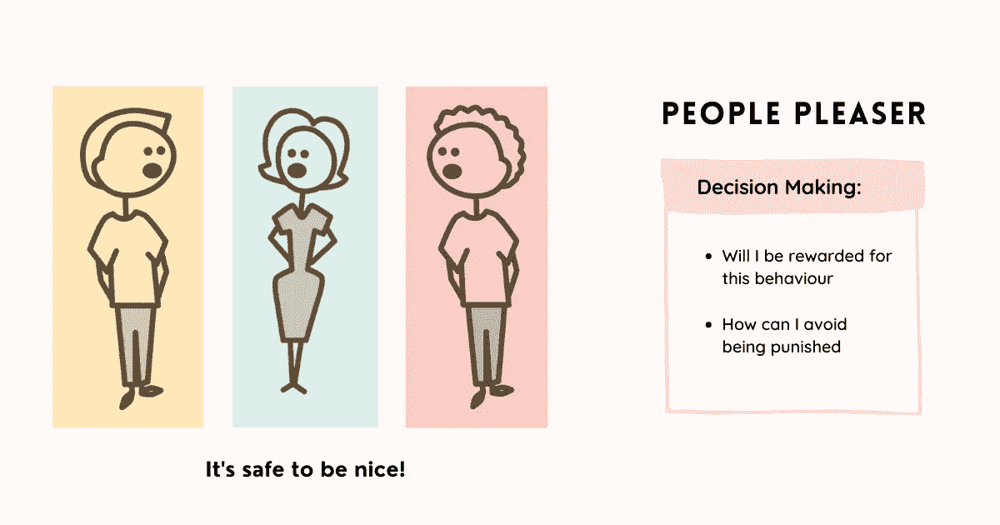

# 如何停止做一个讨人喜欢的人

> 原文：<https://betterprogramming.pub/how-to-stop-being-a-people-pleaser-4177e36d4ac5>

## 以及取而代之做什么

鸣谢:作者

你是否感到疲惫，甚至沮丧，因为你努力工作，加班加点，有时甚至在周末和深夜努力赶工作，但却无法在自己的目标上取得进展？

是工作场所的要求占用了你的时间，还是你无法控制自己的时间表？你是在创造价值，还是仅仅为了满足他人的期望而工作？

匆忙解决工作中的每一个危机，即使你的工作已经排满了，也要对新项目说“是”,为了帮助别人而加班，却错过了自己的交付成果的最后期限，把你的个人承诺推到一边，为另一个会议腾出时间，即使你不同意，也要点头同意，回复每一封电子邮件和信息，就好像你的生活取决于此。

帮助他人是因为你真诚的关心，这对建立信任和建立更好的工作关系大有帮助。但当它源于让别人对你有好感的渴望，通过做让他们开心的事情来操纵他们对你的看法，寻求不断的认可、接受和赞同来建立你自己的自我价值感时，你只关心你自己。

随着你的决策根植于奖励和惩罚，你会发展成为一个取悦他人的强烈倾向。

> 从本质上来说，友善就是通过让一切变得顺利而被别人喜欢。没有波浪，没有摩擦。它基于这个(非常不准确的)理论:如果我取悦他人，给他们他们想要的一切，保持低调，不惹怒他人或制造任何不适，那么其他人就会喜欢我，爱我，并给予我认可和我想要的任何东西。
> 
> 阿齐兹·加齐普拉

取悦他人并不是无害的，尽管它看起来是无害的。你的行为不是出于对他人的善意，而是深深根植于你对拒绝的恐惧、无助感、失败的风险、因得罪他人而产生的不适，以及没有勇气接受他人的反对。

这对你自己和你与他人的关系都是完全有害的。过度思考和评估每一个让别人开心的举动会阻止你说出你的想法，表达你的真实意图，带着你自己的信念来到现实，做给工作带来实际价值的事情。

# 取悦他人的风险

## 1.带着平庸的感觉生活，而不是建立卓越

时刻准备着以牺牲自己的时间和健康为代价去帮助别人，把自己的承诺推到一边，为别人腾出时间，永远不学会说不会让你过度承诺。当你发现很难兑现你的承诺时，你最终会做平庸的工作，甚至可能无法兑现你的一些承诺。

你的表现会受到影响，团队成员会因为你的低质量工作而鄙视你，当你违背了一开始就不应该做出的承诺时，其他人也会对你失去信任。

因为人们不知道你的其他承诺，他们会用他们自己的标准，通过你给他们的价值来定义你的价值。

## 2.纠结于焦点和糟糕的决策质量

抑制自己的冲动，假装自己不是某个人，会消耗你大量的精力，留给专注工作的精力就更少了。

研究表明，我们的意志力就像会疲劳的肌肉。在锻炼了自制力，把所有的精力都倾注在取悦他人上之后，你的精神资源就会被耗尽。你将无法专注地工作，这将增加你的挫败感，并导致你进一步的压力和焦虑。

对情绪的控制越少，你就会对周围的事情做出反应，而不是有目的地行动。

作为一个讨人喜欢的人，你会有意识地根据他人的是非感做出一系列决定，而不是坚持正确的事情。不是做几个决定并把它们做好，而是每一个活动都会变成与他人的兴趣和认同感保持一致的斗争，导致[决策疲劳](https://www.techtello.com/decision-fatigue/)。

当这些决定变得糟糕时，你的判断力会受到质疑。在做重要决定时，别人不会相信你的意见，也不会忽视你的意见，这一点也不奇怪。

## 3.沉浸在痛苦中，破坏关系，而不是加强关系

> 我们花费了太多的时间和精力来确保我们满足每个人的期望，并关心别人对我们的看法，以至于我们经常感到愤怒、怨恨和恐惧
> 
> ——布伦·布朗，*我以为只有我*。
> 
> 我们把人们从他们的责任中解救出来。我们照顾人们对他们的责任。后来我们对他们的所作所为感到愤怒。然后我们觉得自己被利用了，觉得自己对不起自己。
> 
> — Melody Beattie，*不再相互依赖*

作为一个讨人喜欢的人，你会超越他人的期望，不断调整自己的优先事项，并试图挤出你的每一点注意力来为某人或某事腾出时间。

最终，过度劳累、倦怠和疲惫会让你对那些你自愿帮助的人产生怨恨。你甚至可能意识到你被认为是理所当然的，或者别人利用你，因为你从不拒绝任何人的热情。

你对自己行为的愤怒和怨恨会影响你的幸福，并与同事产生误解。它不会加强联系，反而会破坏关系。

# 认识到你是否是一个讨人喜欢的人

也许你不是一个讨人喜欢的人。朋友、家人、同事或任何你关心的人怎么样？他们挣扎是因为他们想取悦每个人吗？

帮他们一个忙——把这个问题列表发给他们，帮助他们认识和承认自己的奋斗。记住，在任何转变之前都要接受。

*   你是否做出了正确的承诺，首先是对自己，然后是对他人？
*   你害怕说不吗？
*   是什么驱动了你现在的行为——害怕被拒绝还是真心想要帮助？
*   你会以自己的健康为代价优先考虑帮助别人吗？
*   你有勇气被人嫌弃吗？
*   你是否经常拿自己和别人比较？
*   你真的做出了贡献还是假装增加了价值？
*   你觉得界定界限很难吗？
*   你会为了给别人腾出时间而把个人承诺推到一边吗？
*   你很难委派工作吗？
*   在试图满足别人的期望时，你会感到愤怒和怨恨吗？
*   你觉得理所当然吗？
*   你很难让别人失望吗？
*   你是否因为假装和试图让每个人都开心而筋疲力尽？

# 是什么让你成为一个讨人喜欢的人，你该怎么做

> 如果你意识到别人很少会这样想，你就不会那么担心别人对你的看法了。
> 
> —埃莉诺·罗斯福

我们的行为和信仰是我们自己的思想创造的。我们对别人如何看待我们以及他们如何思考和行动做出了很多假设。我们对这个故事的理解似乎与我们对周围事物的想象非常吻合。

没有意识到每个人都有足够多的挑战要处理，没有时间去分析我们的行为，我们试图在每个人的生活中占据中心位置。如果我说不，他会怎么看我？如果我告诉她她的想法不好，她会鄙视我吗？如果我为了家庭事务而缺席会议，我的老板会认为我不可靠吗？诸如此类。

受我们过去的经历、教养和许多其他环境因素的驱动，我们的思维只是许多未探索的可能性中现实的一个版本。

取悦他人的倾向是一种思维方式，它认为:

## 1.作为衡量一个人价值的外部认可

不愿意接受新的挑战，害怕自己会失败，让别人看不起你。愿意把自己的承诺推到一边，为他人腾出时间，赢得他们的钦佩。害怕被嘲笑，努力避免犯错。说些让别人开心的话，做些让别人开心的事，即使你不同意他们的观点。寻求对观点的认可，而不是进行健康的辩论。将冲突视为对你身份的攻击，而不是寻求一致的手段。

当你的自我价值感与外部认可联系在一起时，你会努力保持在聚光灯下。你不断寻找可以被表扬的机会。认可定义幸福，可获得性被误认为是生产力，接受成为成就，同意象征钦佩。

做一个讨人喜欢的人会通过寻求外部认可而不是利用你真正的潜力，把你困在你自己的局限之内。

## 取而代之做什么

与其寻求一个衡量你价值的外在标准，不如将你自己与你理想中的自己进行比较。确定你想成为什么样的人，什么样的价值观对那个人来说是重要的，然后通过问以下问题来寻求与这些价值观的内在一致:

*   我的行为如何符合我的价值体系？
*   我能做些什么来变得更好？
*   我该怎么学？
*   关于我自己，这次失败教会了我什么？
*   我怎样才能培养一种成长的心态？
*   我的是非观是什么？
*   我相信什么？

## 2.同意意味着尊重和钦佩

当你认为同意是尊重的标志，而[不同意](https://www.techtello.com/agree-to-disagree-vs-disagree-and-commit/)是相反的，你会自动倾向于流行的观点，远离任何可能引起注意的事物。

你没有意识到，隐瞒信息，不说出自己的想法，到头来弊大于利。你剥夺了其他人解决问题、纠正他们的行为、更清晰地思考、探索不同观点以及根据相关信息做出最佳决策的机会。

如果你保持沉默，没有告诉你的老板他们的想法很糟糕，因为害怕让他们失望，但后来发现这花了你公司很多钱，会怎么样？当你看到你的经理在不提拔你的问题上明显有偏见时，不站出来为你的案子而斗争怎么样？仅仅因为你的利益相关者极力要求，而你认为推迟他们会损害你的声誉，你就承诺不切实际的时间表，这种情况怎么样？

作为一个讨人喜欢的人，你认为你必须在诚实和讨人喜欢、不同意见和尊重、坦率地说话和挽救你的职业生涯之间做出选择。

## 取而代之做什么

你不必选择。你可以是真实的，但仍然是有效的。

> 每一次成功对话的核心都是相关信息的自由流动。人们开诚布公地表达他们的观点，分享他们的感受，阐述他们的理论。他们愿意并有能力分享他们的观点，即使他们的观点有争议或不受欢迎。
> 
> —约瑟夫·格雷尼

大声说出来，不要带着取悦他人或挽回他人感情的愿望，而是带着分享你的信仰和观点的意图，无论它们是什么。选择正确的，而不是流行的。

将这一点付诸实践需要从家中的低风险情况开始，或与你可以信任的人一起，在推进你的观点时感到舒服，练习并慢慢建立自己的方式来面对工作中的其他情况和人。

开始的时候会很不舒服，但你可以从知道这是正确的事情和有效沟通的唯一方式中汲取力量。

## 3.说“不”会损害你的名誉

你能在下周提供这个新功能吗？你能帮我检查代码吗？你能帮我调试这段代码吗？这个周末你能来面试吗？这个星期五你能参加办公室聚会吗？你能参加这个会议吗？可以分享一下对这个设计的看法吗？是的，是的，是的。

你对你遇到的每件事都说好，因为你相信说不会让人对你评头论足。他们会认为你卑鄙、无能、懒惰、不负责任、忘恩负义、有偏见、粗鲁。你把消极的感觉和“不”联系在一起，脱口而出“是”就有一种解脱感。

通过说是，你至少在那一刻从某些事情中拯救了自己。但是你想过以后会发生什么吗？你真的相信你能管理好每一件事，并且还能做得很好吗？好吧，你过于热情的“是”很快就会成为压力的来源，因为你很难勉强履行你的承诺。你肯定会把一些事情搞砸，这不会给人留下深刻印象。说“不”不会损害你的名誉，对一切说“是”肯定会。

作为一个讨人喜欢的人，对所有事情说“是”会阻止你专注于重要的事情，追逐不切实际的目标，给你的生活增加挫败感、压力和焦虑，而不会真正增加你的工作或他人的价值。

## 取而代之做什么

做重要的事。答应吧，但不要以牺牲自己的时间和健康为代价。如果有些事情不符合你的目标和价值观，说不。

说“不”并不容易，但通过一些关键的实践，这是可能的:

*   当你不确定是否同意时，暂停一下。不要马上答应。在做决定前，要求有时间评估。
*   如果这个要求与你的目标不一致，或者不符合你的优先顺序，或者你根本没有时间，就说不。
*   如果这个要求很有意义，但是你的工作已经排满了，那就去找合适的人来帮你重新安排优先顺序。
*   你也可以帮助其他人，把他们介绍给其他同样有能力的人。去吧，启动连接。
*   在[说不的时候使用正确的语言](https://www.techtello.com/saying-no-at-workplace/)。不要试图证明你的不，在你的信息中要清晰简洁，表现出尊重，感谢他们考虑你，然后礼貌地拒绝。如果你用正确的方式表达你的不，人们不会看不起你。他们会欣赏你的诚实。
*   不要把人晾在一边。如果你答应回来，确保你在承诺的时间内回来。

工作场所充满了请求——总有人需要帮助。说“是”不会给你的团队和你的组织增加更多的价值，在正确的时候说“不”会。

## 4.独立创造价值是建立信誉的途径

> 联系的最大障碍之一是我们对“单干”的文化重视。不知何故，我们已经把成功等同于不需要任何人。我们很多人都愿意伸出援助之手，但是当我们自己需要帮助的时候，我们却非常不愿意伸出援手。就好像我们把世界分成了“提供帮助的人”和“需要帮助的人”事实是我们都是。
> 
> —布伦·布朗

你不愿意寻求帮助，因为你认为这会让你看起来很虚弱。你不会分享知识来制造依赖性和证明你的价值，你更喜欢自己做事情，而不是委托给你的团队。你认为独立创造价值是建立信誉和赢得尊重的唯一途径。

你没有用你的知识和技能给团队带来价值，反而阻碍了他们的进步。“单干”的心态会影响你在团队中的集体产出。

你通过过分强调自我来取悦他人的把戏对你的团队和组织都是有害的。

## 取而代之做什么

分享你的知识。e[m 为您的团队提供合适的工具和资源，帮助他们取得成功。展示你的脆弱，说“我不知道”,寻求帮助，向他人学习。认可并欣赏他人——当他人值得称赞时，与他人分享，当事情不顺心时，不要推卸责任，承认自己的错误，并承认它们。](https://www.techtello.com/empowering-teams/)

你的行动根植于对成功的共同定义，你将建立信任并赢得团队和他人的尊重。

让你走上这条路的简单问题:

*   我能从别人身上学到什么？
*   我如何通过分享我的知识来增加价值？
*   怎么做才能做好委托？
*   我如何合作才能一起取得更多的成就？

## 5.可用性表示可接近性

平易近人是工作中的一个好迹象。当人们发现你平易近人时，他们自然会更加信任你。但是，做一个讨人喜欢的人会让你做得过火。你把可用性误认为是可接近性。

你相信，如果其他人可以不受限制地向你伸出援手，他们会认为你对这份工作尽心尽力。当需要帮助解决工作中的问题时，你放弃了个人承诺，在家庭聚餐时接听电话，在孩子的生日聚会上查看电子邮件和回复邮件，甚至对请假感到内疚。

“永远在线”会影响你的工作效率，而[会让你分心](https://www.techtello.com/managing-distractions/)去做正确的事情。在非正常时间发邮件和发信息会给团队带来不必要的压力。人们开始认为你是理所当然的，甚至会因为你不休息而觉得你疯了。

## 取而代之做什么

珍惜自己的时间，设定健康的界限:

*   当你有空的时候和联系不到你的时候进行沟通。
*   放松休息，并真正享受它们。它们会让你在工作中更有创造力和生产力。
*   当你在度假时，在精神上和身体上都要超脱。

你不是生来讨人喜欢的，你会成为一个讨人喜欢的人。你的想法让它如此。

# **总结**

*   外部认可不是衡量你价值的标准，而是与你价值观的内在一致性。
*   同意并不意味着尊重和钦佩，它是坚持正义的勇气。
*   说“不”不会损害你的名誉，它表明你意识到了自己的局限性。
*   独立的价值创造不是建立信誉的途径，而是成功的共同衡量标准。
*   可接近性不是可获得性，它需要设定健康的界限。

让我给你们留下中国古代哲学家老子的思想:

> “在乎别人怎么想，你永远是他们的俘虏。”