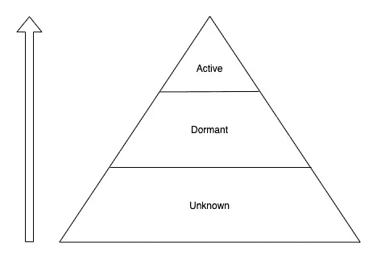

# 如何成功识别和管理 3 种不同类型的技术债务

> 原文：<https://betterprogramming.pub/how-to-successfully-recognise-and-manage-the-3-different-types-of-tech-debt-4193a7e1f57>

## 通过一个技术债务偿还过程，保持你的团队的高生产力和你的代码库的健康

马库斯·斯皮斯克在 [Unsplash](https://unsplash.com?utm_source=medium&utm_medium=referral) 上的照片

并非所有的科技债务都是平等产生的。一些技术债务可能会阻碍你快速迭代代码库的能力，导致发布的功能更少，释放的商业价值更少。

另一方面，一些科技债务可以暂时搁置，你不必花宝贵的时间去解决它。

值得注意的是，本文关注的是较大的技术债务，以及简单的技术债务(例如，提取一个方法、重命名一个类等。)不需要遵循概述的过程。我坚信这样的重构应该每天都发生。

那么，科技债务有哪些不同的类型，你应该如何管理你的科技债务？

# 科技债务的三种类型

首先，让我们看看如何对不同类型的科技债务进行分类。

## 主动技术债务

活跃科技债务是第一种*可接受的*科技债务，下面是休眠科技债务。它被定义为—您知道它，并计划在不久的将来(例如，当前季度)修复它。

如上所述，并不是所有的科技债务都是一样的——例如，积极的科技债务是完全健康的。一个你可能招致技术债务的例子是当引入一个有严格期限的新特性时。为了满足截止日期，一个不太理想的解决方案被生产出来，但是你计划在新功能上线后积极地解决技术债务。

另一个例子可能是在一个已经有一段时间没有更新的遗留系统中，因为没有理由改变代码库。现在有了新的要求，积极解决技术债务是非常有意义的。您可以改善代码库的健康状况，并使更改更容易进行。

## 休眠科技债务

休眠科技债务是第二种可接受的科技债务。它的定义是——你知道它，但你目前不打算解决它。

你可能会想，“如果你知道的话，为什么不还呢？”，这是个好问题。不偿还的主要原因是你没有被它拖累。

例如，一个工程师可能会发现代码库的一部分看起来有点磨损。工程师目前并不在那个区域工作，他们也不需要在当前的工作中对其进行修改。

在我看来，在这个例子中，最好的做法是记下技术债务(我们将在后面讨论更多细节)并继续前进。为什么？因为这段代码**可能永远不需要更新**，所以它可能是两年前写的，从那以后就没有编辑过，也可能永远不会更新或者在遥远的将来更新。

如果它可能在遥远的未来被更新，在那一点上你知道科技债务的存在，并且**能积极地**解决那个科技债务。

## 未知的技术债务

最后一种科技债务是未知科技债务。顾名思义，这是技术债务，你根本没有发现，甚至不知道它的存在。这也是最危险的类型，因为不知道它的存在，你就不能在未来的项目中考虑它。

在我的职业生涯中，一个非常常见的场景是，当一个团队估计一个项目将花费一定的时间时，由于一些不可预见的问题，例如技术债务，这个估计会相差很远。

虽然不可能识别出代码库中每一个可能的技术债务，但拥有一个适当的工作流来确保您定期捕获技术债务是我发现的确保您的代码库保持高健康水平以及您的团队高生产率的最佳方法之一。

在下一节中，我们将看看你可以用来管理你的技术债务的工作流程。

# 管理技术债务

既然我们可以识别三种类型的技术债务，我们如何着手确保我们有效地管理它呢？

## 科技债务金字塔

类似于软件工程中的其他金字塔，例如[测试金字塔](https://martinfowler.com/articles/practical-test-pyramid.html)，我相信有一种技术债务类型存在。

图片来源:作者

既然我们知道了每一个的定义，那么理解科技债务如何从一个部分转移到另一个部分就很重要了。所有科技债务在某个时候都是未知的；一旦它被人们所知，它就会立即进入休眠状态。

然后你需要做出选择:是保持休眠状态，还是想要解决它？选择让它休眠是一个完全合理的选择，这取决于环境(例如，它目前没有造成任何伤害)，但如果你选择解决它，那么它会变得活跃，直到它被解决。

## 追踪科技债务

跟踪技术债务遵循与产品工作相似的生命周期。在我目前工作的团队中，我们在 backlog 中记录我们的技术债务，并相应地进行标记。

每当工程师提出一个潜在的技术债务时，他们就在待办事项中提出一张卡片，详细列出他们已经发现的问题，并列出任何潜在的解决方案。这里的关键是不要让这个过程过于霸道——要填写的长模板可能会让工程师想跳过它，继续他们的产品工作。

既然我们正在识别技术债务，我们如何确保我们不会简单地创建一个从未被关注过的不断增长的列表？

## 解决技术债务的专用时间

这个过程的最后一步是确保你有专门的时间来处理你积压的科技债务项目。您为此分配的时间会因多种因素而异，包括以下因素:

*   你能争取到多少时间来处理技术债务？
*   你是否有交付的压力，需要在一段时间内偿还较少的债务？
*   你是在一个沉重的发现阶段，还是在项目之间，可以分配更多的时间来偿还债务？

在我工作的团队中，我们与利益相关者(包括产品和技术)有一个协议，我们每次迭代的 10-15%的时间花在技术债务上。根据上面的例子，这是波动的，但是我们通常平均达到这个百分比。

在每个迭代的开始，我们优先考虑我们想要完成这个冲刺的产品故事，以及优先考虑我们想要解决的技术债务。这确保了对于大多数迭代，我们改进了我们代码库的健康，并且因为我们正在优先考虑我们的技术债务，我们正在解决我们已经确定为不久的将来的问题的技术债务，或者我们作为我们刚刚完成的项目的一部分积累的技术债务。

# 摘要

到目前为止，我们已经注意到我们代码库的总体健康状况仍然很好，即使我们工作的主库已经有几年的历史了。我们将继续快速提供增强功能和新功能，新加入者也能够快速轻松地跟上速度，迅速提高工作效率。

管理科技债务有很多观点和方法，所以这绝对是我确信可以改进的一种方法。我很想听听你是如何找到方法的，或者如果你采取不同的方法，是什么！

> 希望扩展您的技术知识，但不确定阅读什么？我办了一份免费的时事通讯，提供两周一次的技术书籍推荐，包括我从书中获得的关键信息。感兴趣吗？在这里报名吧！