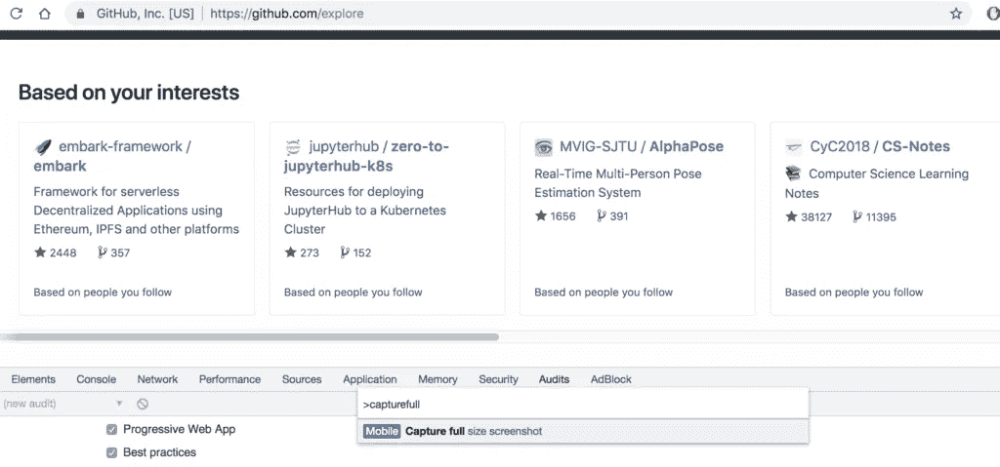

# 如何在没有扩展的情况下在 Chrome 中进行整页截图

> 原文：<https://betterprogramming.pub/how-to-take-full-page-screenshots-in-chrome-without-extensions-be2f0cf36df1>

我们花了相当多的时间使用网络浏览器。有时我们可能需要在浏览器中获取一个完整页面的截图。我最近了解到，谷歌 Chrome 可以做到这一点，不需要使用任何额外的扩展。在本文中，我们将看到如何做到这一点。

# 在 Chrome 中打开 DevTools

首先，我们需要在 Chrome 内部打开 [DevTools](https://developers.google.com/web/tools/chrome-devtools/) 。我们可以用不同的方式打开它:

1.  *主菜单右上角*(三个竖点)> *更多工具* > *开发者工具。*
2.  我们也可以使用以下键盘快捷键打开它:Windows 和 Linux 中的`Control+Shift+I`，或者 Mac 中的`Command+Option+I`。
3.  打开它的另一种方法是右键单击页面的任意位置并选择*检查*。

# 打开命令菜单

现在我们需要打开命令菜单。我们可以通过在 Windows 和 Linux 中按`Control+Shift+P`，或者在 Mac 中按`Command+Shift+P`来实现。

# 截图

然后，我们需要编写并选择*捕捉全尺寸截图*。完成后，我们应该得到一个 PNG 文件作为整个页面的截图。

这就是我的快速提示。真的很简单，但是我觉得可以很有用。