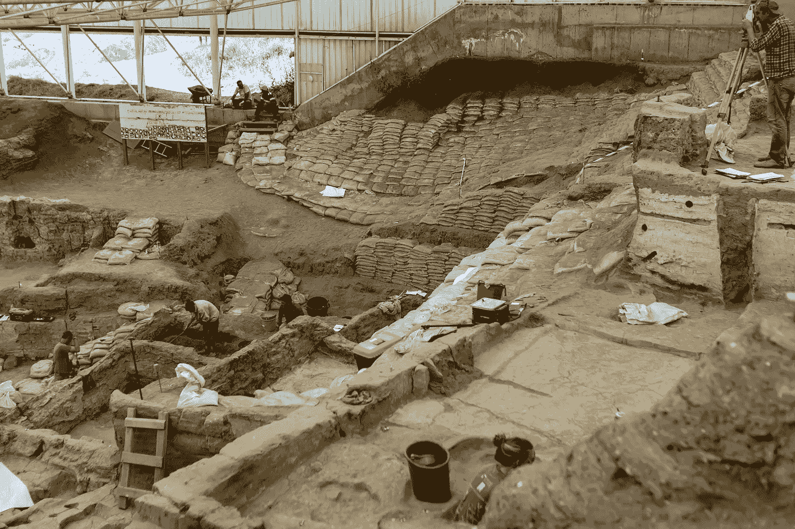

# 如何谈论软件变更

> 原文：<https://betterprogramming.pub/how-to-talk-about-software-changes-82dfb39cfaa>

## 我演示作品的四点纲要

由[路](https://unsplash.com/s/photos/talking-to-people?utm_source=unsplash&utm_medium=referral&utm_content=creditCopyText)上[车头](https://unsplash.com/@headwayio?utm_source=unsplash&utm_medium=referral&utm_content=creditCopyText)拍摄

所以你写了一些代码。现在怎么办？

不可避免的是，你最终会改进别人的工作。如何在不冒犯原作者的情况下庆祝自己的进步？你如何培养一种文化，让其他人感到被邀请在未来改进你的工作？

以下是我演示作品的四点纲要。当然，任何演示都会有微妙的不同，但这是重复的好起点:

1.  以前的情况是怎样的？
2.  为什么还不够？
3.  我们改变了什么？
4.  我们期望什么会变得更好？

让我们分解每一步。

# 1.以前的情况是怎样的？

照片由 [Aron 视觉效果](https://unsplash.com/@aronvisuals?utm_source=unsplash&utm_medium=referral&utm_content=creditCopyText)在 [Unsplash](https://unsplash.com/s/photos/map?utm_source=unsplash&utm_medium=referral&utm_content=creditCopyText) 上拍摄

构建问题域。尤其是在一个更大的组织中，并不是每个人都知道你所改变的产品领域。当你更了解你的听众时，这种方法会更有效。如果你主要是向长期雇员演示，你可以简单地说“我们对结账页面做了一些修改”当主要向新员工或对产品不熟悉的人演示时，不要害怕进入更多的话题。

对于非常熟悉问题领域的人来说，这可能是一句话:“今天早上我将向您展示我们对结帐页面所做的更改。”对于另一个观众，你可能需要多解释一点背景。运用你最好的判断力。

# 2.为什么还不够？

软件工程的一部分是“软件考古学”的角色——通过层层挖掘来了解项目是如何形成的，当时的思维过程是什么，以及那段历史是如何随着时间的推移而演变(以及被遗忘)的。

胡尔基·奥莰·塔巴克在 [Unsplash](https://unsplash.com/s/photos/archeological-dig?utm_source=unsplash&utm_medium=referral&utm_content=creditCopyText) 上拍摄的照片

解释什么是缺失的、损坏的、过于复杂的或其他有问题的。有意将不足之处描述为不断改进的故事的当前章节，而不是某人犯的错误。

请记住，当前存在的产品总是知识、约束和权衡的结果。一旦产品到达用户手中，我们不可避免地开始验证我们开始时的所有假设，以及制定新的假设，这使得发布新代码成为必要。

你变化*就是*新的代码。

如果你不知道如何展示这一部分，可以考虑回答以下几个问题:

*   我们是如何得知不足的？
*   我们得到了什么数据？
*   我们如何解读这些数据？
*   当时的权衡和约束是什么？
*   为什么这些权衡不再被接受？
*   我们如何克服这些限制？

# 3.我们改变了什么？

现在进入变化的实质。总是从产品用户的角度呈现变化。这需要你了解用户。只有当用户(而不是听众)非常精通技术时，才展示非常专业的细节。

由[克里斯多夫·伯恩斯](https://unsplash.com/@christopher__burns?utm_source=unsplash&utm_medium=referral&utm_content=creditCopyText)在 [Unsplash](https://unsplash.com/s/photos/construction?utm_source=unsplash&utm_medium=referral&utm_content=creditCopyText) 上拍摄的照片

例如，如果你发布了一个面向用户的应用程序的变更，试着坚持用户会注意到的不同和(希望)更好的地方。如果一个客户使用一个使用基于函数和基于类的 React 组件的网站，他们通常不会有什么偏好。然而，他们确实关心以前慢的页面是否更快，或者他们是否可以用更少的努力完成工作。这并不是说你必须完全忽略所有的技术细节，只是不要让它们成为演示的主要焦点。

另一方面，有时变化主要是技术性的。在最纯粹的形式下，重构的特征是改变“软件等式的因素，而不改变最终的解决方案。”如果您的更改主要使其他工程师受益，而对最终用户只有二级影响，那么尽可能努力地描述代码的不同之处(同样，希望更好)。

如果时间允许，考虑显示前后的 a；否则只关注之后。利用前两个部分来说明为什么变化是重要的。

# 4.我们期望什么会变得更好？

利用这段时间回到你开始的地方。将你的改进框定为实验的假设:“我们期望{改变}改善{不足}，因为{你的新假设}”

照片由 [Nagara Oyodo](https://unsplash.com/es/@nagaranbasaran?utm_source=unsplash&utm_medium=referral&utm_content=creditCopyText) 在 [Unsplash](https://unsplash.com/s/photos/hope?utm_source=unsplash&utm_medium=referral&utm_content=creditCopyText) 上拍摄

这是在无效假设的情况下确保对代码有一个健康的心态的一个有用的方法:即使假设被证明是错误的，更改也是值得的，因为它们成功地确定了假设的有效性。最坏的情况是，我们获得更多的数据并完善我们的假设。最好的情况是，我们的假设是正确的，我们改善了用户体验。

在数据和学习的背景下框定变化是防止无意中框定其他人的想法为“正确”或“错误”的好方法。专注于学习隐含地假设我们不知道所有的事情。它假设我们将通过收集的数据来了解我们的改变是否是好的，而不是断言我已经知道我的改变是好的，因为这是我自己做的。

这就是带注释的基本大纲。每次演示总是不同的，但我试图至少以某种方式、形式或形式包含那些要点。如果有用的话，可以随意借用和改进。