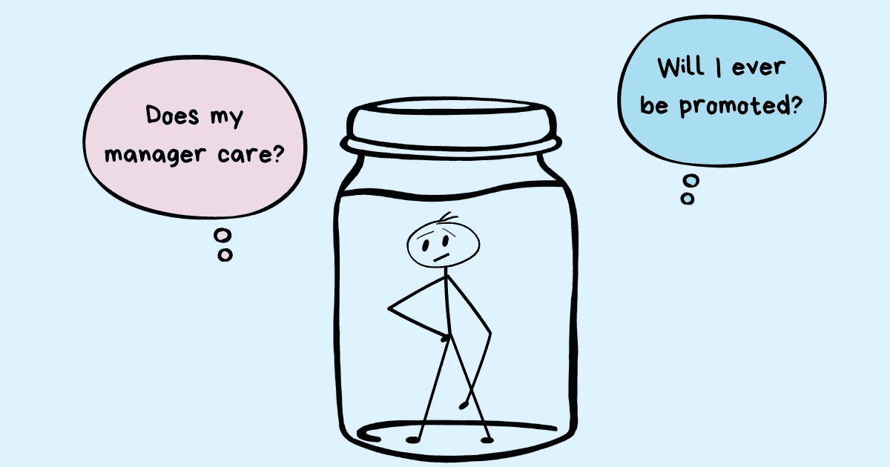

# 如何告诉员工他们还没有准备好升职

> 原文：<https://betterprogramming.pub/how-to-tell-an-employee-they-are-not-ready-for-a-promotion-aff17cfce862>

## 避免谈话或使用策略来激发他们的动机是不起作用的

图片来源:作者

经理在工作中面临的最大挑战之一是晋升。似乎每个人都在等待他们的下一次重大晋升，而他们甚至还没有掌握当前的晋升。一旦绩效评估季节开始，经理的很大一部分时间将用于管理不开心的员工——那些期待晋升但没有获得晋升的员工，甚至那些不期待晋升但当周围的人获得晋升时仍然感到难过的员工。

事实是大多数人认为他们已经准备好升职了，而他们的经理却不这么认为。当员工纠结于他们的晋升，浪费他们宝贵的时间和精力去找方法和他们的经理说话，告诉他们为什么他们应该得到晋升时，经理对他们心中的期望一无所知。这是一种意见冲突，员工认为“我显然应该升职”，而经理认为“不，你不应该。”

不可避免的是，员工认为他们的经理有偏见、没有能力或者根本不关心他们的成长。他们受到不公平待遇的感觉干扰了他们客观看待形势的能力。

尤其具有挑战性的是那些在当前岗位上表现出色的员工。一致的[积极反馈](https://www.techtello.com/how-to-give-constructive-feedback/)和绩效评定会让人认为他们已经准备好升职了。他们可能在检查他们当前角色的所有方框方面做得非常出色，但是可靠地交付一致的结果并不能自动使他们有资格处理下一个级别的挑战。

通过在当前水平上做扎实的工作而获得晋升，而没有建立在下一个水平上超越他人所需要的技能，这是自寻失败。如果你是一名真正关心员工及其成功的经理，你不会希望他们被置于一个容易失败的角色。我明白了。这样做是对的。你的晋升标准不应该基于你的员工对他们晋升的看法，而应该是基于他们实际技能和准备程度的客观衡量。

有什么比不提拔没有准备好的人更重要的呢？正确的交流方式。因为这是大多数管理人员未能履行职责的地方。

每位经理都面临着不得不告诉员工他们还没有准备好升职的恐惧。期望和现实之间的脱节是因为经理没有采取措施来弥合这两者之间的差距。他们的恐惧妨碍了他们。

# 错误的交流方式

对大多数人来说，工作中最大的挫折来源是觉得自己被困在工作中。当他们清楚地看到自己为下一个级别的角色做好了准备，并不断地想知道下一步该做什么才能得到他们显然应该得到的晋升时。

管理这种期望有两种极端的反应:

**避免谈话:**一些经理完全避免这个话题，因为他们不想让他们的员工感觉不好或伤害他们的感情——或者他们只是不知道如何处理管理[困难的谈话带来的不适](https://www.techtello.com/handle-difficult-conversations/)。他们寻找借口来避免做正确的事情:

*   这一次会很痛。最好什么也不说。
*   人们不想知道坏消息。
*   现在说还为时过早。
*   时机不对。
*   他们会自己意识到的。

**增加动力:**其他人因为害怕失去希望而制造虚假的希望*“别担心！下次你就升职了！”他们认为如果没有晋升的希望，人们就会对自己的工作失去兴趣。好像这是在说真话和留住员工之间的选择。他们出于恐惧而行动:*

*   除非我告诉员工他们很快会被提升，否则他们不会被激励。
*   虚幻的希望总比没有希望好。
*   说实话会影响他们的表现。
*   人们会退出。

一时激励员工的虚假承诺通常会适得其反，因为过后会变成彻底的失望。结果是弊大于利。

由于经理未能与员工沟通，员工们继续因为他们未能实现的愿望和欲望而产生不满。每当他们失去晋升的机会时，这种情况就会加剧。由于看不到晋升的希望，每次评估的预期和焦虑都变成了愤怒、怨恨、失去动力，最终导致对经理失去信任和尊重。

> “能够按照自己的意图行事是信任的关键组成部分。盟友只有在被信任有效时才有价值。当你的员工不相信你会兑现承诺时，你就没有得到他们最大的努力。”
> 
> —海蒂·格兰特

我们都知道一个心怀不满的人在工作中是不会有效率的。当员工感到不满意，不明白是什么阻碍了他们的晋升时，这是经理沟通的失败。

挑战在于平衡——不谈论它，而是谈论它的每一个话题，每一个动作。你不希望你的员工纠结于他们的晋升，但同时你也不希望他们完全忘记自己目前所处的位置，或者他们需要做些什么才能达到目标。

# 声明我不同意

## **1。充当转变视角的催化剂**

当员工知道你把他们的最佳利益放在心上，你希望他们在当前职位和下一个职位上取得成功，他们就不再担心晋升，而是把精力用在展示他们的[最佳表现上](https://www.techtello.com/high-performers/)。仅仅说“我关心你的晋升”是不够的它必须反映在你的行动中。

最有可能的是，你的员工对升职有错误的想法。当似乎每个人都在努力争取升职时，他们不想被落在后面。大多数人无法定义晋升对他们意味着什么——他们是在寻求地位的提升、更多的钱，还是仅仅是更多的责任？

只需要一点点视角就能让他们想清楚:

*   询问他们的[目标](https://www.techtello.com/goal-setting/)。讨论这些目标如何融入他们的促销计划。
*   权衡升职的成本和留在当前职位的好处。
*   将他们的心态从寻求晋升转移到培养正确的技能上。
*   向他们展示当前级别的出色工作如何不能转化为下一级别的准备工作。
*   与他们谈论重要的不同技能——为什么沟通和冲突管理技能与实现技术卓越一样重要。

这样，他们就能明白成功和晋升是如何脱节的。他们可以成功，但不一定会得到提升。对增长的更长期关注将人们的期望从获得晋升转变为对学习的投资。

## **2。告诉他们需要听到的内容**

作为一名[经理](https://www.techtello.com/what-type-of-manager-are-you/)，到现在为止，你可能已经有足够的经验，并且在你的职业生涯中经历了多次晋升。你的员工，因为缺乏经验，看不到你明明能看到的东西。这使你处于一个独特的位置，能够准确地掌握他们所需要的知识，了解他们在晋升过程中缺少的关键因素。

你有能力将它们繁荣的领域与它们缺乏的领域区分开来。你可以用他们技能上的漏洞来掩盖他们期望中的差距。你可以帮助他们了解在下一阶段取得成功的真正条件。

让我们面对严酷的事实。告诉员工他们还没有准备好升职总是会让人感到刺痛。即使是出于好意，对另一个人来说也不容易。试图通过隐藏关键反馈来减轻打击，做出虚假承诺“下次你一定会得到它！”或者说“如果你只做这一件事……”这样的话并没有真正的帮助。

含糊不清的反馈可以帮助你度过不舒服的时刻，让你感觉良好，可以从你的待办事项列表中检查一项，但它对其他人没有任何实际帮助。相反，这让他们更加困惑。当他们甚至看不到他们现在所在的地方和他们想要去的地方之间有什么障碍时，他们怎么能把障碍颠倒过来呢？没有明确的反馈，原本可能是一个很好的机会可能会变成绝望和无助感。

作为管理者，你应该怎么做？

感同身受，但保持直接。告诉他们等式中缺少了什么。不要用拐弯抹角的方式来传达你需要说的话。不要试图减轻打击。清楚地表达为什么你认为他们还没有准备好升职。陈述他们需要开始和停止做什么。不要留下解释或混淆的余地。

此外，要清楚这样一个事实，仅仅因为你没有看到他们展示某项特殊的能力，你并不认为他们就是没有。你会全力以赴为他们寻找合适的机会来练习这些技能。

几个例子:

**不要做承诺:**“如果你做了，你会升职的……”

**保持真实:**“你已经在做【以下事情】。你还需要展示你在[这些技能]方面的能力。根据将这些技能付诸实践的反馈，我会考虑你的晋升，因为这些技能将使你在下一个职位上取得成功。”

**不再含糊其辞:**“这次我们不能接受你的晋升，但我相信你下次会成功的。你已经做得很好了。”

**明确目标:“**你有巨大的潜力，这从你在[…]的表现中可以明显看出。然而，你需要提高(这些技能)。”

一个希望成长为团队领导的高级开发人员需要展示领导团队、解决冲突、有效沟通和优先考虑影响的能力。

初级开发人员需要学习交付高质量的代码、独立开发、有效协作，并提高他们解决问题的水平，然后才能被考虑晋升。

> “作为一名经理，你对你的报告的看法比他对你的看法更有分量。毕竟，是你决定了他在做什么，决定了他是应该升职还是被解雇。这种权力失衡意味着，在评估绩效时，你有责任保持诚实和透明。”—朱莉·卓(Julie Zhuo)，《经理人的成功:当所有人都看着你的时候，你该怎么做

她补充道:“你的报告应该随时明确你的期望和他的立场。如果他经常在想，我的经理对我有什么看法？然后你需要提高你的反馈水平。不要认为他能领会言外之意，或者没有消息就是好消息。如果你觉得他是牛逼的缩影，那就告诉他。如果你认为他没有达到你希望看到的水平，他也应该知道，也应该知道你为什么会有这种感觉。”

由于一直有明确的期望和反馈，没有得到晋升可能会令人失望，但这不是停止努力的理由。更确切地说，知道你一直都在帮助别人会有力地激励你更加努力。

## **3。向他们展示如何做到这一点**

如果你的员工已经承担了下一级的责任，但就是没有进步，该怎么办？他们可能会付出努力，但如果这种努力没有带来预期的结果呢？你认为他们不适合这个角色吗？

不完全是。有时候，告诉人们“去做这个”是不够的。大多数人在面对挫折的时候，不知道从哪里开始，也不知道具体做什么。当他们感到停滞不前时，如果没有关于如何取得进展的指导，他们可能会失去希望并过早放弃。他们可能会回去做他们的老工作，但却做不了那些能让他们得到他们极度渴望的工作。这可能只会让他们失去一次晋升的机会，同时也可能让你失去一次发挥他们真正潜力的机会。

作为管理者你能做什么？

正如学习任何新东西一样，他们必然会犯 T2 式的错误。他们需要在挑战和挫折中坚持不懈。帮助他们看到他们做错了什么，并讨论更好的策略来实现他们的目标。蔻驰教他们从失败中学习，并把它们作为变得更好的教训。提出问题，帮助他们发展批判性思维技能，学会独立解决问题:

*   他们面临什么挑战？
*   他们实施了什么策略来解决这个问题？
*   什么没用？他们从中学到了什么？
*   他们还能做什么？
*   谁能[帮帮](https://www.techtello.com/how-to-ask-for-help/)？

在整个过程中，让他们感觉在控制之中。他们不应该对自己的晋升感到无能为力。教给他们成长思维的力量。向他们展示如何通过自己的努力培养完成工作所需的技能，以及如何将努力转化为成就。对他们来说，重要的是要认识到，虽然他们可能还不具备被提升的技能，但培养这些技能仍然是他们力所能及的。他们需要付出正确的努力才能达到目的。他们需要尝试新的策略。他们需要努力培养成功完成该角色所需的技能。

请他们制定一份计划，列出不同的战略，并设定明确的时间表。讨论他们如何就其中每一项寻求反馈，以及他们可以做些什么来衡量进展。明确了他们可以做哪些具体的事情来取得进步，一切都会变得触手可及。

## **4。尽最大努力**

在任何公司里，提升一个人都不仅仅需要你作为经理的良好意愿。根据你所争取的职位类型，你可能需要公司其他人的支持才能获得晋升。

不要行动太晚。甚至在你建立一个案例之前，你就会输掉这个案例。做好你的工作，绝对清楚你公司提升员工的流程。如果你是一个新经理，和人力资源部和其他经理谈谈这个过程。提问:

*   什么会成为交易的破坏者？
*   每个级别的预期能力是什么？
*   a 符合什么条件，a 超出什么条件？
*   需要什么样的文件？
*   谁的反馈重要？

> “经理通常不能保证升职，但优秀的经理知道系统在寻找什么，并能帮助(人们)建立那些成就和技能。”
> 
> —卡米尔·福涅尔，《管理者之路:引领技术领导者成长和变革的指南》

告诉你的员工他们还没有准备好升职是不够的。你需要考虑他们需要获得的经验和曝光度。考虑未来机会的雷达。寻找合适的时机展示他们的优势，在其他人面前为他们辩护，在与其他经理交谈时口头讲述他们的成就。

争取不低于 100%的命中率，这样当合适的时候你就不会努力避免失望。你可能还没有提升他们，但你可能需要现在就开始计划。

如果你需要在工作中处理一点政治，那就去做吧。不要因为过程中的政治让你不舒服，就让你的员工束手无策。无论如何，如果你能修复这个过程，那就去做吧。但以防万一“你不能”，不要以此为借口来为结果正名。

最后，永远不要告诉他们你尽了最大努力，但是升职没有成功。不要以“我尽力了，但别人不同意”来拒绝承担责任。他们不应该关心谁负责做最后的决定。他们需要知道的只是拼图中缺失的那块——他们现在应该做什么，下一步该怎么做。

# **总结**

1.  经理和员工在晋升问题上有很大分歧。在某个时候，员工觉得已经准备好进入下一个级别，而他们的经理却不这么认为。
2.  这种脱节是经理方面的沟通失误。
3.  大多数经理要么试图避免艰难的谈话，以免员工感觉不好，要么做出虚假的承诺，以提高他们的积极性。这种策略是非常无效的。
4.  没有得到晋升的失望和不清楚下一步该做什么让人们愤怒、焦虑和沮丧。
5.  为了避免让员工不满意，管理者需要转变他们的视角，帮助他们专注于学习和成长，而不是把时间和精力花在升职上。他们需要与他们一起工作，找出他们技能上的差距，告诉他们如何在目标上取得进展，并给他们有用的反馈，以便在此过程中进行纠正。

在这里注册我的免费简讯。

*原载于 2021 年 5 月 27 日 https://www.techtello.com**的* [*。*](https://www.techtello.com/how-to-tell-employee-they-are-not-ready-for-promotion/)