# 如何训练 YOLOv5 实时识别游戏物体

> 原文：<https://betterprogramming.pub/how-to-train-yolov5-for-recognizing-custom-game-objects-in-real-time-9d78369928a8>

## 本文将研究如何在自定义数据集上使用 Python 和 PyTorch 训练 YOLOv5 进行对象检测和识别。对于本例，数据集将包含一个名为 Albion Online 的游戏中的对象。

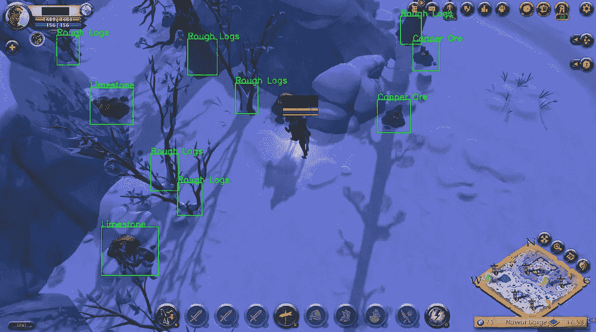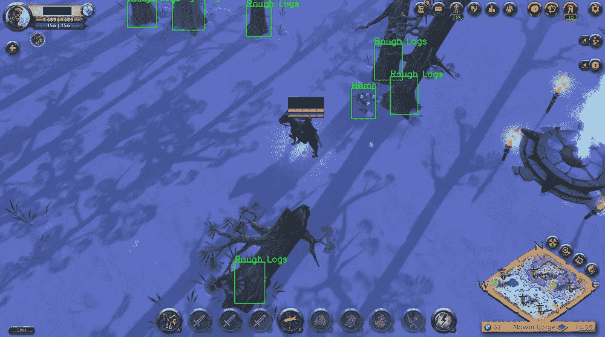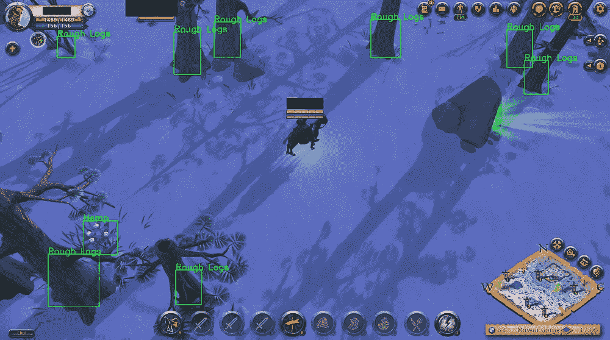

前几天，我在 YouTube 频道[“通过游戏学习代码”上看了一系列关于如何编写游戏机器人的节目](https://www.youtube.com/c/LearnCodeByGaming)在名为[“训练级联分类器——游戏#8 中的 OpenCV 对象检测”](https://www.youtube.com/watch?v=XrCAvs9AePM)的视频中，作者展示了他如何构建一个简单的对象分类器。

我发现那个视频的结果很鼓舞人心。因此，我认为通过使用更高级的分类算法来改善这些结果会很有趣。这就是我如何使用 Python 和 PyTorch 开始试验 YOLOv5 对象检测算法的。本文的内容就是基于这些实验。

在接下来的内容中，我将向你展示如何从一款名为 [Albion Online](https://albiononline.com/en/home) 的免费游戏中截图。这些截图也将被编辑为隐私，因为多个球员将是可见的。这不会对后来的物体检测和识别产生影响。

随后，我将向您展示如何在 Albion Online 的游戏世界的特定区域中标记代表基本资源的游戏对象。一旦被标记，标签和截图都将被用作 YOLOv5 算法的训练和验证数据。结果将是我们数据的新 PyTorch 模型。

最后，我将向您展示如何将经过训练的 PyTorch 模型导出为针对快速推断而优化的 TensorRT 模型。这是(准)实时推理所必需的，因此可以在玩游戏的同时进行物体检测和识别。

# 从你的游戏中截图

让我们从一些 [Albion Online](https://albiononline.com/en/home) 游戏的截图开始。所以一定要安装游戏——它是免费的。另外，请注意，我将在 Windows 上工作。

下面你可以找到我用来截图的代码。

您需要首先启动游戏，然后运行 Python 脚本。

```
python screenshot.py
```

然后，您可以随时按“f”键进行截图。

当按下“f”键时，你还需要确保上面程序的窗口被选中——也就是说，它在前台。这不是超级方便，但是很管用。您将看到一条消息，说明当您正确按键时，屏幕截图已被拍摄。

请注意，Albion 网络游戏有白天/夜晚周期。因此，你需要截屏覆盖整个循环，让所有游戏对象的颜色变化出现在数据集中。

一旦所有的截图都被拍摄下来，我选择编辑它们以保护隐私。这意味着涂黑我自己的玩家头像的名字，也涂黑其他玩家的名字。

涂黑我自己的球员的名字很容易，因为这个名字总是出现在相同的地方。为此，我写了下面一小段代码。

其他球员的名字不能用这种方式涂掉，因为他们总是出现在不同的地方。实际上我最后手动把它们涂黑了。

下面，您可以看到一些用于训练 YOLOv5 网络的最终图像数据的示例。

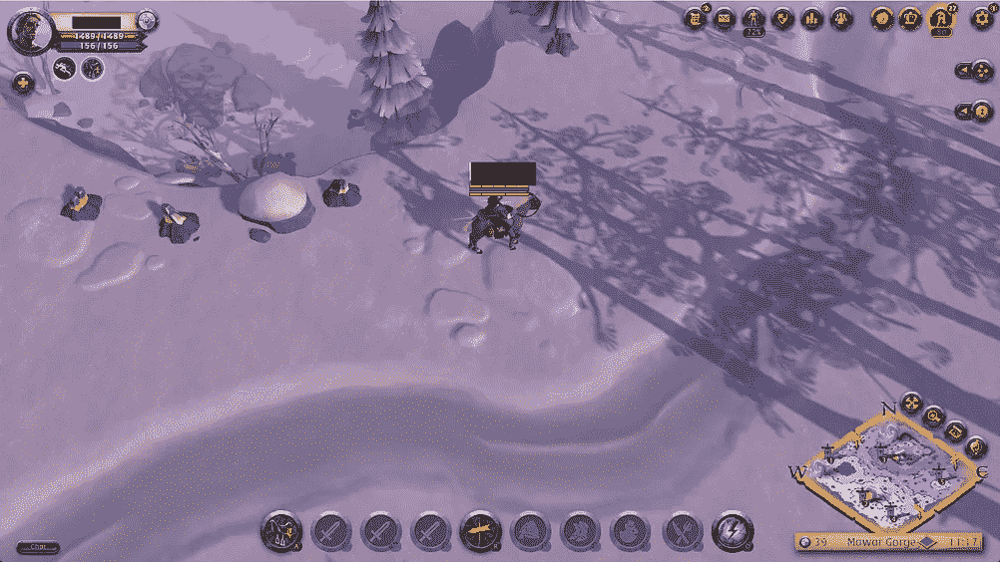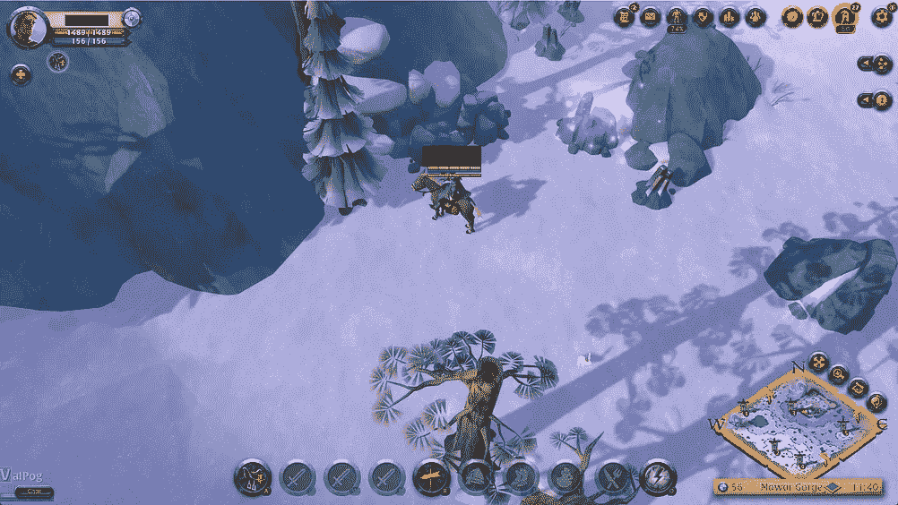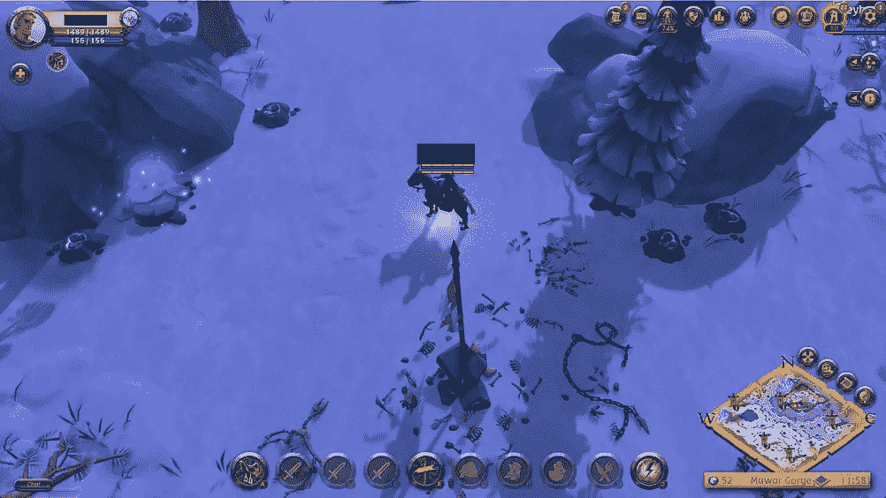

# 使用 Make Sense 应用程序进行标注

我们将使用 [makesense.ai](http://www.makesense.ai) 进行对象检测的图像标记。

在开始之前，创建一个名为 *labels.txt* 的文件，标签的顺序与您在标签应用程序中输入的顺序相同。

下面，你可以看到我做了什么。

当你启动 [Make Sense 应用](https://www.makesense.ai/)时，你首先需要输入所有你想要注释的图像的文件名。然后点击“物体检测”

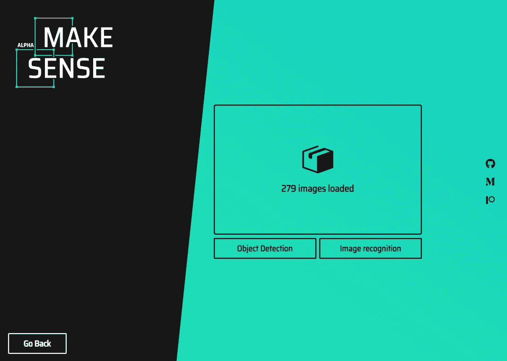

之后，您可以输入 label.txt 文件，如下图所示，然后单击“创建标签列表”

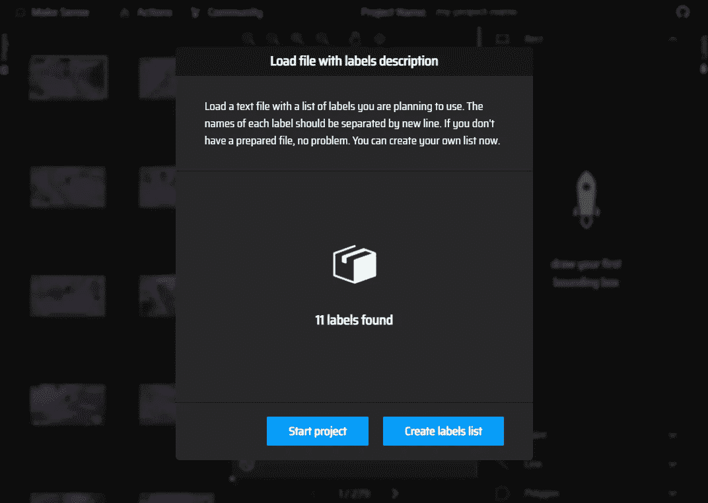

在每一张截图中，你都需要在需要识别的对象周围画出矩形。

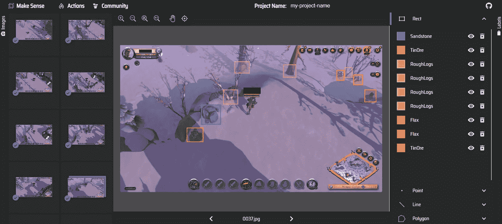

确保正确标记图像中的对象。如果你只是犯了几个错误，那应该不是什么大问题，因为人工智能算法应该会把它们作为噪音过滤掉。

完成后，因为我们使用的是 YOLOv5，所以需要选择将图像标注导出为 YOLO 格式。

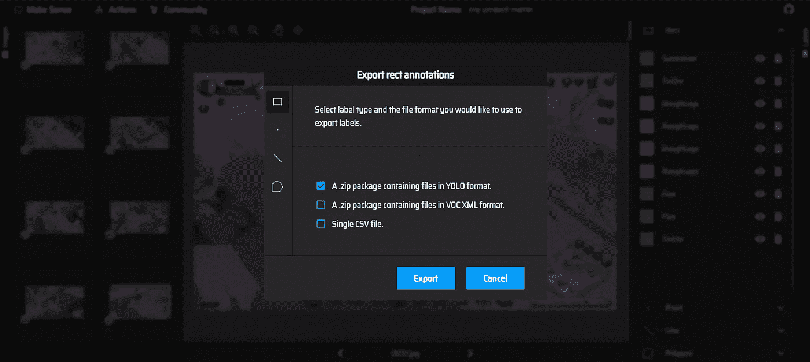

我建议你在开始真正注释所有图像之前，先用一小组图像来玩一下 Make Sense 应用程序。像这样，你就可以知道这个应用程序是如何工作的。

# 基于图像和标签创建数据集

正如你在上面的截图中看到的，我在 279 张图片中标注了物体。

下一步是将数据集分成训练集和验证集。我决定将 251 幅图像放在训练集中，将 28 幅图像放在验证集中。这些图像需要放在各自的目录中。

我们从 Make Sense 导出的标签也需要这样做。确保标签位于正确的目录中。所以如果图像 nr。0005 在 *train_data/image/val* 目录中，那么属于 0005 的标签需要在 *train_data/labels/val* 目录中。

按如下方式订购包含图像和标签的目录:

```
D:.
├───test_data
└───train_data
    ├───images
    │   ├───train
    │   └───val
    └───labels
        ├───train
        └───val
```

最后，在 *test_data* 目录下，我选择了一些我横向镜像的随机截图。这是为了看看我们训练的模型是否对翻转的图像有效。

下面我创建了一个名为 *ready_data.yaml* 的文件，它包含了训练、验证和测试数据集的路径，还包含了网络应该能够识别的类。训练 YOLOv5 网络需要这个文件。

# 使用迁移学习训练 YOLOv5

一旦我们创建并设置了数据集，我们就可以使用迁移学习来训练 YOLOv5 网络。

首先，我们需要安装 [YOLOv5](https://github.com/ultralytics/yolov5) 。实现这一点的一种方法如下:

```
git clone [https://github.com/ultralytics/yolov5.git](https://github.com/ultralytics/yolov5.git)
cd yolov5
pip install -r requirements.txt
```

为了确保你可以使用 PyTorch 的 GPU 进行训练和推理，你可能需要[安装 cuda 版本](https://www.datasciencelearner.com/assertionerror-torch-not-compiled-with-cuda-enabled-fix/)。因为我安装了 CUDA Toolkit 11.5，所以我运行 PIP 如下:

```
pip install torch==1.11.0+cu115 torchvision==0.12.0+cu115 torchaudio==0.11.0 --extra-index-url https://download.pytorch.org/whl/cu115
```

然后，为了在我们的数据集上训练 YOLOv5 网络，您需要编写以下代码。

```
python train.py --img 640 --batch 2 --epochs 240 --data ../PROJECT/ready_data.yaml --weights yolov5s.pt --cache --device 0 --workers 2
```

名为`yolo5s.pt`的模型会自动下载。根据您使用的 GPU，您可以增加批次的数量。如果您想查看选项的完整列表，您可以在编辑器中打开 *train.py* 文件。

一旦完成训练，模型和附加信息将出现在名为 *runs/train/exp* 的目录中。困惑矩阵总是能提供很多信息。


现在，我们可以使用新的网络模型对我们的测试集进行推理。

```
python detect.py --weights runs/train/exp/weights/best.pt --img 640 --source ../PROJECT/ready_data/test_data/ --conf-thres 0.65
```

这里，我将`--conf-thres`(置信度阈值)设置得相对较高，以删除一些不需要的重复检测。

结果将出现在名为*运行/检测/实验*的目录中。

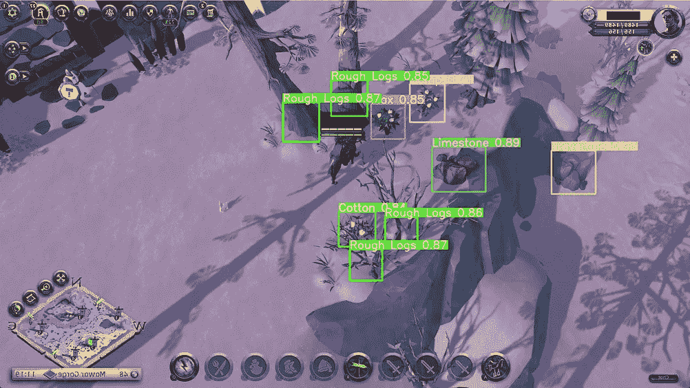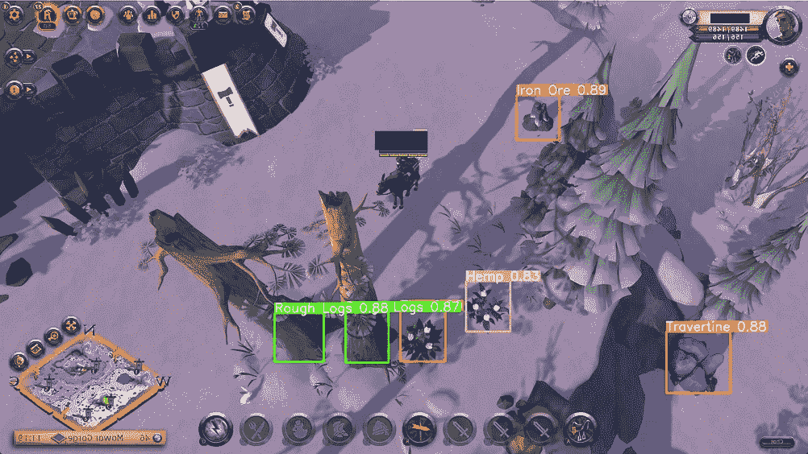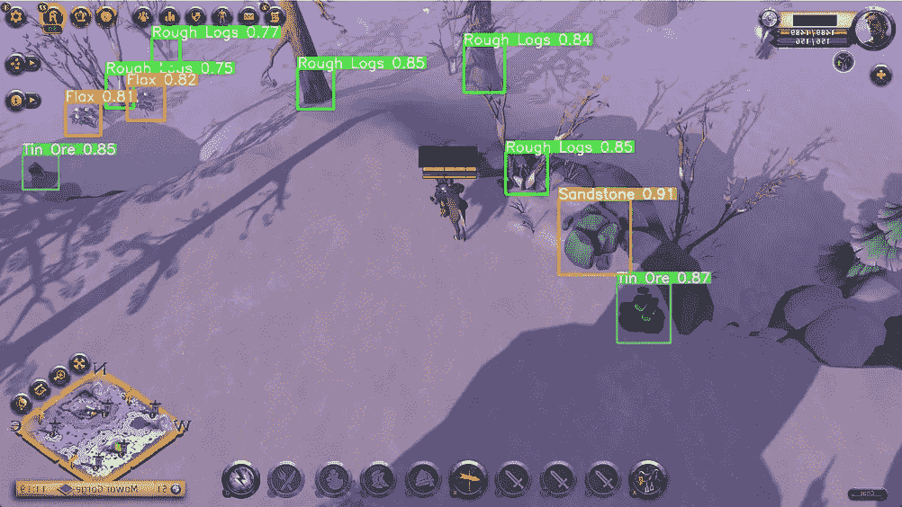

# 将模型转换为 TensorRT 以进行快速推理

为了使用我们新学习的 YOLOv5 网络模型进行实时推理——在我们的例子中是游戏的流捕获——我们需要将网络模型导出到一种运行速度比基本 PyTorch 模型快得多的类型。

这里有几种可能性，但我选择使用 TensorRT 网络类型进行快速推断。然而，不幸的是，为 Python 安装 TensorRT 并不像许多其他 Python 包那样简单。

这是 NVidia 为[安装 tensort](https://docs.nvidia.com/deeplearning/tensorrt/install-guide/index.html)提供的指南。你可以试着通过 PIP 安装它，但是这对我不起作用。我最终通过 Zip 文件安装了 TensorRT。

一旦安装了 TensorRT，我就可以从 YOLOv5 运行导出功能。

```
python export.py --weights ../best_albion.pt --include engine --half --device 0
```

最后，我写了一段代码，对来自 Albion 网游的截图进行实时推断。

要运行推理代码，请启动 Albion 在线游戏，并确保玩家位于用于创建数据集的区域。然后用下面的代码开始上面的代码:

```
python albion_test.py
```

下面，你可以看到结果。

# 参考

[YOLOv5 文档](https://docs.ultralytics.com/)

[YouTube 上 DeepLearning 的“用定制数据进行 YOLOv5 训练”](https://www.youtube.com/watch?v=GRtgLlwxpc4)

[“训练级联分类器——8 号游戏中的 OpenCV 对象检测”，由 YouTube 上的“通过游戏学习代码”](https://www.youtube.com/watch?v=XrCAvs9AePM)

[说得通艾](http://makesense.ai)

[阿尔比恩在线 MMORPG](https://albiononline.com/en/home)

[“assertion error:torch 未在启用 cuda 的情况下编译(修复)”由数据科学学习团队完成](https://www.datasciencelearner.com/assertionerror-torch-not-compiled-with-cuda-enabled-fix/)

["类型错误:无法将 CUDA 张量转换为 numpy。"来自 StackOverflow](https://stackoverflow.com/questions/53900910/typeerror-can-t-convert-cuda-tensor-to-numpy-use-tensor-cpu-to-copy-the-tens)

[NVidia TensorRT 文档—安装指南](https://docs.nvidia.com/deeplearning/tensorrt/install-guide/index.html)

[“TF lite，ONNX，CoreML，TensorRT Export”关于 YOLOv5 Github 问题](https://github.com/ultralytics/yolov5/issues/251)

[“如何从 YOLOv5 预测中获取类和边界框坐标？”来自 StackOverflow](https://stackoverflow.com/questions/67244258/how-to-get-class-and-bounding-box-coordinates-from-yolov5-predictions)