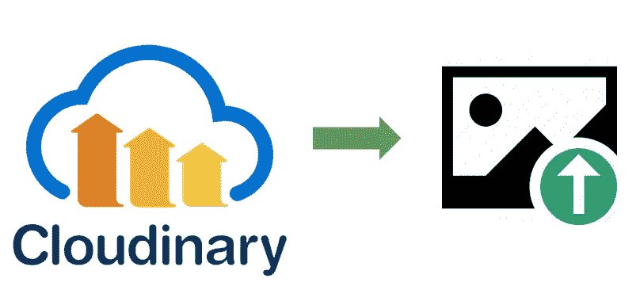

# 如何使用 Cloudinary API 在线管理照片

> 原文：<https://betterprogramming.pub/how-to-upload-and-manage-pictures-on-your-website-54a5dd838b5f>

## 立即支持在您的应用中上传和显示照片



作者照片。

有没有想过做一个支持上传和管理图片的网站或 web app，但是不知道怎么做？我当然有，谢天谢地，有一个简单的方法可以做到这一点。虽然为了从本教程中受益，您应该知道一些事情，包括服务器端(后端)编程的基础知识和 HTTP 请求是如何工作的。

# 设置前端

为了这个快速教程的目的，UI 将只是一个简单的 UI，只有一个功能:上传图片。我用 React 构建了它，尽管普通的 JS、HTML 和 CSS 也能很好地工作。


注意，创建这个初始 UI 实际上只需要两个 HTML 元素。

```
<input name="image" type="file" />
<button><span>Upload</span></button>
```

用于记录目的的附加`p`元素(例如“图像正在上传”、“图像已成功上传”、“错误:无法添加图像”)对任何用户都是有帮助的和信息丰富的。

前端的其余设计是任意的，最终取决于您的 web 应用程序的性质。

# 设置后端和 Cloudinary API

去注册[账户](https://cloudinary.com/users/register/free)。完全免费。接下来，设置后端。我将使用 Node.js (Express)和 MongoDB(带 Mongoose)作为数据库。

现在，让我们为一个图像对象创建一个 Mongoose 模型，并将其导出到`server.js`:

接下来，导入多部分中间件。这个中间件基本上允许你从`req.file`访问上传的文件:

```
const multipart = require('connect-multiparty');
const multipartMiddleware = multipart();
```

最后，使用您在 Cloudinary 仪表板上找到的凭据设置 Cloudinary:

# 构建 API 路由

## 张贴路线以创建图像

## 获取路线以获取所有图像

## GET route 通过图像的数据库 id 获取图像

## 删除路径以通过图像的云二进制 id 删除图像

# 包扎

最后，我们通过设置静态目录、默认路由和服务器监听的位置来结束`server.js`:

现在，我们准备通过来自前端的`POST`、`GET`和`DELETE`请求发送 HTTP 请求来创建、获取和删除图像！

例如，要创建一个图像，我们可以发送如下请求:

对于那些已经走到这一步的人，恭喜他们！尤其是对你们中的新手来说。以前去过，第一次把握肯定不容易。