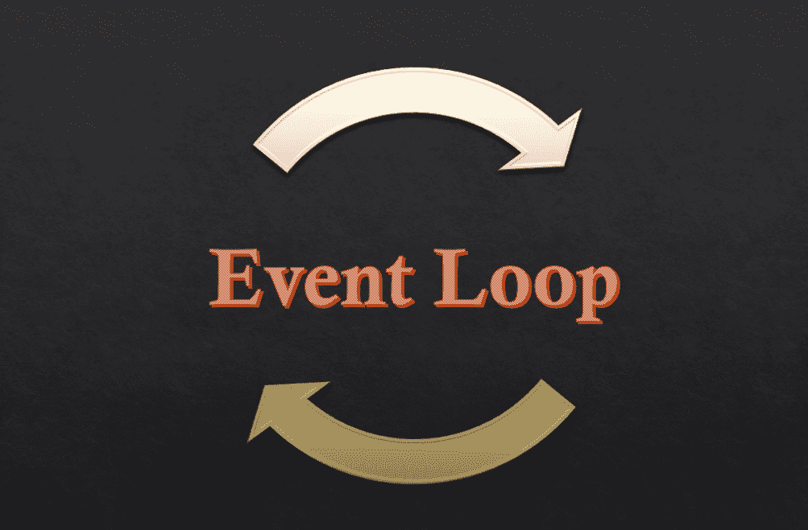

# 如何在 Flutter 中使用异步/等待

> 原文：<https://betterprogramming.pub/how-to-use-async-await-in-flutter-the-flutter-event-loop-97c696caf912>

## 颤振事件循环的观察



作者图片

我以前很讨厌 Flutter 里的 async。我的意思是，如果你认真考虑一下，异步的函数/方法只是一个需要很长时间的函数/方法。那么为什么我必须使用`async`关键字呢？为什么我不能正常地将异步代码与其他代码集成在一起？

我的意思是，如果我让我的`build()`方法异步，这可能是一个非常糟糕的主意。但是仅仅因为这是一个坏主意并不意味着我不应该被允许这样做。这就是你学习的方式。因为做了错误的决定。

所以我基本上已经走出了这个阶段。Async 在 Flutter 上并不完美，后面我会解释原因，但也没有我想象的那么差。

# 首先是一些基础知识——使用棉绒和期货

所以首先使用棉绒。我的意思是用一个`analysis_options.yaml`。这里有一个来自[颤振回购](https://github.com/flutter/flutter/blob/master/analysis_options.yaml)。虽然就我个人而言，我觉得这有点太固执己见了，所以我在这里做了自己的。

因为默认情况下，颤振，或者我应该说，飞镖，让你逃脱最疯狂的事情。以前更糟糕的是，它让你不能从一个函数中返回任何东西，而这个函数显然应该返回一些东西。但是零安全解决了这个问题。

所以我总是假设 Flutter 会让它默认每个项目都有一个`analysis_options.yaml`。但到目前为止还没有发生。

然而，当你读到这篇文章的时候，Flutter 团队可能终于开始添加它了。与此同时你自己做一个`analysis_options.yaml`档案。

我告诉你使用 linter 文件的原因是因为一个特别的规则:

```
- avoid_void_async
```

因此，在 Dart 中，您可以使用:

```
void foo() async {
  // Do some stuff here
}
```

那会运行得非常好。但是它返回 void，这很好，但是为了正确使用 await 和 async，我们需要像这样返回一个`Future`:

```
**Future<void>** foo() async {
  // Do some stuff here
}
```

这将让我们用 async 和 await 做所有有趣的事情。如果你不小心使用了 void，linter 规则会自动警告你。

# 现在你开始考虑期货了

那么现在我们在使用期货，我们如何利用它们做一些有用的事情呢？嗯，有几种使用它们的方法:

1.  正常给他们打电话就行了
2.  等待未来
3.  连锁期货利用`.then()`

## 1.正常给他们打电话

```
analyticsInstance.logEvent(name: “All Your Base Are Belong To Us!”)
```

从技术上讲，这是一个未来，它将在自己的时间执行。

这不是多线程。以前没有听说过异步的程序员有一种倾向，认为一切都是多线程的。Async 使用事件循环。[这个视频](https://www.youtube.com/watch?time_continue=1&v=vl_AaCgudcY&feature=emb_title)解释的最好(跳到 2:17 左右)。

所以不是多线程。这只是魔法。

当然，视频中有一个推论。一个事件不可能一次做太多工作。否则，它将阻塞事件循环，什么都不会发生。

如果正在播放动画，这一点尤其明显。这是我自己的应用程序中的一个大问题。我不得不使用隔离物来处理它——即使这样，它也不是非常平滑。也许我以后会谈到分离株。

当他说“尽管 Dart 是一种单线程语言，但它提供了对未来、流、后台工作和所有其他你需要以现代、异步和(在 flutter 的情况下)反应式方式编写的东西的支持。”在[0:14 左右](https://www.youtube.com/watch?v=vl_AaCgudcY&t=14s)——我想他是在挖苦当时不支持异步的 Swift 但这只是我的看法。

## 2.手动等待期货是我以前使用的

因为是寄生所以很棘手。这意味着如果你`await`一个异步函数或方法，那么这个函数或方法也必须是`async`。

所以如果你有这个:

```
void foo() {
  someAsyncFunction();
}
```

这很好。但是现在让我们假设你是一个控制狂(就像我一样)，你想知道《T2》什么时候结束。所以你像这样使用一个`await`:

```
void foo() {
  await someAsyncFunction();
}
```

但是这会给你一个错误。因为你需要`async`关键词:

```
void foo() async {
  await someAsyncFunction();
}
```

此外，如前所述，您应该将返回类型更改为`Future`:

```
**Future<void>** foo() async {
 await someAsyncFunction();
}
```

现在，这听起来没那么糟糕。但是随后你意识到如果你想让一些父母等待这个新特性，它也必须使用`async`关键字。它就冒泡了。

正如已经讨论过的，我从来没有真正理解这是为什么。为什么你不能不添加关键字`async`并且你的函数需要很长时间？

我对这种方法非常失望。这就是我不喜欢使用期货的原因。

## 3.直到我意识到你可以用。then()方法

这就是魔法。假设您有`task1`和`task2`，其中`task1`是异步的，`task2`依赖于`task1`。然后使用等待你去:

```
Future<void> foo() async {
  await task1();
  task2();
}
```

它相当笨重。但是让我们假设你使用如下所示的`.then()`关键字；

```
void foo() {
  task1().then((_) {
    task2();
  });
}
```

现在`foo()`不再需要异步。相当神奇。最重要的是，有些你没想到会成为未来的东西实际上是。因为未来只是在未来有一个起点和一个终点的一些操作。

例如，显示一个对话框。实现这一点的标准方式如下:

```
showDialog(
  context: context,
  builder: (_) => /* ??? */,
  barrierDismissible: true,
);
```

但这实际上有一个起点，当你运行代码显示对话框时，它有一个终点，当你关闭对话框时。那么为什么不把它作为未来来实现呢？这正是 Flutter 所做的。因为它是作为未来实现的，所以你可以像这样使用`.then()`方法:

```
showDialog(
  context: context,
  builder: (_) => /* ??? */,
  barrierDismissible: true,
).then((_) {
  setState(() {
    loading = false;
  });
});
```

这告诉 Flutter，一旦对话框关闭，就应该调用`setState()`，重建小部件并允许任何加载的动画更新。

我一直用这个。另一种使用方法是在可能还没有初始化的对象上调用方法。

例如，我有以下代码:

```
gamesServicesSignIn?.then((_) {
  GamesServices.unlock(…)
    .onError((Object error, StackTrace stack) {
      crashlyticsRecordError(“Encountered errors in GameState 292: $error”, stack);
  });
});
```

这只会在`GamesService`已经初始化时解锁成就，而不必手动等待未来，你可能不想这样做，以防它抛出一堆错误。

虽然`.then()`有点像`await`所以你必须这样做来适当地抑制错误。

```
gamesServicesSignIn = GamesServices.signIn().onError((_, __) {
  gamesServicesSignIn = null;
});
```

# 最后的想法

所以异步并不完美。我主要担心的是仍然太容易忘记在它上面调用`await`。

就像在 Unity 中，如果你想启动一个协程，你必须进入`StartCoroutine(Foo())`。我的意思是，技术上你仍然可以去`Foo()`，但是 IDE 会提前指出来。

Flutter 不会这样做。可能是因为它不能告诉你是真的想输入`Foo()`还是真的想输入`await Foo()`。这是我在 Dart 中真正喜欢的东西。类似于`runFuture(Foo())`和`awaitFuture(Foo())`的东西。它有点笨重，但更冗长。

除此之外，我在异步方面没有任何问题。我仍然不明白为什么它们是必要的，但是我猜它们会告诉程序员，“嘿，看，这段代码可能需要一段时间才能运行。”并允许他们运行代码，而无需显式等待。

所以它们是一个强大的工具。我的意思是，我仍然更喜欢多线程，但我不得不承认，异步代码非常有用。