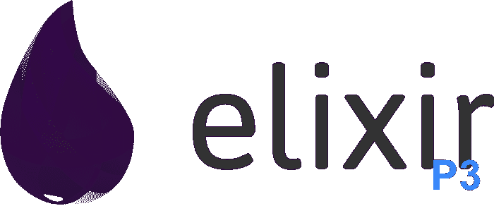

# 如何在药剂中使用控制结构

> 原文：<https://betterprogramming.pub/how-to-use-control-structures-in-elixir-a8b2b134c1f5>

## 如何在灵丹妙药中使用格、条件、如果和除非

摘自[https://elixir-lang.org/](https://elixir-lang.org/)

在过去的条目中，我们看到了 Elixir 中的[数据类型](/learn-elixir-in-2023-a691d37f521)和[模式匹配](/how-to-use-pattern-matching-in-elixir-426709bb179a)。现在，我们将看到允许我们控制应用程序流程的函数。当然，你已经熟悉了一些 if-else 和 case。

# 情况

它用于将一个结果与几个可能的值进行匹配。这个想法类似于模式匹配。我们想要匹配一个对象，根据它是否匹配，我们做一些事情，我们可以从同一个案例中获得值。让我们看看下面的语法:

请记住，pin 运算符`^`用于将现有值与模式进行匹配。让我们看一个关于这个操作符的例子:

每个 case 子句都允许我们使用守卫来指定特殊条件，例如，确保某个值存在于某个区间中。让我们看下面的例子:

值得一提的是，保护中的错误不会传播；他们只是让条款失效。例如，在下一个例子中，hd(1)失败，因为`hd`函数需要一个非空列表作为参数。如果它没有失败，它只是传递到下一个子句。

如果我们有一个结构有一个不匹配的子句，我们将有一个异常。

# Cond

该控制结构用于匹配具有不同条件的结果，直到其评估为既不是`:nil`也不是`:false`的结果，必须始终存在评估为真的默认条件。

语法与 case 非常相似，如下所示:

如果没有条件返回 true，就会出现异常。下面的代码说明了这一点:

重要的是要考虑到除了零或假以外的任何值都被认为是真的。

# 如果/除非

它们只对检查一个条件有用，就像`unless`它和其他编程语言的其他`if`非常相似。

`Unless`相当于`if`，但需要一个假值。

在这种情况下，代码块将返回一个`nil`。`if`和`unless`都支持`else`。

然而，对于`unless`，不鼓励使用它，因为它不太易读。

如果在诸如`if/unless`、`cond`或`case`的块中声明或更改了任何变量，则声明和更改将仅在该结构中可见。

如果我们希望变量改变，我们必须将值重新分配给块的结果，如下所示:

# 结论

虽然一开始看起来很复杂，但我认为 Elixir 提供了非常有效的工具来控制应用程序的流程。这只是学习函数式编程语言如何工作的问题，然后你会爱上它的！