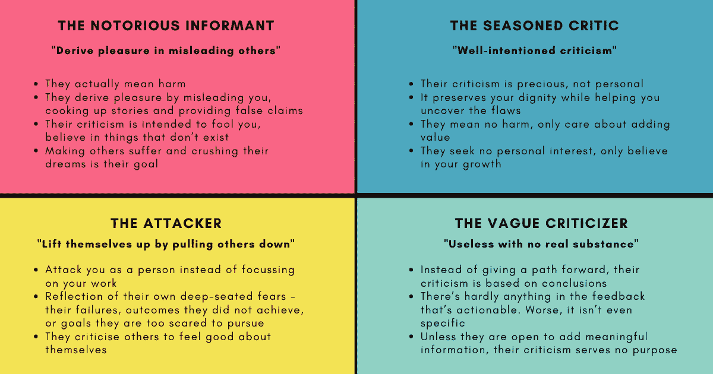

# 如何利用批评来促进你的成长

> 原文：<https://betterprogramming.pub/how-to-use-criticism-to-fuel-your-growth-bd93b1298bda>

## 穿过噪音

鸣谢:作者

给出毫无根据的建议——我们都做过。如果有机会，很容易扮演专家的角色，告诉其他人他们有多错，为什么他们的产品不够好，为什么他们的想法永远行不通，他们应该如何表现，他们应该做什么。当我们觉得我们的批评是正确的时候，为什么要寻求许可呢？

现在让我们扭转局面。你的批评者告诉你你需要听到的事实了吗？想一想当你受到批评时的感受——愤怒、防御、怨恨、沮丧、悲伤，甚至有点崩溃。

老实说。这些感觉几乎是自然的。即使是善意的，批评总是令人痛苦的。谁喜欢被人说他们的工作很烂，或者他们认为值得称赞的东西不够好？

有人喜欢，有人不喜欢。对一些人有用，对另一些人无益。对一些人来说有价值，对另一些人来说是垃圾。事情就是这样。每个人都有权发表自己的意见。很少有人关心你为创造某样东西所付出的努力。重要的是他们的个人观点。

关于批评，即使我们知道批评对我们来说是不公平的，即使我们知道它来自一些卑鄙的人，即使我们知道它对我们没有任何用处，它仍然会伤害我们。很容易把它放在心上，感到气馁，自我怀疑，反复思考。

毫无疑问，有些人不善于提出批评，但我们更不善于接受批评。我们不知道什么时候倾听别人的批评是有用的，什么时候礼貌地把它推到一边继续前进是有意义的。所以，与其试图逃避批评，更有用的是学会事后如何行动。

> 选择不被伤害，你就不会感到被伤害。不要觉得受到了伤害，因为你没有受到伤害——马可·奥勒留，斯多葛派哲学家

# 所有的批评都不一样

你真的能避开批评家吗？我不这么认为。至少如果你真的关心个人发展就不会。如果你在乎反馈，你需要打开门看看外面。你需要邀请他人分享他们的观点，即使这不是你想听到的。

“我想在竞技场上。我想勇敢面对生活。当我们选择大胆挑战的时候，我们就报名了，结果被踢了屁股。我们可以选择勇气，也可以选择舒适，但我们不能两者兼得。布伦·布朗在她的书《强势崛起》中说道。

> *脆弱不是输赢；当我们无法控制结果时，有勇气出现并被看到。竞技场里很多便宜的座位都坐满了从不冒险进入舞池的人。他们只是在安全的距离之外发出刻薄的批评和奚落。问题是，当我们不再关心人们的想法，不再被残忍伤害时，我们就失去了联系的能力。但是当我们被人们的想法定义时，我们就失去了变得脆弱的勇气。因此，我们需要对我们生活中的反馈有所选择。对我来说，如果你不在竞技场上被踢，我对你的反馈不感兴趣*

许多人无缘无故地批评你的工作，通常有一个人会给出有价值的反馈和你需要听到的令人不快的真相。你可能不想失去这个智慧的金块。有时候，这一条建议可以成为成长的主要动力，推动你在职业生涯中前进，帮助你看清自己的现实情况，或者让你采取纠正措施。

我们周围有批评者也有好处——我们善意的父母、同事、老板、朋友、社交媒体，甚至是不请自来的邻居。几乎任何事情都很容易得到反馈。但是也有不好的一面。很少有人真正关心给你有价值的反馈，并努力为你的生活增加价值。大多数人都只是发表了一个转瞬即逝的评论，而没有太多考虑意图和它对他人的价值。

不要把所有的批评家放在同一个桶里，把他们分类通常是有用的。

# 含糊的批评家

这种批评毫无实际意义，毫无用处。而不是给出前进的路径，而是基于结论——*我不喜欢，你的工作不够好，这很烂，没有达到我的预期，你可以做得更好。*

真的，反馈里几乎没有什么可操作的。更糟糕的是，它甚至不具体。你可以继续挠头，浪费你宝贵的时间，但你哪儿也不会去。

如果含糊不清的批评者没有学会批评的艺术，不知道如何做出贡献，那么让他们扩展他们的评论可能会有用。除非他们愿意添加有意义的信息，否则它没有任何意义。

*   他们观察到了什么？
*   他们具体不喜欢什么？
*   他们希望看到什么改变？
*   为什么他们认为它会增加价值？

# 袭击者

这些人攻击你是一个人，而不是专注于你的工作。他们的批评不会以任何方式帮助你，因为在大多数情况下，这反映了他们自己根深蒂固的恐惧——他们的失败，他们没有实现的结果，或者他们害怕追求的目标。

他们批评别人自我感觉良好，通过拉别人下来提升自己——*你是个坏人，你一定很糟糕，你的生活糟透了，你没有所需要的东西。*

具有固定思维模式的攻击者也可能会说一些让他们看起来不错的话，并验证他们的智力。通过批评是他们建立自己聪明的一种方式。

# 臭名昭著的线人

这些人实际上意味着伤害。他们通过误导你，编造故事，编造数据，甚至提供虚假的说法来让别人朝着他们的方向摇摆，从而获得快感。

他们的批评意在愚弄你，相信不存在的东西，让你放弃梦想。他们为什么这么做？让别人受苦，粉碎他们的梦想，这太让人满足了。

他们可能看起来像是善意的人，没有恶意。毕竟愚弄别人才是他们的目标。只有当你深入挖掘，你才意识到他们的意图。

# 老练的评论家

这些才是你应该追求的。这些人有很多做事的经验，知道如何做好，他们相信增加价值，即使价值被包装成批评。

他们了解这个游戏，不会放过你，给你你需要听到的反馈。他们的批评是宝贵的，不是针对个人的。它保留了你的尊严，同时帮助你发现缺点。他们没有恶意，只在乎增加价值。他们不追求个人利益，只相信你的成长。

即使是善意的，也不是每个人都擅长精心制作适合他人的信息。所以，你可能需要超越文字去理解信息的意图。不要指望批评会被端上来。正如我们将在下一步中看到的那样，它为您提供了工作。

但是首先，考虑一下反馈。你如何看待这个人——是含糊的批评者、攻击者、臭名昭著的告密者，还是经验丰富的批评家？好好想想。

# 穿过噪音

> 一个人看到危机，另一个人就能看到机会。当一个人被成功冲昏了头脑，另一个人会以无情的客观性看待现实。当一个人情绪失控时，另一个人可以保持冷静。绝望、绝望、恐惧、无能为力——这些反应是我们感知的功能。你必须意识到:没有什么能让我们有这种感觉；我们选择屈服于这种感觉——瑞安·哈乐黛

当有人批评你的工作时:

**自我怀疑的情绪可能会产生**——我可能不够好，我没有能力，我不应该这样做，如果有人这么说，那一定是真的。你没有要求澄清，而是妄下结论。自我怀疑会让你过早放弃或退出。

**你只看到伤害，怀疑他们的反馈**——他们嫉妒我的成功，他们不知道自己在说什么，他们没有能力增加价值。它会让你忽略反馈，即使它对你有价值。

**你感觉受到了评判，开始为自己辩护** —你的议程从创造价值转移到分享你的观点，并让他们以你的方式看待它。你坚持支持你信念的反馈，拒绝任何与你的观点相矛盾的东西。

**你保持冷静，选择脆弱**——你想面对令人不安的事实，即使这会带来伤害。通过控制你的情绪，告诉你的大脑不要切换到战斗或逃跑的模式，你向自己敞开了你以前从未考虑过的想法。你抓住机会去了解不同的人是如何思考的，为什么他们会有不同的反应，以及他们想要传达的信息的真正价值是什么。你从他们的角度想想——他们的意图是什么，他们这样说容易吗，为什么他们关心与我分享这种批评？

人类最自然的反应是避免批评。但是没有批评，就没有成长。带着不适用于你的态度忽视反馈是很容易的，但是接受令人不舒服的事实，即使一开始很痛苦，也是成长的唯一途径。

自己选吧。你想浪费精力去证明，证明你是对的，他们是错的，自我辩护，反复思考别人说的话，或者你可以用这些精力去实施改变，发现需要改进的地方，找到更好的做事方法，并在改变中寻求快乐吗？

采取积极的观点会帮助你引发正确的行为。大海捞针仍然需要努力——是的，这就是有用的反馈。你需要穿过噪音，找到能给你的工作带来价值的智慧。与其说是科学，不如说是艺术，是只能通过经验获得的东西。

你会犯错误，你会感到沮丧，甚至有时会失去动力，但如果你坚持下去，它会引导你走向学习和成长的道路。

# 不要坐在上面

比忽视批评更糟糕的是承认批评的价值，然后却对此无动于衷。在内心深处，你想要实现改变，但却无法付诸行动。

> *永远不要仅仅因为你无法应对当下的压力而放弃具有巨大长期潜力的事情——塞斯·戈丁*

接受反馈可能很难，但实施改变可能更难，特别是如果它违背了你所珍视的东西，如果这意味着放弃你所珍视的东西。

花时间处理反馈，做你的研究，问问题和收集数据。没有必要匆忙做出决定。但是，一旦你知道什么需要改变，就行动起来。这可能需要你制定新的计划，做出调整，改变你的承诺，更新你的目标，但是不去做不应该是一个选项。现在，每一个变化都不需要你立即关注。所以，承诺以后的日期是可以的，但是不承诺和不做是一样的。除非你努力把这个任务放到你的日程表上，否则它不会发生。你会为了更重要的事情把它推到一边。

批评并不意味着阻止你前进，它是一条更快达到目标的道路，帮助你看清重要的事情。

最后，永远感谢给你有用反馈的人。

# **总结**

批评会带来伤害，但如果你忽视能帮助你成长的反馈，伤害会更大:

*   思考:思考批评家和他们的反馈。是噪音还是他们在讲一个有用的故事。
*   梅干:穿过噪音，面对令人不安的事实。即使是一个小小的智慧也能给你指明正确的方向。
*   决定:制定计划，决定如何以及何时根据反馈采取行动。不要坐在上面。

正如作家吉米·罗恩所说，“成功的人做失败者不愿做的事。不要希望它更容易；希望你更好。”

关注我[推特](https://twitter.com/techtello)了解更多故事。这个故事最初发表在 https://www.techtello.com 的。