# 如何在 Android Studio 中使用 Git

> 原文：<https://betterprogramming.pub/how-to-use-git-in-android-studio-part-1-a8a554006aad>

## 掌握你的工具，掌握你的手艺


资料来源: [ppokta，needpix](http://Developer Android Team)

# 包括什么

在本文中，我将向您展示在 Android Studio 中使用 Git 的一些基本功能，包括:

*   将 Git 集成到项目中
*   设置远程连接
*   暂存和提交更改
*   将更改推送到远程
*   从远程获取更改
*   使用分支
*   显示日志历史记录

我们开始吧！

*注:本文所有引用路径、选项、名称、配置均基于 Mac OS 系统上的 Android Studio。在其他系统如 Windows 或 Linux 上可能略有不同，但精神是一样的。*

# 将 Git 集成到项目中

## 测试是否配置了 Git

在 Android Studio 中，进入 **Android Studio >首选项>版本控制> Git** 。点击**测试**确保 Git 在 Android Studio 中配置正确。


测试 Git 是否配置正确

## 启用版本控制集成

假设您刚刚创建了一个名为`MyApplication`的 Android 项目。在 Android Studio 中，进入 **VCS >启用版本控制集成**。如果之前与任何版本控制集成，此选项将不可见。

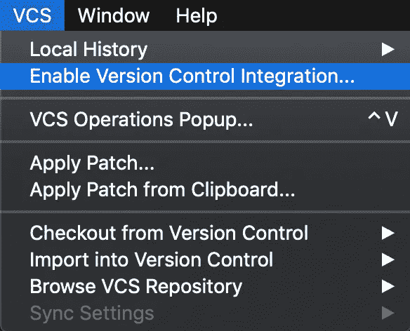

然后选择 **Git** 作为版本控制系统。


成功启用 VCS 后，将创建一个默认的本地主分支


## 补充。gitignore 从 Git 中排除文件

当您使用 Android Studio 创建新的 Android 项目时，会自动添加两个`.gitignore`文件(一个在项目根文件夹中，另一个在 app 文件夹中)。像生成的代码、二进制文件(可执行文件、apk)、本地配置文件这样的文件不应该添加到 Git 中。这些文件应该排除在版本控制之外。下面是我最初的`.gitignore`文件内容:

```
# content of .gitignore
*.iml
.gradle
/local.properties
/.idea/*
.DS_Store
/build
/captures
.externalNativeBuild    
.cxx
```

# 暂存并提交更改

该项目可以与 Git 版本控制一起使用了。要准备并提交您的更改，请转到 **VCS >提交**。

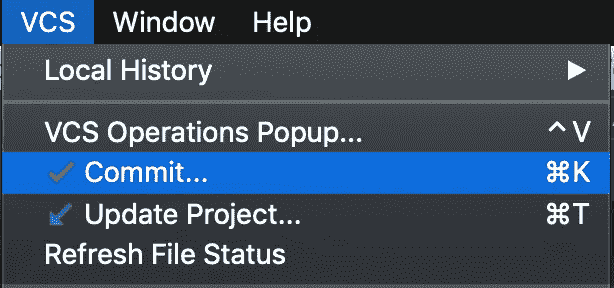

您将看到一个对话框，检查将要添加的所有文件，输入提交消息并提交。您可以取消选择不希望属于此提交的任何文件。

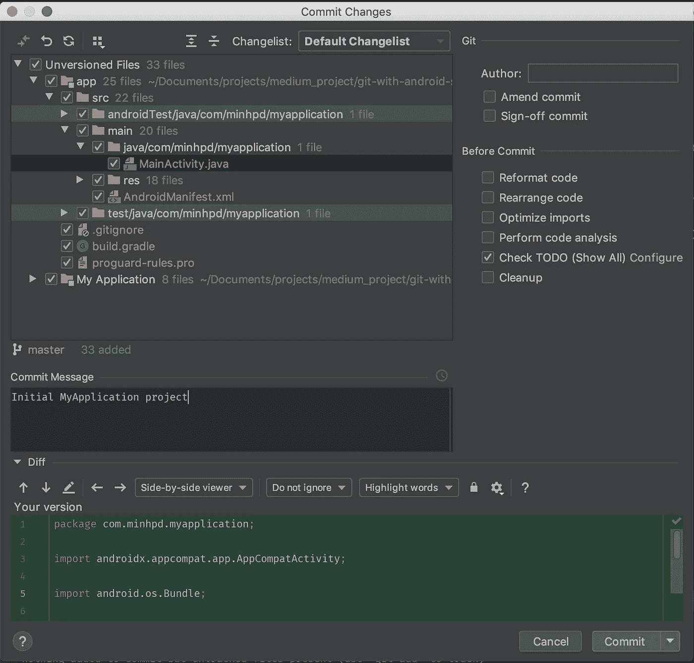

当您单击提交时，弹出窗口显示您尚未配置用户名和电子邮件。您应该始终配置它们，因为它们将被附加到您的提交消息中。


有一个“全局设置属性”的选项，我建议你*不要*勾选这个，因为如果你这样做，你本地机器上的每个 git 项目将会有相同的用户名/电子邮件。有时你想让你的兼职项目和公司项目有不同的用户名/电子邮件。

全部完成——现在整个项目已经添加到 Git 中。

# 设置远程连接

要将项目添加到远程存储库中，请转到 VCS > Git >远程。

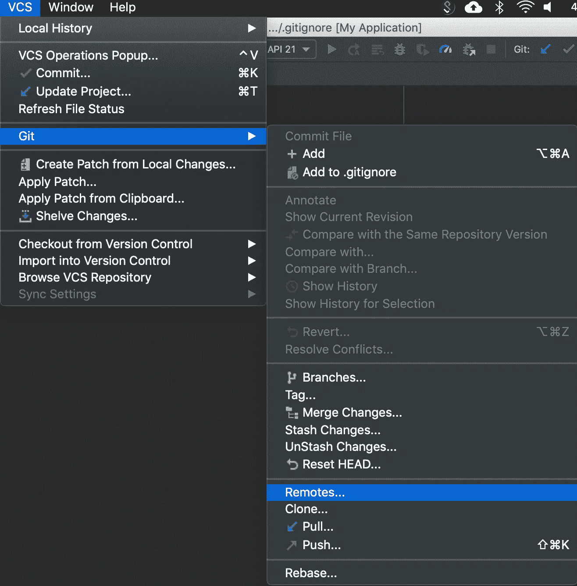

单击**“+”**添加新的遥控器，然后在 URL 框中键入您的遥控器 URL。

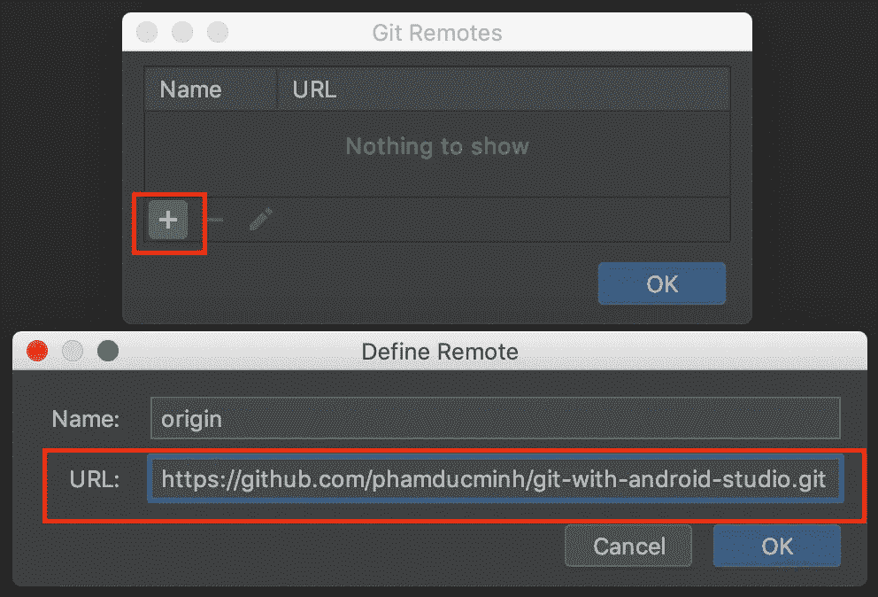

现在，您的本地项目链接到您的 Github 远程存储库。除了 Github，你还可以使用 Bitbucket，Gitlab 或者任何一个库。

# 将更改推送到远程

要将您的本地更改推送到远程存储库，请转到 **VCS > Git >推送。**

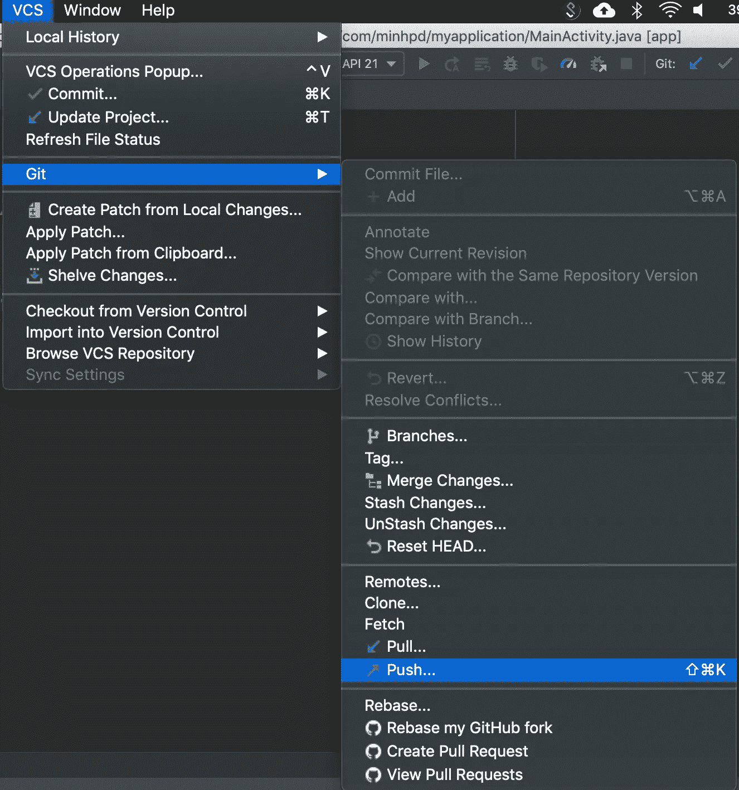

**“推送提交”**弹出窗口将显示哪个提交将被推送到远程跟踪分支。你可以继续努力。

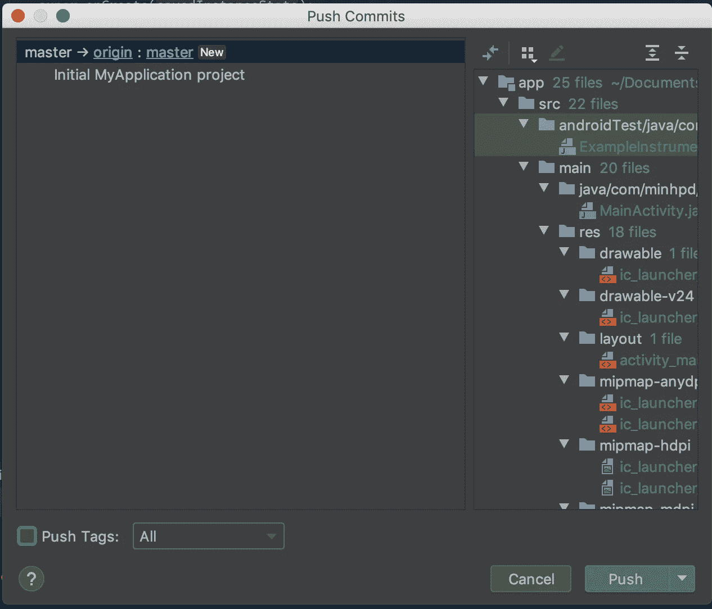

# 从远程获取更改

要从远程下载最新的更改，请转到 **VSC > Git > Pull。**

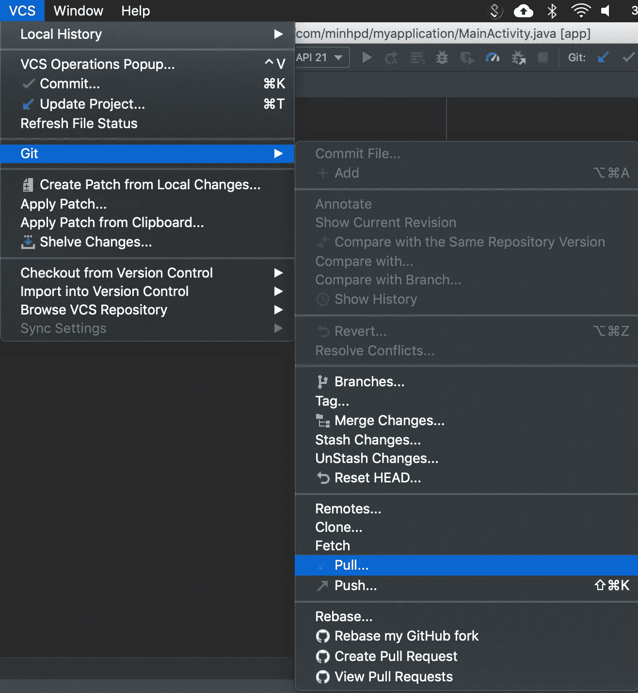

出现**“拉动变化”**弹出窗口。拉的策略我就不解释了，就用 **<默认>** 策略，进行拉。

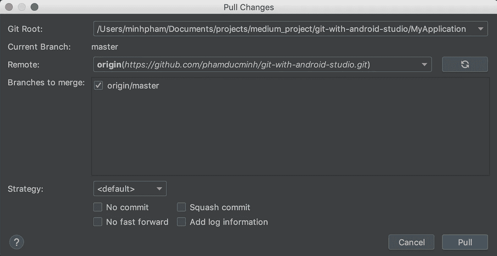

# 使用分支

有些人认为 Git 的分支模型是它的杀手锏，它让 Git 在 VCS 社区中脱颖而出。在这一节中，我将向您展示如何在 Android Studio 中使用分支。

## 创建新分支

去 **VCS >吉特>分店。**


“Git 分支”出现。它显示所有本地分支和远程分支以及“新分支”选项。


提示:如果你看 Android Studio 的右上角，你也会看到你当前的分支——点击它也会打开“g it 分支”弹出窗口。


点击“新建分支”，将其命名为特征分支。

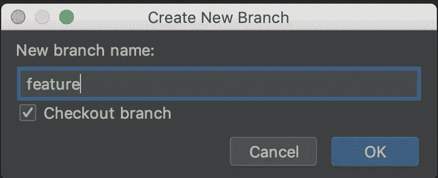

## 其他分支选项

假设你站在特征分支。单击主分支并展开菜单，您将看到许多选项:

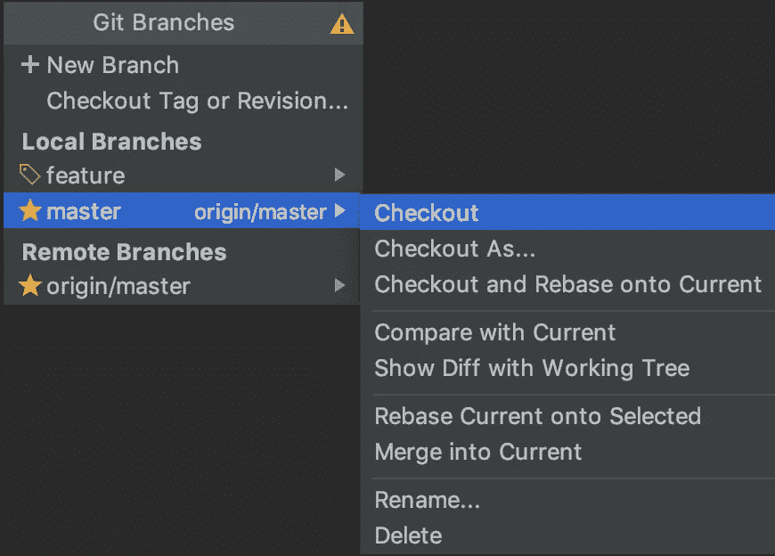

让我逐一解释一下:

*   **结账:**结账主支行。
*   **签出身份:**从主服务器签出新分支
*   **检出并重设基础到当前:**检出主特征和重设基础特征分支到当前特征上。
*   **与当前比较:**提交存在于主文件中但不存在于特征文件中，反之亦然。
*   **显示与工作树的差异:**显示主工作树和当前工作树的差异。
*   **重设当前基础至所选:**重设基础至主特征。
*   **合并到当前:**将主合并到特征。
*   **重命名:**重命名主分支。
*   **删除:**删除主分支。

你会根据自己的需求选择正确的选项。

# 显示日志历史记录

前往 **VCS >吉特>展示历史。**

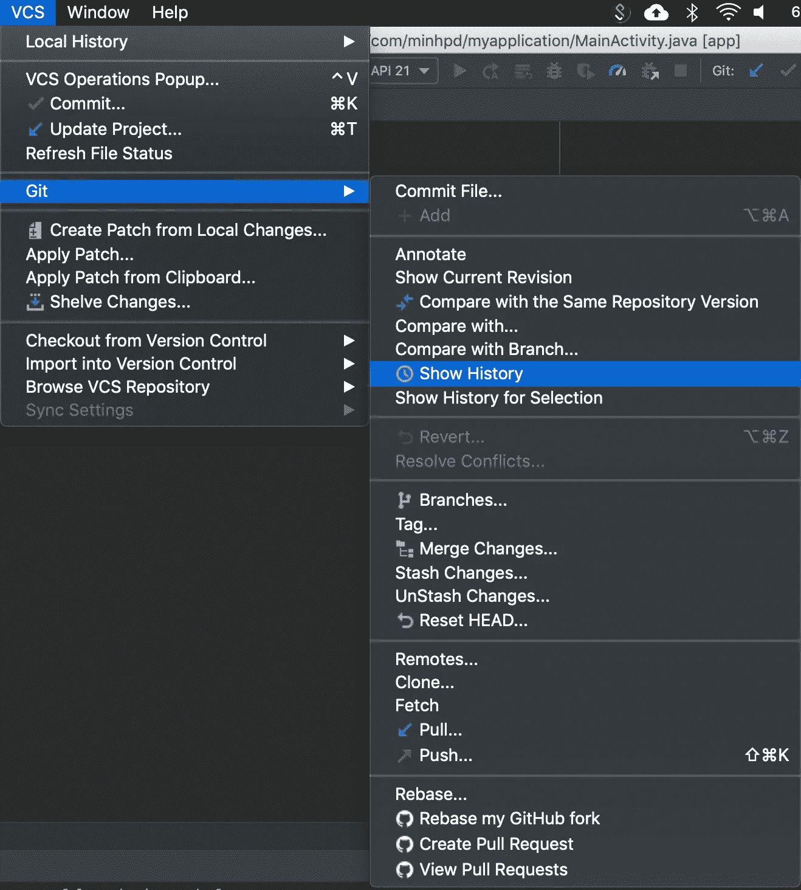

Android Studio 将显示当前打开文件的历史记录:


您可以点击“日志”选项卡查看整个日志历史:

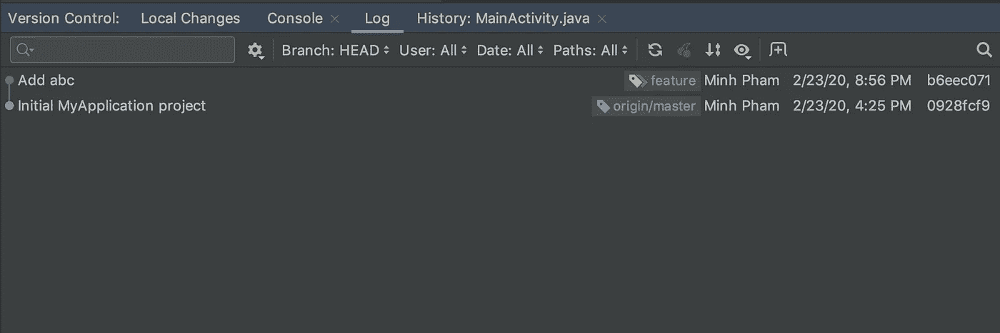

在这里，您可以按分支、用户和日期过滤历史记录，帮助您快速找到您想要的提交。

# 结论

感谢您读到这里！

这就是第 1 部分的全部内容。我希望你学到了新东西。请继续关注第 2 部分，我们将在这里介绍 Android Studio 中 Git 的更多高级特性。

祝你快乐！