# 如何在 Android Studio 中使用 Git 第 2 部分

> 原文：<https://betterprogramming.pub/how-to-use-git-in-android-studio-part-2-93cec67b91b0>

## 掌握你的工具，掌握你的手艺

照片由[乔安娜·科辛斯卡](https://unsplash.com/@joannakosinska?utm_source=medium&utm_medium=referral)在 [Unsplash](https://unsplash.com?utm_source=medium&utm_medium=referral) 上拍摄

这是系列*如何在 Android Studio* 中使用 Git 的第 2 部分。如果您还没有阅读第 1 部分，您可以通过下面的链接来阅读，以获得实际操作的基本功能:

 [## 如何在 Android Studio 中使用 Git

### 掌握你的工具，掌握你的手艺

medium.com](https://medium.com/better-programming/how-to-use-git-in-android-studio-part-1-a8a554006aad) 

# 包括什么

在这篇文章中，我将向您展示在 Android Studio 中使用 [Git](https://git-scm.com/) 时与提交、解决冲突和比较更改**相关的一些功能，包括:**

*   互动分期。
*   提交前的最佳实践。
*   解决冲突。
*   注释。
*   比较变化。

我们开始吧！

注意:本文中所有的引用路径、选项、名称和配置都基于 macOS 系统上的 Android Studio。在其他系统如 Windows 或 Linux 上可能略有不同，但精神是一样的。

# 互动舞台

使用 Git 的最佳实践之一是“尽早提交，经常提交”。

这意味着，与其等待提交变得完美，不如分成小块工作并不断提交工作。为此，您可以使用`--interactive`选项。转到“VCS”——>“提交”:

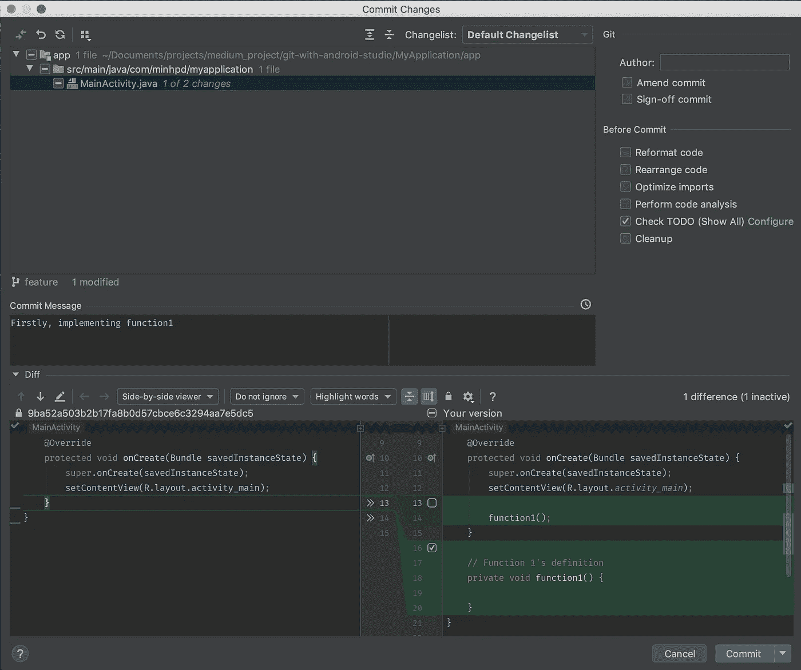

仅添加文件的一部分

对于每个文件，您可以在比较面板中选中/取消选中您希望/不希望在当前提交中出现的部分。使用这种`interactive`模式，您可以将相关的更改分组到一个提交中。

# 提交前的最佳实践

在“提交更改”弹出菜单中,“提交前”有许多选项，让我们浏览一下:

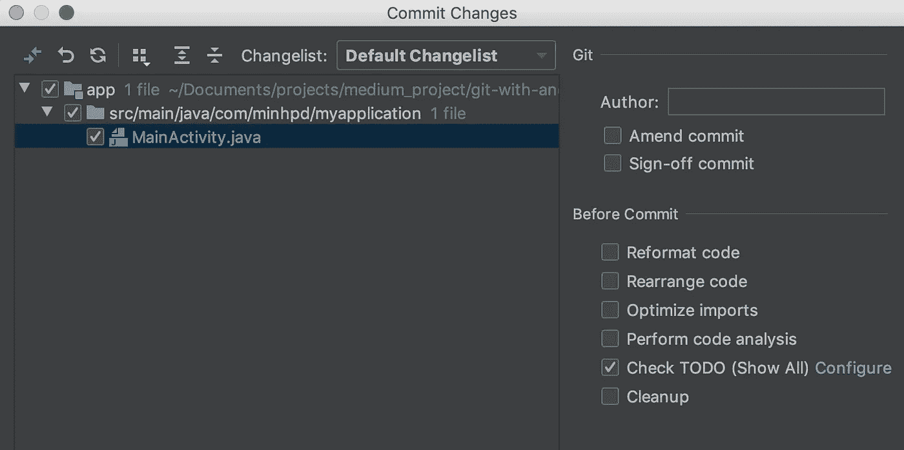

提交更改弹出窗口，带有有用的提交前选项

*   重新格式化代码:与选择“代码”->“重新格式化代码”或快捷方式`Option + CMD + L`时相同。它将删除您可能已经给出的多余空格/制表符，并以适当的缩进格式排列它们。

Java 语言的代码样式区域

*   重新排列代码:与选择“代码”->“重新排列代码”时相同。它会根据“首选项”->“编辑器”->“代码样式”->“Java”->“排列”选项卡中预定义的代码样式准则，以某种方式对所有属性进行排序。
*   优化导入:与选择“代码”->“优化导入”或快捷方式`CTRL + Option + O`时相同。

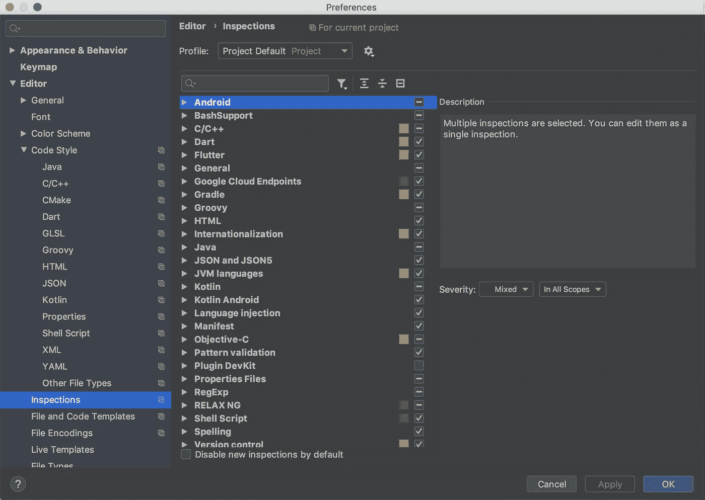

检查区域

*   执行代码分析:与选择“分析”->“检查代码”时相同。它是一组代码检查，在您编译/提交项目之前检测并纠正项目中的异常代码。
*   检查待办事项:提交前我最喜欢的选项之一。我稍后会解释
*   清理:意味着发现潜在的有问题的代码片段，并立即自动修复它们。

TL；DR；让我们做一个演示。

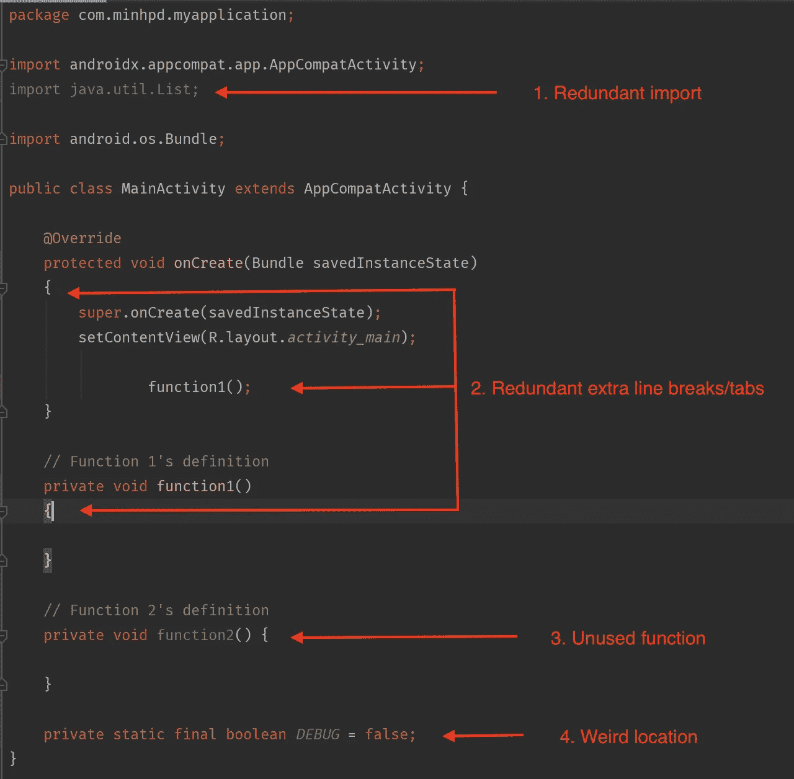

提交前

如您所见，这段代码中有太多需要更正的地方。

这里我选择了选项:*重新格式化代码，重新排列代码，优化导入，执行代码分析，*和*清理*。一切都将自动更正，最终结果将是:

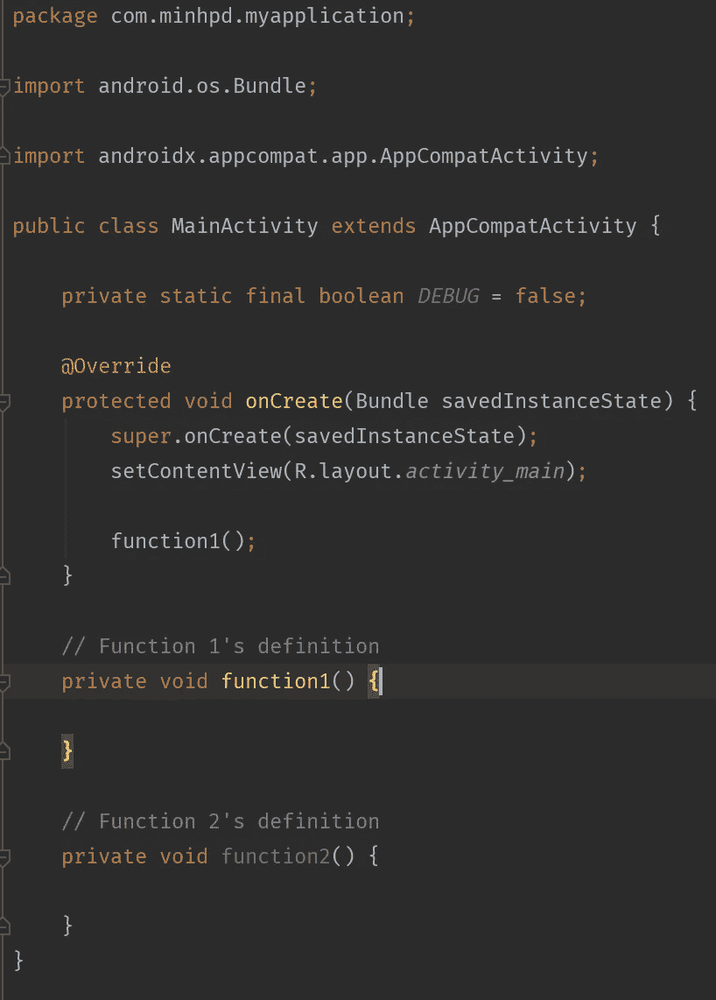

在提交适当的选项后

啊，我忘记了*检查待办事项*选项。假设我需要为 DEBUG 标志设置 true，我添加了一个待办事项来提醒我在完成调试后将其恢复为 false。

添加待办事项以提醒将值恢复为 false

现在，让我们假设你完全忘记恢复它，并且你继续提交这个危险的改变，当你点击*提交*按钮时，检查 TODO 选项将会拯救你。

无法通过 TODO 提交

出现一个弹出窗口，显示“找到一个添加/编辑的待办事项。要不要复习一下？”如果您点击*查看*按钮，它将显示您需要检查的待办事项。

这里要注意的一点是，这是一种提醒，你必须自己处理它，检查更改，删除待办事项，以便你可以继续提交。

# 解决冲突

如果你是一名开发人员，你迟早要处理冲突。有很多解决用户界面冲突的工具，但是在我看来，Android Studio 是最适合 Android 开发者的。

当您将一个分支合并或重置到另一个分支时，如果您遇到冲突，将出现一个“冲突”弹出窗口，其中列出了如下冲突:

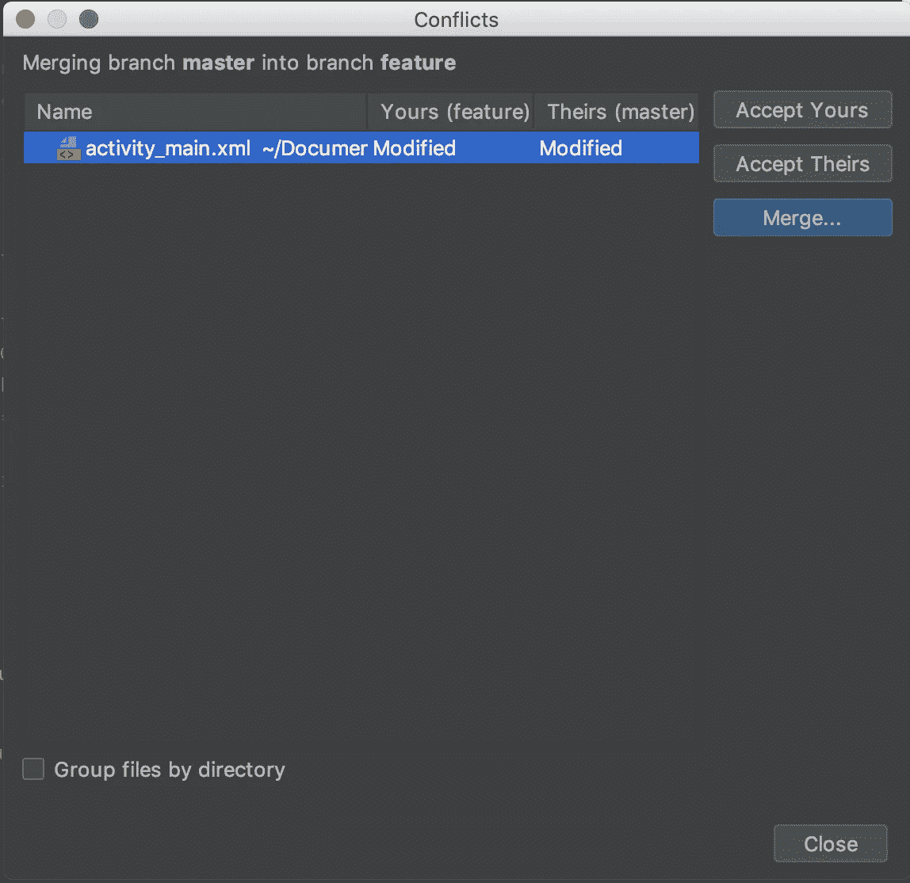

冲突详细信息

*   接受您的:保留您在当前分支(特征)中的更改，并放弃您合并到的分支(主)中的所有更改。
*   接受他们的:放弃您在当前分支(特征)中的所有更改，并使用您合并到的分支(主)中的更改。
*   合并:手动解决冲突。

如果您选择*合并*，将出现一个弹出窗口，左侧显示本地回购的变更，右侧显示远程回购的变更，中间的合并结果将显示在一个单独的对话框中。

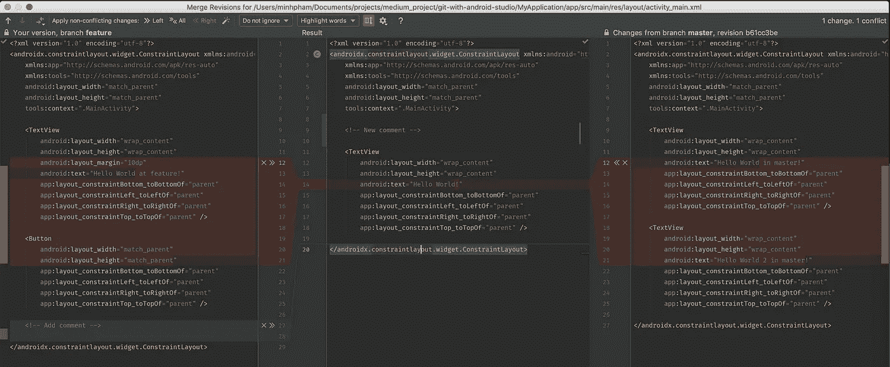

合并冲突

让我解释一下颜色:

*   绿色:从任一侧移动变化总是安全的。
*   蓝色:修改直接在中间窗口的合并结果中进行修改。
*   红色:两边都有修改，需要慎重解决。
*   灰色:显示删除的行。

注意:在解决任何冲突之前，我建议你点击顶部面板中的魔法按钮，Android Studio 将尝试解决尽可能多的简单冲突。它真的是你的救命恩人。

解决简单冲突按钮

点击“解决简单冲突”按钮后，你所要做的就是修改红线。

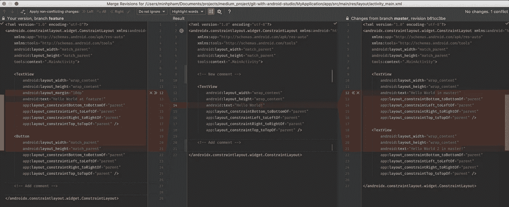

单击解决简单冲突按钮后

你可以使用箭头在本地和远程 repo 之间移动更改，直到 IDE**T3 告诉你冲突已经被处理。**

提示:在*合并修改*面板的左上方，可以上下移动箭头移动到上一个/下一个差异。如果您有一个包含数千行的文件，并且冲突位于文件中的某个位置，这将非常有用。

# 给…作注解

有时你想显示文件的每一行的最后修改版本和作者。然后，*注释*会帮到你。

您可以通过右键单击行号和文件内容之间的空间来注释整个文件。

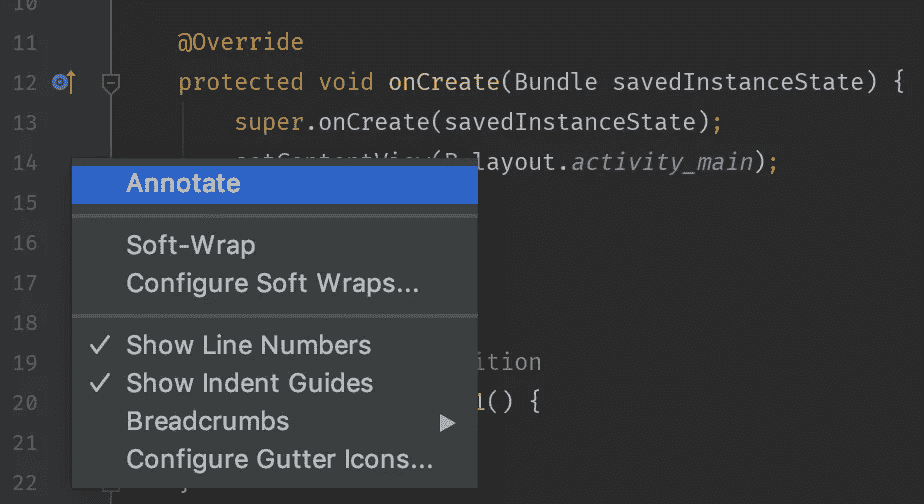

Android Studio 注释

它将显示日期和作者谁最后修改了文件的每一行。

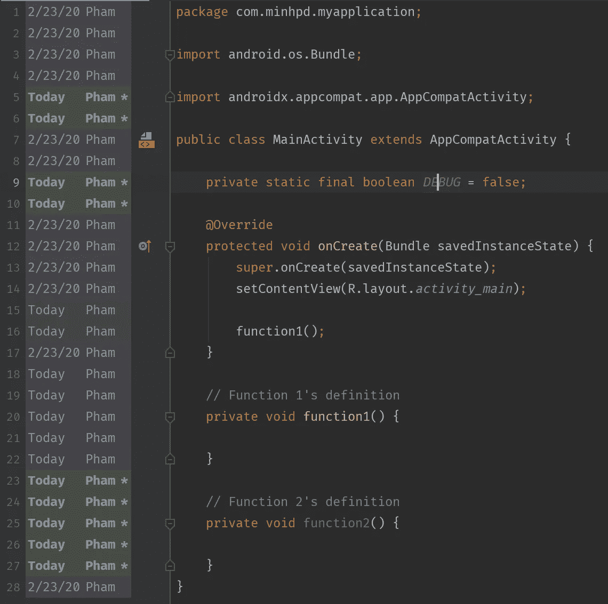

注释每行的放映日期和作者

通过单击注释内容，您可以看到该修订的详细信息，包括文件更改和提交消息。

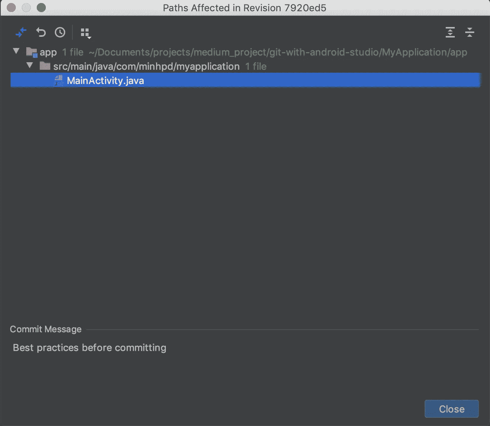

修订中受影响的路径

# 比较变化

## 文件比较~ git diff

假设您从客户那里收到了一个 bug，并且您确切地知道是哪个文件导致了这个 bug，但是您不知道这个 bug 存在于哪一行，或者是谁做了那个更改。

将该文件的当前版本与以前的版本进行比较将有助于您找出问题所在。

右键单击文件，选择“Git”->“Compare with…”

将文件更改与先前版本进行比较

“文件修订”弹出窗口将从头开始显示与该文件相关的每次提交。然后，您可以跟踪文件的历史变化来追踪 bug。

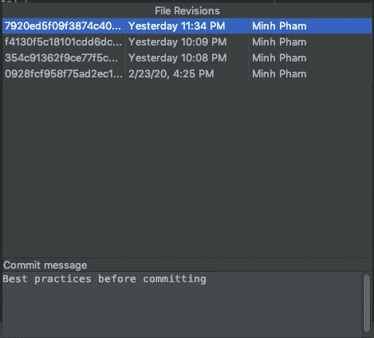

文件修订

我最喜欢的特性之一是“与分支比较…”使用这个工具，您可以将当前的变更与逻辑仍然工作良好的每个分支进行比较(通常是主分支或生产分支)。

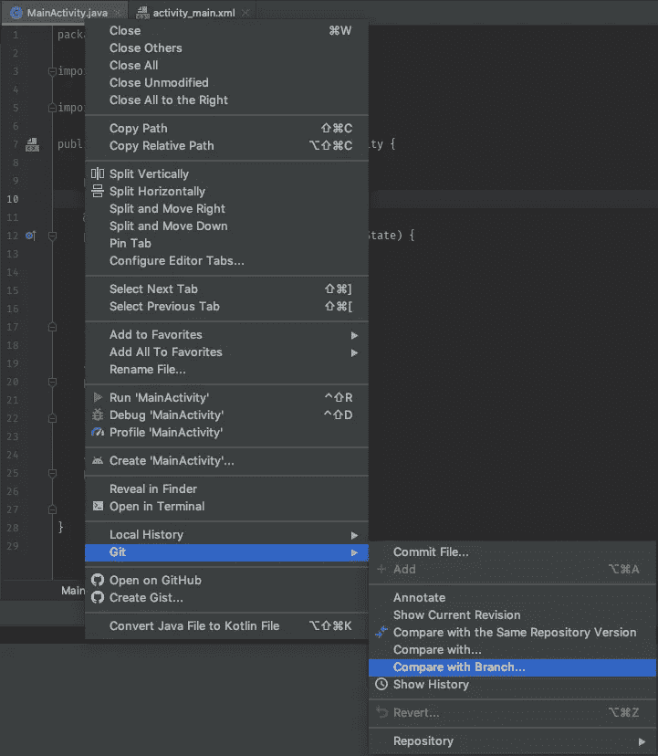

将文件更改与特定分支进行比较

选择要比较的分支

在“选择要比较的分支”中，您可以开始键入任何字符来搜索您想要选择的特定分支，以防您有一堆分支

## 分支比较~ git 日志<branch1>..<branch2></branch2></branch1>

这是当您想要比较两个分支之间的所有变化时使用的。

假设我在特征分支，我想和主分支进行比较。进入“VSC”->“Git”->“分支”，选择主分支，然后选择“与当前比较”。

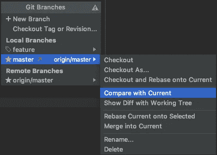

将当前分支与主分支进行比较

一个弹出的“与主特性比较”显示了两个分支、提交到提交、文件到文件之间的所有差异。

将特征与母版进行比较

*   上面将是“存在于主机中但不存在于特征中的提交”:与命令`git log feature..master`的结果相同。
*   下面是“存在于特性中但不存在于主特性中的提交”:与命令`git log master..feature`的结果相同。

如果您单击上面或下面的每个提交，您可以在右侧面板中看到属于所选提交的更改。

如果您想查看两个分支之间的所有文件更改，您可以单击弹出菜单中的选项卡 *Files* 。使用这个视图，您可以快速比较所有的更改。

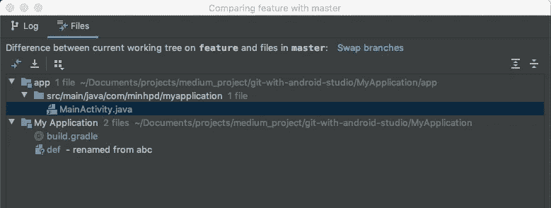

文件在两个分支之间改变

# 结论

感谢您读到这里！

这就是第 2 部分的全部内容。我希望你学到了一些新的东西，并最终掌握在 Android Studio 中使用这些有用的工具。

祝你快乐！