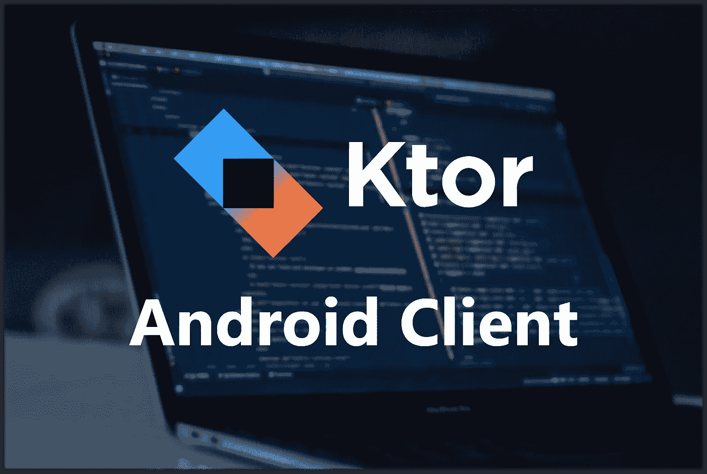

# 如何在你的安卓应用中使用 Ktor

> 原文：<https://betterprogramming.pub/how-to-use-ktor-in-your-android-app-a99f50cc9444>

## 了解关于这个 Kotlin 本地网络库的所有信息



作者照片。

在本文中，您将了解什么是 [Ktor](https://ktor.io/) 以及使用它的好处。然后您将学习如何将它集成到您的项目中。之后，您可以阅读如何用代码片段创建和执行 Ktor 请求。

这篇文章以关于 Ktor 的有价值的见解结束。您还可以在本文底部找到一个 GitHub Ktor 样本库链接。你可以随意摆弄它。

# Ktor 是什么？

据其官方网站称，“Ktor 是一个开源框架，使用强大的 Kotlin 编程语言在互联系统中构建异步服务器和客户端。”它运行在协程程序上，由 JetBrains 公司制造。

Ktor 的目标是提供一个端到端的多平台应用。还是个 WIP。目前，它有 JVM、iOS、JavaScript 和 Android 客户端。

# 为什么选择 Ktor 进行联网？

尽管有特定于平台的客户端，但是如果您尝试学习如何在您的本地平台上使用 Ktor 客户端，您可以很容易地在其他平台上使用 Ktor。

例如，首先作为一名 Android 开发者，我试图通过 Ktor 的 Android 客户端在原生 Android 应用程序中使用它。这段经历帮助我在多平台 Kotlin 项目中实现了 Ktor。

在幕后，Ktor 使用协程进行异步编程，以保持代码的可读性和整洁性。除此之外，Ktor 有许多 Kotlinx 库来帮助开发人员完成解析响应之类的任务。

与选择特定于平台的库相比，使用可以集成到多个平台的网络库是更好的解决方案。随着 JetBrains 的开发，将会有更多的高级功能和长期支持。

# 综合

为了在原生 Android 应用中实现 Ktor，我们需要集成三个库:

1.  第一个是集成 Ktor 的 Android 客户端。
2.  Ktor 有一个接口来发出依赖于引擎的 HTTP 请求。Ktor 提供了一个 CIO(基于协程的 I/O)来使它工作。我们也可以使用 HttpURLConnection 或者 OkHttp 客户端。
3.  最后一个依赖项是用来解析响应的序列化程序。在这个例子中，我们使用 Ktor 的基本 JVM 序列化客户端。但是，您可以从 gson Ktor 客户端等其他选项中进行选择。

当我们把这些碎片放在一起时，它看起来像这样:

Ktor 集成库

# 如何创建 Ktor 客户端

既然我们已经在项目中集成了 Ktor，那么是时候编码了。首先，我们需要创建一个 Ktor 客户机来发出类似于改造构建器的网络请求。

我们使用 Ktor 的 HTTP 客户端，并在构造函数中传递引擎(本例中是 CIO)。然后我们必须`install`一个特定的特性，并可选地配置它。

例如，这里我们使用`KotlinxSerializer`来解析 JSON 响应。JSON 是特性，`KotlinxSerializer`是配置:

用`KotlinxSerializer`创建 Ktor 客户端

# 用协程程序执行 Ktor 请求

为了简单起见，我们将实现一个`GET`请求。这里，我们使用 GitHub API 根据最终用户给定的开发人员名称来检索存储库。

要发出一个`GET`请求，我们必须在 Ktor 的 HttpClient 上使用`get`内联函数，带有一个响应数据类和请求 URL，如下所示:

```
val response = client.**get**<GitHubSearchResponse>(requestUrl)
```

`get`也是一个挂起函数，所以它会负责在 I/O 线程上执行请求。因为它是一个暂停函数，所以它也暂停下一步的执行，直到我们得到响应。

这是 Ktor 的真正力量被释放的地方。使用协程，我们可以顺序执行异步请求。我们需要用一个`try/catch`块来包装请求，以捕获错误和异常。看一看:

使用 Ktor 客户端执行 get 请求

# 关于 Ktor 请求您应该知道的事情

## 请求类型

在前面的代码片段中，您看到了如何执行一个`GET`请求。类似地，我们可以使用`post` suspend 函数执行一个`post`请求。看一看:

通过 Ktor 客户端执行 GET 和 POST 请求

作为替代，我们可以使用`request` suspend 函数并在 lambda 表达式中提供请求类型，如下所示:

使用 Ktor 请求函数执行各种类型的请求

## 头球

我们需要添加到请求中的基本内容之一是标题。我们可以通过使用`headers`块在 Ktor 请求中实现这一点，如下所示:

向 Ktor 请求添加标题

## 序列化程序

在上面的示例中，我们使用了`KotlinxSerializer`来解析响应。如果您的项目太大，并且您的所有数据类都是使用其他库(如 Gson、Jackson 或 JSON)序列化的，Ktor 通过它们各自的客户端支持这些库，如下所示:

Ktor 的一些序列化程序

## 构建客户端

在上面的例子中，我们使用 CIO 作为引擎。或者，我们可以通过分别集成`ktor-client-android`或`ktor-client-okhttp`来使用通常的 HttpURLConnection 或 OkHttp 客户端。

对于 Android 的`HttpURLConnection`，我们需要实现以下内容:

```
// in build.gradle 
implementation "io.ktor:**ktor-client-android**:$ktor_version"

// in the code, while creating the client
HttpClient(**Android**)
```

对于 OkHttp 客户端，我们需要实现以下内容:

```
// in build.gradle add
implementation "io.ktor:**ktor-client-okhttp**:$ktor_version"

// in your code, create the client
HttpClient(**Okhttp**)
```

# 奖金

为了更好地理解 Ktor，请随意尝试这个 [GitHub 示例](https://github.com/SG-K/KtorSample)。

要了解更多关于 Kotlin 的信息，请阅读 Kotlin 系列的[高级编程。](https://medium.com/better-programming/advanced-android-programming-with-kotlin-5e40b1be22bb)

要了解更多关于 Kotlin 协同例程和 Kotlin 的其他高级特性，请阅读以下文章:

*   [《Koin—kot Lin 原生依赖注入库》](https://medium.com/android-dev-hacks/koin-kotlin-native-dependency-injection-library-f1daddc1ef99)
*   [“学习如何组合科特林流”](https://medium.com/@sgkantamani/learn-how-to-combine-kotlin-flows-317849a71d3e)

目前就这些。希望你学到了有用的东西。感谢阅读！