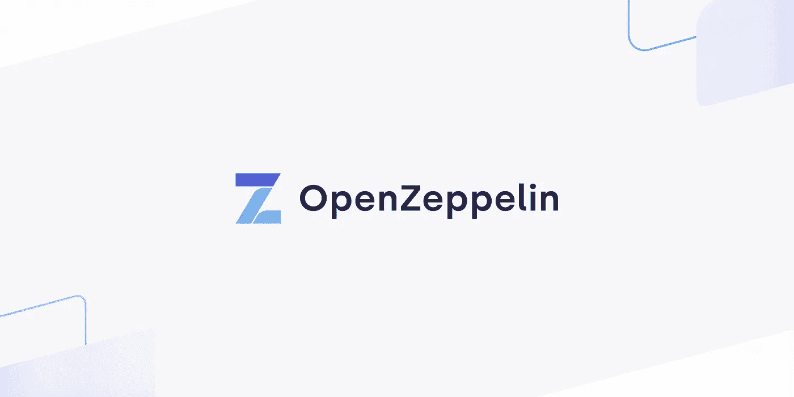

# 如何使用 OpenZeppelin 的新 AccessControl 合约

> 原文：<https://betterprogramming.pub/how-to-use-openzeppelins-new-accesscontrol-contract-5b49a4bcd160>

## 使用最新版本的黄金标准智能合同库



OpenZeppelin

OpenZeppelin 的智能合同库第三版已经发布了！在最新的版本中，他们引入了一种全新的方法来控制对函数的访问。

# 我们所知道的

控制对某些功能的访问对于确保智能合约的安全性至关重要，自从以太坊虚拟机推出以来， [Solidity](https://solidity.readthedocs.io/en/v0.6.6/) 就是这种情况。

熟悉 OpenZeppelin 智能合同库的开发人员知道，它已经提供了根据访问级别限制功能的选项。

最常见的是由`Ownable`契约管理的`onlyOwner`模式。另一个是 Openzeppelin 的`Roles`合同，它使合同能够在部署前定义多个角色，并在每个功能中设置规则，确保`msg.sender`拥有正确的角色。

## 可拥有的

`onlyOwner`模式是最常用和最容易实现的访问控制方法。很原始但是很高效。

它假设智能合约只有一个管理员，并允许管理员将所有权转移到另一个地址。

扩展`Ownable`契约允许子契约用`onlyOwner`自定义修饰符定义函数。这些功能要求交易的发送者是单一管理员。

```
function normalFunction() public {
    // anyone can call this
}function restrictedFunction() public onlyOwner {
    // only the owner can call this
}
```

这是一个简单的例子，展示了如何利用由`Ownable`契约提供的自定义修饰符来限制函数访问。

## 角色

尽管`Ownable`契约非常流行且易于使用，但是存储库中的其他 OpenZeppelin 契约只使用`Roles`库进行访问控制。这是因为`Roles`库提供的灵活性超过了`Ownable`契约的刚性。

作为一个库，它没有被子契约扩展，而是被用作一个工具，通过`using`语句向数据类型添加功能。`Roles`库为`Role`数据类型提供了三个函数，这是它自己定义的。

图 1 显示了`Roles`的定义。

图 1: Roles.sol

在顶部，您可以看到`Role`结构。契约使用它来定义多个角色及其成员。函数`add()`、`remove()`和`has()`是库用来与`Role`结构交互的函数。

例如，图 2 显示了一个令牌如何使用两个独立的角色`_minters`和`_burners`，来对某些功能应用访问限制。

图 2:实现角色

注意在`mint()`函数中，require 语句如何通过使用`_minters.has(msg.sender)`函数来确保消息的发送者是 minter。

# 怎么样

鉴于这已经成为标准有一段时间了，对开发者来说一个大消息是**`**Roles**`**契约已经在从版本 2.5.x 到 3.x 的升级中被移除****

## **原则**

**`Roles`库在它所提供的功能上有些限制。**

**作为一个库，数据存储必须受进口合同的控制。理想情况下，访问控制应该在某种程度上被抽象出来，导入契约只需要考虑对每个功能的限制。**

**新的`AccessControl`合同被吹捧为:**

> **“满足所有授权需求的一站式商店。它让您可以轻松定义具有不同权限的多个角色，以及允许哪些帐户授予和撤销每个角色。它还通过启用系统中所有特权帐户的枚举来提高透明度。”**

**该语句的最后两点在`Roles`库中是不可能的。**

**OpenZeppelin 看起来正在转向一个更像基于角色的访问控制(RBAC)和基于属性的访问控制(ABAC)标准的系统，这两种标准在传统计算安全中非常突出。**

# **剖析代码**

**图 3 显示了`AccessControl`合同代码。**

**图 3: AccessControl 定义**

**第 42 行的`RoleData`结构使用`EnumerableSet`(也是版本 3 的新特性)作为存储成员的数据结构。这允许对特权用户进行简单的迭代。**

**该结构还将`adminRole`存储为一个`bytes32`变量。这定义了哪个角色充当特定角色的管理员(即，能够充当该角色的管理员的角色，向用户授予和撤销该角色)。**

**现在，当角色被授予或撤销时，就会发出事件，这在第 57 行和第 66 行进行了定义。**

**`Roles`契约只提供了三个功能:`has()`、`add()`和`remove()`。这些形式存在于`AccessControl`中，还有额外的功能，如获取角色计数、通过 ID 获取角色的特定成员，以及放弃角色的能力。**

# **如何使用它**

**图 2 给出了一个令牌契约的例子，它需要两个单独的角色，`_minters`和`_burners`，使用了`Roles`库。为了保持连续性，我们将使用相同的概念并应用`AccessControl`契约来实现。**

**图 4 显示了它的实现。**

**图 4:实现访问控制**

**那么，发生了什么变化？首先，每个角色不再在子契约中定义，因为它们存储在父契约中。只有字节 32 id 作为常量状态变量存在于子契约中(本例中为`MINTER_ROLE`和`BURNER_ROLE`)。**

**在构造函数中使用`_setupRole()`来设置角色的初始管理员，绕过`AccessControl`中的`grantRole()`执行的检查(因为在构造时还没有管理员)。**

**此外，不是调用库函数作为数据类型的扩展(即`_minters.has(msg.sender)`)，这些函数本身就是内部的(`hasRole(MINTER_ROLE, msg.sender)`)。这使得子契约中的代码通常更加清晰易读。**

**与使用`Roles`库相比，抽象掉更多的功能可以让子契约更容易地构建在`AccessControl`契约之上。在上一篇文章中，[我提出了使用](https://medium.com/coinmonks/proposing-future-ethereum-access-control-72e56e14e68e) `[AccessControl](https://medium.com/coinmonks/proposing-future-ethereum-access-control-72e56e14e68e)`构建的 RBAC 和 ABAC 系统的未来实现。**

**如果你有兴趣进一步探索这种可能性，加拿大阿尔贝托·单面山制作了[合同的例子，扩展了](https://github.com/HQ20/contracts/tree/master/contracts/access) `[AccessControl](https://github.com/HQ20/contracts/tree/master/contracts/access)`提供的基本功能。**

# **结论**

**`AccessControl`的推出是以太坊生态系统在系统安全方面向行业标准迈进的一大步。**

**该合同得到了行业专家的大力支持。我想象一些有趣而复杂的系统将很快从这份合同中产生，将这一衣钵推得更远。**

**我强烈建议将 OpenZeppelin 合同导入到您的项目中，并自己对它们进行扩展。你永远不知道你会学到什么或偶然发现什么！**

**感谢阅读。**