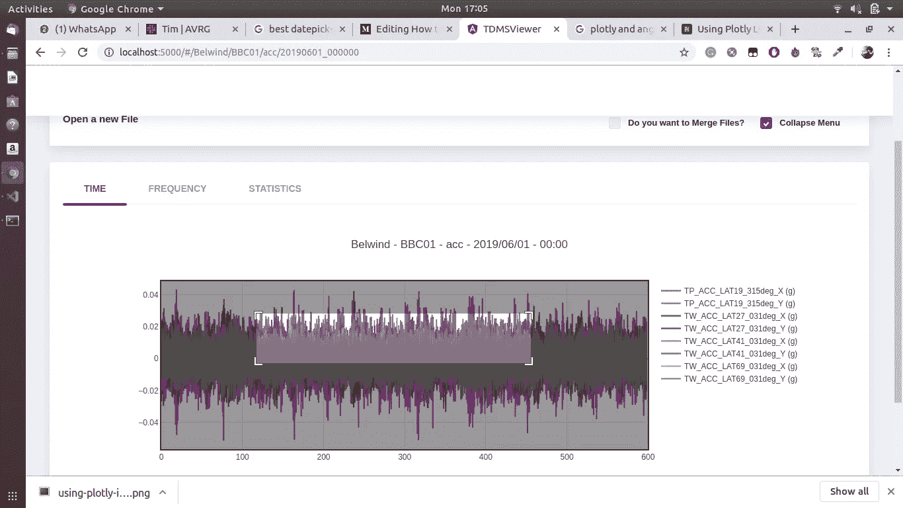

# 如何配合 Angular 8 使用 Plotly.js

> 原文：<https://betterprogramming.pub/how-to-use-plotly-js-with-angular-8-2cbf74fd29ba>



这张图超载了，但是很平滑。

我一直在做一个项目，我需要使用 [Plotly.js](https://plot.ly/javascript/) 和 [Angular](https://angular.io/) 8 来绘制一个自定义的 TDMS 文件。

我在互联网上找到的简单方法有效，但有一个自定义要求，即绘制一个超过 100 万个点的线图。浏览器最终会崩溃或变慢。

在集思广益和尝试了许多事情之后，我设法找到了一种方法，使 Angular 8 成为可能。我找到了关于普通 JavaScript 和反应的文档，但是没有关于 Angular 的。

有一个 [angular-plotly.js repo](https://github.com/plotly/angular-plotly.js?files=1) ，它可能是 angular 的 plotly 的最佳版本，但它似乎适用于较小的图形，仍然有一点缺陷。

# 入门指南

我们将在 Angular 中使用 Plotly 的普通 JavaScript 版本，以使其与他们的 WebGL 版本一起工作时更快更流畅。

本教程假设您在 Angular 上有一个应用程序。

我们将首先在 Angular 项目中包含 Plotly.js。

从下载部分下载他们的 plotly-latest . min . js(1 . 48 . 3 是我写这篇教程时的版本)。(你可以使用 CDN，但我想让我的应用程序完全独立于互联网)。

如果您正在使用 CDN，只需在`index.html`中添加脚本标签。

如果您下载了该文件，请将该文件复制到 assets 文件夹中。

在`scripts`标签的`angular.json`中添加这一行:

```
"scripts": ["src/assets/plotly-latest.min.js"]
```

我们已经成功地将该库包含在我们的项目中，现在我们将使用它。

让我们假设我们有一个组件`graph`，我们将在这里使用它。

在`graph.component.ts`:

```
declare var Plotly: *any*;
export class GraphComponent implements OnInit {
...
...
}
```

我们在 HTML 文件中创建一个应该绘制图形的 div，您可以相应地添加 CSS 和 HTML 标签。我将在最后提供我的，这帮助我保持我的项目响应。

`graph.component.html`

```
<div id="Graph" #Graph></div>
```

回到`graph.component.ts`。

我们使用`@ViewChild`从 DOM 中查找元素。

使用`ViewChild`而不是`document.getElementById`的原因是:

1.  是[打字稿](https://www.typescriptlang.org/)。
2.  如果`div`不可见(也就是说，它可能在某个选项卡中，当你转到该选项卡时，该选项卡将被呈现，或者由于某种原因，它的可见性在应用程序中被隐藏)，`the document.getElementById`将返回一个错误；它不会找到的。

现在，我们得到了数据。我们可以从任何`GET`请求、文件或你可能有的任何来源获得它。

我将使用一个`GET`请求。

接下来，我们需要以特定的方式格式化数据，以便这个图形库能够工作:

我们已经格式化了数据，现在是时候定义图的布局并最终绘制它了。

我们使用这个功能，`Plotly.newPlot()`。

现在，服务应用程序并检查。

# 完整的打字稿代码

TypeScript 文件的完整代码:

# CSS 代码

我使用 CSS 来保持它的响应——根据屏幕方向和中心:

我希望这篇教程对你和我一样有帮助。在这之前我纠结了很多！

感谢阅读。