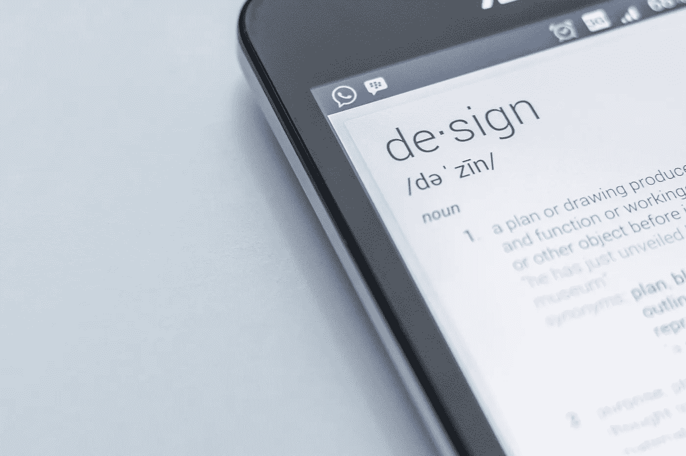

# 如何使用 Python 字典理解

> 原文：<https://betterprogramming.pub/how-to-use-python-dictionary-comprehensions-af5cc5c75bba>

## 列表不是唯一具有理解的数据类型



照片由 [Edho Pratama](https://unsplash.com/@edhoradic?utm_source=unsplash&utm_medium=referral&utm_content=creditCopyText) 在 [Unsplash](https://unsplash.com/s/photos/dictionary?utm_source=unsplash&utm_medium=referral&utm_content=creditCopyText) 上拍摄

Python 最受欢迎的特性之一是列表理解——一种低语法、快速的列表循环替代方法。但是你知道理解不仅限于列表吗？

字典理解虽然不像列表理解那样被广泛使用，但它是一种代替字典循环的简便方法。

# 基本的字典理解

为了展示字典理解的语法，让我们来看几个例子。

第一个示例将创建值为 1-10 的字典，其中术语和定义是等价的。

```
my_nums = {
   i: i
   for i in range(1,6)
}print(my_nums) # {'1': 1, '2': 2, '3': 3, '4': 4, '5': 5}
```

接下来，让我们创建相同的字典，但是添加一个条件过滤器，只创建奇数。

```
my_nums = {
   str(i): i
   for i in range(1,6)
   if i % 2 == 1
}
print(my_nums) # {'1': 1, '3': 3, '5': 5}
```

我知道这两个例子没有什么意义，但是这些普通的例子只是为了演示语法。

列表理解和字典理解的最大区别是字典需要两个值(术语和定义)。由于这种微妙的差异，词典理解需要额外的一秒钟才能有意义，并且不经常使用。

让我们来看一些真实世界的例子，它们将有助于激发你的创造力。

# 词典释义举例

我们将复习我过去用过的两个词典释义，并把它们放在我的活动工具包里，因为它们很方便。

## 删除空值

我喜欢使用字典理解来删除空值——技术上来说，就是`None`值。我们利用条件过滤器，它看起来像这样:

```
data = {
  "id": 1,
  "first_name": "Jonathan",
  "middle_name": None,
  "last_name": "Hsu"
}cleaned = {
  k:v
  for (k,v) in data.items()
  if v != None
}"""
{
  'id': 1,
  'first_name': 'Jonathan',
  'last_name': 'Hsu'
}
"""
```

我们使用原始字典的`.items()`方法将每个键值对作为一个二值元组返回，分别分配给`k`和`v`。

## 地图的替代品

我已经学会喜欢上了 [map 方法](https://medium.com/better-programming/how-to-replace-your-python-for-loops-with-map-filter-and-reduce-c1b5fa96f43a)，但是现实是字典理解通常可以达到相同的结果，而不需要额外的方法和 [lambdas](https://medium.com/better-programming/how-to-use-lambda-expressions-in-python-a96330b513d4) 的复杂性。

```
data = {
  "first_name": "Jonathan",
  "last_name": "Hsu"
}mapped = {
  k: v.upper()
  for (k,v) in data.items()
}"""
{
  'first_name': 'JONATHAN',
  'last_name': 'HSU'
}
"""
```

# 结论

你最喜欢的词典释义是什么？我希望这篇文章能为您的技能工具箱增加一个工具。