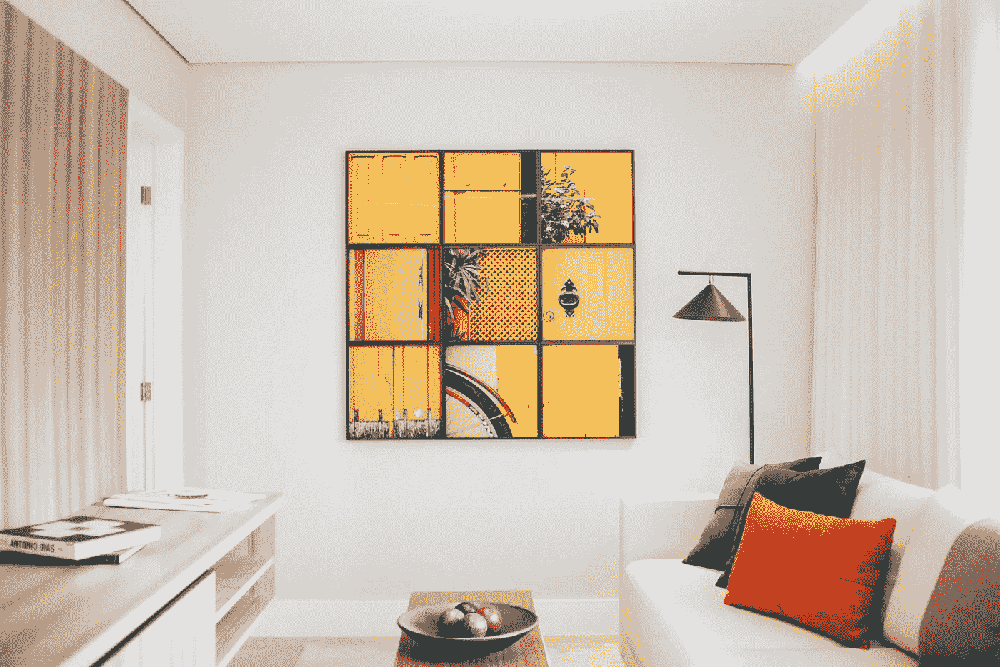

# 如何通过 Kotlin 流使用房间持久性库

> 原文：<https://betterprogramming.pub/how-to-use-the-room-persistence-library-with-kotlin-flow-c73f461a0819>

## 实现从数据库到用户界面的连续数据流



照片由 [Vinicius Amano](https://unsplash.com/@viniciusamano?utm_source=unsplash&utm_medium=referral&utm_content=creditCopyText) 在 [Unsplash](https://unsplash.com/s/photos/room?utm_source=unsplash&utm_medium=referral&utm_content=creditCopyText) 上拍摄

# 这篇文章的要点

[Kotlin 流](https://kotlinlang.org/docs/reference/coroutines/flow.html)是 Coroutines 团队的一个新的强大特性。使用它从本地数据库获得持续更新使得 Android 应用程序更具反应性。

到本文结束时，您将学习如何将 Kotlin 流与 [Room persistence 库](https://developer.android.com/topic/libraries/architecture/room)一起使用，以及如何使用流仅观察表中的特定行。

观察数据列表或数据库表中的特定行是一个现有的特性，但是使用 Kotlin Flow 进行观察会更有效。

尤其是当您更新数据库中的内容，并希望用最新数据更新应用程序的先前屏幕时，您已经开始观察来自`Dao`的数据。

在进入深入的技术内容之前，让我们看看需要的必要步骤。

# **整合**

将房间数据库与目前最新版本的 AndroidX、Kotlin 和 Coroutines 支持相集成。这里，我们使用`kept`代替注释处理器。看一看:

# 实体

任何数据类上面的`@Entity`注释表示数据库中的一个表。

类中的每个字段都是数据库表中的一列，我们可以通过用`@ColumnInfo (name = “column_name”)`注释该字段来给该列指定一个特定的名称，并且至少应该有一个主键字段。

假设我们有一个电视节目的数据库，其中名称是主键；因此，我们不能在数据库中有两个同名的节目。看一看:

# 大刀

Dao(数据访问对象)是一个带注释`@Dao`的接口类；使用`Dao`接口，我们可以从数据库中访问数据(`@Entity`)。

在这里，我们有一个`Dao`接口，它对电视节目列表进行简单的 GET 和 SET 操作。现在为了简单起见，我们在`getTvShows` 上使用`LiveData`而不是 Flow。看一看:

是时候向数据库中添加一些数据了，如下所示。

到目前为止，我们使用`Dao`函数从数据库获取数据并更新 UI。由于这是一种`livedata`排放，它将具有生命周期意识。

假设您最初从数据库中获得数据并更新了 UI，现在我们将另一个 show (Lucifer)添加到`Tvshows`表中，如下所示:

在 Flow 之前，我们需要显式地检查是否有任何额外的数据添加到数据库中，并更新 UI，因为只有当数据在另一端发布时，实时数据才会发出数据。

但是有了 Flow，房间数据库会处理这些变化，并将它们发布到相应的观察点，而不需要任何额外的工作。

# 理论够了，我们来看看怎么用流量

我们将从改变动态数据在`Dao`接口中流动开始。看一看:

```
@Query("SELECT * FROM FavTvShows")
fun getAllshows(): **Flow**<List<FavTvShows>>
```

既然我们已经移除了另一端的实时数据，我们就不能使用可观测量了。我们必须使用`collect`，一个内联扩展函数来从`Dao`获取数据。看一看:

现在，每当表中的一个显示被更新时，协程将使用数据库中该表的整个列表触发 collect 扩展。

然而，这种行为意味着如果我们更新一个不相关的行，比如 Suits show，那么流就会发出 GOT、Lucifer 和其他具有相同数据的 show。

这是因为 [SQLite](https://www.sqlite.org/) 只允许表级通知；因此，Room 触发整个查询以确保您已经更新了数据。

您可以使用像`[distinctUntilChanged](https://kotlin.github.io/kotlinx.coroutines/kotlinx-coroutines-core/kotlinx.coroutines.flow/distinct-until-changed.html)`这样的流操作符，以确保您将只接收特定的行更新。看一看:

现在，当您想要观察 Suits 行中的变化时，您可以通过使用`getShowDistinctUntilChanged`函数并将节目名称作为参数传递来实现，Room 确保您只在特定节目更新时得到通知。看一看:

感谢您的阅读。