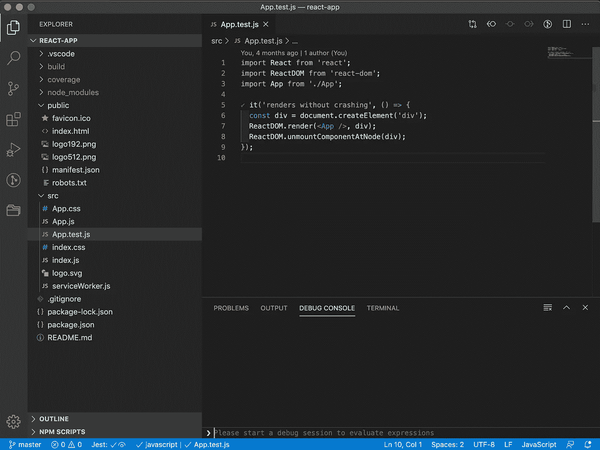
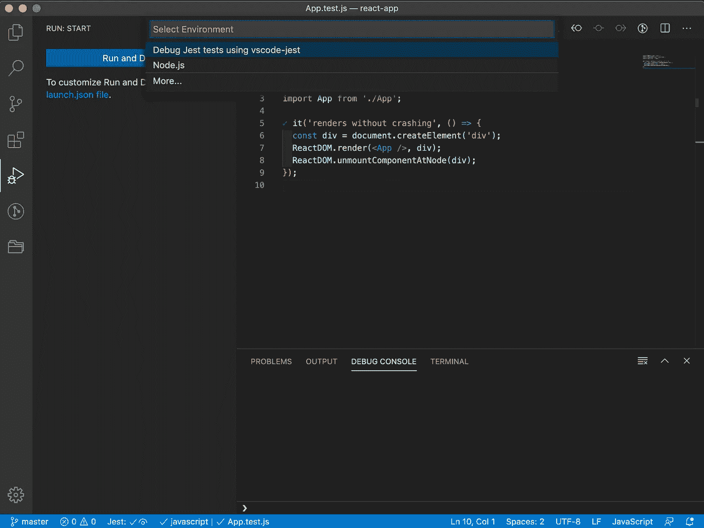
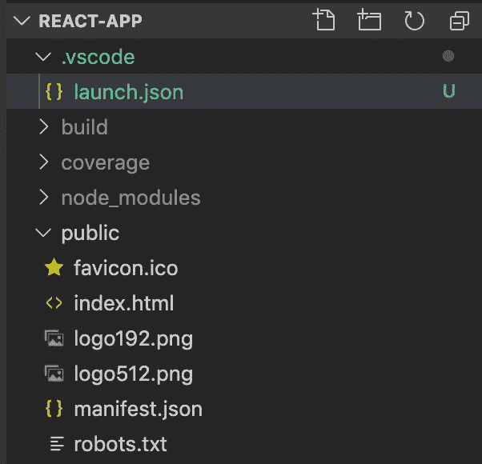
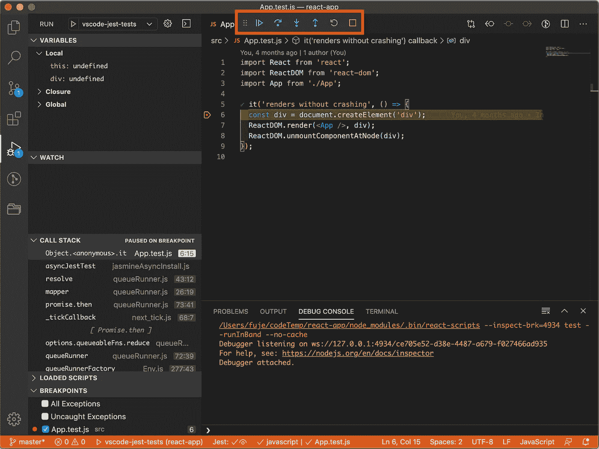
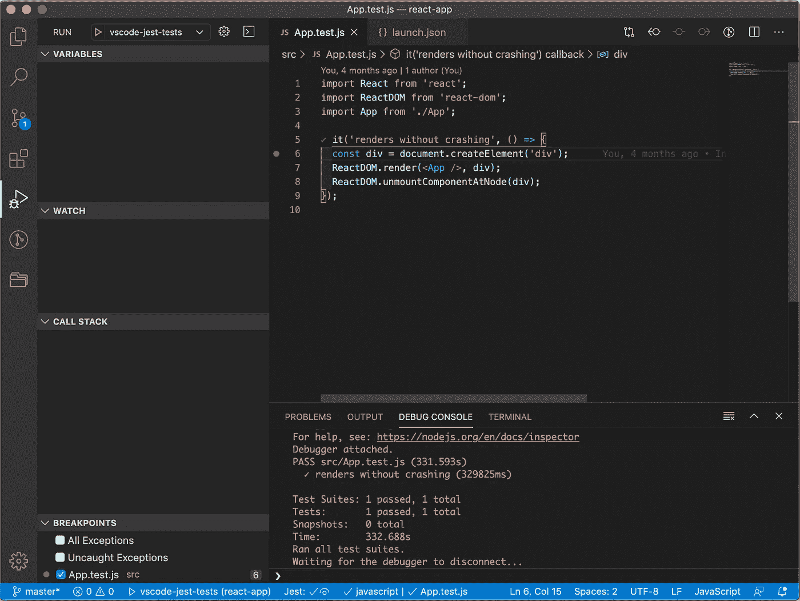
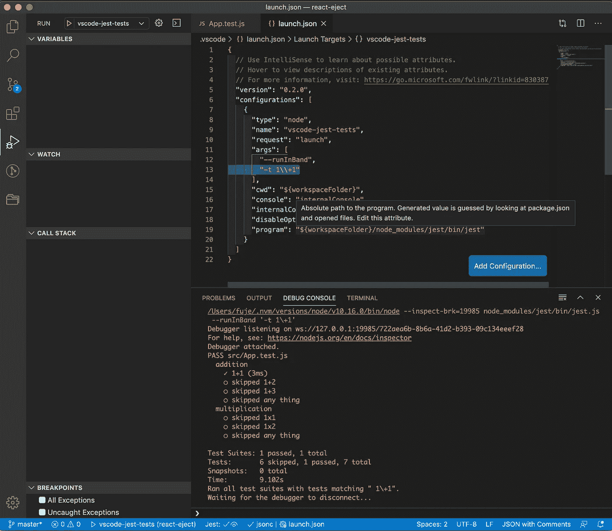
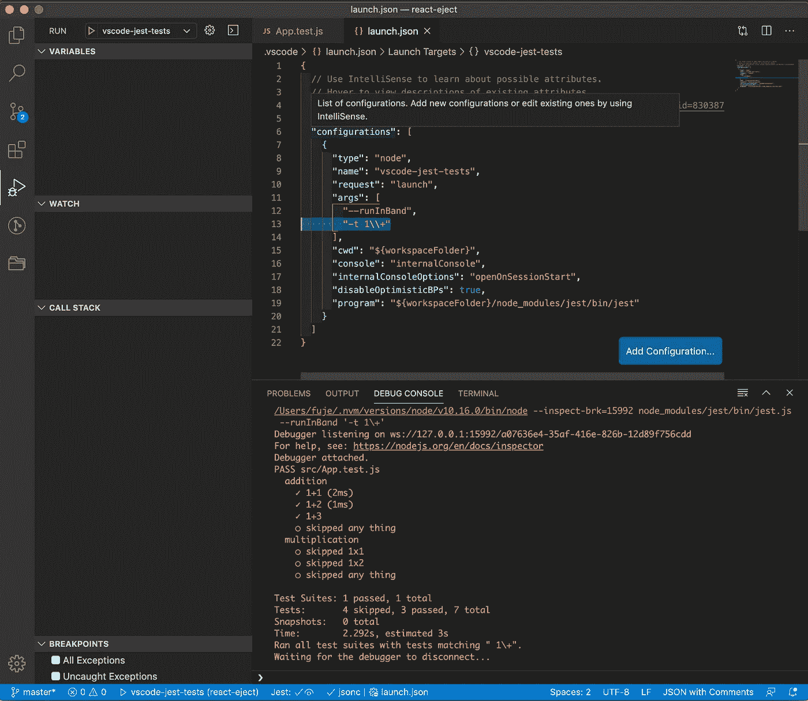
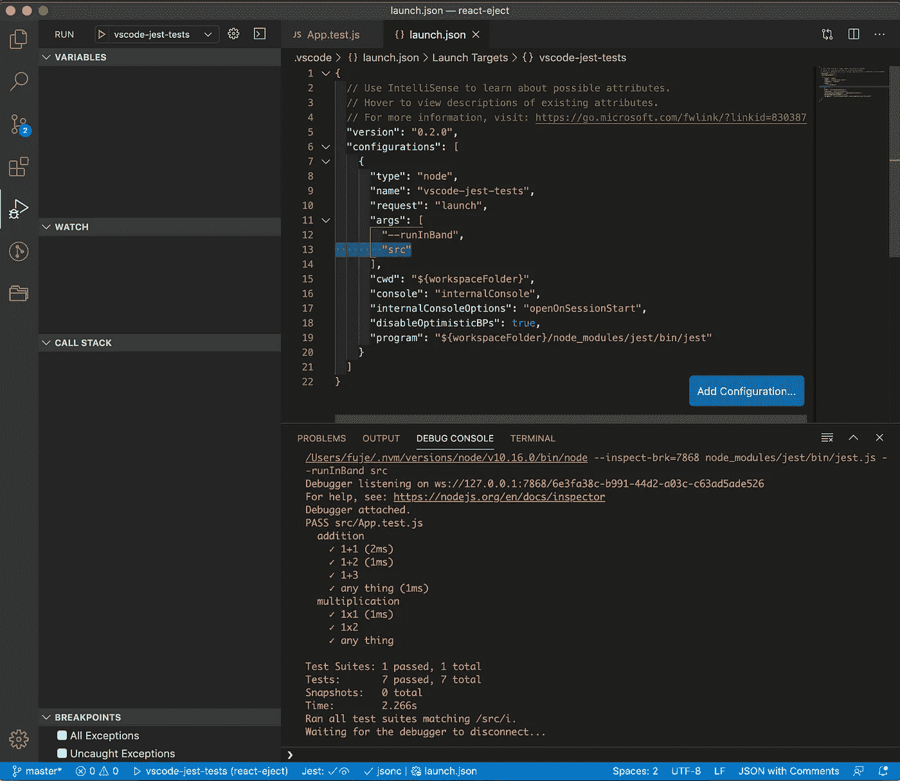
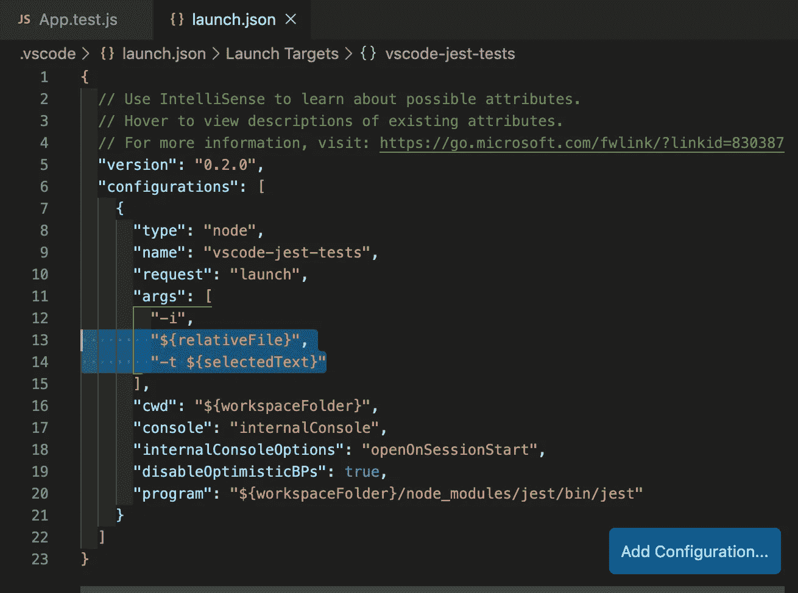
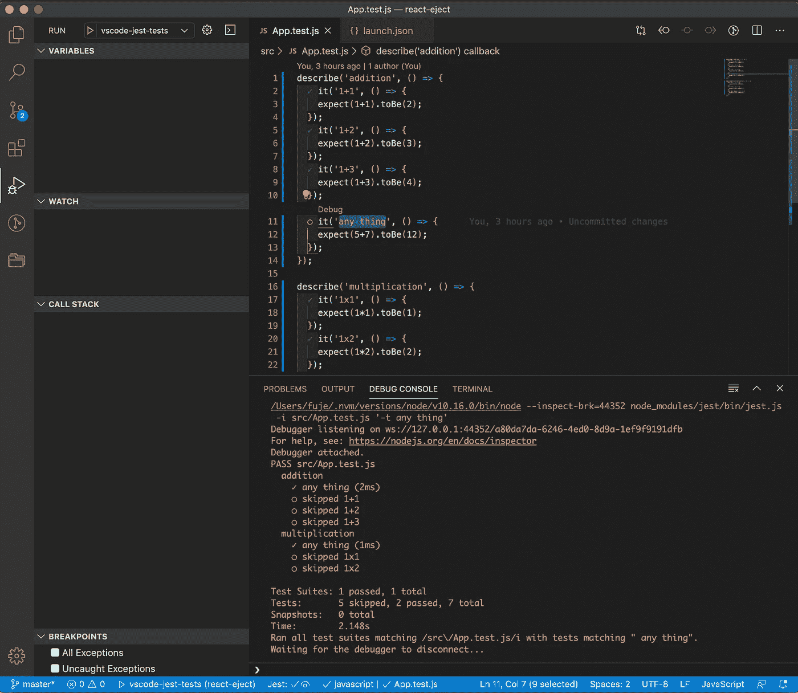

# 如何使用 VS 代码调试单元测试用例

> 原文：<https://betterprogramming.pub/how-to-use-vs-code-to-debug-unit-test-cases-6aebfd7021bd>

## 使用 VS 代码进行更好的调试


照片由 [NeONBRAND](https://unsplash.com/@neonbrand?utm_source=unsplash&utm_medium=referral&utm_content=creditCopyText) 在 [Unsplash](https://unsplash.com/s/photos/bugs?utm_source=unsplash&utm_medium=referral&utm_content=creditCopyText) 上拍摄

你如何调试单元测试用例？有两种流行的方法:

*   使用 Visual Studio 代码(通常称为 VS 代码)的内置功能
*   [使用 Chrome DevTools 的内置调试器](https://medium.com/better-programming/how-to-use-chrome-devtools-to-debug-unit-test-cases-db20ffabb33f)

在本文中，我们将介绍第一种方法:如何使用 VS 代码调试单元测试用例。作为先决条件，必须安装并启用 Jest 扩展，以便通过 VS 代码调试单元测试用例。我的另一篇文章“Visual Studio 代码的 10 个有用插件”描述了如何安装和使用 Jest。

# 调试最初的 Create React App 单元测试用例

下面是脸书著名的 [Create React App](https://github.com/facebook/create-react-app) ，用 VS 代码编辑器打开。代码库中有一个单元测试文件`src/App.test.js`。



可以运行这个命令:`npm run test`。

```
**PASS ** src/**App.test.js** ✓ renders without crashing (3ms)
**Test Suites: 1 passed**, 1 total
**Tests:       1 passed**, 1 total
**Snapshots:** 0 total
**Time:**        0.056s, estimated 1s
Ran all test suites related to changed files.
```

所有测试都通过了。我们感觉很好。

等一下。

单元测试用例出现错误怎么办？如果测试用例很复杂，目测无法识别问题，该怎么办？我们必须硬编码许多`console.log`来调试吗？

VS 代码为我们提供了一个内置的解决方案。

点击左侧面板下面的`Run`按钮。它为运行和调试提供了一个接口。通过指定适当的配置，我们可以在过程中使用断点进行调试，以及检查变量和调用堆栈。不需要特殊的代码更改(例如，`console.log`或调试器语句)。


从上面截图，点击链接`create a launch.json file`。这允许我们选择预定义的环境。



在选择了`Debug Jest tests using vscode-jest`之后，我们以下面的调试配置`launch.json`结束。


该文件出现在项目的根目录下:



我们稍微修改了一下生成的配置文件:

```
{
  "version": "0.2.0",
  "configurations": [
    {
      "type": "node",
      "name": "vscode-jest-tests",
      "request": "launch",
      "args": [
        "test",
        "--runInBand",
        **"--no-cache"**
      ],
      "cwd": "${workspaceFolder}",
      **"console": "internalConsole",
      "internalConsoleOptions": "openOnSessionStart",**
      "disableOptimisticBPs": true,
      "runtimeExecutable":
        "${workspaceFolder}/node_modules/.bin/react-scripts",
      "protocol": "inspector"
    }
  ]
}
```

以下是 Jest 选项:

*   `—-runInBand`:别名`-i`。在当前进程中连续运行所有测试，而不是创建运行测试的子进程的工作池。这是用于调试环境的。
*   `--no-cache`:禁用缓存。这是可选的。平均来说，禁用缓存会使 Jest 至少慢两倍。

这是创建 React 应用程序的启动配置。因此，`“runtimeExecutable”`被设置为`react-scripts`。

以下选项设置为在`Debug Console`而不是`Terminal`运行测试。

```
"console": "internalConsole",
"internalConsoleOptions": "openOnSessionStart",
```

在`src/App.test.js`上，点击在第 6 行设置断点。


然后点击`Start Debugging button`，在上图截图中的红框中标注。



为了调试，执行在第 6 行停止。一组按钮，在上面截图中的红框中标记，允许我们继续、跨过、步入、步出、重启和停止。

单击继续按钮，测试以成功状态结束:



# 调试重新连接的 Create React App 单元测试用例

对于使用重新连线的 Create React 应用程序的项目(参见“[关于 Create React 应用程序的有趣事实# 5](https://medium.com/better-programming/10-fun-facts-about-create-react-app-eb7124aa3785)”)，我们遵循相同的步骤并生成以下修订的`launch.json`:

```
{
  "version": "0.2.0",
  "configurations": [
    {
      "type": "node",
      "name": "vscode-jest-tests",
      "request": "launch",
      "args": [
        "test",
        "--runInBand",
        "--no-cache"
      ],
      "cwd": "${workspaceFolder}",
      "console": "internalConsole",
      "internalConsoleOptions": "openOnSessionStart",
      "disableOptimisticBPs": true,
      "runtimeExecutable":      
        "${workspaceFolder}/node_modules/.bin/**react-app-rewired**",
      "protocol": "inspector"
    }
  ]
}
```

这里唯一的区别就是`“runtimeExecutable”`改成了`react-app-rewired`。


# 调试弹出的 Create React App 单元测试用例

您想知道如何调试常规的 JavaScript 单元测试用例吗？我们使用弹出的 Create React 应用程序来测试这个案例。同样，遵循相同的步骤，生成以下修改后的`launch.json`:

```
{
  "version": "0.2.0",
  "configurations": [
    {
      "type": "node",
      "name": "vscode-jest-tests",
      "request": "launch",
      "args": [
        "--runInBand"
      ],
      "cwd": "${workspaceFolder}",
      "console": "internalConsole",
      "internalConsoleOptions": "openOnSessionStart",
      "disableOptimisticBPs": true,
      **"program": "${workspaceFolder}/node_modules/jest/bin/jest"** }
  ]
}
```

以上设置中，`args`更简单，`“program”`直接指向`jest`可执行文件。


# 单元测试用例的调试选项

您想知道如何通过 VS 代码调试指定更多选项吗？让我们看看弹出的 Create React 应用程序代码库中修改过的`App.test.js`的几个例子:

我们可以使用选项`"--testNamePattern=<regex>"`来匹配单元测试名称。别名:`-t <regex>`。它只运行名称与正则表达式匹配的测试。

`"-t"`放入`"args"`。

*   `"-t 1\\+1"`开始一个单元测试:



*   开始三个单元测试:



*   `"-t any thing"`开始 2 个单元测试:


为了让`"-t"`选项在 VS 代码中工作，`it`测试用例需要被`describe`包装。因此，Create React App 中的`App.test.js`文件需要做一点调整(在下面的代码中，增加了第 5 行和第 11 行):

另外，`"args"`可以匹配一个文件名:


`"args"`也可以匹配一个目录名:



想把它变得更漂亮吗？您可以使用 VS 代码的[预定义变量](https://code.visualstudio.com/docs/editor/variables-reference#_predefined-variables):

*   `${relativeFile}` —当前打开的文件相对于`${workspaceFolder}`
*   `${selectedText}` —激活文件中当前选中的文本



然后，在`App.test.js`中选择`'any thing'`。点击`Start Debugging button`，将运行当前文件中两个名为`'any thing'`的单元测试用例。



那不是很容易吗？

如果你想尝试更高级的 Jest 选项，请访问[Jest 官方网站](https://jestjs.io/docs/en/cli.html)了解更多详情。

如果你想尝试更高级的 VS 代码调试选项，去[VS 代码官方网站](https://code.visualstudio.com/docs/editor/debugging#_launch-configurations)了解更多详情。

感谢 Vikash Singh、Shraddha Chadha 和 Shreya Shah 对验证和优化该方法的帮助。

感谢阅读。我希望这有所帮助。你可以在这里看到我的其他媒体出版物[。](https://medium.com/@jenniferfubook/jennifer-fus-web-development-publications-1a887e4454af)