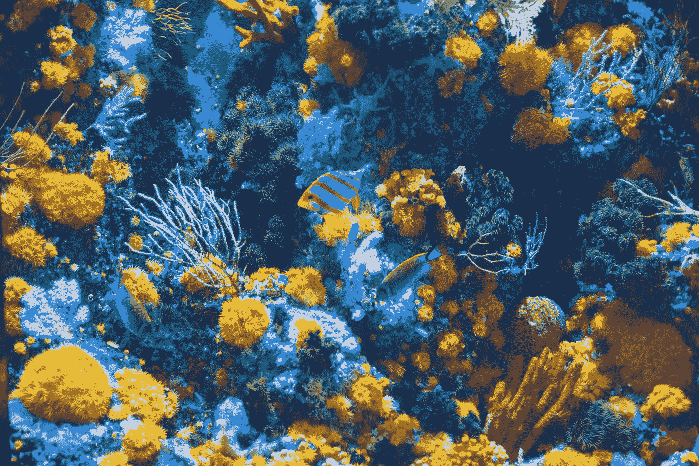

# 如何用 Sonobuoy 验证您的 Kubernetes 集群

> 原文：<https://betterprogramming.pub/how-to-validate-your-kubernetes-cluster-with-sonobuoy-c91b282908fe>

## 为您的 Kubernetes 集群运行全面的一致性测试



照片由[肖恩·劳](https://unsplash.com/@breadboyshaun?utm_source=unsplash&utm_medium=referral&utm_content=creditCopyText)在 [Unsplash](https://unsplash.com/s/photos/deep-sea?utm_source=unsplash&utm_medium=referral&utm_content=creditCopyText) 拍摄

Kubernetes 是容器编排领域事实上的领导者。由于 Kubernetes 是一个开源的、健壮的、灵活的平台，因此市场上有许多可用的实现。

您可以托管云原生托管的 Kubernetes 集群(如 GKE、AKS 和 ECS)，使用`kubeadm`运行本地安装，或者以艰难的方式设置 Kubernetes。托管 Kubernetes 有多种方式，每种方式都有其使用案例。

随着时间的推移，行业中的特定标准不断发展，大多数设置都需要符合这些标准，以获得最佳性能和安全性。

由于 Kubernetes 有多个活动部件，这让大多数系统管理员感到困惑，他们中的大多数人不知道他们的配置是否正确，以及是否按照应该的方式进行了设置。

# 什么是声纳浮标？

Sonobuoy 是一个一致性测试工具，它试图解决这些问题并回答上面的一些问题。行业专家设计了端到端一致性测试套件，这些套件随着时间的推移而不断发展，让您受益于多年的学习和经验。

Sonobuoy 以一种可访问和非破坏性的方式运行一致性测试。这意味着您可以在生产环境中定期运行这些测试，而不会干扰您的实际应用程序。

它为您的集群提供可定制、可扩展且独立于集群的报告。它帮助您了解您的设置如何符合行业标准，以及您是否需要进行任何更改。

您可能想知道，如果我们已经适当地保护了我们的 Kubernetes 集群，我们为什么还要这样做。

答案很简单:Kubernetes 允许团队开发可移植的、独立于平台的应用程序。这意味着您可以将容器工作负载从一个集群转移到另一个集群，并且只需做最少的更改。如果您的 Kubernetes 集群不符合某个标准，您就无法实现可移植性。

Sonobuoy 的另一大特色是可定制插件。这个特性允许你编写定制的插件来符合你的组织标准。您可以编写一组测试，并将它们扩展并应用到您团队的所有 Kubernetes 集群中。这确保了公司内部的一致性和质量。

让我们通过一个动手练习来了解它的工作原理。

# 先决条件

确保您拥有:

*   运行中的 Kubernetes 集群
*   拥有`cluster-admin`权限的 kubectl 用户

# 安装声纳浮标

Sonobuoy 可以作为二进制文件用于多种平台。根据您的 Kubernetes 版本选择 Sonobuoy 版本。Sonobuoy 版本 n 支持 Kubernetes 的 n 到 n-2 版本。例如，Sonobuoy 0.18.2 支持 Kubernetes 版本 1.18、1.17 和 1.16。

转到[https://github.com/vmware-tanzu/sonobuoy/releases](https://github.com/vmware-tanzu/sonobuoy/releases)并根据您的 Kubernetes 集群版本获取版本。在演示中，我运行的是 Google Kubernetes 引擎版本 1.16.8。因此，让我们使用 Sonobuoy v0.18.2。

获取 Sonobuoy tarball，解压缩它，并将 Sonobuoy 二进制文件移动到您的`/usr/bin`目录中。

正如先决条件中提到的，您需要为您的用户提供`cluster-admin`特权。如果您正在运行 GKE，请运行以下命令:

# 运行一致性测试

现在让我们通过运行 Sonobuoy 来启动测试。以下命令将`kube-conformance-image`作为`gcr.io/google-containers/conformance:v1.16.8.`，根据您的 Kubernetes 版本更改标签。

声纳浮标运行命令的成功完成表明声纳浮标测试的开始。Sonobuoy 创建一个`sonobuoy`名称空间并运行一个`sonobuoy` pod 和一个`e2e`作业。`e2e`作业为您的集群运行端到端一致性测试。

列出`sonobuoy`名称空间中的资源以获得`e2e` pod。

完成一次声纳浮标测试需要一个小时。因此，定期检查状态是有意义的。

要获得状态，请运行以下命令:

如果您想了解 Sonobuoy 在幕后做了什么，请按照`e2e`测试容器中的日志来查看 Sonobuoy 运行您的测试。

一旦测试完成，Sonobuoy `e2e`作业停止生成日志并终止容器。

# 分析结果

下一步是得到结果并分析它们。

```
$ results=$(sonobuoy retrieve)
$ echo $results
202005251309_sonobuoy_56f07ee5-87c8-4599-81d3-4e08385b576c.tar.gz
```

如您所见，Sonobuoy 创建了一个结果的 tarball，并将其存储在您的工作目录中。

```
$ $ ls -l|grep .tar.gz
-rw-r--r-- 1 cloud_user_p_a9ca74 cloud_user_p_a9ca74 1492967 May 25 16:08 202005251309_sonobuoy_56f07ee5-87c8-4599-81d3-4e08385b576c.tar.gz
```

要检查结果，请运行以下命令。

您可以进一步提取结果 tarball 来调查测试失败的根本原因，并了解您需要做些什么来修复它们。

对于完整的端到端一致性测试日志，请看一下`e2e.txt`日志文件，如下所示。

```
$ tar -xvf 202005251309_sonobuoy_56f07ee5-87c8-4599-81d3-4e08385b576c.tar.gz
$ more podlogs/sonobuoy/sonobuoy-e2e-job-28c9482fd5e4477a/logs/e2e.txt
```

# 打扫

在测试完成后，清理 Sonobuoy 创建的所有资源是有意义的。下面的命令删除 Sonobuoy 名称空间和 Sonobuoy 在运行期间创建的任何资源。

# 结论

感谢阅读！我希望你喜欢这篇文章。

声纳浮标可以让你感知海洋深处的情况。类似地，Kubernetes 环境中的 Sonobuoy 使您能够了解您的集群是否符合特定的标准。Sonobuoy 帮助您使您的集群更加健壮，并帮助您在组织内实现容器管理的成熟。