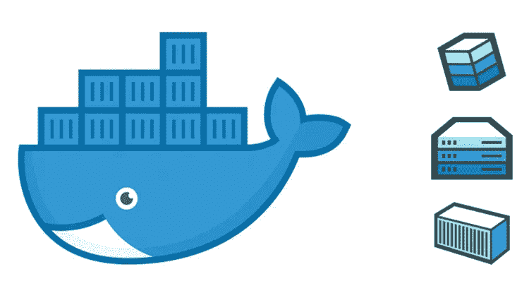

# 如何对 Docker 图像进行版本控制

> 原文：<https://betterprogramming.pub/how-to-version-your-docker-images-1d5c577ebf54>

## 有一千种方法来版本化 Docker 图像——这里有一个简单的方法



虽然可能有一千种方法来版本化你的 Docker 图像，但是我将向你展示一个非常简单的方法，使用已经变得相当普遍的方法。它将确保您的映像版本与您的 Git 版本标签相匹配，因此您可以确切地知道哪个代码在映像中。

*更新:我最近写的一篇关于版本控制的文章是* [*，这里有*](https://medium.com/better-programming/how-to-version-your-code-in-2020-60bdd221278b) *。*

本教程假设您已经有了一个构建映像的 docker 文件。

## 版本文件

首先，创建一个*版本*文件，其中除了版本号之外什么也没有:

```
0.0.1
```

为了完整起见，您希望将这个版本文件存储在映像中(因为您的程序可以使用它来显示版本)，所以将以下内容添加到 docker 文件中:

```
ADD VERSION .
```

这将把版本文件添加到您的工作目录中。

## 构建脚本

如果您还没有构建脚本，创建一个并将其命名为 *build.sh.* 最简单的形式就是运行您的 docker 构建:

```
set -ex# SET THE FOLLOWING VARIABLES
# docker hub username
USERNAME=treeder
# image name
IMAGE=helloworlddocker build -t $USERNAME/$IMAGE:latest .
```

您可能需要一些额外的构建步骤，所以继续添加它们。或者您可能有自己的构建脚本，在这种情况下，您可以忽略该脚本，只需更改下面脚本中的行来运行您的构建。确保 *chmod a+x ./build.sh* 以便运行它。

## 发布脚本

现在，让我们创建一个名为 *release.sh* 的简单发布脚本，它将撞击版本，运行构建脚本，设置 git 标签，将标签推送到 GitHub，构建映像，最后将映像推送到 Docker Hub。您可以复制并粘贴下面的脚本，只需确保更改顶部的值以匹配您的 Docker Hub 信息:

```
set -ex# SET THE FOLLOWING VARIABLES
# docker hub username
USERNAME=treeder
# image name
IMAGE=helloworld# ensure we're up to date
git pull# bump version
docker run --rm -v "$PWD":/app treeder/bump patch
version=`cat VERSION`
echo "version: $version"# run build
./build.sh# tag it
git add -A
git commit -m "version $version"
git tag -a "$version" -m "version $version"
git push
git push --tagsdocker tag $USERNAME/$IMAGE:latest $USERNAME/$IMAGE:$version# push it
docker push $USERNAME/$IMAGE:latest
docker push $USERNAME/$IMAGE:$version
```

用 *chmod a+x ./release.sh* 使其可执行，然后用*运行。/release.sh* 。

这就是了。每次发布时，只需运行*。/release.sh* 你将拥有与你的源代码相匹配的版本化图像！