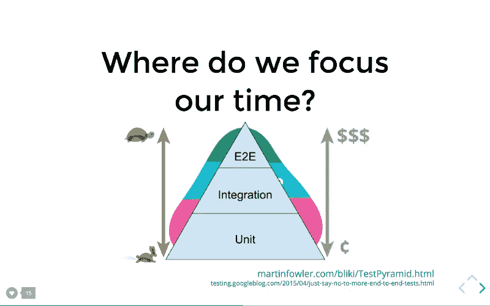

# 如何用测试库写出更好的 UI 组件测试

> 原文：<https://betterprogramming.pub/how-to-write-better-ui-component-tests-with-testing-library-e80bc489051c>

## 模拟用户行为的测试帮助我们创造更好的软件产品

费伦茨·阿尔马西在 [Unsplash](https://unsplash.com?utm_source=medium&utm_medium=referral) 上的照片

测试是软件开发的一个重要部分。虽然测试有时仍然被认为是事后的想法，特别是在时间关键的项目中，但是像[测试驱动开发(TDD)](https://en.wikipedia.org/wiki/Test-driven_development) 这样的方法和改进的测试工具在最近几年已经做了很多来纠正这一点。

有很好的测试框架可以在 web 项目中编写单元测试、组件测试和端到端测试。对于 UI 测试，经常使用像 Cypress 或 Selenium 这样的端到端测试框架。和所有事情一样，端到端测试有好有坏:

*   最初，端到端测试似乎很容易编写。然而，很容易编写脆弱的端到端测试，每当 UI 发生变化时，就必须进行调整。
*   端到端测试通常需要像 Chrome 这样的真实浏览器来运行。好处是可以直观的看到测试中的 UI 交互。另一方面，这些测试通常需要更长时间，因为下载浏览器、加载网页和与用户界面交互需要时间。
*   如果端到端测试依赖于对服务和第三方 API 的 HTTP 调用，那么您必须处理网络问题、与其他服务的更紧密耦合以及碎片化。

你可能对著名的测试金字塔很熟悉。它粗略地向我们展示了在编写软件测试时我们应该努力的方向。

# 为什么我们在前端项目中没有更多的组件测试？

在我工作的公司，我们努力拥有可靠的测试覆盖率。不管编程语言或项目范围如何，我们都希望确保测试尽早到位。我们通过设置测试覆盖阈值和测试框架来促进测试的编写。

我最喜欢的创建 web 应用程序的框架是 [Angular](https://angular.io) ，它已经带来了坚实的测试基础。为了改善开发者的体验，我们转向了 [Jest](https://itnext.io/how-to-use-jest-in-angular-aka-make-unit-testing-great-again-e4be2d2e92d1) ，这是一个通用的 JavaScript 测试框架。Jest 帮助我们编写快速运行的测试，[我们可以很容易地模仿和存根依赖关系](https://medium.com/better-programming/how-to-use-mocking-in-javascript-tests-using-jest-67cf513f47c0)(例如第三方库)。多亏了 Jest、TypeScript 和 Angular 的测试 API，我们在默认情况下不断添加更多的单元测试，同时减少了端到端测试的数量。

然而，我觉得一些开发人员仍然不愿意为 Angular 组件和指令编写测试。组件是创建现代 web 应用程序和静态网站的构建块。然而，我们并不经常为项目的核心部分编写测试。

*   我经常在组件测试中看到组件被实例化成一个普通的类，而不是一个真正有角度的组件。
*   在许多这样的组件测试中，用户交互并不反映现实——在没有任何用户交互的情况下模拟事件或调用功能。
*   有时候，开发人员认为为组件编写测试并不重要。我记得在一些对话中，对于为什么缺少组件测试的回答是这样的，“这只是一个选择的组件，有什么可测试的？”
*   我也不满意你阅读这些测试来理解测试内容的方式。

默认情况下，Angular CLI 在生成新组件或新指令等代码时会创建一个基本单元测试。这里有一个简单的例子，测试在点击一个按钮后，`WelcomeComponent`在一个`
`元素中输出正确的文本。

我个人对类似上面例子的测试的看法是:

*   **测试设置不太直观。**如果你对 Angular 有一点了解，那么你可能知道你需要提供依赖项，比如 Angular 模块的导入。尽管如此，代码看起来比它应该的要复杂。
*   **单元测试中的变更检测通常是混乱的来源，尤其是对初学者来说。**默认情况下，Angular 不会像我们在运行应用程序时使用的那样进行变化检测。当更新一个属性或模拟一个事件时，我们需要让 Angular 拾取这些变化，否则它们不会反映在 DOM 中。此外，使用`OnPush`变更检测的组件不容易测试([尽管有一个很好的解决方法](https://medium.com/better-programming/how-to-write-tests-for-components-with-onpush-change-detection-in-angular-24f2637a0f40))。
*   测试有时不容易读懂。虽然你可以给你的测试用例起有意义的标题，但是我经常遇到这样的测试代码，如果我不阅读测试用例的标题，我就不知道测试的是什么。
*   测试设置没有提供一种在没有到达`componentInstance`的情况下初始设置组件属性的方法。
*   如果您想为 Angular 指令编写一个适当的测试，您需要创建一个伪包装器组件，它使用您实际想要测试的指令。
*   任何事件(例如通过`@Output`属性)都可以使用`triggerEventHandler`进行模拟。这对于在单元测试中难以复制的事件(例如无限滚动)很有用。但是，如果我们过多地使用这个，我们的测试可能会不准确。示例:假设有一个组件测试，当一个子组件发出一个事件时，它将调用一个函数。当我们使用`triggerEventHandler`模拟事件时，即使子组件本身没有发出事件，这个测试也可以工作。
*   为了找到 DOM 元素，你可以使用角度测试 API(例如`query(By.Css('a-css-selector'))`或者普通 JavaScript(例如`document.querySelector('a-css-selector')`)。虽然这相当容易，但是依赖 CSS 选择器会导致测试很容易出错。此外，用户也不会通过 CSS 在网页上找到元素，所以我们最好也不要这样做。例如，一个用户可能想要得到一个由文本为`xyz`的标签描述的表单字段。

当我在我的时间表中发现下面的推文时，它给了我一个想法，即寻找一个可以轻松集成到新的和现有的项目中的解决方案。

这是我偶然发现测试库的时候。让我们看看测试库带来了什么。

# 如何用测试库编写组件测试

[测试库](https://testing-library.com/)是由[肯特·多兹](https://twitter.com/kentcdodds?lang=de)发起的项目。它最初只是一个 React 专用项目。今天，它支持各种附加框架，如 Angular、Cypress、Vue.js 等，以及普通 JavaScript。它既不是 Jest 那样的测试运行器，也不依赖于特定的测试框架，这使得在新的或现有的项目中集成测试库变得很容易。

测试库建立在这样的原则上，你的测试越像你的软件被使用的方式，它们就越能给你信心:

*   测试只在你的应用崩溃时才会崩溃，而不是实现细节
*   以与用户相同的方式与应用交互
*   内置选择器像用户一样查找元素，帮助您编写包容性代码

听起来很有希望？我认为 Testing Library 实现了它的承诺。这是一个角度组件测试的例子，它使用了建立在测试库之上的角度测试库。被测试的组件是一个选择组件，它包含标签作为选择选项。

让我们来看看典型角度分量测试的不同之处:

*   我们正在调用一个`[render](https://testing-library.com/docs/angular-testing-library/api#render)`函数来创建我们想要测试的组件。角度测试库将调用角度测试 API(看你如何指定像`declarations`和`imports`这样的选项？)但是我们可以做更多的事情，比如初始化组件属性。
*   我们不是模拟事件，而是通过与 UI 交互来尽可能地模拟用户行为。在一个测试用例中，我们首先按 tab 键将焦点移动到 select 组件，然后按 *ENTER* 键打开它，最后单击包含文本`Silver`的选项。这有一个好的副作用，在我看来，代码可读性更好，因为测试库 API 更具表现力。
*   我们不做任何手动变化检测，因为角度测试库在渲染组件或执行用户交互时会处理它。
*   为了找到 DOM 元素，我们通常避免通过 CSS 查询。不像 CSS 类那样使用选择器，[测试库提供了多种方式来查询元素](https://testing-library.com/docs/dom-testing-library/api-queries/#queries):例如通过部分文本或者通过角色。
*   我们可以更容易地测试组件的可访问性。测试库有助于编写测试代码，这些代码可以发现可访问性问题，比如缺少键盘导航。
*   `RenderResult`包含对引擎盖下的`ComponentFixture`的引用。这意味着如果我们愿意，我们仍然可以模拟事件或手动触发变更检测。
*   上面的测试没有多少嘲讽。如果可能的话，我想尽可能避免嘲笑，以便编写尽可能接近现实的测试。

这让我们更接近肯特·多兹描述为“[测试奖杯](https://kentcdodds.com/blog/write-tests)”的状态(强烈推荐博客帖子！).

正如您所看到的，与上面提到的测试金字塔相比，集成测试更受关注。在前端项目中，组件测试可以是集成测试(想想与不同服务对话并使用多个子组件的智能组件)，但它也可以更接近于单元测试(例如按钮组件的测试)。

在上面提到的帖子中，Kent 给出了一个很好的例子，我想重复一下，以强调集成测试在前端项目中的重要性:

> 如果你的组件`<A />`用道具`c`和`d`渲染组件`<B />`也没关系，如果不提供道具`e`的话，组件`<B />`真的坏了。因此，虽然用一些单元测试来验证这些部分独立工作并不是一件坏事，但是如果你不同时验证它们是否正常工作，那就没有任何好处。你会发现，通过测试它们一起工作是否正常，你通常不需要单独测试它们。
> 
> **集成测试在信心和速度/费用之间取得了巨大的平衡。这就是为什么在那里花费你大部分(请注意，不是全部)精力是明智的。**

# 结论

感谢阅读这篇关于如何用测试库编写更好的测试的文章。虽然我关注的是角度组件测试，但是您可以在各种 web 项目中使用测试库。有了测试库，你可以轻松地编写 UI 测试，避免测试实现细节，而是关注 UI 提供的功能。

你试过测试图书馆吗？你有哪些编写 UI 测试的经验？请在评论中告诉我。