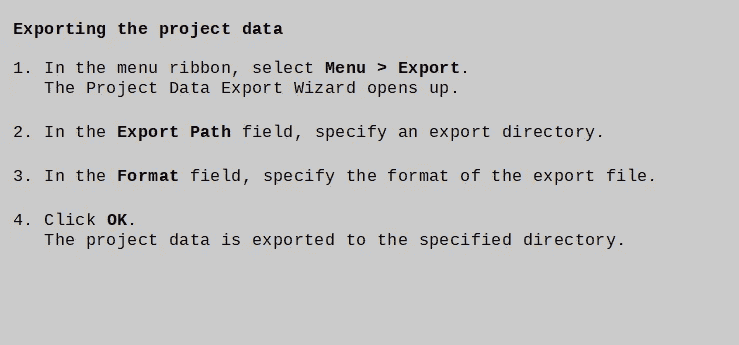
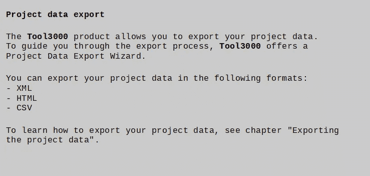

# 作为开发人员如何编写手册

> 原文：<https://betterprogramming.pub/how-to-write-manuals-as-a-developer-83f481494ec8>

## 快速建立实体手册的指南

[Calle 马卡龙](https://unsplash.com/@callemac?utm_source=medium&utm_medium=referral)在 [Unsplash](https://unsplash.com?utm_source=medium&utm_medium=referral) 上的照片

我知道，我知道，用户文档对开发者来说不是最令人兴奋的话题。然而，你必须确保你的产品不会对你的用户造成任何伤害——身体上的或者财产上的损害。数据丢失、机器故障和其他问题会导致严重的法律索赔。

这个故事不会让你成为一个专业的技术作家，也不会确保你已经涵盖了你的产品的所有法律要求。但是它会让你大致了解如何创建可靠的内容来帮助你的用户有效地操作你的软件。

在这个故事里，我将和你分享我将近十年的技术写作经验。它涵盖了非技术作家的需求。

事不宜迟，让我们开始写吧。

# 了解你的目标群体

在写内容之前，你需要了解你的目标群体。谁会使用你的产品？

我不会解释如何完成目标群体分析，因为你可以很容易地谷歌自己。最后，考虑用户的需求，以及这些需求将如何影响用户手册。

为了更容易理解，这里有几个目标群体如何影响你的手册的例子:

*   如果你知道你的目标群体是老年人，使用视力不好的人容易阅读的字体。
*   如果您的目标群体由开发人员组成，您就不必解释如何在 Windows 操作系统上执行基本步骤。
*   如果你为阅读障碍的读者写作，用短句写作，使用简单的术语。

这份清单远未完成。这只能说明你需要理解你的读者来创造可读的内容——他们可读，而不是你可读！

# 了解目标群体如何使用你的产品

一旦你了解了用户，你需要了解他们将如何使用你的产品。好的用户文档应该始终以用户为中心，而不仅仅是解释产品的特性。技术作家谈到面向任务的手册，相对于面向功能的手册。

为了强调区别，这里有两个例子:

*   面向特征的章节标题:使用导出向导
*   面向任务的章节标题:导出项目数据

导出向导只是一个执行任务的工具，在本例中是导出项目数据。用户不知道他们需要使用向导来导出项目数据。他们会搜索任务，而不是功能。

开发人员处理特性，因此将您的视角切换到任务可能有点棘手。

一个小提示是问自己以下问题:

*   用户会用我的产品做什么？
*   他们为什么使用该产品？他们的目标是什么？

最佳实践是邀请一组用户，与他们一起完成研讨会。目标是确定他们的任务，理想情况下，用他们的行话命名。如果你不能邀请真正的用户，有一个退而求其次的解决方案:邀请与他们关系密切的同事，例如产品经理、项目经理、营销或支持人员。

按照用户完成任务的顺序创建任务列表。如果您有多个具有不同任务的目标组，请为每个目标组创建一个任务列表。

# 从说明开始

拿起你和你的用户确认的任务列表。粗略地说，每个任务将是一个指导性的章节。如果你有不止一个列表，我建议为每个目标群体创建单独的文档。

指导章节告诉用户如何一步一步地做。

## 撰写教学章节的技巧

以下是一些在撰写教学章节时需要考虑的技巧:

*   以动名词形式的动词开始章节标题。
    示例:导出项目数据。
*   用一个编号列表来组织你的教学章节。任务的每一步都应该是一个列表项，这样更容易理解。
*   一个指导性章节最多应该有 11 个步骤。更多的步骤会使你的章节太长，读起来不舒服。如果你最后有一个更长的章节，把它分成几个小章节。
*   用祈使句，即命令句来写这些步骤。
    示例:要导出项目数据，请单击导出图标。
*   不要提供任何关于功能或产品工作原理的详细信息。相反，关注用户的步骤。背景信息章节是下一步的一部分。

下一节说明了教学章节应该如何格式化和编写。

## 教学章节示例

作者图片

# 添加背景信息

写完说明后，问问你自己:我的用户需要什么知识(他们还没有)来完成这些说明？

在每个指导性章节之前，添加概念性章节。这些概念性章节解释了完成指令所需的软件功能。在我们的“导出项目数据”的例子中，有一章是关于项目导出向导和支持的数据格式的。

指导性信息和概念性信息被严格分开，以使用户能够更快地找到所需的信息。请记住，大多数用户不会通读整本手册。他们使用 PDF 阅读器的搜索功能或在线帮助来搜索特定主题。

## 撰写背景信息的技巧

以下是写概念性章节时要考虑的一些技巧:

*   对于标题，不要添加描述性前缀，如“的背景”或“关于…”只说出你想描述的概念或特征。基本原理:当你在谷歌上搜索某个主题时，你不需要输入“Eclipse 背景”你可以搜索“日蚀”当用户搜索概念信息时，他们将以相同的方式操作，例如，搜索“导出向导”
*   仅添加帮助用户完成说明的概念性章节。
    您可能已经投入了大量精力来开发后端，以使实际功能正常工作。然而，后端的复杂性不应该在手册中结束。唯一的例外是，如果用户需要知道它来完成一个指令。在写概念章节的时候，总是问自己:为什么用户需要知道这些？
*   将背景信息章节与它们各自的指导章节联系起来，反之亦然。

## 背景信息章节示例

作者图片

# 添加引用

最后一个要素是引用。参考型章节包含表格中的查找信息。在这些表格中，您描述了图形用户界面和 API。

这种信息类型的目标用户通常熟悉这些概念，但希望仔细阅读参数、输入字段、下拉框或其他 GUI 元素。虽然初学者可能会在参考章节中查找一些内容，但它更经常被高级用户使用。

## 写推荐信的技巧

*   参考章节的标题应与其描述的 GUI 元素或功能相同，例如导出向导对话框。
*   确保 GUI 元素的名称与 GUI 中的名称相同。用户经常复制 GUI 元素名称并将其粘贴到搜索栏中。
*   想想哪些信息会对查找特定 GUI 元素的用户有所帮助。也许，存在对其他 GUI 元素的依赖或限制。将它们记录在参考章节中。

## 参考章节示例

作者图片

这就是你要的，一本关注用户需求的手册。当然，要制作出最先进的手册，在技术文档领域还有很多东西需要学习。本指南不会取代七个学期的大学课程。但是有了这些基础，你应该能够构建一个可靠的文档。

我避免任何详细的解释为什么我建议以这种方式组织和编写内容。我的目标是让你尽快建立一个手册。如果你想了解更多具体话题，请在评论中告诉我。基于问题的复杂程度，我要么直接在评论里回答，要么专门写篇文章。

此外，请注意，如果内容本身不可读，那么再好的结构也毫无价值。因此，请确保遵循以下基本原则:

*   使用拼写检查。
*   坚持写。
*   使用简短易懂的句子。
*   使用尽可能少的词，只要有必要就行。

考虑到我们阅读手册是因为我们不得不这样做，而不是因为我们喜欢它们。