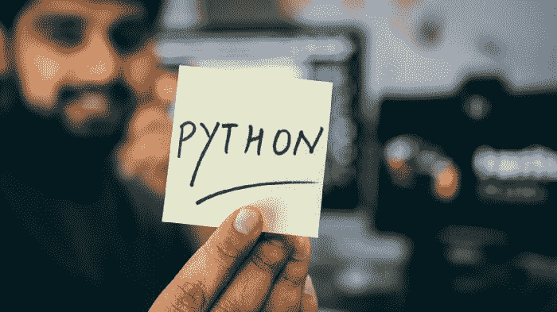

# 如何使用 Python 编写区块链智能合约——第一部分

> 原文：<https://betterprogramming.pub/how-to-write-smart-contracts-for-blockchain-using-python-8f645d485bf7>

## 入门分步指南



照片由[希特什·乔杜里](https://unsplash.com/@hiteshchoudhary?utm_source=medium&utm_medium=referral&source=post_page---------------------------)在 [Unsplash](https://unsplash.com/?utm_source=medium&utm_medium=referral&source=post_page---------------------------) 拍摄

2019 年，智能合约绝对是计算机编程的新范式转变。本指南旨在为创建在分散的区块链部署和运行的计算机程序提供一个入门途径。

一点历史…回到 20 世纪 50 年代，在计算的早期，如果你想写一段代码来执行，比方说，一个简单的加法运算(考虑摩托罗拉 6502 8 位 CPU)，你会得到这样的结果:

18 A9 01 69 02 85 31 F6

上面的十六进制数代表了 CPU 可以理解并执行操作的机器语言。

CPU 有一个“指令集”，这意味着每个数字都是一个命令，导致处理器进行操作:加、减、除、乘、加载、存储、跳转等。

程序员需要记住操作码，从而记住哪个数字对应哪个命令。效率不高。

很快，很明显需要一种更人性化的方法。这是创造更高级语言运动的开始，这种语言看起来更像口语。

因此，最初出现了被称为*助记法*:

```
CLC
LDA #$01
ADC #$02
STA $31F6
```

对于每一个计算机操作代码，现在都有一个相关的单词或符号，便于理解。因此，CLC(清除进位)相当于 18。LDA(载荷累积器)为 A9。ADC(加进位)为 69。STA(存储累加器)为 85。

这种编程方法被称为汇编语言，它是使编程更容易的第一步，将程序员从繁琐的任务中解放出来，例如记住数字代码。

上面的程序清除进位，将值`01`加载到累加器中，加上`02`，然后将结果数存储在内存地址`31F6`中。现在用一种人类更容易理解的方式。

随着时间的推移，新的工具被创造出来以使编程更有效率，因此开发环境也发生了很大的变化。术语*高级语言*出现了。

这意味着编程语言的水平越高，它就越像人类的口语。类似地，低级语言更接近计算机指令集本身。

在计算机语言进化的同时，也有一些范式的转变。

最早的计算机程序被直接注入内存地址，然后计算机需要被告知程序开始执行的位置。这是原始的机器语言计算机代码，如本文开头所示。

随着助记符的出现，我们创造了所谓的*汇编器*——一种软件，负责解码人类可读的助记符，将其转换为机器语言代码，将其注入正确的内存地址，并告诉 CPU 开始执行。好多了。

尽管这对编写和调试软件很有帮助，但它仍然是反生产的。我们需要一种更简单的编程方式。

# “基本”语言

初学者通用符号指令代码(或 BASIC)是第一种高级、人性化的计算机语言，设计于 1964 年，目标是易于使用。

一个普通的 BASIC 程序应该是这样的:

```
10 A = 1
20 B = 2
30 SUM = A + B
40 PRINT(SUM)RUN
```

在 BASIC 语言中，由序列号(`10`、`20`、`30`、…)标识的每一行存储一个命令。这些命令将按顺序运行，一次一个，然后是下一个。

当用户在计算机屏幕上输入命令`RUN`时，程序就会执行。在这里，我们经历了第一次编程范式的转变。

有一种叫做*解释器*的东西，它的功能是实时地将每一行代码转换成机器语言，然后执行它。

另外，请注意，这些命令现在由一个英文单词表示(例如 *print* )。CPU 寄存器(如累加器)和内存地址被变量取代。像这样编程变得容易多了！

BASIC 虽然是一种非常强大的高级语言，但执行起来太慢，因为解释器需要实时地将一切转换成机器语言。

这需要解决。

# 编译语言

又一次，范式转变发生了，给我们带来了我们今天所知的*编译语言*。

编译意味着我们现在在执行计算机代码时多了一个步骤。*编译器*是一款将高级语言编写的程序转换成完全机器语言的软件，但不是实时的(像 BASIC)。

相反，用户必须等待该过程完成。最后，当程序被转换(编译)并可以运行时，用户要求启动*可执行文件*。

不同之处在于，它比旧的解释程序运行得快得多——更高效、更省时。另一个隐含的好处是，可执行文件可以在没有源代码的情况下共享，避免了版权问题。

这是一个新时代的黎明，许多编译语言在生态系统中蓬勃发展。

一些例子:Ada、ALGOL、SMALL、Visual Basic、PureBasic、C、C++、Objective-C、Swift、D、C#(到字节码)、Java(到字节码)、CLEO、COBOL、Cobra、Crystal、eC、Eiffel、Sather、Ubercode、Erlang、F#(到字节码)、Factor(以后的版本)、Fortran、Go、Haskell、Haxe(到字节码或 C++)、JOVIAL、Julia、LabVIEW、G、Lisp、Common Lisp、Lush、Mercury、ML

软件继续发展。此外，正如一些计算机科学家(即艾伦·凯和伊凡·苏泽兰)在 20 世纪 60 年代早期所建议的那样，一种新的系统开发方法得以实现，以便计算机程序能够更好地代表我们的现实世界。

*面向对象编程* (OOP)诞生了。又一次范式转变。

现在，我们有了类和方法的概念:

尽管我们已经看到了所有这些新的、丰富的、不同的交付软件和如何设计架构的方法，但有一点是相同的:在将代码编译成机器语言之后，它是特定的——依赖于 CPU 的。

换句话说，在 IBM 个人电脑上开发的软件不能在苹果电脑上运行，因为每台电脑都有不同的处理器和不同的指令集。

# 互用性

然而另一个范式转变给我们带来了所谓的*互操作语言*，比如 [Java](https://www.java.com/) 和[。网](https://dotnet.microsoft.com/)。

这背后的想法很简单:创建一个中间(虚拟)指令集，并将程序的源代码编译成这个中间指令集。

然后，在每一系列的计算机上，你将有一个特定的编译器/解释器，从这些中间指令到每个计算机品牌的特定指令集。一种“两步编译程序”的形式，它共享一组通用的指令。

这个中间指令集被称为*字节码*。字节码运行在 JVM (Java 虚拟机)或 CLR(公共语言运行时)上。这使得编写一次程序并在任何地方运行成为可能(这成为 Sun Microsystems for Java 创造的一个口号)。

尽管计算机语言和软件架构的这种演变在每台计算机都是一个孤岛的世界中是有意义的，但我们很快就开始通过网络连接我们的设备。

网络协议诞生了，它允许机器之间通过电子通信信道进行通信。

1989 年，蒂姆·伯纳斯·李发明了万维网。现在，软件需要通过网络分发，我们不知道什么类型的计算机连接到它。

新的标准被创建来解决这个问题，并且*客户端-服务器*架构被引入到编程语言中。这种方法认为计算机软件现在将驻留在一个*服务器*上，该服务器将根据特定请求向*客户端*传送信息。

这种新的范式转变完全改变了我们使用软件和编程的方式。我们不得不注册在线托管服务来发布我们的软件。然后，将软件上传到服务器，服务器 24 小时响应用户的请求。

上一段描述了互联网和客户机-服务器软件的最近时代。它完全改变了我们所知的世界，也随之改变了我们生产、分发和消费计算机程序的方式。

虽然好处毋庸置疑，但这仍然是一个基于集权的环境，容易受到攻击、审查和失败。软件依赖于服务器始终在线。

即使使用计算机网络云解决了性能和可伸缩性问题，它仍然存在中间人的问题。

中介通常会设置障碍，给通用共享解决方案的用户带来困难。这可以是高收费、许可证、区域规则、政府审查等形式；不知何故总是伤害消费者。

为了一个自由的世界，越分散越好。尽管区块链本身仍然比他们的同行昂贵得多，可扩展性也差得多，但通常当颠覆性技术出现时，消费者获得解决方案的成本会大幅下降。

举个例子，想想今天用比特币给另一个国家的亲戚汇钱有多便宜多容易。

# 新时代

我们正处于一个新时代的开端——区块链分权的时代。有人可能会称之为互联网 3.0。

这是我们最近的范式转变，随着智能合约的出现，给我们带来了一种创建计算机软件的新方式。

智能合同是在分散环境中运行的程序。它们是颠覆性技术，因为它们消除了对某些现实世界过程的中介(中间人)的需要，从而使其更便宜、更容易获得、更高效。

适合被智能合同取代的常见应用:保险、遗嘱、定期支付计划、医疗保健计划、自动驾驶汽车经济、游戏、产权交易、资产令牌化、抵押贷款、投票等等。

智能合同发布后，它的副本将驻留在世界各地的每台区块链服务器上。而且，正如程序员曾经不得不改变他们在引入面向对象架构时创建软件的方式一样，我们现在不得不再次适应这种新方法。

你将无法在智能合约中进行股票期权布莱克-斯科尔斯公允价格计算，这不是它的目的。

# 结论

本文是系列文章的第一部分，旨在使用基于 [Python](https://www.python.org/) 的语言，通过允许在区块链中编辑、测试、调试和运行智能合约的完全在线环境 IDE，教授智能合约编程的基础知识。

在系列的第二部分[中，我们将开始一种实用的方法，针对那些已经有计算机编程经验的人，但是用一步一步的简单例子。](https://medium.com/better-programming/how-to-write-smart-contracts-for-blockchain-using-python-part-2-99fc0cd43c37)

最终，您将能够开始有效地编写智能合约。

阅读[第二部](https://medium.com/better-programming/how-to-write-smart-contracts-for-blockchain-using-python-part-2-99fc0cd43c37)。

感谢阅读！