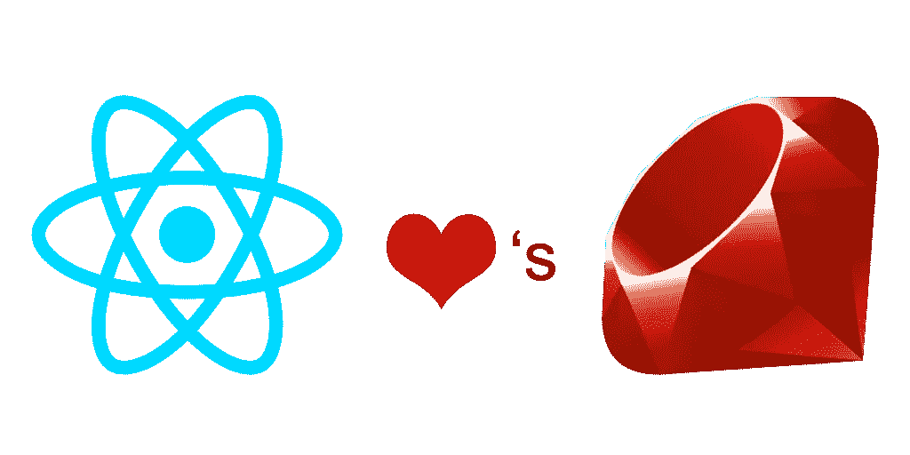
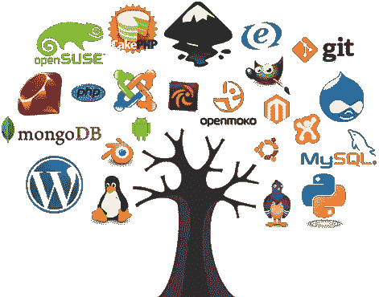

# 我成为了 React JS 和 Ruby on Rails 的贡献者——你也可以

> 原文：<https://betterprogramming.pub/i-became-a-react-and-ruby-on-rails-contributor-and-you-can-too-e4e81704a878>

资料来源:gennovacap.com

我真的很感激为一些开源项目做出了贡献，包括我目前经常使用的两个项目: [Ruby on Rails](http://contributors.rubyonrails.org/contributors/fatos-morina/commits) 和 [React](https://github.com/reactjs/reactjs.org/commits?author=fatosmorina) 。

我的贡献是非常小的修正和建议，可能不值得太多的赞扬，但我想用这篇文章来激励您也去做出自己的贡献。

我的核心价值观之一是帮助他人。这是我喜欢写文章的原因之一，也是我对这些年来受益的项目做出自己贡献的原因之一。

尽管多年来广泛使用的主要框架经过了大量的审查和仔细的分析，但总有改进或增加的空间。这意味着您不仅能够修复 bug 或改进已经实现的东西，还可以贡献新的特性。

# 为什么要为著名的开源项目做贡献？

Img 来源:jing.fm

在解释如何为著名的开源项目做贡献之前，最好先解释一下为什么我认为参与这样的努力非常重要。

## 你会向最优秀的人学习

照片由[阿里夫·里扬托](https://unsplash.com/@arifriyanto?utm_source=medium&utm_medium=referral)在 [Unsplash](https://unsplash.com?utm_source=medium&utm_medium=referral) 拍摄

著名的开源项目如 Ruby on Rails、React、 [Spring](https://spring.io/) 等。，已经被很多项目使用。他们让无数开发者的生活变得更加轻松。

因为它们是许多聪明头脑的产物，分析它们的代码并尝试改进是一个巨大的学习资源。

您不仅会更好地学习您使用的框架和库，还会学到一些使这些项目真正伟大的最佳实践和永恒原则。然后你也可以在自己的工作中运用这些经验。

通过尝试做贡献，你会比只使用它的人更好地学习一个框架。在 Linux 基金会 2016 年的一份报告中，86%的技术专业人士说开源在他们的职业生涯中帮助了他们。

## 你可以产生重大影响

[Levi XU](https://unsplash.com/@xusanfeng?utm_source=medium&utm_medium=referral) 在 [Unsplash](https://unsplash.com?utm_source=medium&utm_medium=referral) 上的照片

如果你一直在做一些不太受关注的小项目，为著名的开源项目做贡献可以给你带来更大影响的机会。

通过做出这样的贡献，你可能会对你所做的工作产生重大影响，这可能是一次非常令人满意的经历。不管你的贡献有多小，你都会有一种意义非凡的感觉，因为你知道你的工作让你热爱的项目变得更好了。

## 你可以提高你的声誉

由[克里斯多佛·高尔](https://unsplash.com/@cgower?utm_source=medium&utm_medium=referral)在 [Unsplash](https://unsplash.com?utm_source=medium&utm_medium=referral) 拍摄的照片

如果你去看看著名开源项目的贡献者列表，你可能会发现一个共同的模式。顶级贡献者通常是为大公司或大型项目工作的开发人员。

结果，对这样的项目做出重要的贡献可能是困难的，仅仅是因为这些开发人员可能已经很好地实现了某个特定的特性。这意味着，进入这份名单对任何寻找新开发人员的招聘人员来说，都代表着你的技能得到了显著的展示。

这也意味着你也更有可能获得更好的工作机会或更高的咨询费用。公司总是希望雇佣在开源项目上有经验的聪明而熟练的开发人员，除了为项目实际编写一些代码，没有什么更好的方法来展示你对框架的了解。

# 你如何为著名的开源项目做贡献？

既然我们已经提到了为著名的开源项目做贡献的三个主要原因，那么你该如何做呢？

## 了解事物如何运作

由[奥斯汀·迪斯特尔](https://unsplash.com/@austindistel?utm_source=medium&utm_medium=referral)在 [Unsplash](https://unsplash.com?utm_source=medium&utm_medium=referral) 上拍摄的照片

好奇心可能会害死猫，但它也帮助泰勒·威尔逊[成为](https://www.theguardian.com/science/2015/jun/20/taylor-wilson-nuclear-teen-genius-science-interview)人类历史上第 32 个实现核聚变的人……在他 14 岁的时候。

同样，如果你想为著名的开源项目做贡献，你必须了解事情在幕后是如何工作的。你需要从书本中学习。你必须有好奇心去理解一个特定函数的实现，或者路由如何调用一个特定的控制器。通过这种方式，你也可以发现你可以改进的奇怪的事情，或者为一个特定的任务实现一个更有效的方法。

你对一个框架理解得越多，你就越喜欢在你的项目中使用它，[因为我们通常会避免未知的和对我们不清楚的事情](https://medium.freecodecamp.org/vim-isnt-that-scary-here-are-5-free-resources-you-can-use-to-learn-it-ab78f5726f8d)。

## 检查报告的问题

由 [Austin Distel](https://unsplash.com/@austindistel?utm_source=medium&utm_medium=referral) 在 [Unsplash](https://unsplash.com?utm_source=medium&utm_medium=referral) 上拍摄

问题可能代表其他人已经注意到的或者想要表达的关于项目的错误、关注或者简单的建议。他们也代表了一个伟大的贡献想法的来源，你可以用来作为灵感。

看看一个项目的问题，评估一下你是否能对它们有所贡献。

尽管有些问题一开始看起来非常困难，但是你不应该害怕尝试修复一个 bug 或者在那个框架中实现一个新特性。你可以用它来学习新的东西，拓展你目前的极限，走出你的舒适区。

你也可以提问来更清楚地了解问题，并对其他人的问题给出你的答案。

## 不要忽视小事

照片由[莎拉·基利安](https://unsplash.com/@rojekilian?utm_source=medium&utm_medium=referral)在 [Unsplash](https://unsplash.com?utm_source=medium&utm_medium=referral) 上拍摄

你可能会认为著名的开源项目已经没有多少机会可以贡献了，所以你可能会放弃贡献的想法。

尽管事实并非如此，但是对于开源项目，您可以承担一些经常被忽视的责任。除了代码之外，项目还需要作者帮助编写文档，需要翻译人员将语言环境文件转换成其他语言，需要设计人员使界面更加直观和吸引人。

您不必编写整个文档或将所有内容翻译成另一种语言。你可以简单地开始一些你认为值得包括的东西，并寻求改进的帮助，或者简单地推动你的小改变并向项目维护者寻求反馈。

您还可以通过编写测试、修复已经失败的测试、创建关于 bug 的新问题或回答人们就现有问题提出的问题来做出贡献。

还有另一种间接的方式可以为开源项目做贡献。

那就是联系维护人员，感谢他们的时间和工作。他们中的大多数人在志愿者的基础上为开源做出贡献，所以感谢他们可以让他们意识到他们贡献的重要性。这样，你让他们对自己的努力感觉更好，也激励他们继续做出贡献。

# 结论

诺亚·布舍尔在 [Unsplash](https://unsplash.com?utm_source=medium&utm_medium=referral) 上的照片

任何人都可以为著名的开源项目做出贡献。关键是要有耐心，因为这可能需要一段时间，直到你找到你想贡献的东西。你也应该乐在其中，享受这个过程。毕竟，这就是为什么 Linus Torvalds 给这本书起了个名字，他在书中描述了他如何创建 Linux 的故事——“只是为了好玩。”