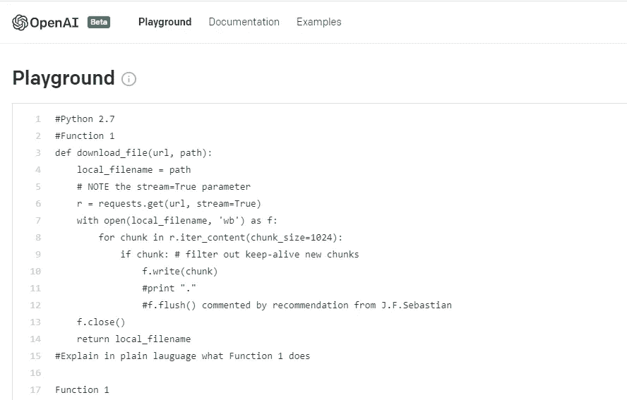
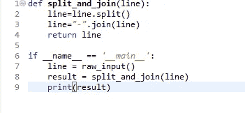
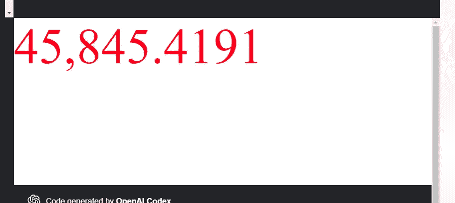

# 我测试了 OpenAI 的代码，结果非常好

> 原文：<https://betterprogramming.pub/i-beta-tested-openais-codex-and-the-results-are-spooky-good-e282a1874c79>

## 它不会取代人类程序员，但会让他们变得更加强大



抄本截图。照片由作者提供。

上周，人工智能公司 OpenAI 推出了 [Codex](https://openai.com/blog/openai-codex/) ，这是一个新的深度学习驱动的平台，可以自动编写全功能的软件代码。该系统——在一个巨大的公开可用代码语料库上进行训练——最初作为 [GitHub 的 Copilot](https://copilot.github.com/) 的一部分首次亮相，该功能可以帮助程序员自动改进或更新他们的软件。

Codex 是基于 OpenAI 的大获成功的 GPT-3。当我去年测试 GPT 3 号时，我感觉我正在见证一场技术革命。该系统可以生成任何东西，从完整的博客帖子到歌曲、食谱——甚至是[海上小屋](https://debugger.medium.com/i-asked-gpt-3-to-write-a-sea-shanty-about-bidens-inauguration-cb6e8a90d675)。许多 GPT-3 测试人员也注意到，它通常能够用 Python 和 JavaScript 这样的语言编写代码。

OpenAI 利用了这一能力，开发了一个新版本的 GPT-3，它是专门针对代码进行训练和优化的。结果是法典。新系统发布一周后，我被邀请对其进行测试，从那以后，我一直在测试 Codex。这显然是 GPT-3 的进化，其结果令人毛骨悚然。以下是我花了几天时间和 Codex 一起工作后的想法和发现。

我从使用来自[黑客等级](http://hackerrank.com)的 Python 编码挑战来测试 Codex 开始。这些挑战旨在帮助程序员准备工作面试。它们是简单的有界编程问题，你可能会在 Python 入门期中考试中发现，或者如果你申请像 [Yelp 或 Box](https://www.hackerrank.com/career-fair/fall2021) 这样的公司的编程工作，你可能会被要求解决这些问题。

Codex 完成了简单挑战的短期工作，比如涉及字符串拆分和连接的挑战。我给了它提示:

```
#Python 2.7#You are given a string. Split the string on a ” ” (space) delimiter and join using a — hyphen.
```

它吐出了一个 Python 函数，我把它粘贴到我的 Aptana Python IDE 中。我对 Codex 的输出进行了一次更新，将一个`input()`改为一个`raw_input()`。



事实上，这个函数接受一个字符串，在每个空格上分割它，并用连字符连接文本。当我提供字符串“这是一个测试”时，它打印出“这是一个测试”Codex 的自动生成代码通过了 Hacker Rank 的测试。

这是最基本的东西。但是 Codex 也成功地解决了来自 Hacker Rank 的一个更复杂的挑战，其中涉及到[编写两个正则表达式来验证邮政编码](https://www.hackerrank.com/challenges/validating-postalcode/problem)，Hacker Rank 说这对人类程序员来说是“困难的”。对于这个任务，我只是直接从 Hacker Rank 把提示交给 Codex，让它去镇上。没几秒钟，就蹦出两个正则表达式。(对于非编码人员来说，正则表达式是一种用于模式匹配的工具，写好它们就像是[一个编码超级大国](https://xkcd.com/208/))。

我将它们粘贴到 Hacker Rank 中，网站证实正则表达式工作得非常好。看着系统在大约两秒钟内快速地打出一个解决方案，我感到毛骨悚然，而我可能要花一个多小时来设计。

我的 YouTube 频道上的一名粉丝向我指出了一个问题，即 Codex 是否真的在为这些简单的问题编写自己的解决方案，或者只是从其训练数据的深处吐出现有的结果。公平地说，这可能是系统对简单问题的预期操作方式——编码人员通常从开源代码中逐字逐句地提取整个功能，当解决方案足够简单并且已经存在于非专有的某个地方时，Codex 也可能这样做。

不管使用什么方法，Codex 显然擅长解决明确指定的编码挑战。如果你给它入门级编程工作面试中的任务，或者计算机科学 101 考试中的问题，它很可能会顺利通过。这令人印象深刻，因为系统开始时只有明文输入。

然而，我想知道 Codex 在现实世界中会做什么——它会如何处理我当场编造的全新问题，而不是那些可能存在于其训练数据中的问题。真实业务环境中的许多编程任务都涉及访问和操作数据，而不是像验证数字或转换字符串这样的基本工作。

根据 OpenAI 的说法，Codex 可以访问各种 API，并执行有用的数据操作。我决定通过解决一个与加州非常相关的问题来测试这一点:根据城市的邮政编码获取城市的空气质量指数，以检查野火烟雾的存在。

为此，我给了 Codex 以下提示:

```
#Python 2.7#Use the airnow API to to find and print the current AQI for zip code 94549
```

它返回了代码:

这是惊人的产量。仅仅基于我对 [Airnow API](https://docs.airnowapi.org/) 的明文引用，Codex 确定了 API 的 URL 和它需要使用的参数，以便给我有用的输出。它还正确地确定了 AQI 的含义，并编写了一个 URL 字符串，该字符串确实接受邮政编码`94549`，在该邮政编码中查找当前的条件，并返回当前的 AQI。

为了使输出像真正的 Python 代码一样操作，Codex 然后用一些基本的 Python 操作包装它的函数，用于访问 URL 和格式化来自 Airnow 的 API 的 JSON 响应。只有一个问题 Codex 生成的用于通过用户帐户登录 API 的 API 密钥——完全是编造的。

我也遇到了 GPT 3 号的这个问题。该系统将愉快地编造事实、引文，甚至是根本不存在的科学论文的参考文献。对于 GPT-3，这些事实错误可能很难被发现，因为它们看起来如此真实，而且被如此随意地撒入系统的输出中。至少对于代码来说，有一个简单的测试来验证输出是否有效:它是否可以编译和运行？在我的例子中，我运行代码并从 Airnow API 返回一个身份验证错误。为了解决这个问题，我申请了自己的真正的认证令牌。当我把它放到 Codex 的代码中时，它运行得很好，并显示出我的邮政编码的当前 AQI。

Codex 也不局限于编写服务器端代码。它还可以用 JavaScript 等基于网络的语言编写代码，甚至可以做基本的网页设计。为了测试这种能力，我启动了 OpenAI 为测试人员提供的一个特殊的 JavaScript 平台。然后我给了它一个提示，指示它获取关于比特币当前价格的数据，并格式化和显示结果。

> 使用 Coindesk 的 API 获取比特币的当前价格，并在网页中间以巨大的红色字母显示出来

Codex 生成了必要的 JavaScript:


然后它创建了一个简单的网站，完全符合我的要求:



同样，这是一个相对简单的例子，但 OpenAI 的演示视频展示了 Codex 的网络开发能力如何用于更高级的任务。在视频中，OpenAI 使用该系统创建了一个涉及火箭船和小行星的全功能 JavaScript 游戏，只需输入每个游戏功能的描述，并让 Codex 编写底层代码。

除了编写新代码，Codex 还能够描述现有代码。为了测试这一点，我从我公司的代码库中拿出一段 Python 代码交给系统，我们用它从一个 URL 下载文件。当我请 Codex 解释这段代码的作用时，它写道，该函数“从一个特定的 URL 下载一个文件，并将其保存到一个特定的本地路径。”这是一个完美的——尽管有点怪——描述。

用通俗易懂的语言解释事物的能力很可能直接来自于 Codex 的母平台 GPT-3。很容易想象这个特性对程序员有多大的帮助。假设您试图更新一个旧的开源项目，但是没有相关的文档。你可以将每个函数粘贴到 Codex 中，让系统计算出代码的作用，然后用简单的语言向你解释。

正如*连线* [指出的](https://www.wired.com/story/plaintext-open-ai-codex/)，这个特性对学习编码的人也非常有帮助。他们可以粘贴一个令人困惑的函数，然后很快得到一个关于它如何工作的清晰描述。人们甚至可以想象 Codex 自动为公司或开源项目的现有代码库编写文档。许多程序员讨厌写文档，结果是,[世界上很多代码都没有文档记录。这使得代码很难更新和维护，也使得新程序员更难加入项目并了解代码库的工作方式。法典委员会可以自动弥补这一文献空白。](https://www.techrepublic.com/article/open-source-documentation-is-bad-but-proprietary-software-is-worse/)

在我的测试中，该系统在自动化其他枯燥但必要的编码任务方面也表现出色。我给了 Codex 一大块 Python 代码，让它把代码翻译成 JavaScript。它完美地做到了这一点，生成的 JavaScript 运行起来没有任何问题。维护遗留代码可能非常昂贵。有了 Codex，一家公司可以用传统语言编写代码库，并自动将其更新为现代语言，这可能会节省数千或数百万的维护成本。

更新旧代码对社会也有很大的好处。据报道，在疫情开始时，加州就业发展部很难发放失业救济金，因为他们仍在使用 20 世纪 80 年代遗留下来的计算机系统。自动更新旧代码除了使关键系统更加安全之外，还可以简化政府运作，为纳税人节省数百万美元。开源项目也可以使用 Codex 进行更多的增量更新，比如将代码库从 Python 2.7 迁移到 Python 3。

鉴于 Codex 通常非凡的能力，程序员应该担心他们的工作吗？不。虽然法典是强大的，但它并不完美。根据 OpenAI 的说法，当前版本的系统在第一次尝试时写下完美的代码[只有 37%的几率](https://www.terrancemcarthur.com/blog/openai-codex)。为了使系统的输出真正有用，人类程序员仍然需要审查它，评估输出是否工作良好，并在不工作时进行小的调整和更新。

我在最初的例子中直接看到了这一点。`input()`函数在我的 IDE 中无法正常工作，因此 Codex 的字符串转换代码无法运行。基于我的 Python 背景和我在尝试运行代码时看到的错误消息，我立刻知道什么样的`raw_input()`会更好。这是一个简单的改变，但却是至关重要的。然而，关键的是，这也是一个非程序员永远不知道要做的改变。Codex 的产量令人印象深刻。但是当它犯了一个小错误时，一个有知识的人需要介入来纠正它。

除了修复小错误，还有一个更根本的原因是 Codex 不会取代人类程序员。写代码只是编程的极小一部分；程序员最重要的工作是理解一个问题，并把它翻译成计算机能理解的格式。正如 OpenAI 本身[所说](https://openai.com/blog/openai-codex/)，“一旦程序员知道构建什么，编写代码的行为可以被认为是(1)将一个问题分解成更简单的问题，以及(2)将那些简单的问题映射到现有的代码。”

法典可以帮助后者，但前者仍然是一个非常人性化的领域。定义一个问题，把它简化成必要的组成部分，然后把这些组成部分翻译成具体的指令，这些占据了一个熟练程序员的大部分时间。就像遵循互联网上的美食网食谱不会让你成为米其林星级厨师一样，编写漂亮的 Python 代码也不会让你成为程序员。在 Codex 能够与客户或顾客坐下来，了解他们的需求，设计一个技术解决方案，将它分解成组成部分，并提出解决每个部分的明确计划之前，它不会取代人类编码员。

不过，几乎可以肯定的是，这会让他们的工作变得容易得多。让一个有经验的程序员花费几周或几个月的时间将一家公司的代码库从一种语言翻译成另一种语言是对他们的天赋和培训的浪费，也是对公司资金的浪费。通过将这些扼杀灵魂的任务从程序员手中拿走，Codex 可以腾出他们的时间来专注于更高价值的任务，比如找出新业务问题的技术解决方案。它还可以为开源社区创造奇迹，允许一个志愿程序员在一个周末重构整个代码库，或者在几个小时内提出一个想法并编写一个功能完整的代码库。

目前，法典委员会还处于起步阶段。它仍然需要大量的手工操作，而且它的输出通常是不可用的。然而，随着时间和更多的训练，这种情况将会改变。因为编程需要的不仅仅是写代码，我怀疑 Codex 是否会取代人类程序员。但是很快，它就可以极大地提高他们的工作效率，使他们更有能力，更强大。

```
You finished this story, so you’ll want to [join my newsletter](https://diylifetech.substack.com/), which is free and really very good.
```

# 资源

open ai Codex:[https://openai.com/blog/openai-codex/](https://openai.com/blog/openai-codex/)