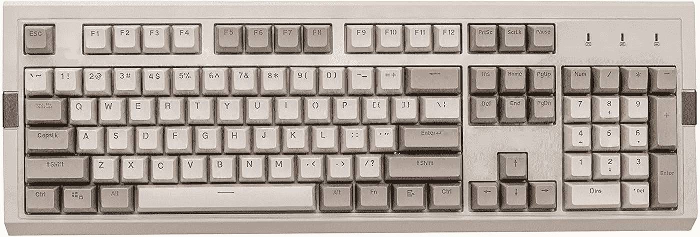

# 作为初级开发人员，我犯了这些错误，所以你不必犯

> 原文：<https://betterprogramming.pub/i-made-these-mistakes-as-a-junior-developer-so-you-dont-have-to-8531d9f2f0e3>

## 我开发生涯中最大的三次失败


原照片由[布雷特·乔丹](https://unsplash.com/@brett_jordan?utm_source=unsplash&utm_medium=referral&utm_content=creditCopyText)在 [Unsplash](https://unsplash.com/s/photos/mistake?utm_source=unsplash&utm_medium=referral&utm_content=creditCopyText) 上拍摄，作者编辑

听过这句话吗“开发商在穿过单行道前总是先看两边”？这意味着我们已经被自己和他人的错误严重烧伤，以至于我们不相信任何情况，不管它看起来有多简单。

我们都有过这样的经历，在职业生涯的开始，我们认为自己什么都知道，但我们甚至意识不到我们不知道自己不知道什么。

这是一种常见的模式，大多数初级开发人员都会经历。你甚至可以说这是一个通过的仪式，一旦我们经历了它，我们就从搞砸中获得了智慧。

至少我知道我有，这就是为什么我想分享我的智慧，这样你就可以跳过前面，避免自己犯这些新手的错误。不过话说回来，很少有经历能像搞砸这么糟糕的事情那样让人肾上腺素飙升，尤其是在你的第一份工作中。

# SQL 和没有 Where 子句的可怕的更新

如果你没有更新一个没有`where`子句的生产数据库，你就没有活过。

不，不，那不是我让你去做的。

但是请相信我，当您意识到刚刚将`update`语句(或者更糟糕的是，`delete`语句)发送到生产数据库而没有使用`where`子句时，您的感觉是无与伦比的。当你意识到自己的错误时，你想继续下去，掐断网线，希望这些比特不会通过。但话说回来，我们都知道那是行不通的。

在我的例子中，我更新了我工作的第一家公司的整个产品表，并将每一件待售商品重命名为“圣诞快乐”。我想更新一条记录，但是我没有写查询中该死的`where id = X`部分。

不用说，十分钟后我不得不向公司的首席执行官解释我的错误。幸运的是，我的同事能够恢复最近的数据库备份，错误在同一天得到了纠正。

话虽如此，我这辈子也没忘记另一个`where`说法。所以是的，我得到了教训。

# 从生产中删除文件而不先备份它们

这个错误在我心中有着非常特殊的位置，因为我在我作为开发人员的第一份工作的第一天就犯了这个错误。

我在一家小型软件精品店工作，我们为客户创建网站，“部署到生产”意味着我们将通过一些拖放程序将 HTML 文件直接上传到 FTP(我想我们当时使用的是 FileZilla)。

我正在用其中的一个。记得他们吗？



还记得“Del”键离“Enter”键有多近吗？

嗯，我正在上传一个新的 HTML 文件到我们的一个客户的网站上，在拖放之后，我不小心按了“回车”，而不是按“删除”键。不过，这还不是最糟糕的部分，因为出现了一个确认弹出窗口，以确保我想要删除该文件。问题是，我立即试图通过按“回车”键来纠正我的错误；这是一个反射动作。我想都没想过。当然，我最后还是接受了确认弹出，删除了当时选中的文件。

是的，在我第一份工作的第一天，我不小心删除了一个客户的主页。我不知道如何向我的经理传达这一点；真是疯狂的一天。

幸运的是，这个问题很容易就解决了，因为我的经理有该网站的本地备份，几分钟后他就上传了文件。

就在同一天，吃完午饭回来后，我发现我的“Del”键被同事从我的关键字中拆走了，并贴上了一个标签，上面写着“仅在紧急情况下使用”。他们告诉我嘲笑自己的错误是可以的，那天我学到了宝贵的一课:

始终确保您没有拿潜在的独特资产冒险，并确保您有一个备份策略。

# 分支处理不当

Git 很可怕吧？我知道我恨了这么多年，CVS 更惨！(没错，我就是那么老。)

当你刚刚开始的时候，版本控制是很难理解的。如果你运气不好，你将最终从事一个具有非常复杂的分支模型的项目。如果您在一个单一回购环境中工作，尤其如此，在这个环境中，您必须处理多个项目和团队在同一个代码库上工作。

我无法告诉你有多少次我不得不重新克隆回购并重新开始我的任务，因为我忘记在开始自己的任务之前切换到正确的分支。

因此，我不会从`development`分支创建我的新分支，而是从我以前的分支创建它，它还没有被批准。这意味着我将未测试的代码和我的新代码一起导入到这里，并且我将最终把两者都作为新任务的一部分。可爱！

如果您使用终端窗口，现在有一个非常简单的解决方案:确保当前分支显示为提示的一部分(即。显示您正在处理的当前文件夹的文本)。花五分钟设置一下，你就再也不会遇到这个问题了(当然，除非你也没有注意你的提示):

如果您使用的是 Linux 或 macOS，您可以将类似这样的内容添加到您的`~/.bashrc`文件:

```
parse_git_branch() {
     git branch 2> /dev/null | sed -e '/^[^*]/d' -e 's/* \(.*\)/(\1)/'
}export PS1="\u@\h \[\e[32m\]\w \[\e[91m\]\$(parse_git_branch)\[\e[00m\]$ "
```

这将在提示符后的括号中添加当前分支。

如果你使用的是 Windows，我建议使用 Git bash，这是一个终端程序，包含在默认的 [Git 安装](https://git-scm.com/downloads)中。它已经显示了当前的 git 分支，如下所示:


现在你可以在犯我的错误之前确定当前的分支。记住总是遵循你的团队正在使用的分支模型的指示。由于这是一项重复的任务，将这些说明写在一个逐步说明的文档中总是一个好主意，尤其是对即将加入的新团队成员而言。这样，如果他们还在学习交易，他们可以复制和粘贴命令。因此，如果你的团队中没有这样的文件，考虑向你的领导提出这个想法！

在我 18 年的职业生涯中，我也犯过一些错误，但这三个是犯了错误后改变我工作方式的最大错误。他们塑造了今天的我，这已经很说明问题了。

你有这样的故事吗？你还记得你作为开发者犯的最大的错误吗？请在评论中分享你的错误。让我们正视这样一个现实:我们都会犯错，只要我们从中吸取教训，错误就有用武之地。