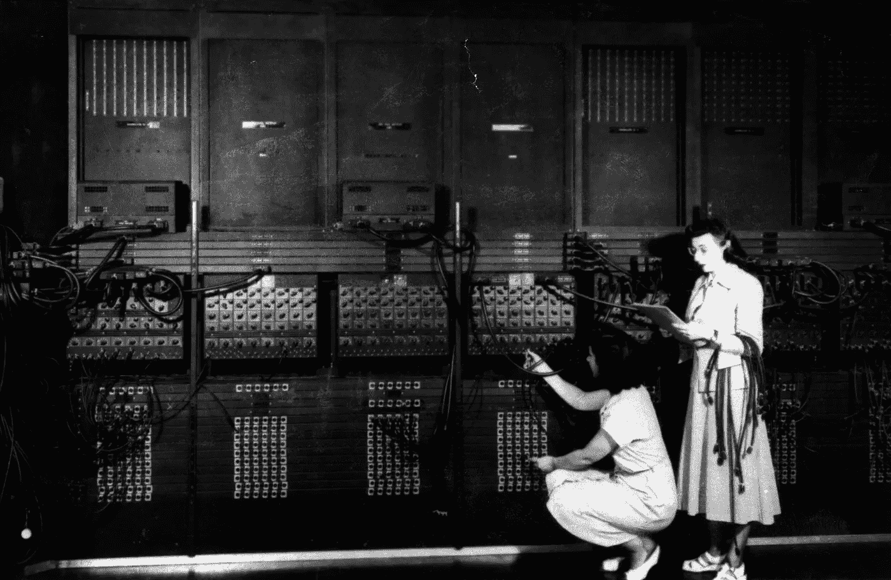

# 如果 ENIAC 工程师可以配对程序，你也可以

> 原文：<https://betterprogramming.pub/if-eniac-engineers-could-pair-program-so-can-you-62a26e074be9>

## 结对编程实践实际工作

来自[国家妇女历史博物馆](https://www.womenshistory.org/resources/lesson-plan/getting-program)的照片。

到目前为止，我已经听到了一些开发者和管理者的借口，他们有自己的理由*而不是*去配对程序。就我所见，怀疑和抑制来自于不良实践的经历。

最早的两位 ENIAC 工程师 Jean Bartik 和 Betty Snyder 在 20 世纪 40 年代合作开发第一台 ENIAC 机器。“我相信最好的程序和设计都是两人一组完成的，因为你可以批评对方，发现对方的错误，并采用最好的想法，” [Bartik 说](https://martinfowler.com/articles/on-pair-programming.html)。

如果计算机科学历史上的两位早期程序员可以配对，那么你也可以。

一旦你掌握了这项技能，结对编程就会有所收获，并开始变得更加有趣。相信我，结对编程适用于所有人。你只需要找到适合你和你伴侣的风格。

所以，如果你是新手，觉得结对很吓人，那就从小处着手。从一个小错误或者一个容易完成的任务开始。下一步是挑选一个你认识的风度翩翩的开发人员。当你开始工作时，和更好的、善于沟通的人在一起会有帮助。最后，请记住，人们不会读心术，所以要和自己交流，尽可能大声地说出自己的想法。

在本文中，我列出了成功结对编程会话的一些基本要求。

# 检查您的设置

使用不符合人体工程学的设置会造成身体上的压力，并使你失去配对的动力。

一个好的设置可以走很长的路。你想让配对变得越容易越好。所以首先，把你的设置做好。理想的设置有一台电脑、两个键盘、两个鼠标和一个显示器(或两个镜像显示器)。尝试一次只插入一个键盘，但是要有你自己的鼠标和键盘。如果你想了解更多，我在另一篇文章中写了关于设置的细节[。](https://medium.com/better-programming/pair-programming-392eece7d341)

选择一个对双方都方便的字体大小，尽量不要占用显示器或键盘。让司机来做打字的工作。如果你想经常打字，事先制定一个使用乒乓球交换配对的策略是个好主意。

# 会话的时间框

预先决定你想配对多久将有助于你更有效地安排你的任务。决定一个时间管理技巧，比如番茄工作法和时间间隔。对一些人来说，25 分钟可能是一个不错的间隔，但有些人可能会持续到 45 分钟。

无论你选择什么，都不要走极端。有一个计时器，不管任务状态如何，都要立即停止。在会议期间，完全集中注意力，远离干扰。计时和配对的额外好处是，你会开始更加珍惜这段时间，因为在分心时浪费的不仅仅是你的时间。

# 预安装所需的工具

学习配对过程中可能需要的工具，为配对做好准备。不合适的工具会造成不便。如果您使用的是相对较新的工具，如 Git、Vim 等。，在配对前花些时间熟悉一下自己。学习 IDE 快捷键可以提高你的工作效率，为你们两个节省很多时间。

如果你能有效地使用这些工具，这将有助于增强信心，这对于进行一次令人满意的配对是必不可少的。

对于远程配对，尝试在会话之前安装所有必需的应用程序，这些应用程序可以使您的配对更加顺畅。做好准备！

# 使用模板

结对编程会话可以像会议一样对待。带有基本指导原则的模板就像是为会议设置一个议程。然后双方都知道该从会话中期待什么。预先决定一个模板可以省去你每次和多个开发者见面时设置议程的麻烦。

你当然可以根据个人喜好讨论每双鞋的变化，但是大部分零件应该还能工作。例如，我的模板如下所示:

1.  从和我的搭档一起检查时间表开始。
2.  时间框基于手头问题的一个或两个会议，由休息时间隔开。
3.  如果没有预先决定，选择一种方法，如乒乓球、番茄工作法等。
4.  把问题说出来，确保我们双方都正确理解问题。
5.  讨论各种方法，并决定采用最佳方法。
6.  时间到了就休息，交换角色。
7.  重复，以迷你复古结束。

# 决定一个时间段

在你的日程表中留出一些发展的时间。觉得新鲜就开始。你上班的清晨是配对的最佳时间。研究表明，将创造性活动安排在大脑得到充分休息的早晨是最有效率的。

试着在会议之间留出一个不被挤占的时间段。更大的时间——一个小时到三个小时之间——可以完成很多事情。不要连续配对五个小时或一整天。这可能不如把两个小时分成两块，每块有更长的休息时间更有效率。

避免在午饭后或晚上疲劳加剧时立即配对。此外，如果你不能再配对，可以说“我累了，想下次继续”。

# 充分休息

不要迷失在流动中，忘记休息。避免长时间的配对，因为这需要高度专注，会很快耗尽你的精力。

如果你们没有停下来休息，提醒他们。每次休息后强制休息。研究表明，经常打破和重新审视这个概念以产生创造性的想法是很重要的。

事实证明，间歇休息让大脑在专注和分散模式之间切换，比长时间工作更有利于创造性任务，从而产生更好的想法。

# 注重清洁

首先，注意你的个人卫生。保持足够的距离，注意彼此的私人空间。彼此之间有一臂的距离。

开始前先吃一颗新鲜的薄荷糖。每个人都知道口臭会把人赶走。与有臭味或口臭的人结对编程会导致不适。大多数人只是容忍这种糟糕的卫生问题，因为向同事指出这些问题可能会引起冲突。所以，向前迈一步，保持警惕。

有专用的键盘和鼠标。开始前，用消毒纸巾清洁设备。

最后，整理你的桌子。一张干净的桌子可以帮助你清晰地思考。

# 来个迷你复古

最后，是时候庆祝一天的好工作了。务必以迷你复古结束配对。如果你不想弄得这么正式，那就问问你的搭档他们是怎么找到配对环节的。谈论哪些进展顺利，哪些可以在接下来的会议中改进。

不要忘记用击掌等方式强调你的成就。这些都是保持动力流动的小姿势。庆祝小的里程碑有助于以一个好的音符结束一天，这对保持良好的团队士气至关重要。

# 结论

在一天结束的时候，如果一件事情没有做好，它很快就会变成一个怪物。但是重要的是要记住需要改进的是技术。不要仅仅因为这个想法对不知道配对的人不起作用就放弃它。不值得完全放弃。像任何其他技能一样，结对编程技术可以通过时间、努力和定期迭代来学习和发展。

在我十多年的职业生涯中，我发现快速有效学习的最简单快捷的方法就是结对学习。如果它让你害怕，停止过度思考，开始行动。毕竟也没什么损失。