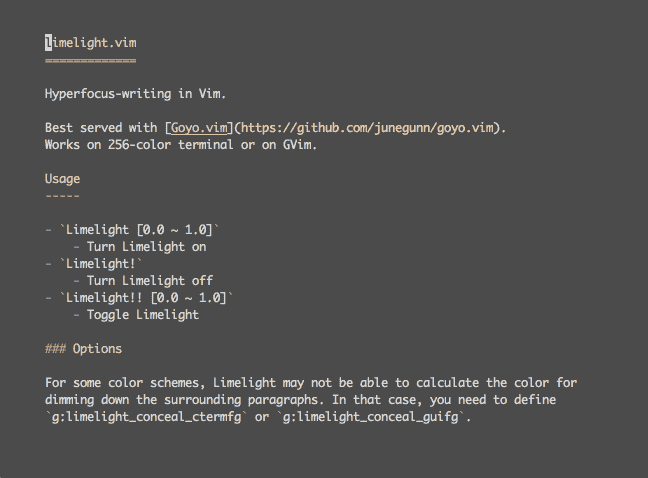

# 如果你能写代码，你就能写博客

> 原文：<https://betterprogramming.pub/if-you-can-write-code-you-can-write-blogs-28726560334b>

## 如何构建一个代码和散文都适用的 IDE？

J. Kelly Brito 在 [Unsplash](https://unsplash.com?utm_source=medium&utm_medium=referral) 上的照片

写文章和博客很像写代码。

首先，你在头脑中培养一个想法。也许这个想法是你在洗澡的时候想到的，或者是你长时间专注思考的结果。不管怎样，你现在已经准备好与世界分享了。

您的目标受众可能是程序员、IT 经理或初级开发人员。或者，它可能是编译器、解释器或解析器。不管是谁，你的责任是让读者完全理解你，并与读者建立联系。

那么从哪里开始呢？当写散文和代码时，我发现自己首先在一堆地方记下想法:在咖啡馆的餐巾上，在笔记本上，或者在纯文本编辑器中。当灵感来临时，即使是口红和镜子也是写下你心中所想的好方法！但是当谈到*将这个想法发展成一篇博客文章时，你很快就会发现有些工具比其他工具更好。作为一名代码和散文的作者，我想和你们分享我大部分写作的理想环境。*

# 文本编辑器

用“老派”来形容我自己并不完全准确。毕竟，我确实喜欢新鲜闪亮的东西，总是急于尝试最新的技术。但是当涉及到编写和编辑工具时，如果命令行工具提供与 GUI 工具相似的功能，我通常更喜欢命令行工具。(这可能是小时候花太多时间玩[流氓](https://en.wikipedia.org/wiki/Rogue_(video_game))的结果吧！)

你可能听说过两种主要的可编程编辑器: [Emacs](https://www.gnu.org/software/emacs/) 和 [Vim](http://www.vim.org/) 。我完全支持 Vim，更确切地说，我属于选择和使用 [Neovim](https://neovim.io/) 的阵营。也就是说，这真的是个人喜好的问题。我下面写的关于 Vim 的内容可能也适用于 Emacs。

一个好的编程文本编辑器的特征之一是它是可编程的。另一个是它的灵活性。当你需要打开几个不同的编辑器来编辑 Python、HTML、JavaScript 和 YAML 时，这意味着你的工具对你的阻碍超过了它们对你的支持。我的意思是，你需要在每个编辑器中重新调用适当的快捷键，或者你需要注意为代码的哪个部分打开哪个窗口，这样认知负荷就变得明显了。

Vim 本身只是一个文本编辑器，它不会对您正在编辑的内容类型做太多假设。但由于脚本和插件，它可以采取任何你喜欢的形状，利用外部工具来帮助你的工作。它可以编辑 C++代码并将其格式化为 clang-format，同时提供基于 LLVM 的自动完成功能。它可以编辑 Python 代码，为你提供一个交互式的 [REPL](https://en.wikipedia.org/wiki/Read%E2%80%93eval%E2%80%93print_loop) 。它甚至可以提供一个基于 [LLDB](https://lldb.llvm.org/) 的交互式调试器。根据您正在编辑的文件类型，它会为您提供最合适的帮助。

不管你是用 [LaTex](https://www.latex-project.org/) ，纯文本，还是用 [Markdown](https://daringfireball.net/projects/markdown/) 写的，散文和代码一样好。对于我的大部分写作，我更喜欢降价。让我告诉你为什么。

# 降价

对于我写的大多数文本，我不需要花哨的格式，比如改变字体样式或背景颜色。我真正需要的格式选项是一个结构(不同级别的节、子节等的标题)、超链接(原因很明显)、强调(粗体和斜体)、有序和无序列表，通常还有代码格式(需要等宽字体)。Markdown 以自然的方式提供这一切。(嗯，至少对我这个记得新闻组的人来说很自然。)

标题由一个或多个前导`#`来区分。所以`# Heading 1`是一个区段，而`## Heading a`是其中的一个子区段。粗体和斜体是用`*hey*`和`_ho_`实现的，和我们在 [IRC](https://en.wikipedia.org/wiki/Internet_Relay_Chat) 上做的差不多。列表看起来就像它们应该的样子，用`+`、`-`或`*`作为无序列表的指示器，后面带点的数字作为有序列表的指示器。链接和脚注就像新闻组上的帖子一样呈现:`[Text](http://example.com)`，代码格式化可以通过几种方式实现。图片可以像链接一样嵌入。我很少看到比这更多的需要。

减价的另一个好处是它无处不在。GitHub 对文档、维基页面和评论使用 Markdown。各种博客引擎把 Markdown 当一等客:Jekyll，Ghost，Tumblr。使用 GitBook，您可以将您的 Markdown 页面转换为以 PDF 或 ePub 格式发布的整本书。Slack 也提供了语法的子集。这有点像滚雪球效应:每一个针对程序员的工具似乎都在某种程度上支持 Markdown，因为 Markdown 的受欢迎程度使它有望支持 Markdown。Markdown 之所以受欢迎，是因为很多工具都在使用它。

因为我是 GitHub 的活跃用户，我在 Slack 上聊天，我为各种平台写书、贴子和文章，所以 Markdown 是我在准备散文时总是选择踩的共同点。

# 不受干扰且专注的写作

无论是代码还是散文，写作时专注是必不可少的。如果不能进入“流”的状态，每一句话，每一个命令都会有些吃力。但是一旦进入这种想要的状态，每一句话都只是跟着前一句走。你的手指开始本能地触摸键盘，将你的想法转换成字节序列。例如，我之前关于 [Serverspec](https://www.iamondemand.com/blog/test-deployments-like-test-application/) 的大部分帖子都是我在购物中心等待我的伴侣时写的。我只是坐下来，戴上耳机，单词开始流入序列，然后变成段落。

因为杂乱会阻碍这个过程，所以有一整类不受干扰的编辑器。他们给你一个最小的界面，所以你能看到和想到的只有你的文本。为此，我使用了两个 Vim 插件的组合: [Goyo](https://github.com/junegunn/goyo.vim) 和[light](https://github.com/junegunn/limelight.vim)。我自己的设置有一些定制功能，可以关闭来自我使用的其他软件的界面的附加部分。没有必要写太多关于他们的东西，因为[一部(移动的)电影](https://camo.githubusercontent.com/fa4e9321be0b4a565ae84a66bae36e97545c101b/68747470733a2f2f7261772e6769746875622e636f6d2f6a756e6567756e6e2f692f6d61737465722f6c696d656c696768742e676966)胜过千言万语。

# 完善你的草稿

## 阿斯佩尔之类的

当我写作时，我不喜欢看我正在打字的东西。初稿更多的是意识流；它的目的是清空我头脑中的想法。这可能会导致拼写错误或语法错误。我不在乎。过一段时间后，我还是得读一遍，看看哪些部分对我来说仍然有意义，并改正那些错误。

非常方便的是，我可以在不离开 Vim 的情况下这样做。而且不止一种方式。首先，有一个内置的拼写检查器，可以给不正确的单词加下划线。例如，它不知道“GitHub”，所以如果我在写作中经常使用它，我可以将它添加到拼写文件中。另一种可能是打开 Aspell 及其交互式建议，并逐个解决错误。斯科特·J·罗伯茨为它提供了一个很好的例子。

## 宝库

在第二轮写作(主要是阅读)中，我经常发现自己盯着重复的内容。当思想流动时，使用一个更小的单词库更容易，但是为了使文本可读，我需要稍微清理一下。当我有一个工作的互联网连接时，我可以使用 [Vim 在线词库](https://github.com/beloglazov/vim-online-thesaurus)，在[http://thesaurus.com](http://thesaurus.com/)中查找光标下的单词。对于离线工作，[同义词库查询](https://github.com/Ron89/thesaurus_query.vim)提供了一个使用[OpenOffice.org/LibreOffice](http://openoffice.org/LibreOffice)数据库的本地查找——前提是你已经安装了该数据库。

## 风格和语法

对于离线校对，有[语言工具](https://github.com/languagetool-org/languagetool)，它也可以作为[在线服务](https://languagetool.org/)使用。它支持 20 多种语言，并且像前面提到的工具一样，它可以与 Vim 集成。

如果你不介意把你的数据交给云，另一个有趣的服务是语法上的。它要求你建立一个账户，但作为交换，它提供人工智能校对。有趣的是，它是作为一个 Chrome 扩展提供的，能够检查你所有的文本输入，如电子邮件、论坛评论，甚至整个博客帖子。MS Office 支持也是可用的，但是我还没有听说任何 Vim 集成。

# 翻译人员

## 降价渲染

最后，当文本准备好向其他人(这意味着编辑或客户)展示时，我将它上传到 GDocs，以便于共享和协作。为了使我的 Markdown 文档与 GDocs 兼容，我需要呈现它。这基本上意味着将我留下的所有格式提示(前面提到的 Markdown 语法)转换成正确的格式。有很多工具可供选择，但对我来说，最方便的是一个在线 [Markdown 编辑器](https://jbt.github.io/markdown-editor/)。我稍微修改了一下，使它的风格与 GDocs 中的一致。

## 将 GDocs/网页转换为降价

有时候，我想换种方式工作。例如，当我需要处理别人的文章时，我首先在本地将它保存为 Markdown 文档，然后在 Vim 中编辑它。一个好的格式化文本转换器被恰当地命名为 [clipboard2markdown](https://euangoddard.github.io/clipboard2markdown/) ，它的工作方式与你所期望的一样。您将格式化的文本粘贴到窗口中，并从中获得等价的 Markdown。

# 我想和你一样

当我开始我的 Vim 之旅时，我习惯于看别人的`.vimrc`文件(所有定制配置都在那里),并为我窃取最好的想法。嗯，我还是喜欢看各种配置，寻找一些灵感，但是我不再盲从别人的方式了。读完这篇文章后，您可能会想复制我的配置，看看它如何为您工作。我反对这样做。工具是非常个人化的选择，我的设置不一定会让你写得更好。这就像每天喝醉不会让你像海明威一样写作一样。

我们鼓励您亲自尝试 Vim，您可以尝试不同的插件，但是要真正从使用它中受益，您应该开发自己的工作流，并根据您的需要配置编辑器。不要围绕工具设计你的习惯，而是让工具为你服务。路上玩得开心点！