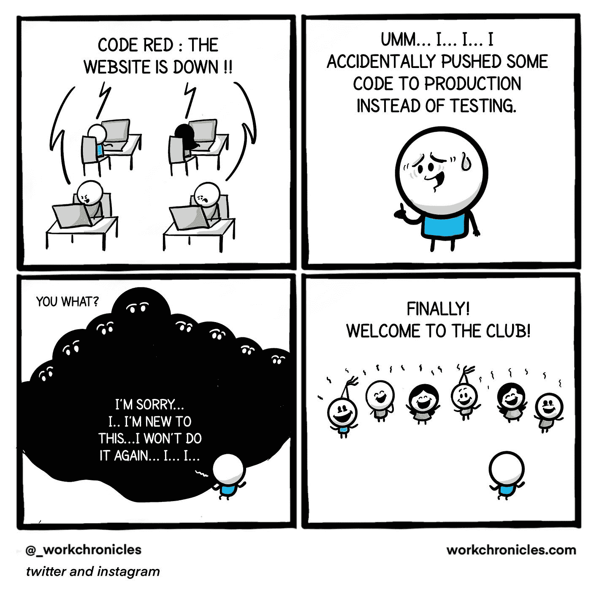
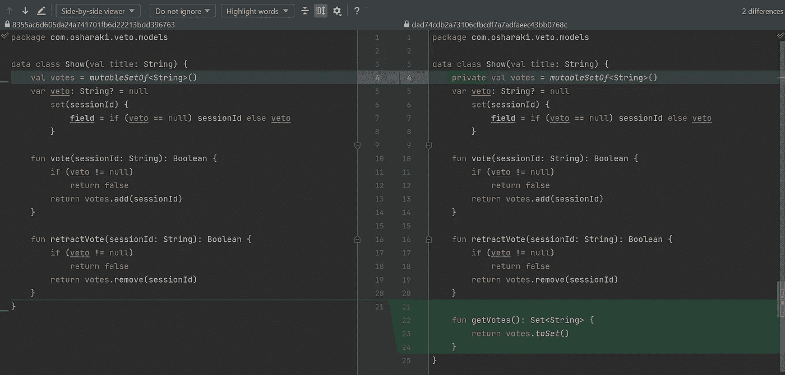
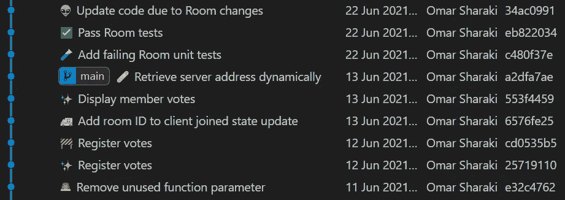

# 如果你正在学习编码，你需要学习 Git

> 原文：<https://betterprogramming.pub/if-youre-learning-to-code-you-need-to-learn-git-de97acf19907>

## 5 分钟 5 个理由

照片由[扬西·敏](https://unsplash.com/@yancymin?utm_source=medium&utm_medium=referral)在 [Unsplash](https://unsplash.com?utm_source=medium&utm_medium=referral) 上拍摄

在我软件开发之旅的早期，我甚至不知道源代码控制管理的存在——更不用说 Git 了。当这个消息最终传到我居住的岩石下时，我的无知让位于压抑的恐惧。分支、合并、分叉和差异？不，我很好。

部分恐惧源于缺乏理解。另一个是想打破一些东西，这不是完全没有道理的；初级开发人员意外投入生产或合并冲突分支的故事激发了许多迷因。但是说实话，在软件中，出问题只是时间问题，当这不可避免地发生时，有版本控制是好的。

对陌生事物的恐惧永远不应该成为开阔我们视野的障碍。这就像总是去汉堡王，而不是街角那家不错的日本餐厅，只是因为你不会说日语或不知道如何使用筷子(碰巧的是，我不会)。

但是不像日语和筷子，如果你打算做任何软件相关的事情，你*迟早会*不得不使用源代码管理器——很可能是 Git。在接下来的几分钟里，我希望我能说服您为什么这是一件好事，以及为什么您越早开始学习和使用 Git 越好。

# 鼓励实验

学习和实验是齐头并进的。就我个人而言，我发现了解事物的最好方法是把它拆开，然后再组装起来。这就是我在毫无头绪的 CS 本科生的第一学期开始理解 bash 脚本的原因。例如，我会删除代码行，看看哪里出了问题，然后将它们添加回去，重复这个过程。

另一种需要修改现有代码的情况是，当你对如何处理一个给定的问题有不同的想法时。尽管 Ctrl+Z/Ctrl+Y 或者创建文件的多个副本本身就很强大，但也只能做到这一步。在这种情况下，你要么因为担心你的程序会失败而停止尝试你的想法，要么你实现了它们，它们并不像你想象的那样工作，并且你不能恢复工作版本。不管是哪种情况，结果都是你是一个犹豫着要不要继续攀登的攀岩者，因为你已经用光了在岩石上固定自己位置的登山扣——这是理所当然的。

照片由[凯德先于](https://unsplash.com/@medicadetion?utm_source=medium&utm_medium=referral)在 [Unsplash](https://unsplash.com?utm_source=medium&utm_medium=referral) 上拍摄

Git 完全消除了这一点。一个简单的`git commit`给你信心，让你勇往直前去尝试你想尝试的任何事情，因为你知道在任何时候你都可以回到那个关卡。当你想同时做多件事情，但是要分开做的时候，用`git checkout -b <branch>`或者`git switch -c <branch>`转移到一个新的分支同样有用。这允许你通过简单的`git checkout <branch>`或`git switch <branch>`在它们之间无缝切换。

正如我已经提到的，阻碍进步和创新的最大障碍之一是害怕打破东西。虽然在许多情况下这是一种健康的恐惧，但在软件的非物质世界中，我们有能力让这种恐惧过时。这种力量就是版本控制。

# 为您的工作流程增加灵活性

你有没有在开发某个功能的时候，突然有事情发生，你需要暂时把它放在一边？也许是天才的一击，或者你只需要看看你的代码在改变之前是什么样子。无论哪种方式，您仍然希望保留当前状态，并且在完成后能够返回到当前状态。

有了 Git，这就不在话下了。假设您在当前更改之前已经提交了一次，一个简单的`git -u stash`将加载最后一次提交并保存您的更改，供您稍后使用`git stash pop`检索。

# 促进协作

带着你的代码库在闪存盘里转来转去或者让多人竞争访问相同文件的日子已经一去不复返了。Git 和像 GitHub 这样的分布式版本控制平台使得共享源代码成为一种更加愉快的体验，无论是对个人还是团队，无论他们是在房间的另一边还是地球的另一边。

有了 Git，团队成员可以独立完成他们各自的任务，而不会妨碍彼此的工作或者打乱彼此的工作。准备就绪后，可以合并代码，任何可能出现的冲突都可以通过 Git 更容易地解决。

类似地，对于希望与世界共享代码的独立工作的个人来说，GitHub 存储库实质上是您项目的一个公共可访问版本，其他人可以查看和浏览您的代码库，如果他们愿意贡献，甚至可以请求进行更改。

# 允许查看更改

Git 还使得查看提交之间的确切变化变得非常容易。一个简单的`git diff`将显示上一次提交和工作区当前状态的比较。这是我的一个项目的例子:

前(左)后(右)

这对于单个文件和提交一样有效，并且可以根据需要进一步定制。此外，大多数现代 ide 都集成了 Git，使得这些差异更容易解释，还有其他很酷的特性，比如让您一目了然地看到哪些文件有未提交的更改。

# 跟踪项目进度

当你一次又一次地提交时，你基本上是在写你的项目是如何进展的故事。与提交消息(即`git commit -m "<message>"`)相结合，它不仅允许您跟踪所做的更改，还允许您跟踪做出这些更改的*原因*。

在任何给定的时间，你都可以和`git log`一起回顾过去，搞清楚一些旧的变化，或者在前进之前进行评估。

正如你所想象的，这仅仅是皮毛。显然，除了我在这里提到的原因之外，还有很多使用 Git 的原因。Git 是一个复杂的工具，但是你不需要成为一个大师才能从中受益。甚至将 Git 最基本的命令整合到您的开发中也能极大地提升它，并且您总是可以从那里[深入](/git-commands-to-live-by-349ab1fe3139?source=friends_link&sk=3c6a8fe034c7e9cbe0fbfdb8661e360b)。就我个人而言，我数不清有多少次不得不说，“感谢上帝赐予我饭桶！”

还是不服气还是觉得我遗漏了什么？请在评论中告诉我。谢谢你的来访！