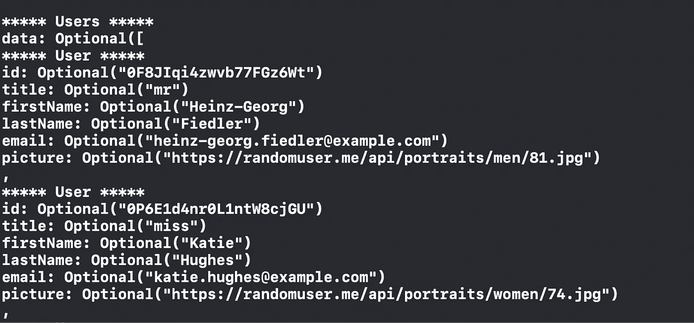

# 在 Swift 5 中使用 Combine 实现网络层

> 原文：<https://betterprogramming.pub/implement-a-networking-layer-using-combine-in-swift-5-8a83e3ac9bae>

## 一个灵活的解决方案，可复制并粘贴到您的新应用中

Thom Bradley 在 [Unsplash](https://unsplash.com?utm_source=medium&utm_medium=referral) 上拍摄的照片

在本文中，我们将了解如何通过利用组合发布者、可编码、可自定义字符串转换协议和自定义端点结构来设计和创建高效且易于使用的网络层。

在本教程结束时，您将有一个现成的实现，您可以轻松地将它复制并粘贴到您的应用程序中，并按照您想要的方式扩展它。

完整的源代码可以在文章的底部找到。

# 我们开始吧

在深入研究代码之前，让我们先概述一下网络层的所有组件:

*   *端点*——一个方便的`struct`，具有`path`和`queryItems`属性。通过在其上定义扩展，我们可以方便地创建 REST APIs 的基本 URL，定义特定的端点和头(当我们开始实现它时，这对您更有意义，所以不要担心)。
*   *可编码模型*——可以从 JSON 创建的简单对象。
*   *网络控制器* —负责直接与`URLSessionTask` s 合作，从数据中解码出`Codable`模型。例如，它有一个通用的`get()`方法，返回包含模型的发布者。
*   *逻辑控制器—* 从表示层(视图/视图控制器)抽象出网络控制器正在完成的工作，并提供查询模型的简单方法。例如，它可能有一个`getUsers()`方法，该方法调用网络控制器所需的方法并返回一个用户数组。

我们将使用一个名为 Dummy API 的免费 REST API:

 [## 伪用户数据 api。超正析象管(Image Orthicon)

### 拥有虚假数据的全周期 REST 生产 API 服务器，100 个用户，800 多个帖子，1000 条评论，24/7 可供您…

dummyapi.io](https://dummyapi.io) 

现在让我们开始一个接一个地创建每个组件。

# 可编码模型

我们将从虚拟 API 中获取用户。JSON 看起来像这样:

因此，我们创建了以下两个结构:

注意，我们遵循了 [CustomStringConvertible 协议](https://levelup.gitconnected.com/automate-debugging-swift-objects-using-the-customstringconvertible-protocol-c01fff74380f?source=friends_link&sk=a4b2f320bf7da16bc771ef628b630f9c)来轻松调试我们的对象。我们有以下方便的扩展，减轻了为每个一致性结构定义`description`属性的负担:

模型完成后，现在让我们来看另一个组件。

# 端点

定义一个`Endpoint`结构，我们将扩展它以满足特定的 API 需求:

现在，我们需要创建一个扩展，在这个扩展中，我们为虚拟 API 构造了`URL`,并且还定义了包含应用 ID(虚拟 API 所必需的)的`headers`属性:

现在让我们定义几个端点:

我们将只使用第一个。我提供了后两个来展示我们如何方便地添加参数和设置路径。

现在，该是`NetworkController`的时候了。

# 网络控制器

首先，让我们定义一个`NetworkController`协议:

正如我们所看到的，我们有一个查询单个可编码模型的方法。

现在我们需要创建协议的具体实现:

请注意，在短短四行代码中，我们完成了以下工作:

*   创建并启动一个`URLSessionDataTask`
*   如果没有出现错误，获取`data`
*   解码模型对象
*   返回包含模型对象或错误的发布者

我们还剩下最后一个组件——一个`LogicController`。

# 逻辑控制器

因为我们想要获取用户，所以我们的逻辑控制器将被称为`UsersLogicController`。首先，让我们从一个协议开始:

我们依赖于`NetworkController`并定义了三个方法:

*   `getUsers()` —默认情况下查询 20 个用户
*   `getUsers(count: Int)` —查询指定的`count`用户
*   `getUser(id: String)` —查询一个与提供的`id`匹配的用户

具体实现如下所示:

正如我们所看到的，我们直接使用端点并调用所需的`NetworkController`方法。通过将该类标记为`final`，我们向其他开发人员发出信号，表明该类不被设计为子类。

最后，我们可以测试我们创造了什么。

# 用法示例

让我们初始化`NetworkController`和`UsersLogicController`:

创建将存储我们未来订阅的`subscriptions`属性:

现在我们可以如下获取用户:

不出所料，我们看到`User`对象像预期的那样打印得很漂亮:

# 资源

Xcode 游乐场的源代码可以在[概要](https://gist.github.com/zafarivaev/c9ffa6e47b302795fa3413fb5901b72e)中找到。

# 包扎

查看 John Sundell 关于管理 URL 和端点的视频，这是这篇文章的灵感来源:

 [## Swift clip:管理 URL 和端点| Sundell Swift

### 在本视频中，我们将了解三种不同的方式来管理 URL 和服务器端点，即 Swift 应用程序…

swiftbysundell.com](https://swiftbysundell.com/clips/4/) 

想了解更多关于联合收割机的信息吗？查看我的其他相关作品:

*   [使用 Combine 编写更可读的 Swift 代码](https://medium.com/better-programming/use-combine-to-write-more-readable-swift-code-9e8e6cf0bf50)
*   [在 Swift 5 中用 Combine 替换 Delegation】](/better-programming/replace-delegation-with-combine-in-swift-5-e4c193655e7b)
*   [您应该从 Swift Combine 了解的 7 个顺序运算符](/better-programming/7-sequential-operators-you-should-know-from-swift-combine-1775ce3c47c8)
*   [你应该从 Swift Combine 了解的 6 个合并运算符](/better-programming/6-combining-operators-you-should-know-from-swift-combine-17ea69d9dad7)
*   [Swift:你应该知道的 5 个变换合并运算符](/better-programming/5-transforming-combine-operators-you-should-know-4603fe112d74)

感谢阅读！