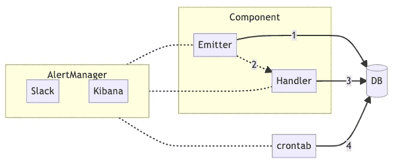

# 以最小的努力实现事件驱动的架构

> 原文：<https://betterprogramming.pub/implement-event-driven-architecture-with-minimal-effort-182c3bbe5524>

## *时间耦合是最容易被忽视的陷阱*


由[穆罕默德·拉赫马尼](https://unsplash.com/@afgprogrammer?utm_source=medium&utm_medium=referral)在 [Unsplash](https://unsplash.com?utm_source=medium&utm_medium=referral) 上拍摄的照片

上次，我们[解释了时间耦合](/temporal-coupling-in-code-e74899f7a48f)可以通过事件驱动架构有效解决。其中，我们分别讨论了这三种方法。从可靠性最低的开始，简单的使用事件发射器就可以事半功倍的解决大部分情况；其次，为了进一步提高可靠性，可以引入消息队列，保证事件至少执行一次。最后，实现事件源以确保事件不会丢失。

然而，在资源有限的组织中，消息队列似乎遥不可及。这里的资源包括人力资源和组织预算，无论是没有额外的人力来维护一个新的消息服务，还是没有额外的资金来启动一个消息服务。消息队列是受限组织中的高价系统之一。

因此，在本文中，我将介绍如何用最少的资源通过事件驱动架构实现解耦。

# 系统概况

为什么会诞生这个话题？因为我们的一个产品属于这个受限组织。因此，在系统演进的过程中，我们通过做出大量的设计决策来逐步提高可靠性。



上面的整体架构是我们系统的最终外观。从图中我们可以看到，没有消息队列。即便如此，我们仍然实现了高可靠性。至少，出了问题，还有挽回的办法。

组件、警报管理器、crontab 和 DB 都存在于系统中，没有添加其他组件。我们只是将最初由函数执行的单元分成发射器和处理程序。

在下一节中，我将一步步解释我们是如何做到的。

# 系统进化

整个系统演进过程经历了四个阶段，我们逐渐提高了整个系统的可靠性。

*   尽力而为:在开始时，我们简单地将函数分成发射器和处理器，仅此而已。这是最基本的做法，所有的事件都是一劳永逸的。当然，如果没有意外发生，这样的实施其实并不坏。可以用最少的资源实现解耦。但是前面文章提到，主要有两个问题，**事件损失**和**发射损失**。
*   与警报管理器集成:当处理程序执行失败时，我们添加一个警报。通过将必要的信息写入`Elastic Search`并呈现在`Kibana`上，负责人可以在收到 slack 的警报后采取相应的行动。也就是说，我们通过人工恢复来解决**事件损失**。


*   事件源:为了更完整地跟踪事件以避免**事件损失**和**发射损失**，我们使用现有的数据库来实现事件源的简化版本。在发射事件之前，发射器将元数据写入数据库，并标记预期的处理程序。如果写入数据库失败，则被视为事件发射失败，将触发警报管理器。当处理程序完成事件时，它还会将自身更新到数据库中。对于上面提到的示例，事件的元数据如下所示:

```
{
    eventName: "purchased",
    createAt: "2022/01/01 1:11:11",
    expected: ["giveCoupon", "lottery"],
    status: 0, // 0: emitted, 1: timeout, 2: processed
    done: [],
    args: ["user A", 5000]
}
```


*   应用 crontab 加事件幂等性:此时此刻，与前面完整的架构图相同。以上步骤都有一个致命的缺陷，需要人工恢复。虽然这可以确保问题最终得到解决，但平均恢复时间(MTTR)将会相当长。因此，通过我在[上一篇文章](https://lazypro.medium.com/design-patterns-of-event-driven-architecture-bf0121cfda7b)中介绍的工作流事件模式，可以进一步增强整个恢复机制。通过 crontab 定期检查哪些事件没有正确执行，然后重新运行它。

有两个要点值得注意。首先，每个事件的处理必须是幂等的，这一点即使在使用消息队列时也非常重要。因为消息队列保证至少一次，而不是恰好一次。其次，即使有幂等性，重试次数也应该有上限。如果重试几次失败，我们还是要通知负责人处理后续事宜。

# 权衡取舍

其实上面的架构有很多值得讨论的地方。举个例子，

*   了解发射器向数据库写入数据时需要哪些处理程序。换句话说，发射器以某种方式耦合到处理程序。但是，在我看来，这样的耦合是可以接受的。只要可以通过适当的编码减少耦合，例如，有一个全局映射表来拥有每个事件和处理程序之间的关系，那么这可以被视为一种配置而不是耦合。
*   在处理程序中重试，而不是 crontab。各有各的优势。在处理程序中重试可以尽快恢复错误，但有时处理程序失败的主要原因是数据库拥塞，立即重试会进一步增加数据库的负载。
*   数据不一致。处理程序成功执行，但更新失败。使用幂等性来确保即使重复执行也不会导致问题。另一方面，发射器的任务成功执行，但未能写入数据库，必须手动重新发射。这可以通过一种更复杂的机制来实现自动重试，但以更复杂的代价来说，我认为对于写入失败的情况来说不值得。

# 结论

在本文中，我们将讨论一些受限组织在事件驱动架构中面临的一些权衡。不得不说，事件驱动架构本身就是一个高度复杂的架构，它是否真的适合小组织一直是争论的问题。然而，本文提供了一种在小型系统上实现事件驱动架构的简单方法。除了不创建新的组件之外，它不会产生太多的编码复杂性，并且是一个易于实践的实现。

尽管如此，在这一长串设计决策中为每个组织找到正确的方法并不容易。每一个直截了当的回答背后，都有很多考量和可能的风险。当我在设计一个系统，尤其是一个分布式系统时，我总是提醒自己要小心 FLP 定理。

> 没有一个完全异步的一致协议能够容忍甚至一个未宣布的进程死亡

用简单的英语来说，就是墨菲定律。

> *任何可能出错的事情都会出错。*

如何在有限的资源下尽可能可靠，无论是在时间、人力还是成本方面，都是系统设计中最有趣的部分。