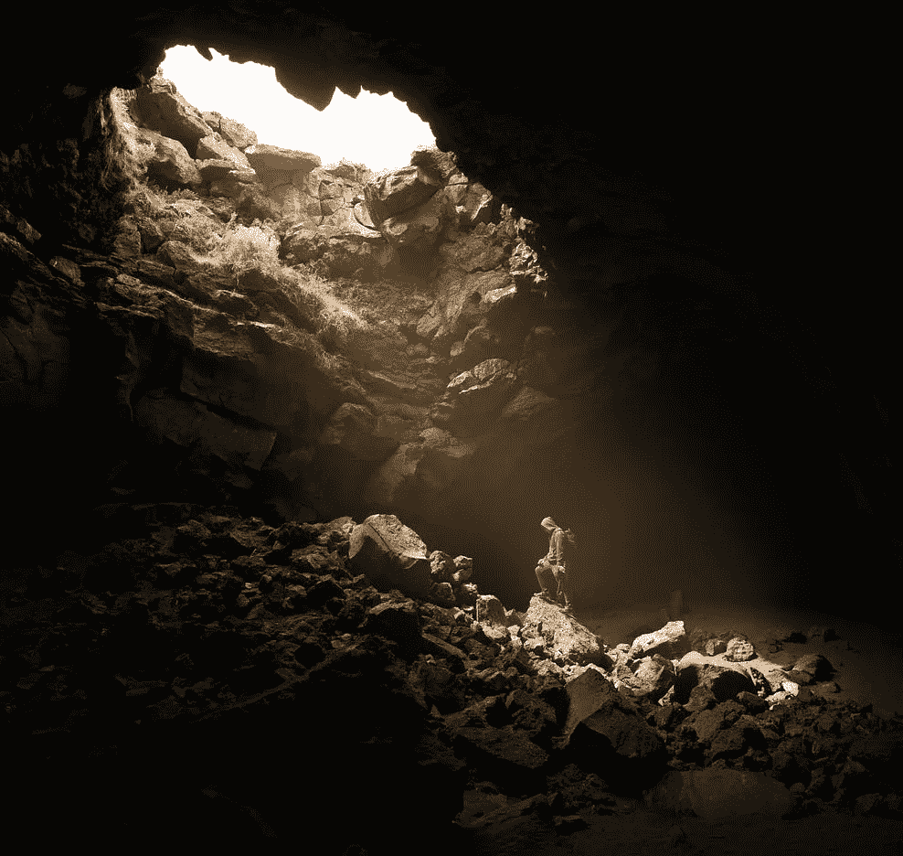
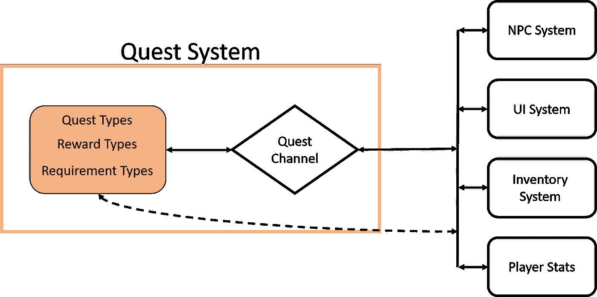

# 实现可扩展的 Quest 系统

> 原文：<https://betterprogramming.pub/implementing-a-scalable-quest-system-7f36ea4cfe22>

## Quests 系统分为三个部分:理论、设计和实现

任务带我们去意想不到的神奇地方|图片来自 Unsplash 上的[陈琦烨](https://unsplash.com/photos/wrrgZwI7qOY)

在许多游戏类型中，故事是通过游戏任务来讲述的。在其他情况下，任务是一个辅助机制，给玩家动力和进步的感觉。

要理解如何构建一个任务系统，首先，我们需要掌握什么是系统(编程)和什么是任务。只有这样，我们才能将两者结合起来，真正理解 Quest 系统是什么，并开始考虑它的实现。

如果你对游戏开发中的系统或任务有很好的理解，可以跳过下一个理论部分。

# 理论

## 系统

> 一套有组织的想法或理论或做某事的特殊方法。
> 
> —牛津词典

在软件开发中，特别是在游戏开发中，系统是一个封闭的逻辑概念，当实现时，它使用不同的元素(类、接口等)处理与这个概念相关的所有事情。).

系统名称的例子有战斗系统、库存系统、聊天系统、保存/装载系统等。以上一段为例，战斗系统负责战斗的所有事情，例如战斗期间实体之间的交互，玩家在每个阶段能做什么或不能做什么，以及战斗结果。

你能想到的大部分战斗相关的东西，都可能属于战斗系统。

系统注定要相互作用，相互影响。一个例子是，当敌人或玩家被击中时，UI 系统很可能会做出反应，这些信息来自于战斗系统。

## 探索

> 对某样东西的长期寻找……-牛津词典

嗯，在我们的上下文中，任务有时很短，但通常我们会搜索一些东西(或人)。

在软件开发中，任务可以有很多不同的命名方式，比如挑战、任务、检查点等等。

游戏开发中最常见的名字是“任务，*”*，所以我们将使用这个名字。

任务试图完成(触发)一个游戏事件或多个游戏事件。通过这样做，玩家以另一个任务、奖励、揭示新内容等形式获得了一些游戏中的连续性！

一些任务的例子是:

迪士尼的大力士

*   打败尼米亚狮子
*   偷三个金苹果
*   精心准备五份口粮

那么，要完成这些任务，需要触发哪些游戏事件呢？

在击败敌人时，很可能会有一个由战斗系统触发的事件，其中包含被击败的敌人及其类型的信息。

当收集(或窃取)物品时，可能会有一个由库存系统触发的事件，该事件带有关于物品和已收集数量的信息。

在制作口粮的时候，我相信你现在已经明白了。

到目前为止，我们已经讨论了什么是系统，什么是任务。现在，我们可以很容易地将这两者结合起来，形成任务系统。一旦我们深刻理解了这两个短语，你会惊讶于它是多么简单。

## 探索系统

这个系统负责所有与任务相关的事情。

*   分配
*   跟踪
*   完成

这个系统的另一个责任是通知环境(其他系统)与任务相关的事件，这些事件与上面的列表非常匹配。

# 设计

为了设计任务系统，我们需要依靠我们对系统、任务和任务系统的知识。我们知道任务系统应该由代表我们上面列出的属性的元素组成。我们知道任务系统应该通知环境关于任务相关的事件。

Quest 系统一般流程

橙色方块是本文的重点，我们将确保我们的任务系统可以开始监听其他系统中发生的事件，以便它可以开始跟踪任务的进度，还可以通知环境(其他系统)任务的进度。

## 探索频道

quest 通道是连接 quest 系统元素和其他系统的管道元素。我喜欢将它包含在任务系统中(这是一个完全抽象的上下文)，因为它与我们之前定义的“所有任务”相关。

该通道将主要调用与任务状态变化相关的事件，以便环境能够做出反应。

一旦我们开始实现它，我们将对此进行更详细的阐述。

## 探索

有许多不同类型的任务。我们之前已经看过一些例子了。在我们深入研究实现之前，我们需要找出它们的共同点。

*   为了避免不同任务之间的混淆
*   `Name`，每个任务都要有名字。
*   `State`，任何给定的任务都处于某种状态，或者未决，或者活动，或者完成。更复杂的任务系统有更多的状态，但这些是基本的。
*   任务可以有等级要求，甚至是完成另一个任务的要求。
*   `Rewards`，几乎每个任务都有一个奖励列表——经验、货币、物品等等。
*   `Quest Channel`，每个任务都必须承认任务通道的存在。

*提醒:这是系统通向环境的管道。*

## 任务类型

在我们理解了抽象任务的属性后，我们可以考虑具体的任务类型，比如“击败敌人任务”、“收集物品任务”、“到达地点任务”、“与 NPC 对话任务”等等。

每种类型的任务都有自己的属性，并对来自不同系统的事件做出反应。

在我们的任务系统的实现中，我们将使用两种不同类型的任务:

1.  **击败敌人任务** 除了抽象的任务属性之外，这个任务还需要分配一个敌人 id \类型和一个代表需要击败多少敌人的数字。当敌人被击败时，我们可能需要一些到战斗系统的信息管道。
    我们还希望用户能够在保存进度的情况下退出任务。
2.  **收集物品任务** 这里的概念很相似。我们需要一些物品 id，以便当我们从库存渠道收到关于库存数量变化的信息时，我们可以监控它以确定任务是否完成。
    在这里，我们希望在用户收到请求时，立即检查他是否满足请求的条件。

# **任务系统的其他元素**

我们可以继续为任务系统的其他元素编写属性列表，在我们的例子中是奖励类型和需求类型，但我们不会这样做，因为这不是本文的主要主题，在实现部分，这些元素的职责将变得清晰。

在决定你的任务系统需要哪些元素和设计这些元素时，我能给你的主要建议是保持简单。每个元素都应该是一个封闭的想法，负责与这个简化的想法相关的一切(就像一个迷你系统)。

# 履行

这一部分假设了一些编写代码、OOP 和 C#的知识。欢迎在评论区提出任何不清楚的问题！

另外值得一提的是，下面一个 quest 系统的实现是我自己的，有很多不同的方法可以得到相同的结果。我们的 quest 系统是非常基础的，所以我们可以对主要原理有深刻的理解。

最能定义这个系统的是给定任务的状态，所以我们从这里开始。

在我们的系统中有三种状态:

*   `Pending`，为了任务还没开始的时候。
*   `Active`，当任务开始并交给玩家时。
*   `Complete`，当任务完成，奖励发放时。

另一个与环境交流的非常基本和必要的东西是探索通道。下面是代码的样子:

`QuestChannel`类非常基本，由两个可以从外部订阅的事件组成。该类也有两个触发其事件的方法，也是为了使用环境。

例如，一个 NPC 在结束与玩家的对话时授予玩家一个任务并触发`AssignQuest`方法。

接下来，我们将深入到`Quest`类，这是一段较长的代码，但是不要担心，我们会弄清楚每一部分是如何与我们之前谈到的想法相关联的。

第 3–9 行:我们可以看到与抽象任务相关的所有属性，我们将在我们的示例中保持需求和奖励元素简单，只分发经验作为奖励，确认任务激活的需求将只是一个等级需求。

第 11–20 行(`Enable`):这个函数负责任务的事件注册和设置。你可以看到我们订阅了由 quest 频道触发的事件，这是我们通往游戏软件其他组件的管道。然后我们检查任务是否已经激活(也许我们在任务中途关闭了游戏),然后激活当前的任务。
这个方法在某种意义上就像一个构造函数。我没有构造一个构造函数，因为在某些地方，一个任务可以保存为一个启动时启用的资产，这个方法被称为。

第 22–26 行(`Disable`):只要确保你总是记得当游戏/软件关闭，或者物体被破坏时取消订阅事件。

第 28-36 行(`QuestActiveEvent`，`QuestActive`):这是任务通道想要激活一个事件时触发的方法。在这里，我们确保当前的任务已经被激活(第 30 行)，改变任务的状态，并触发内部激活方法，这是下一步(第 36 行)并且是抽象的，因此从任务继承的类可以根据自己的需要实现它。

第 38–46 行(`QuestCompletedEvent`，`QuestCompleted`):同样的概念也适用于这里，但是是由任务通道触发的任务完成事件。

第 48–51 行(`Complete`):这个方法供继承的子进程使用，通过触发任务通道上的事件来完成任务。

奖励呢？让我们看一个例子。

这个任务系统只奖励经验。我们要做的是让`PlayerStats`职业一旦可以就抓住那个奖励。它怎么知道那是什么时候？事件。

这里不多赘述。我们确保我们订阅了任务完成的事件，并获得了它授予我们的奖励，然后我们让环境知道玩家获得了一些经验！(可能 UI 需要更新？也许我们想要一些烟火和文字？也许升级发生了？)

# **快速总结**

我们已经为我们的任务系统奠定了所有的基础，现在可以用独特的任务和功能来扩展它。干得好！

我将展示两个扩展我们的任务系统的例子，它们很相似，但在我看来很重要。

1.  `CollectItemQuest`

这种任务类型让用户收集物品，除非他们运气好，并且已经在他们的库存中。

首先，让我们承认从 Quest 类的继承(第 1 行)。

接下来，我们有这个任务类型的属性:

*   `InventoryChannel`，这是库存系统到环境的管道。我们需要它，所以我们知道什么时候物品被添加到库存中。
*   `_inventoryItemMeta`，我们需要采集的物品类型应该有一些唯一的标识符。
*   `_amountToCollect`，玩家应该收集多少物品。
*   `_playerInventory`，关于物品的任务应该确认库存。我们需要订阅与项目金额变化相关的事件

第 9-15 行(`TryComplete`):我们从库存中得到一件物品，检查它是否是正确的，以及我们是否有足够的数量来完成任务。如果是，我们完成它(第 13 行——还记得 Quest 类中的方法吗？)

第 17–27 行(`QuestActive`):如果您还记得，这是我们在 Quest 类中的抽象方法，所有继承类都必须实现它。

当任务被激活时，我们需要订阅与物品数量变化相关的库存渠道事件，然后检查玩家是否有任务所需的数量，以便我们可以立即完成任务。

第 34–40 行(`ItemAddedEvent`):当一个项目被添加到库存时触发，我们比较 id 以确保它是相关的。如果是这样，尝试完成任务。

2.`DefeatEnemiesQuest`

我们在这里引入一个新概念。一些任务在激活时需要加载一个状态。代码如下:

首先，让我们承认从 Quest 类的继承(第 1 行)。

接下来，我们有这个任务类型的属性。它们是这样的:

*   `CombatChannel`，从作战系统到环境的管道。我们需要它，这样我们才能知道敌人何时被击败。
*   `_enemyToDefeat`，玩家应该击败的敌人，应该有一些独特的标识符。
*   `NumberOfEnemiesToDefeat`，玩家必须击败多少敌人才能完成任务。
*   `_actualEnemiesDefeated`，这是一个内部计数器。

第 9–13 行(`Enable`):我们覆盖了`Quest`类的`Enable`方法，因为当游戏开始并且任务被激活时，我们需要这个任务类型的一些独特的功能。如果我们在任务中途关闭游戏，然后重新登录，我们希望加载玩家的进度。
为了简单起见，这是在`Enable`方法中完成的，但是我们不会在本文中详细阐述保存\加载系统。

第 16-24 行(`QuestActive`，`QuestCompleted`):在战斗系统上订阅和取消订阅`EnemyDefeatedEvent`。这有助于我们确定玩家何时取得进展。

第 26–36 行(`EnemyDefeatedEvent`):由`CombatChannel`触发，我们检查相关性(第 28 行)，增加击败敌人的计数器，并检查任务是否已经完成(第 32 行)。如果是这样，我们调用位于父`Quest`类中的`Completed`方法。

# 接下来我们能做什么？

我要做的第一件事是尝试实施一个不同于经验的奖励，也许是一个项目？

任务系统可能是游戏中最复杂的系统之一。如果我们的系统有一个强大的基础，并且我们的环境可以通过事件流畅地通信，并且系统定义良好，那么我们可以毫不费力地轻松扩展它。

最后一件事:最近，我开发了一个免费的 Quest System Unity 脚本资源包。它易于使用，适合所有项目规模。

去看看吧，如果你喜欢就留下评论。

 [## Quest 系统|实用工具| Unity 资产商店

### 内置的渲染管道是 Unity 的默认渲染管道。它是一个通用的渲染管道，具有…

assetstore.unity.com](https://assetstore.unity.com/packages/tools/utilities/quest-system-223737)