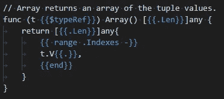

# 用 Go 1.18 实现类型安全元组

> 原文：<https://betterprogramming.pub/implementing-type-safe-tuples-with-go-1-18-9624010efaa>

## 以及如何用新的泛型特性实现它


照片由[Ty suggest](https://unsplash.com/@burtonts?utm_source=medium&utm_medium=referral)在 [Unsplash](https://unsplash.com?utm_source=medium&utm_medium=referral) 上拍摄

最近， [Go 1.18 beta 发布](https://go.dev/blog/go1.18beta1)带有期待已久的泛型特性。

作为一名来自 C++和 Python 的开发人员，在过渡到 Go 时，没有泛型特性对我来说是一个巨大的痛点，我仍然发现自己希望能够有一些函数或结构。幸运的是，现在这变得越来越有可能。

**TL；DR** :我为 Go 1.18 实现类型安全元组的旅程。希望它能让你感受到泛型的新的可能性，以及它的局限性。
你可以在这里找到开源`go-tuple`包[。](https://github.com/barweiss/go-tuple)

# A 仿制药简介

在 Go 1.18 中，我们可以用以下方式定义一个通用函数:

*(* [*围棋游戏*](https://go.dev/play/p/hI60P37OSk3?v=gotip) *)*

这里的关键是`[T, U any]`部分，它允许我们定义泛型类型参数。`T`和`U`都是类型参数，它们必须满足`any`约束条件(后面会详细介绍)

其实`any`简单定义为`interface{}`，也可以作为类型使用！

类型参数打开了很多可能性！例如，我们可以利用 Go 的一个隐藏特性[，其中一个函数的返回值可以作为另一个函数的参数传递](https://stackoverflow.com/a/35274608)，以便创建一个类似于 Rust 的 unwrap 的通用“Unwrap”函数:

*(* [*去游乐场*](https://go.dev/play/p/oV-CkED7-qY?v=gotip) *)*

结构和接口也可以成为泛型:

# 元组

在编写 Go 时，我经常觉得需要在一个元组中存储多个值。这并不是说没有其他方法可以做到这一点，但是我总是认为每次需要对值进行分组时声明一个结构是很乏味的。要么我用一个无意义的名字声明一个结构，比如`personAndCar`，要么我可以使用一个未命名的结构，但是这样我就不得不在使用时再次指定定义。

因此，当我听说 Go 1.18 中增加了泛型，并立即想看看它的工作情况时，我决定创建一个元组类型。

# 实现元组类型

我的目标是支持这些特性，各种语言的大多数 tuple 实现都支持这些特性:

*   包含固定数量的不同类型的值。*(受支持)*
*   允许对值进行索引访问。*(受支持)*
*   可以解包到命名变量中。*(受支持)*
*   元组之间的比较。*(有些支持)*
*   获取子元组*(不支持)*
*   串联元组*(不支持)*

我开始记下一些代码。

不过之前有一点需要注意:Go 不支持可变的泛型参数。这意味着不可能编写一个`Tuple`类型。我必须为我希望元组保存的每个不同数量的值实现一个类型。但不代表不能有什么共同的代码。

我的第一次尝试是使用递归定义实现元组:每个元组类型定义一个新值，并使用较低级别的元组来描述其余的值。例如，我可以这样定义一个由 4 个值组成的元组:

```
type Tuple4[T1, T2, T3, T4] Tuple2[T1, Tuple2[T2, Tuple2[T3, T4]]]
```

迷惑？是的。但是通过这种方式，我可以在`Tuple2`上实现一切，并让所有更高级别的元组基于`Tuple2`。此外，用户不必知道元组是如何实现的，这对他们来说不重要。

```
type Tuple2[T1, T2 any] struct {
    V1 T1
    V2 T2
}
```

现在实现一个`Get`方法，返回所请求索引的元组值。

```
func (t Tuple2[T1, T2]) Get(index int)
```

等等。结果的类型是什么？`any`？这意味着我会失去类型安全。

我简单地尝试了一种方法，其中`Get`是泛型的，调用者将把期望的类型传递给函数，但是除了在语法上不受支持之外，这将导致一个奇怪的、不安全的接口。无论如何，我也不能让`Get`在运行时安全使用，因为我必须验证索引没有越界。

不用说，递归实现在这里不是一个好方法。

令我沮丧的是，我意识到每种元组类型之间没有多少共同点。每种元组类型都必须单独实现。

然而，手动编写每个元组类型是不可能的。我不打算单独编写和维护 N 个元组类型。这正是自动化来拯救的地方。

# 代码生成

然后……我们达到了元编程。

写代码写代码很容易变得混乱。为了尽量减少混乱，我选择使用`text/template`引擎来生成实际代码。

我编写了一个快速生成脚本，加载一个`.tpl`文件，执行它，并将结果转储到一个`.go`文件。这个过程要进行多次，每次迭代都是针对元组可以容纳的不同数量的值。

我还使用了非常酷的嵌入功能！

完成脚本后，我开始使用 Go 模板编写通用元组实现。使用代码生成来支持我计划的特性要容易得多。



*摘自****tuple . TPL***的一个片段

当然，这不是最容易读懂的。您需要了解许多变量(例如，`$typeRef`引用当前的元组类型，`.Indexes`是元组的基于 1 的范围片)，并且理解`{{-`和`-}}`的意义，但是我确信这比从代码中生成更具可读性。另外，VS 代码有一些很好的语法突出显示，这有一点帮助。

使用代码生成，我能够实现基本的元组特性。

# 元组比较

这就是我们在 Go 中遇到泛型限制的地方。

让我们从一个简单的 tuple 的`LessThan`函数开始:

*(* [*去游乐场*](https://go.dev/play/p/CMI3-njYgus?v=gotip) *)*

等等，这里有一个编译器错误:

```
invalid operation: cannot compare host.V1 < guest.V1 (operator < not defined on Ty1)
```

再来说说约束。

`Ty1`和`Ty2`都是用`any`约束定义的，这意味着调用者可以将他们喜欢的任何类型传递给函数，但不是任何类型都定义了`<`操作符。事实上，能做到这一点的种类非常有限。

约束帮助我们声明除了类型之外，我们还需要哪些功能。它们非常类似于接口。实际上它们也是用关键字`interface`定义的。与接口相比，约束的优势在于它们在类型参数上下文中使用，这意味着它们可以接受类型参数。否则你应该直接使用接口。

在这种情况下，我们排除了具有`<`操作符的类型。但是怎么才能指定呢？约束不同于接口的另一个方式是支持联合。约束可以简单地表示预定义的类型选择。

```
type HasLessThanOperator interface {
    int | uint | string | ...
}
```

幸运的是，Go 1.18 还引入了`constraints`包，其中定义了一些基本约束，我们可以在这里找到`Ordered`约束。

基本上，`constraints.Ordered`被定义为实现排序操作符`<`、`<=`、`>`、`>=`、`==`的任何(根据定义内置的)类型。

*(操场链接* [*此处*](https://go.dev/play/p/EpPJp2YGX1D?v=gotip) *)*

厉害！那有效！

但是，如果元组拥有一个自定义结构呢？我们不能在 Go 中为结构实现`<`操作符。对于这种情况，让我们定义一个自定义结构可以实现的约束:

```
type Lesser[T any] interface {
    LessThan(guest T) bool
}
```

让我们来看看实际情况:

```
func LessThan[Ty1 Lesser[Ty1], Ty2 Lesser[Ty2]](
    host, guest T2[Ty1, Ty2]
) bool {
    return host.V1.LessThan(guest.V1) ||
        (!guest.V1.LessThan(host.V1) && host.V2.LessThan(guest.V2))
}
```

非常管用！但是现在我们已经失去了对`constraints.Ordered`类型的支持。我们能为这两个约束建立一个联盟吗？然后我们可以类型断言每个值实现什么约束，并根据约束进行比较。

```
type LesserOrOrdered[T any] interface {
    constraints.Ordered | Lesser[T]
    // compiler error: cannot use main.Lesser[T] in union
    //(main.Lesser[T] contains methods)
}
```

没有。嗯，也许我们还可以用`any`？如果该类型没有实现任何约束，那么我们`panic`。

不，再来一次。似乎最好的选择是执行两次`LessThan`。一次用于`Ordered`类型，一次用于`Lesser`类型(显然它们也必须用不同的名称定义)。这是我能想到的最好的了，但还是不够:

*   为了进行比较，元组值必须全部为`constraints.Ordered`或`Lesser`。不能混搭。
*   用户可以为`Ordered`类型实现`Lesser`约束，但是这会产生开销，而且并不像我希望的那样微不足道(在 r/golang 中有关于这个问题的有趣讨论[)](https://www.reddit.com/r/golang/comments/pxv3al/comparable_types_in_generic_go_has_anyone_done/)

这是我用来比较的解决方案。我最终使用了一个`Comparable`约束而不是`Lesser`，并实现了可能的比较操作矩阵。

# 结论

希望分享这段旅程能帮助你更深入地理解 Go 泛型是如何工作的，以及它们的局限性。

值得注意的是，Go 1.18 仍处于测试阶段，具体来说，泛型功能仍处于非常早期的阶段。我希望将来他们会为这个用例添加更好的支持。

还有两个我选择不支持的元组特性:获取子元组和元组串联。实现这些特性需要为每种元组类型实现一个由`Add`和`Sub`函数组成的矩阵。添加这些功能不仅会使包膨胀，而且会使导航和阅读变得非常困难。

你可以在这里找到开源的`go-tuple`包。您可以随意浏览它，甚至在您自己的项目中使用它！