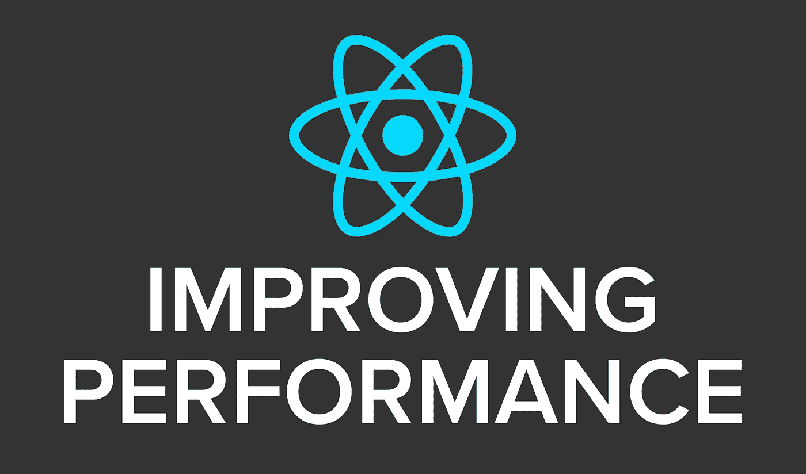

# 使用钩子提高 React.js 的性能

> 原文：<https://betterprogramming.pub/improve-performance-in-react-js-using-hooks-3d0ebbad6956>

## 了解 useCallback 和 useMemo 的威力

在开发 React 应用程序时，有时您需要开始考虑如何优化性能。对于一些较小的、不太复杂的应用程序，性能可能永远不会成为问题。但是对于绝大多数中到大规模的 React 应用程序来说，缓慢的性能可能是一个严重的问题。让我们深入讨论一下可能会降低应用程序性能的最常见场景。

React 性能缓慢有两个主要原因——不必要的重新渲染和在组件中做太多(计算)工作。我将讨论如何使用直接由 React 提供的钩子来减轻这些问题。

# 不必要的重新渲染

当组件的属性或状态发生变化时，这将自动触发该组件的重新渲染。这通常是好的，并且是 React 如何工作的基础！然而，有时我们可以比 React 更聪明，当我们知道输出将完全相同时，阻止组件重新呈现。

这些重新呈现的一个常见原因是向组件传递了新的函数。这实际上经常发生，很容易被忽略。

当需要向函数传递额外的数据时，这是许多开发人员决定使用的一种常见的“解决方案”。但是每次`DropdownContainer`渲染，`Dropdown`也会重新渲染，因为作为`handleItemClick`道具传入的匿名函数每次都会重新构建，并触发道具变化。在很多情况下，这种重新渲染很可能是不必要的，因为这不一定意味着任何数据——我们想要重新渲染`Dropdown`的数据——实际上已经改变。

解决这个问题最简单的方法就是使用`useCallback`钩子。这个钩子将 [*记忆*](https://codeburst.io/understanding-memoization-in-3-minutes-2e58daf33a19) 你的函数，并且只在它的一个依赖关系改变时重建一个新的。让我们来看看更新后的示例:

因为除非`data`或`onClick`改变，否则不会重新构建功能，所以`Dropdown`组件将不再进行不必要的重新渲染。

# 昂贵的计算

React 性能差的另一个常见原因是在组件中执行了太多的工作。当您需要在 React 组件中处理一些需要大量数据操作和/或计算量很大的问题时，您可能会希望使用`useMemo`钩子。这个钩子只是接受一个函数，这个函数返回一个值，这个值将被自动重新计算，并在其中一个依赖关系改变时触发重新呈现。让我们来看一个例子:

通过使用`useMemo`,我们可以避免在每次渲染组件时计算昂贵的值，只在必要时重新计算值。

# 最后

我希望这篇文章和使用这两个简单的钩子可以帮助你提高 React 应用程序的性能。如果您有任何问题或建议，请随时留下您的回复，我会尽全力帮助您的！