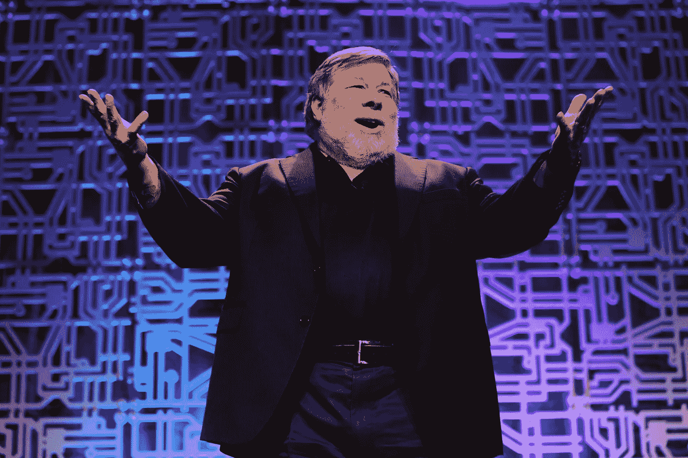

# 像史蒂夫·沃兹尼亚克一样创新

> 原文：<https://betterprogramming.pub/innovate-like-steve-wozniak-8fca7a86c4e9>

## 每个开发人员都可以从苹果传奇的创始工程师身上学到很多东西

在 [Flickr](https://www.flickr.com/) 上由 [Gabe Skidmore](https://www.flickr.com/photos/gageskidmore/) 拍摄的照片。

# 传奇工程师的诞生

如果没有史蒂夫“沃兹”沃兹尼亚克，这个世界将永远无法欣赏苹果公司的技术成果，这些成果彻底改变了个人电脑(Apple I/Apple II)、我们听音乐的方式(iPod)和我们交流的方式(iPhone)。许多人讨厌苹果产品的独特性，但他们需要意识到的是，在我所知的公司中，没有一家公司像苹果公司那样，通过在上述所有途径上领先，对计算世界做出了更大的贡献。这样，我们应该感谢他们，因为我们口袋里和家里都有电脑。

现在值得注意的是，如果没有两位伟大的头脑在一个车库里聚在一起，产生了我们今天所知道和喜爱的苹果公司的大脑产物——史蒂夫·乔布斯和史蒂夫·沃兹尼亚克，苹果的愿景就不会实现。

每个人都喜欢给史蒂夫·乔布斯贴上苹果成功背后的唯一天才的标签，但如果没有这位让个人电脑成为现实的杰出工程师，苹果公司根本不会起步。沃兹创造了原型技术，为乔布斯带来了愿景。

从这个角度来看，沃兹的创新天才造就了个人电脑的当代状态，就像我们今天看到的那样，他发明了苹果一代和二代。在计算机科学和技术领域，沃兹现在被认为是一个传奇。

所有的工程师和商业领袖都在寻找如何持续地、有意识地创新和创造前沿技术、产品和功能，看看沃兹对待创造力和创新的方式就知道了。

对于我们开发人员来说，我们应该做详细的笔记，以便在我们的日常工作流程中产生尽可能多的价值，以匹配他的创作实践。

# 学会为了热爱建筑而热爱建筑

当创新和创造时，我们总是试图简单地让事情运转起来，为别人创造某种价值。我们很少停下来问自己，为什么我们正在创建和维护的东西对我们很重要。

沃兹年轻时的大部分时间都在探索和摆弄电脑。他热爱自己的手艺，并独自为自己创立了每一家公司和每一件产品。

> “我的目标不是赚很多钱。那就是制造好的电脑。”— [史蒂夫·沃兹尼亚克](https://www.quotenova.net/authors/steve-wozniak/qb6vvm)

他非常专注于工艺和创造过程，为了让计算机在工程设计和编程能力方面工作良好，他经常迷失在解决这种技术难题中。他为自己制定了一个原则，总是做一些对他来说有趣的事情，这些事情会给他的生活和单独的生活带来快乐和满足——只建造他可以想象自己会使用的东西。

这就是为什么当你在编程和发明时，你应该停止如此努力地关注其他人会如何接受它。通过这样做，你会让你的头脑如此专注于你正在创造的完美，以至于你可能会忘记你最初为什么开始建造，迷失在复杂的纠结中去得到一些工作。更糟糕的是，你可能会削弱需求，构建出一些不太实际的东西，仅仅是因为你对你正在组装的东西没有热情。这可能会导致你添加一些你认为你的受众想要但并不特别需要的功能，或者让你看起来对你正在做的工作不太可靠。

要真正了解观众想要什么，并让自己在别人眼中变得有价值，你必须先问问自己想要什么。

*   你希望如何与你正在建造的东西互动？
*   你正在构建的东西将如何为你提供价值？
*   你会喜欢与你正在开发的技术互动吗？
*   你对项目的最终目标是否有足够的热情，以至于你被一种内在的驱动力所控制，去反复创造一些实质性的东西？

如果你为自己建造，你会发现创新成为你日常工作流程的副作用。

> “最初的苹果之所以行得通，是因为沃兹尼亚克是为自己设计的。最初的 iPhone 之所以能用，是因为乔布斯是为自己设计的。沃兹尼亚克目前迷恋的品牌特斯拉(Tesla)是创始人埃隆马斯克(Elon Musk)制造的产品的又一个例子，而不是大众产品。“伟大的产品就是这样设计出来的，”沃兹尼亚克说。—[x 元组](https://www.xtuple.com/blog/technology-strategies-words-from-woz-on-innovation)

# 专注于把小事做好

完美是梦想杀手，试图从一开始就建立完美的东西会以这样或那样的方式导致复杂化。简单地开始并扩展。

当给定一组需求并接近一个广泛的目标时，您可能会发现在组织您构建的功能背后的设计和架构时遇到了困难。

沃兹强调，接近一个宽泛的目标是非常困难的，因为一个简单的事实是，你会带着成百上千的不同想法去完成一项任务，只是为了让它达到一个特定的点。这导致您构建了一大堆可能有效但效果很差的特性。他反思了自己过去的错误，说道:

> “我学会了不要太担心结果，而是专注于我正在走的那一步，并在做的时候尽可能完美地完成它。”

沃兹并不是一夜之间就造出了个人电脑。他最初只是在一个电脑俱乐部里做了一块简单的电路板。他从一个非常小的东西开始，没有人能够意识到他所创造的东西的潜力。

相反，他恳求你把事情简单化，把你的想法浓缩成能非常好地做 20 件甚至 5 件事情的东西。这样，你就不用那么关注了，这反过来让你专注于从那些微小的功能中创造最大的价值。

作为一名开发人员，要知道你应该总是从小处着手，简单地开始。不考虑这一点的建设不仅会减慢你的进度，还会破坏你为规模和优化而创新的能力。构建一些有用的东西，并在此基础上慢慢扩展和改进这些功能——就像你在逐步拼凑一个拼图，并为更大的东西打下基础。

> “你的第一个项目并不是世界上最伟大的事情，它们可能没有金钱价值，它们可能不会有任何结果，但这就是你学习的方式——如果是为了自己，你会付出如此多的努力去做正确的事情。”— [史蒂夫·沃兹尼亚克](https://www.quotepub.com/quote/steve-wozniak-your-first-projects-arent-the-greatest-things-in-the-world-and-they-may-have/)

# 重构，直到你完美地锁定眼睛

完美是通过对相同的功能和设计进行多次迭代，经过长时间的锻造而成的。无论您构建什么，都要记住这一点，并采用前面提到的简单性和自我激励开发的原则来驱动原型状态下的可工作特性的发明。

没有一个开发人员能够在第一次尝试中写出最好的代码和最佳的特性——不管你有多聪明。沃兹说，你必须抱着总能做得更好的心态来对待你所做的一切。

是的，你完成的功能可能有用，但这真的是最好的方法吗？这是最佳的、可扩展的、用户友好的方法吗？

沃兹强调，唯一真正的创新之路是努力积极思考解决老问题的新方法——看看我们现有的东西，告诉自己它可以改进。

这可以通过在每次迭代结束时他提供给我们的这些问题[来启动你的方法来实现:](https://www.youtube.com/watch?v=FfbM7kfnYr4&list=PLjLRzor6A9-NMKoDfuT90Nf8Fl1PYlNhD&index=8&ab_channel=CGTNAmerica)

*   我怎样才能做得更好？
*   我怎样才能让它变得如此完美，几乎比任何人都好？
*   我能缩短代码吗？
*   我能给它一个更好的结构吗？
*   我可以改进用户界面吗？
*   是否缺少一些基本功能？
*   我能重做什么？

总是问自己这些问题，你会发现自己拼凑出惊人的应用程序。

在这个阶段，真正的创新发生了——神奇的事情发生在你(或其他人)已经完成的事情的不断改进和完善中。在这个阶段，你可以开始关注你的观众，用你创造的东西给他们的生活注入价值。

> “如果我用 200 个芯片设计一台电脑，我试着用 150 个来设计。然后我会试着用 100 来设计它。我只是试图找到生活中我能找到的每一个小技巧来设计非常小的东西。”— [史蒂夫·沃兹尼亚克](https://www.quoteslyfe.com/quote/If-I-designed-a-computer-with-200-314401)

# 你应该带的东西

作为一名开发人员，您可能最喜欢有机会不断构建和发明新事物。我们毕竟是发明家、建筑商和工程师。我们的创新能力与我们创造最大价值的能力在同一个范围内浮动。

你不必建立一个新公司，从事你自己的副业项目，或者成为一个孤星开发者来实现这些事情。相反，我们每天都可以像史蒂夫·沃兹尼亚克一样创新。

要像他那样创新和发明，我们只需在我们的日常工作流程中采用他的思维方式和方法——无论你是雇员、自由职业者还是企业家。

只需遵循这三个原则，你就会前所未有地创新:

1.  如果你把自己想象成一个用户，你可以用最有价值的方式为自己开发和编程。
2.  专注于小事，并把它们做得很好。将注意力从任何不可告人的动机上转移开，将注意力集中在建设的过程上。
3.  提炼、改进和重申，才能真正创新。创新只不过是同一事物的一系列不同版本——比以前更新、改进、更闪亮。