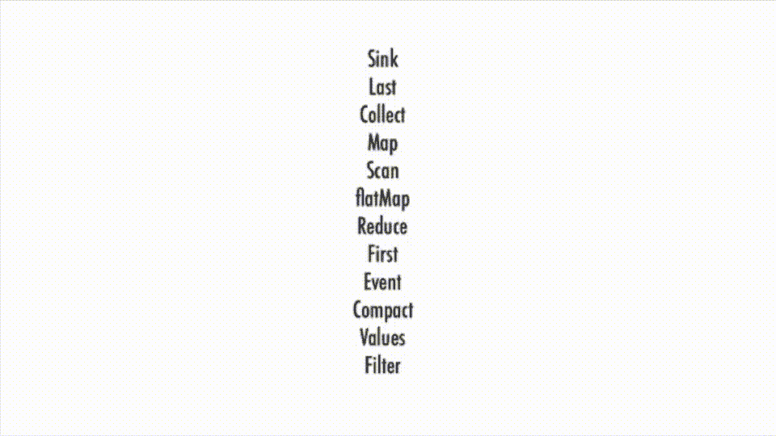

# 在 SwiftUI 中集成联合收割机

> 原文：<https://betterprogramming.pub/integrating-combine-in-swiftui-f3ffa2e170ba>

## 在 SwiftUI 代码中直接使用消费者和操作者

作者 GIF。

当苹果推出 SwiftUI 时，他们还加入了第二个没有得到太多关注的框架:Combine，苹果将该框架描述为“一个统一的、声明式的 API，用于随时间处理值”

也就是说，声明式编码进入 Swift 已经有一段时间了。这方面的一个很好的例子是 2018 年的一个演示，它仍然是近年来 WWDCs 中最好的通用演示之一。在这次演讲中，戴夫·亚伯拉罕斯向我们讲述了拥抱算法。

 [## 有史以来最好的苹果 WWDC 演讲

### 回顾我认为是最好的 WWDC 会谈之一

marklucking.medium.com](https://marklucking.medium.com/the-best-apple-wwdc-talk-ever-16d613815f86) 

但是等等，这不是一个关于反应式编码的演示，对吗？不，这是一个关于使用正确算法的演示。在本例中，Dave 的目标是对一组形状进行排序。他回顾了他用代码解决问题的步骤。最终导致他使用反应式编码的修正，就像我们今天要讨论的那样。

# **组合框架**

让我们来关注一下联合收割机。它包含发布者、订阅者和操作者。发布者发送数据，订阅者消费数据，运营商是中间人。虽然您可以通过观察和发布的对象将这些集成到 SwiftUI 中，但是您也可以使用一个名为 subjects 的功能。

主题在全局中很重要，因为它们发布了运营商可以使用并最终传递给订户的数据。在 Combine 框架中，有两种类型的主题:

*   `PassthroughSubject` — 一个空的管道，可以通过它发送数据。
*   `CurrentValueSubject`**——**同一个东西有一个默认值。****

****您可以使用`.onreceive`视图修饰符在 SwiftUI 中捕获主题发送的数据，除此之外，您还可以使用许多操作符来处理数据，然后将其传递给订户。如果你有系统背景，这个想法可能会开始变得熟悉。在系统编程中，您使用管道字符始终将数据从一个实用程序发送到下一个实用程序。Combine 框架使用相同的原理。****

****se 已经写了一些关于使用新框架的书。这里有很多东西需要消化——对于一篇单独的文章来说实在太多了——所以这里有十几个用代码详细描述的操作。我在最后分享了我的研究，如果你现在想知道更多的话。如果你能等的话，我打算以后再发表几篇关于这个主题的文章。****

****让我们开始吧。****

****这里显示的`"sink”`操作符消耗数据和任何错误。当它这样做时，我打印出它获得的数据(在本例中是`“foobar”`):****

****`"last”`操作符读取我们的行星列表，并返回最后发送的一个。在这种情况下，它将返回`“mercury”`:****

****`“collect”`操作符接受来自发布者的数据，直到它得到这里显示的数字(`4`)。然后将它传递给订户。在这种情况下，订阅者得到(`0,1,2,3`)，然后是(`4,5,6,7`)，最后是(`8`)。这是该运算符的几个选项之一。****

****你可能以前见过`“map”`。这将发布的数据类型转换为新的指定类型。这很重要，因为数据和错误的类型必须与发布者和订阅者相匹配。****

****`“scan”`操作符接受数据，在我们的例子中，在将它们传递给订阅者之前，将最后两个接收到的数据加在一起。所以结果就是序列`0 1 3 6 10 15 21 28`。走过这个，你得到`0, 0` + `1, 1` + `2, 3` + `3, 6` + `4`等等。****

****`“output”`运算符返回代码中指定位置的元素。在这种情况下，我们得到`“2416”`:****

****`“reduce”`运算符返回一个字符串(在本例中为`“abcdef”`)。基本上，它将所有数据作为一个单元返回:****

****`“first”`操作符很像我已经提到过的它的表亲`“last”`。它将返回流中发送的第一个元素，并丢弃其他元素。在这种情况下，我们得到`“mars”`:****

****`“event”`操作符有点不寻常，因为我们忽略了这里的数据，只是在它安静下来时通知订户。****

****`“compact”`操作符将测试传入的数据(这里，我们寻找整数),只传递那些通过验证的数据，丢弃其他的。在这种情况下，我们得到`[1,2,4,8]`:****

****`removeDuplicates()`操作符基本上删除了发布者发送的相邻重复项。在这种情况下，我们得到了`1`、`2`、`3`、`4`、`8`、`9`和`10`。如果您发送相同的值，但顺序不同(例如，如果您在`3`和`4`之间发送一个`1`，则值通过。****

****注意，这个操作符对于那些使用 subjectss 的人来说非常有用，subject 有时会神秘地触发多次。****

****我在这里要提到的最后一个运算符`“filter”`，超级有用。在这个例子中，我在寻找包含字母`“a”`的行星。所以我们得到了一个结果`“Earth”`、`“Mars”`、`“Saturn”`和`“Uranus”`:****

****这就把我带到了这篇相当长的文章的结尾。我相信你可以看到一种模式正在形成。我在几乎所有的例子中都使用了`sink`来消费数据，使用`store`来通知订阅。****

****关于这个主题的进一步阅读，我推荐 Joe Heck 的这篇文章。还有蒂博尔·博德斯的[一篇更长的文章](https://theswiftdev.com/the-ultimate-combine-framework-tutorial-in-swift/)和另一位媒体作家[艾哈迈德·纳赛尔](https://medium.com/@ahmednasser_43518?source=post_page-----2a4d770a138c--------------------------------)的[另一篇](https://medium.com/swlh/integrating-apple-combine-framework-into-an-exciting-ios-project-2a4d770a138c)。****

****保持冷静，继续编码。****