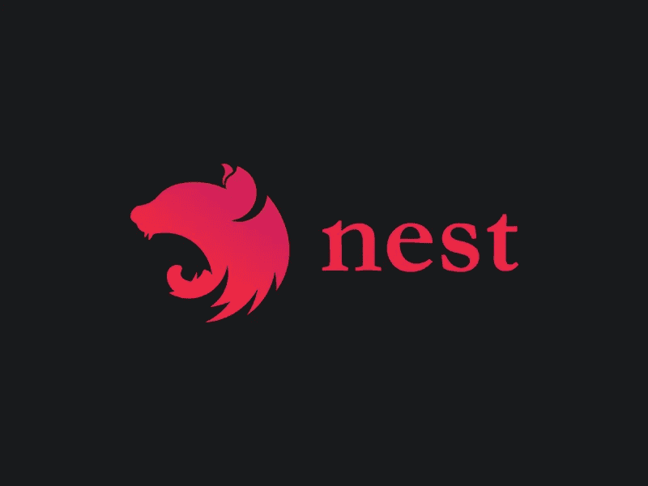

# NestJS 服务介绍

> 原文：<https://betterprogramming.pub/introduction-to-nestjs-services-2a7c9a629da9>

## 我们如何在 NestJS 中使用服务



NestJS 标志

# 服务

在企业应用中，我们遵循稳固原则，其中 S 代表*单一责任*。

控制器负责接受来自客户端的 HTTP 请求并提供响应。为了提供响应，您可能需要连接到一些外部数据源。

如果我们添加代码来连接内部的外部源，我们就没有遵循单一责任原则。

为了避免这个问题，您使用服务，它将负责提供一些数据，这些数据可以在整个应用程序中重用。它还可以保存一些验证逻辑或验证用户的逻辑。

# 创建和使用服务

在 [NestJS](https://nestjs.com/) 中可以创建两种类型的服务:

*   基于类的提供程序
*   非基于类的提供程序

注意:如果你来自 Angular，很有可能你已经知道这些概念。

## 基于类的提供程序

要创建基于类的提供程序，我们可以使用下面的 CLI 命令，该命令将在产品文件夹中创建服务。

```
nest generate service product
```

在产品文件夹中，您会找到两个文件:

*   `product.service.ts`(用于逻辑。)
*   `product.service.spec.ts`(用于单元测试。)

您最终可能会为一个特性使用多个服务，甚至是多种类型的提供者。

## 使用基于类的提供程序

现在打开`product.service.ts`文件并添加下面的代码，我们将把一些代码从`ProductController`移到`ProductService`。

现在服务准备就绪，打开`product.controller.ts`并进行以下更改。

这里使用`ProductService`的方式被称为[依赖注入](https://en.wikipedia.org/wiki/Dependency_injection)。

像控制器一样，服务也需要注册，CLI 为我们完成了这项工作，您可以通过将它添加到模块的`providers`数组中来手动完成这项工作。

```
providers: [AppService, ProductService]
```

还有更多关于基于类的服务，我们将在接下来的文章中介绍。

## 非基于类的提供程序

我们还可以创建一个不是基于类的服务。有两种类型:

*   令牌:我们可以使用字符串值作为令牌。
*   工厂:当我们的一个服务需要来自另一个服务的一些数据时，工厂很有用。

## 创建令牌

您可以创建一个注入令牌来用作服务，为此，在产品文件夹中创建一个新文件`product.token.ts`并添加以下代码:

现在打开`app.module.ts`并使用`providers`属性注册令牌。

```
import { PRODUCT, Product_Token } from './product/product.token';providers: [
{
    provide : PRODUCT,
    useValue: Product_Token
}]
```

接下来，打开`product.service.ts`，让我们使用这个令牌并添加下面的代码。这只是为了演示的目的，在实时应用程序中我们可能要使用这个值。

```
import { Injectable, Inject } from '@nestjs/common';
import { PRODUCT, Product } from './product.token';constructor(@Inject(PRODUCT) product: Product) 
{
    console.log(product.endPoint);
}
```

一旦使用该值运行应用程序，`endPoint`将被记录在控制台上。

## 使用工厂

工厂是另一种类型的提供者，可用于非常特殊的用例。

一般来说，当我们提供一个服务时，它们是在模块被加载时被解析的，但是可能有些情况下我们需要动态地创建实例，这就是我们需要工厂的地方。

例如，获取数据库连接，以便客户端在运行时决定连接到哪个数据库。

运行以下命令创建两个服务:

```
nest generate service dbprovider
nest generate service client
```

在`client.service.ts`中添加以下代码。

接下来，打开`dbprovider.service.ts`并添加下面的代码。

在`dbprovider.service.ts`中，我们使用了一个字符串属性，如果你试图运行这个应用程序，你会得到错误，因为这是不允许的。

我们想在运行时创建`DbproviderService`的实例，所以我们需要再做一个修改。打开`app.module.ts`并从`providers`属性中移除`DbproviderService`。

Nest 让我们创建工厂，创建新文件`connection.provider.ts`，并添加下面的代码。

这里我们通过从`ClientService`获取`db`来创建一个`DbproviderService`的新实例。您可以在这里使用多个服务，您只需要在`useFactory`中以逗号分隔的方式传递它们，并且需要在`inject`属性中添加相同的服务。

现在我们完成了工厂，让我们注册并使用它。打开`app.module.ts`，在`providers`属性中添加`dbConnectionFactory`。

接下来，打开`product.service.ts`并添加以下代码。

```
constructor(@Inject(PRODUCT) product: Product,
    **@Inject('ClientConnection') dbProviderService: DbproviderService**){
    console.log(product.endPoint);
    **console.log(dbProviderService.getProductsForClient())**
}
```

# 结论

我们学习了如何在 NestJS 中创建和使用不同类型的提供者，我们使用了依赖注入设计模式来使用服务，这也让您可以实现单一责任。

服务是单一的，但是我们也可以控制服务的范围，这将在下一篇文章中看到。