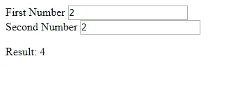

# 网络工作者简介

> 原文：<https://betterprogramming.pub/introduction-to-web-workers-6ba4385e983e>

## 怎样才能在后台运行长时间运行的任务而不影响性能？


[马特·霍华德](https://unsplash.com/@thematthoward?utm_source=unsplash&utm_medium=referral&utm_content=creditCopyText)在 [Unsplash](https://unsplash.com/s/photos/long?utm_source=unsplash&utm_medium=referral&utm_content=creditCopyText) 上的照片

要运行需要很长时间才能完成的任务，我们需要一种在后台运行它们的方法。

网络工作者是实现这一目标的途径。它们存在于浏览器中自己的上下文中。因此，它们没有访问 DOM 的权限，只有自己的全局变量`self`。

web worker 不能访问`window`对象，但是我们仍然使用许多属于它的东西，比如 [WebSockets](https://developer.mozilla.org/en-US/docs/Web/API/WebSockets_API) 和 [IndexedDB](https://developer.mozilla.org/en/docs/Web/API/IndexedDB_API) 。

在本文中，我们将研究如何创建一个基本的 web worker，它可以在 worker 和其他脚本之间发送消息。

# 网络工作者的特征

网络工作者允许我们在他们和其他脚本之间发送消息。非工作脚本可以通过附加消息处理程序来侦听工作脚本发出的消息。

要发送消息，我们使用`postMessage()`方法。可以通过`Message`事件的数据属性访问该消息。`Message`事件对象被传递到`onmessage`处理程序的事件处理程序中。

工作线程可以产生新的工作线程，只要它们与父页面驻留在同一原点。工作者也可以使用`XmlHttpRequest`进行网络 I.O，除了`XMLHttpRequest`上的`responseXML`和`channel`属性总是返回`null`。

除了敬业的员工，还有其他类型的员工:

*   共享工作者是可以被不同窗口、IFrames 等中的多个脚本使用的工作者，只要它们与工作者在同一个域中。它们比专用工作器更复杂，因为脚本必须通过活动端口进行通信。
*   服务工作者充当 web 应用程序、浏览器和网络之间的代理服务。它们旨在创造有效的离线体验。它们拦截网络请求，并根据网络是否可用采取适当的行动。
*   Chrome workers 是一种 Firefox 专用的 worker 类型，我们可以在开发附加组件时使用，并希望在扩展中使用 worker。
*   音频工作者提供了在 web 工作者上下文中指导脚本化音频处理的能力。


照片由[大卫·西格林](https://unsplash.com/@dsiglin?utm_source=medium&utm_medium=referral)在 [Unsplash](https://unsplash.com?utm_source=medium&utm_medium=referral) 拍摄

# 创建一个简单的专用工人

我们可以通过创建一个简单的 worker 脚本来创建一个专用的 worker，然后让其他脚本与之通信。

例如，我们可以创建一个专门的 worker，它从两个输入中获取值，然后通过将它们相加并将其发送回屏幕来计算结果。

首先，我们创建 HTML 来获取输入值，如下所示:

然后，在`main.js`中，我们将`keyup`事件处理程序添加到输入中，以将值发送给我们的专用工作器，如下所示:

我们还添加了`onmessage`事件处理程序来接收来自 worker 的消息，在下面的代码中，我们将把它添加到`worker.js`中来从它那里获取消息:

```
worker.onmessage = e => {
  result.textContent = e.data;
};
```

最后，我们在`worker.js`中创建工人代码如下:

上面的代码从`main.js`获取消息，我们在这里调用了`postMessage`。我们传递给`postMessage`的任何东西都将在`e`参数中，我们可以从那里获得数据。

然后，在这个文件中，我们在函数的第一行用`data`属性得到我们传入的两个数字。

然后，我们检查两个数字是否都是数字，如果是，我们将它们相加，然后在计算总和并将结果放入`workerResult`字符串后，用`postMessage`将总和发送回`main.js`。

最终，我们应该会得到如下结果:



只要专用的 worker 脚本与我们的其他脚本在同一个域中，它就会运行。

`Worker`构造函数还接受一个选项对象，该对象包含以下选项:

*   `type`:指定要创建的工作者类型的字符串。该值可以是`classic`或`module`，默认为`classic`。
*   `credentials`:指定工作者使用的凭证类型的字符串。该值可以是`omit`(不需要凭证)、`same-origin`或`include`。如果没有指定，`type`为`class`，则默认为`omit`。
*   `name`:指定`DedicatedWorkerGlobalScope`的标识名的字符串，代表工作器的范围。主要用于调试。

如果不允许启动 workers，比如 URL 无效或者违反了同源策略，构造函数将抛出一个`SecurityError`。

*   如果工作脚本的 MIME 类型不正确，将引发`NetworkError`。
*   `SyntaxError`引发的是工作者的 URL 无法解析。

培养敬业的员工很简单。他们让我们运行后台任务。workers 和其他脚本之间的通信是通过来回发送消息来实现的。

Web 工作者有他们自己的上下文，所以他们不能使用`window`对象或访问 DOM。