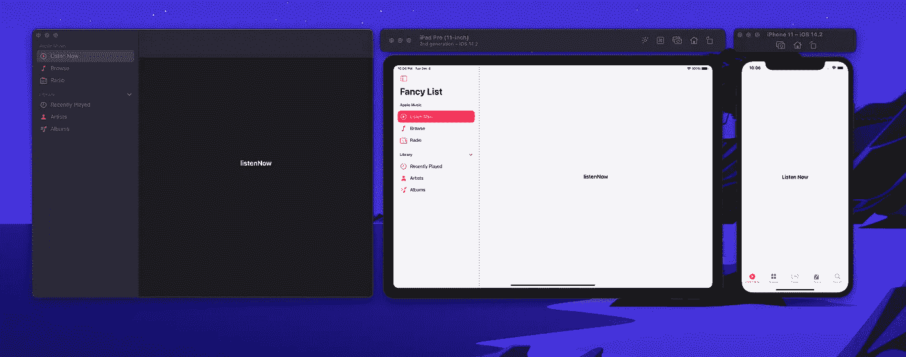
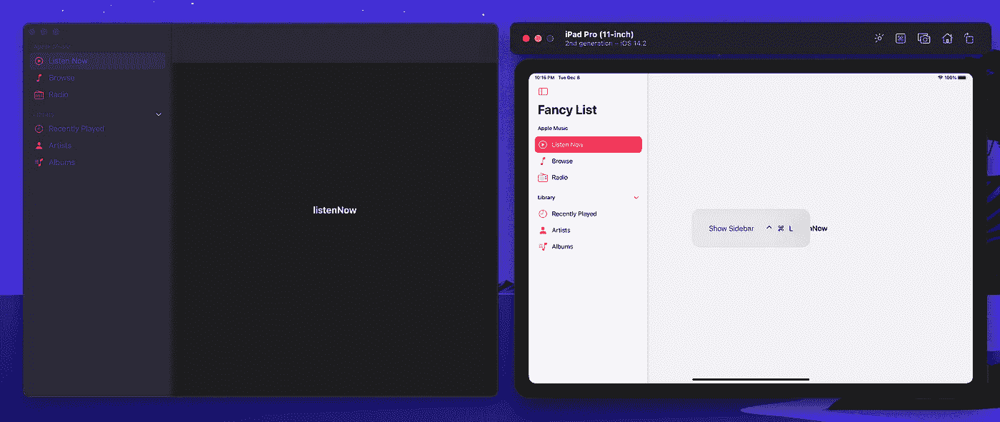
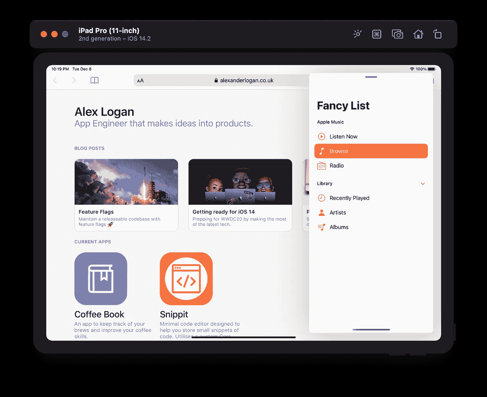
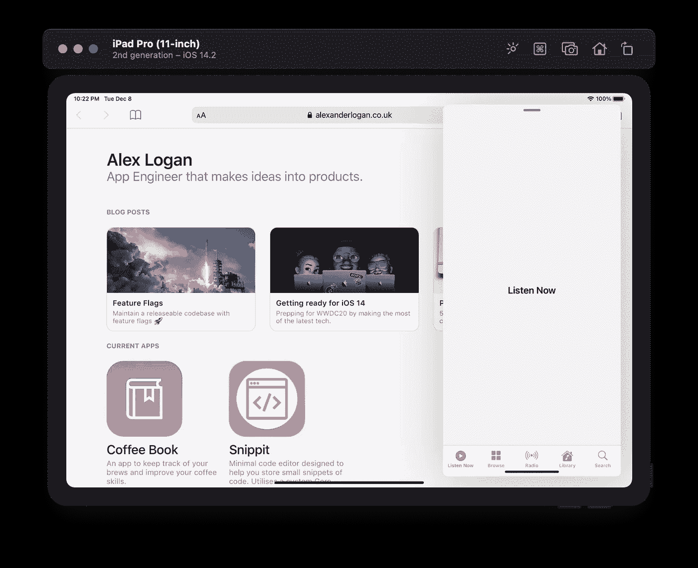

# iOS 14 和大苏尔导航

> 原文：<https://betterprogramming.pub/ios-14-and-big-sur-navigation-ae11a7efdf29>

## 在现代苹果生态系统中使用侧边栏和标签栏进行主导航


奥利尔在 [Unsplash](https://unsplash.com/s/photos/iphone-and-ipad?utm_source=unsplash&utm_medium=referral&utm_content=creditCopyText) 上拍摄的照片

WWDC20 的突出趋势之一是在 iPad OS 中添加了侧边栏，这让人想起了 Mac 上的侧边栏。这些提供了一种更好的使用 iPad 空间的方式，感觉比标签栏好得多。凭借根据上下文显示和隐藏侧边栏的能力，您可以创建出色的导航并最大限度地利用屏幕空间，而不会失去 iPhone 的任何便利性。

# 最终产品



在 iPhone、iPad 和 Mac 上运行的应用程序


这款应用在紧凑的多任务处理中的外观

在这里，我们可以看到我们要创建的实际最终产品。如果不想看文章，直接跳到最后，从 GitHub 抓取代码。

我们在 Mac 和 iPad 上有侧边栏，在 iPhone 和紧凑型 iPad 上有标签栏多任务大小。当在侧边栏中选择一个项目时，导航会像您预期的那样工作，并且标签栏在 iPhone 上的行为与往常一样。当您调整应用程序大小时，它会自动重新绘制到正确的导航状态。

# 开始

我们不会直接跳到 UI，因为首先我们需要对侧边栏建模。为此，我们需要几个对象。

首先，我们的标识符。这些是最简单的，只是一个枚举。

接下来，我们需要一种区分项目类型的方法。我们将拥有标题、可扩展/可折叠标题和标准行。枚举也非常适合这种情况。

最后，我们需要实际定义一个项目的模型。这将需要与所有三种类型的项目类型兼容，这意味着它可能有也可能没有图像和项目标识符，但它将始终有一个标题。我们还将保留一个对类型的引用，以备后用。

这允许我们使用一个 section 对象来建模我们的侧边栏，这可以使以后的事情更加整洁。

# 设置侧栏

侧边栏本身非常简单，只是一个带有特殊数据源和列表布局的集合视图。这几乎是今年的所有新功能，因此我们将逐一介绍每个步骤并解释其工作原理。

首先创建一个带有私有扩展的空白视图控制器，如下所示。我们将把我们所有的集合视图设置放在那个私有扩展中，这样它就不会暴露在任何其他地方。

我们需要几个变量来开始我们的布局和显示项目，它们是集合视图、数据源本身和对我们的部分的引用。

这里的部分只是我们之前的`FancyListSection`中的静态变量，配置成看起来像 Apple Music 的侧边栏。现在，您可能需要更改这些内容以匹配您的应用程序。存储对这些的引用，让我们可以做一些非常简单的事情。

视图控制器的其余部分只是样板文件，但是值得一看，以显示侧栏的重要部分。不要担心实际上还不存在的功能——我们将在下一节中填充它们。

这里只需要指出两件事，其余的都是标准的:

*   在`setupCollectionView`中，我们使用一个外观设置为`sidebar`的`UICollectionLayoutListConfiguration`，我们将标题模式设置为`firstItemInSection`。这为我们处理了列表的布局，并将每一部分中的第一项视为标题——所以要小心确保每一部分都有标题，否则可能会出现一些奇怪的行为。
*   此外，还做了一些改动，让它在 Mac 上看起来更自然。大多数 macOS 侧边栏没有导航标题，所以我们应该隐藏它们。我们还将背景颜色设置为`clear`。这意味着我们可以在 split view 控制器中使用侧边栏背景样式来获得侧边栏适当的本机外观。

# 数据源

接下来，我们将构建数据源。我们将自下而上构建它，从每种细胞类型开始，然后向上移动到更大的来源本身。

选择的数据源是`UICollectionViewDiffableDataSource`和几个`UICollectionView.CellRegistration`，让我们从一些细胞注册开始。

单元注册为我们提供了一种通过闭包配置单元的简单方法，闭包提供了条目、索引路径和单元本身。我们只是配置我们需要的。

我们将结合一个单元注册和一个`UIContentConfiguration`以最小配置构建不同类型的单元。我们需要一个标题和行的配置，这两个都已经可用了。

我们的第一个注册是标准行。将以下功能添加到您的私人分机中。

我们正在返回一个`UICollectionView.CellRegistration<UICollectionViewListCell,FancyListITem>`。这意味着当我们调用它时，单元注册将期待一个`FancyListItem`，在闭包中，我们将得到它。

我们使用预制的`UIListContentConfiguration.sidebarCell()`创建一个内容配置。这为侧边栏行设置了完美的一切。当我们使用这个配置的文本和图像属性时，它们将完全按照您在侧边栏中所期望的方式显示。

这就是我们设置侧边栏单元格所需要做的一切！

我们只需对我们的标题单元格重复这个过程，只需做很少的更改。

这里我们使用了非常相似的东西，但是内容配置不同。字体被覆盖以更好地匹配 Apple music 示例，但是如果您愿意，可以保留这个标准。

在我们的可扩展注册中，我们可以看到内容配置的附件功能，这允许我们显示类似于公开指示器的内容，或者在本例中，显示大纲公开。大纲显示是一个特殊的附件，允许用户点击它并展开标题所在的部分。

现在我们有了这些，我们实际上可以制作我们的数据源。有了我们刚刚完成的新注册，代码就变得很简单了。

我们完全按照您的期望创建数据源，并使用新的`dequeueConfiguredReusableCell`选项。我们在数据源中所要做的就是切换条目类型，这是我们之前在模型中配置的，并调用新的`dequeue`函数。我们使用开关，这样我们可以通过正确的注册，但我们不必做任何其他事情，因为我们的`FancyListItem`类型足够智能，可以为所有三行类型工作。

接下来，让我们实际添加数据。

还记得之前那部分的属性吗？它将允许我们只需几行代码就可以向列表中添加数据。我们这样做的方式也是面向未来的，允许我们在以后添加更多的节和更多的行，只需将它们放在节的属性中。

下面是实现这一点的代码。你可能以前没见过这些快照，但它们非常有用。我们不使用普通的数据源快照，而是使用节快照。我们添加标题，然后在标题下添加我们想要的项目，最后调用`expand`来确保该部分可见。

如果您不展开没有大纲显示的部分，用户将无法看到它的内容。对于带有大纲显示的部分，用户可以随意打开和关闭它。

# 代表

由于我们刚刚使用了相同的 section 属性，我们的委托变得轻而易举。我们为代理定义了一个协议，该协议将传递一个项目标识符，并在视图控制器中调用该代理。

确保向视图控制器添加一个变量，我们可以在以后填充它。

现在我们需要遵守`UICollectionViewDelegate`并确保我们安全地调用我们的代表。在这里，我们可以获取相关的部分，并安全地检查标识符。请注意，我们使用的是`indexPath.row-1`，而不仅仅是`indexPath.row`。这是为了说明第一项总是标题这一事实。

# 构建导航堆栈

我们有一个填充了数据的侧边栏。现在我们只需要创建一个拆分视图来托管它并响应它的回调。

这不完全是最佳实践，但是我们将在`SceneDelegate`中直接实现侧边栏委托。一旦你掌握了这一点，你可以很容易地把它迁移到其他地方，比如一个`SidebarCoordinator`。

我们再次没有做任何不寻常的事情，但是我们已经为 Mac 做了一点小小的改变。

*   我们设置了一个双栏风格的拆分视图，这将使侧边栏能够根据用户手势或点击自动生成的侧边栏按钮来打开和关闭。
*   我们已经为主视图和次视图设置了视图控制器，次视图是从`FancyListItemIdentifier`构建的一个简单的占位符。

不要担心占位符，它只是一个非常简单的视图控制器，用来证明导航是有效的。所有代码如下。

我们现在要做的就是遵守我们的列表委托，我们就可以使用 iPad 和 Mac 了。

在场景委托的底部添加一个符合`FancyListViewControllerDelegate`的扩展。这里我们有一个基本的实现，它调用上面的函数来创建一个占位符，然后将其设置为辅助视图控制器。在您的应用程序中，这是您获取正确视图控制器的地方。

在 iPad 和 Mac 上运行该应用程序，你会看到以下内容——万岁！



它看起来很棒，你甚至可以看到键盘快捷键在 iPad 上可用。但是我们还有另一种情况要处理:多任务处理。



当我们进入紧凑的多任务处理时，我们最终得到的是一个每次触摸都不起作用的列表。我们必须对此采取措施，幸运的是，解决方案非常简单。

# 处理小型设备

当你使用紧凑型设备时，你通常会期望一个标签栏，这正是我们现在要添加的。添加标签栏的功能非常简单——我们实际上已经使用过了！

```
splitViewController.setViewController(FancyTabBarController(), for: .compact)
```

不幸的是，我们不得不独立地实现标签栏和它的导航堆栈，但这对于在所有设备上获得良好的用户体验来说是很小的代价。我已经创建了一个基本的`FancyTabBarController`，但是你应该以你认为最好的方式实现它。

当我们实现这个的时候，一旦我们的 size 类变成了 horizontal，我们就会得到一个 tab 栏。修正了上面的例子，给出了下面的例子。



就是这样！

我们现在在所有平台上都有一个最佳的导航系统，只需要最少的工作。接下来的步骤是用一组真正的视图控制器替换掉`viewController(for itemIdentifier:)`函数的内容，但这完全取决于您！

当然，这里是[示例代码。](https://github.com/SwiftyAlex/sidebar-sample)