# 用一个示例 iOS 应用程序构建您的 Cocoapods 框架

> 原文：<https://betterprogramming.pub/ios-build-your-cocoapods-framework-with-an-example-app-from-scratch-fd0f7bdf3f8c>


作为 iOS 初学者，在我们的应用中采用外部框架很容易，
但当涉及到构建我们自己的框架时，事情就变得复杂了。

尽管创建一个框架可能就像键入`pod lib create`以获得一个模板一样简单，但是许多令人困惑的词语，比如*目标、产品、*和*方案、*仍然会让新手头疼。一个项目如何不仅产生框架，还产生演示其用法的示例应用程序？为什么我在我的框架中重新构建了新的 API，但是无法在示例应用程序中使用它们？

新手最好从零开始，充分了解它是如何工作的，然后再走捷径。在本文中，您将构建一个框架以及手动创建的测试和一个示例应用程序。您还将了解目标、产品和计划之间的关系。以下是概要:

1.  构建第一个目标:框架
2.  构建第二个目标:框架的单元测试
3.  准备框架的 Podspec
4.  构建第三个目标:示例应用程序
5.  常见问题，比如重建框架时的情况

从我的存储库中取出完整的例子:[https://github.com/peteranny/HelloWorldSDK.git](https://github.com/peteranny/HelloWorldSDK.git)

# 1.构建第一个目标:框架

## 为 Cocoa Touch 框架创建一个项目

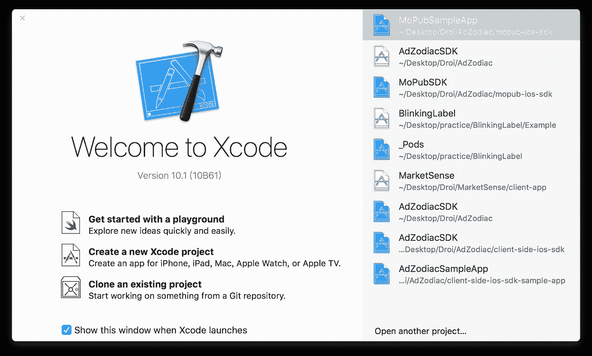

创建新的 Xcode 项目


选择`Cocoa Touch framework”`作为模板

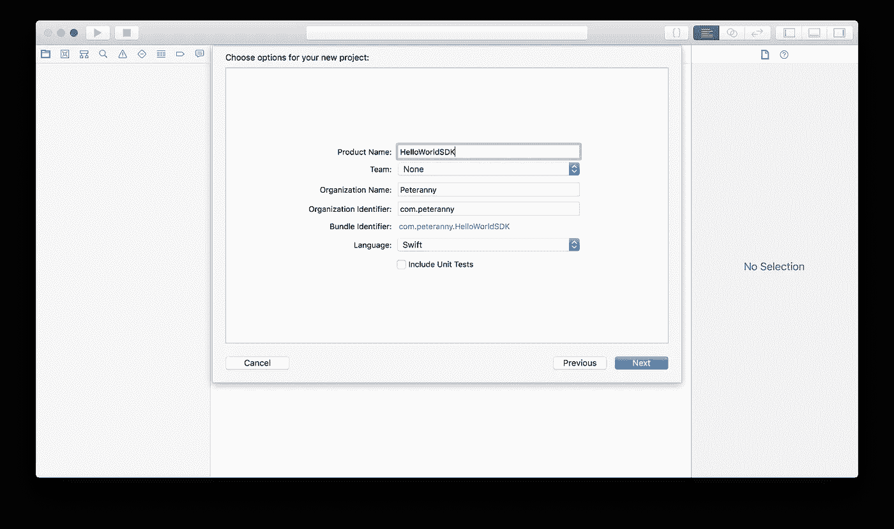

取消选中“`Include Unit Tests."` ,我们将在稍后手动创建单元测试。


如您所见，Xcode 创建了一个名为**“HelloWorldSDK”的项目，包括一个名为“hello world SDK”的目标。该目标对应于一个名为“HelloWorldSDK.framework”的产品，您可以在左侧 project-navigator 面板的`Products`组中看到它。**

**该产品没有保存在您的项目目录中(因此不会包含在您的源代码版本控制下)，而是保存在 Xcode 创建的临时目录中。如果目标没有建成，它在`Products`的产品应该看起来是红色的。**

****

**接下来，我们来看看方案。一个方案是包括`Run`、`Test`、`Profile`、`Analyze`等动作的集合。您可以长按操作图标来选择您想要执行的其他操作。每个方案只对应一个项目，但可能涉及多个目标。这里 Xcode 自动为我们创建了一个名为“HelloWorldSDK，”的方案，显示在 action 按钮旁边(是的，这是一个方案的名称，不是目标或项目)。单击方案按钮时，您可以从菜单中切换、创建、编辑或删除方案。**

**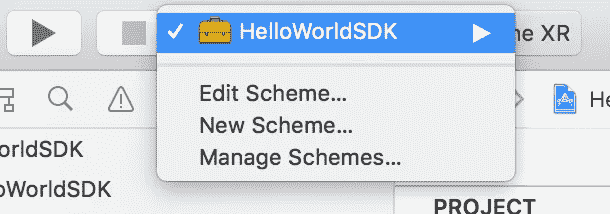**

**如果你点击“编辑方案...，”你会发现 Xcode 已经配置了`Build`动作来构建目标 HelloWorldSDK。稍后我们还将配置在其他目标上执行的其他动作，例如在单元测试目标上的`Test`。**

****

**现在，您的项目目录应该如下所示:**

```
.
├── HelloWorldSDK.xcodeproj      # the project
│   └── ...
└── HelloWorldSDK                # the framework source code
    └── ...
```

## **构建框架目标**

**让我们从一个简单的类开始。通过文件>新建>文件…创建 Swift 文件**

**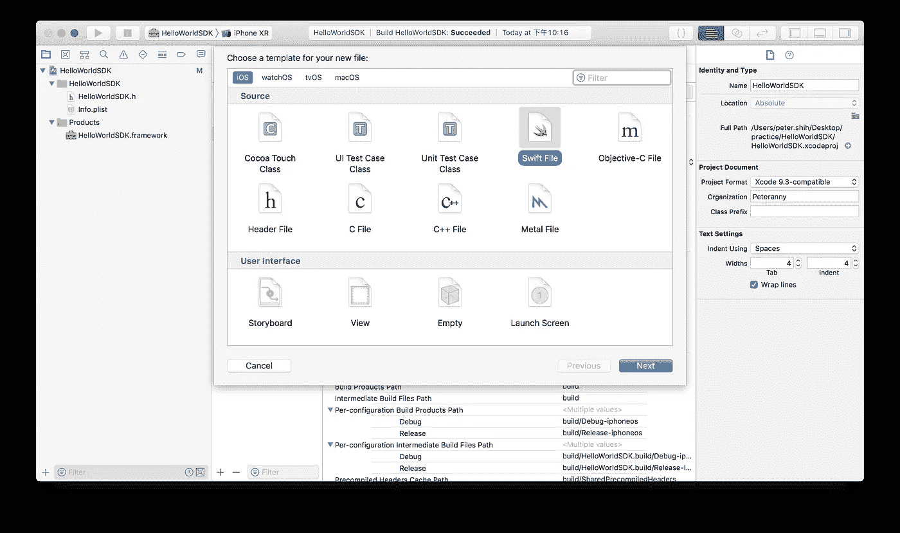****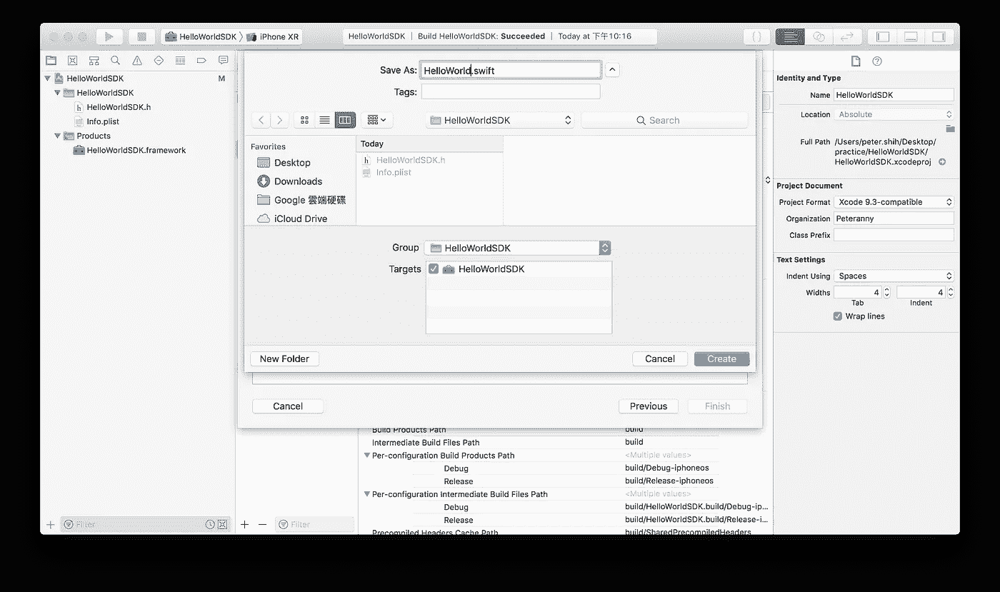**

**在组 *HelloWorldSDK* 和目标 *HelloWorldSDK* 下定位文件**

**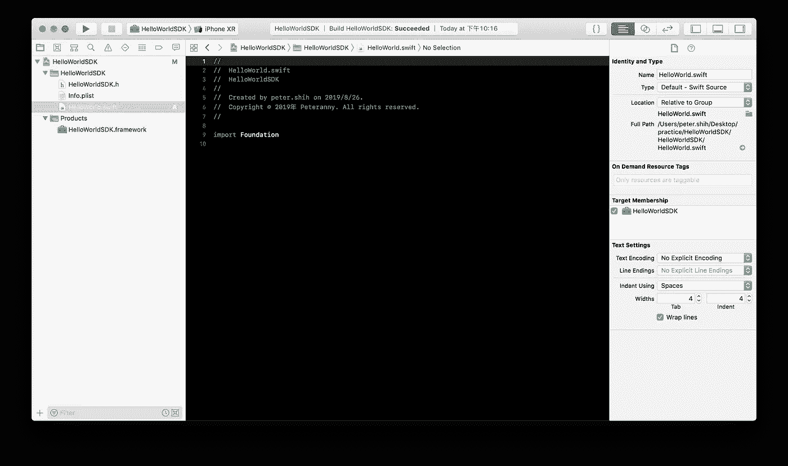**

**实现您的类。注意，您想要向用户公开的 API 必须以`public`为前缀。如果您没有留下访问控制关键字，它默认为`internal`访问级别，并且只能在框架内访问。**

**点击左上角的“运行”按钮。如果一切顺利，你会看到`Build Succeeded`并且构建的产品是 HelloWorldSDK.framework，注意它实际上是在`Run`之前执行`Build` 。根据 scheme，scheme HelloWorldSDK 的`Run`动作没有可执行文件可以运行，所以构建成功后什么都不会发生。**

**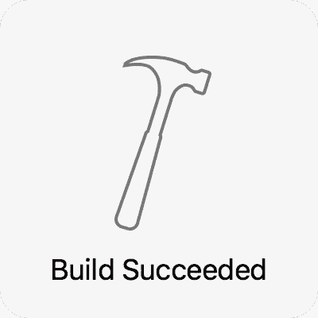**

**但是如果我们的框架不像预期的那样工作呢？我们现在应该写一个应用程序来测试我们的框架是否工作正常吗？坚持住。我们可以先编写一个单元测试来模拟它的用法，然后再为它制作一个真正的应用程序。**

# **2.构建第二个目标:框架的单元测试**

## **创建 iOS 单元测试包的目标**

**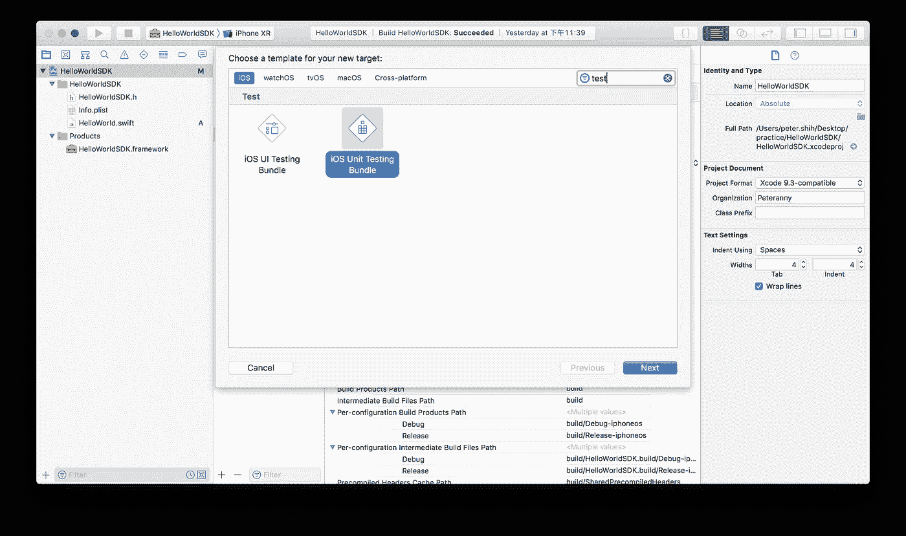**

**选择`iOS Unit Testing Bundle" via` *文件* > *新建* > *目标…***

**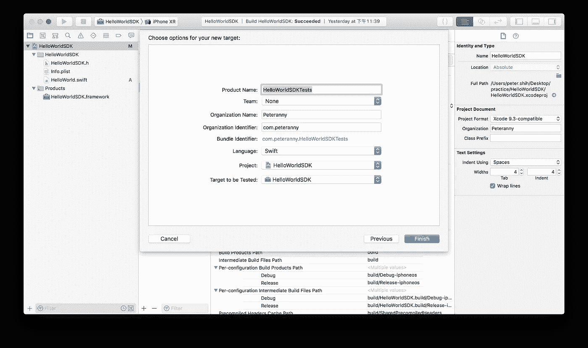**

**选择“*hello world SDK”*作为项目“*hello world SDK”*下的`target to be tested`**

****

**您的项目目录应该如下所示:**

```
.
├── HelloWorldSDK.xcodeproj  # the project
│   └── ...
├── HelloWorldSDK            # the framework source code
│   └── ...
└── HelloWorldSDKTests       # the framework test files
    └── ...
```

**现在我们有了第二个目标，HelloWorldSDKTests，位于 HelloWorldSDK 项目下，测试文件位于项目导航器面板中的 HelloWorldSDKTests 组下。Xcode 还为我们自动创建了一个名为“HelloWorldSDKTests”的方案，这个方案已经被 action `**Test**` 配置为运行测试目标 HelloWorldSDK。**

**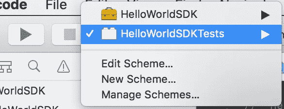**

## **构建测试目标并测试框架**

**在导航面板中点击文件“HelloWorldSDKTests.swift”。让我们开始编写测试:**

**您可以使用 Xcode 的内置断言来断言公共 API 的预期结果。注意，如果您在`import` *之前加上前缀`@testable`，您也可以测试框架中的内部属性或方法。*但是，私有的是绝对不能暴露和测试的。**

**要开始测试，单击 scheme 按钮，选择 HelloWorldSDKTests ，长按左上角的 action 按钮，选择“Test”如果一切顺利，您应该看到您的框架通过了测试。否则，修改你的框架直到测试成功。**

**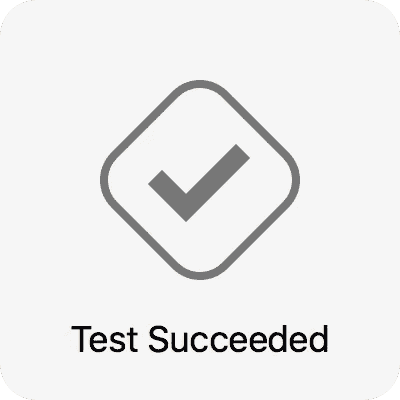**

# **3.准备框架的 Podspec**

**为了允许其他应用程序使用你的框架，我们应该把你的框架打包成一个 Pod。需要一个 Podspec 来描述你的框架。在根目录下手工创建文本文件“HelloWorld.podspec”或利用`pod spec create HelloWorldSDK`创建模板进行修改。**

**编辑 HelloWorld.podspec，使其如下所示:**

**以上是 Podspec 中的必填字段。要完成这些字段，你最好把你的框架源代码推到 GitHub 之类的地方。你可以使用`pod lib lint`来验证你的 Podspec。点击了解更多关于 PodSpec [的信息。项目目录应该如下所示:](https://guides.cocoapods.org/syntax/podspec.html)**

```
.
├── HelloWorldSDK.xcodeproj    # the project
│   └── ...
├── HelloWorldSDK              # the framework source code
│   └── ...
├── HelloWorldSDKTests         # the framework test files
│   └── ...
└── HelloWorldSDK.podspec      # the framework pod spec
```

# **4.构建第三个目标:示例应用程序**

**现在我们要做第三个目标:一个向用户展示如何使用这个框架的示例应用程序。**

**作为一个框架，这很重要，因为如果用户不能快速上手，他们可能会放弃使用你的框架。请记住，它与框架目标是不同的目标，我们将让前者使用后者的产品。**

## **为示例应用程序创建目标**

**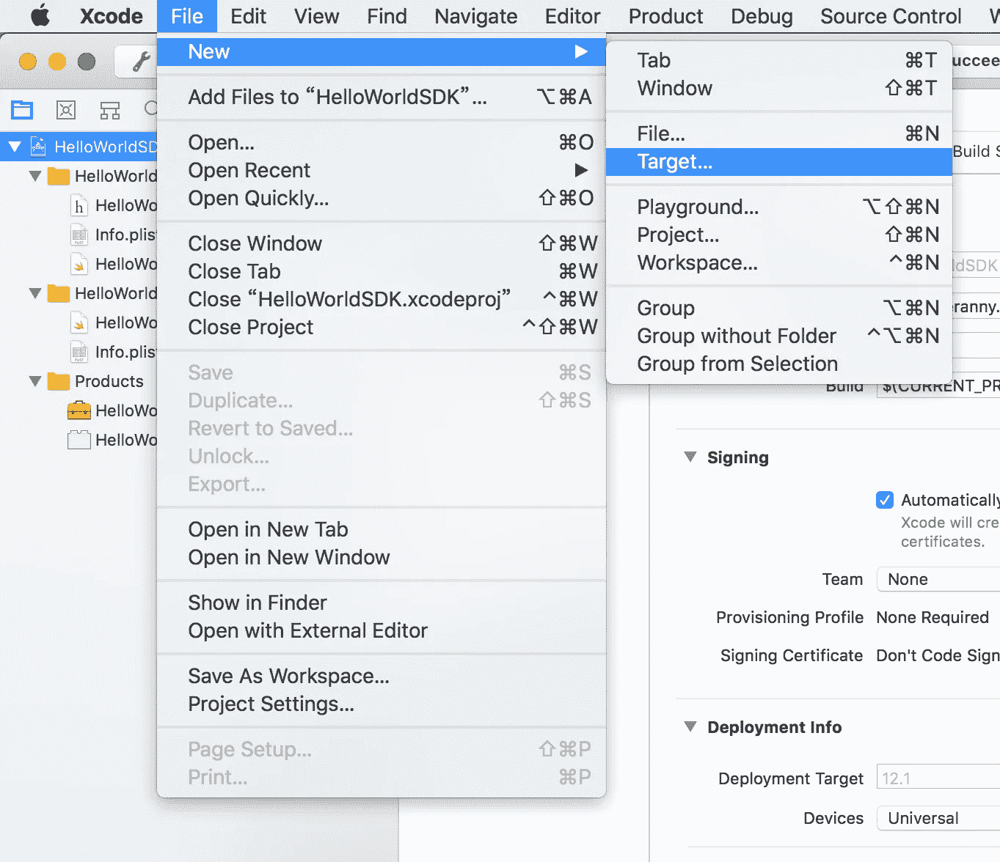**

***点击“文件* > *新建* > *目标…”***

****

**选择“单视图应用程序”**

**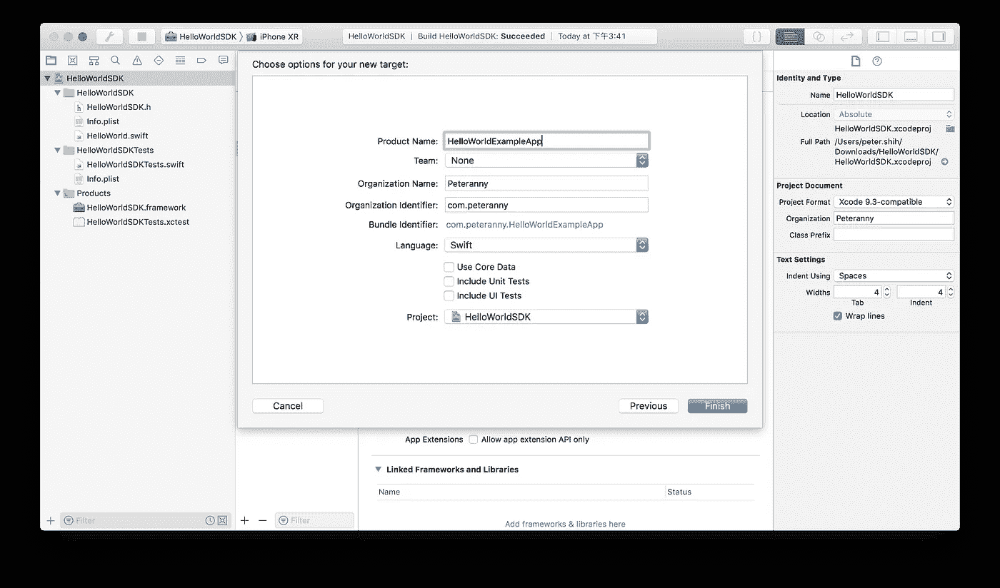**

**取消选中“`Include Unit Tests"` ,因为示例应用程序不是项目的核心**

**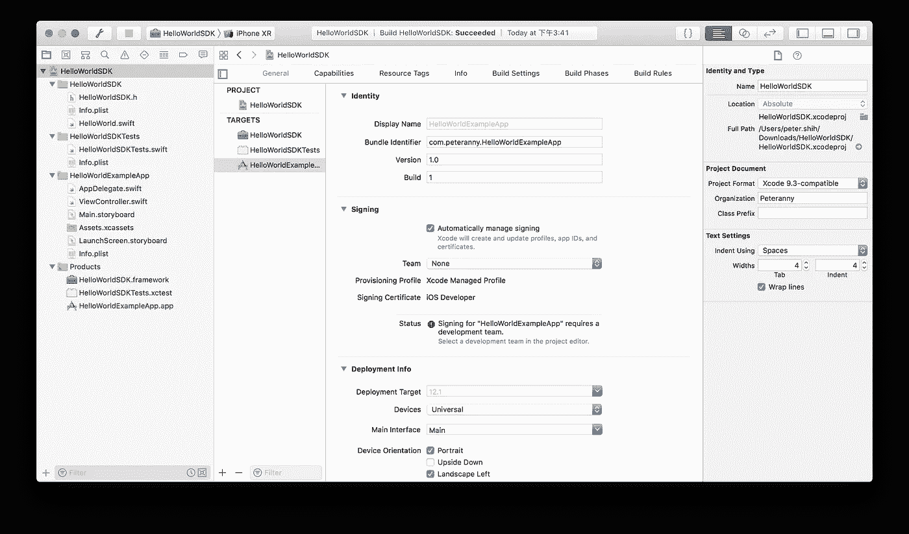**

**现在，我们有三个目标，以及一个用于构建 App 目标的新方案 HelloWorldExampleApp。项目目录应该如下所示:**

```
.
├── HelloWorldSDK.xcodeproj  # the project
│   └── ...
├── HelloWorldSDK            # the framework source code
│   └── ...
├── HelloWorldSDKTests       # the framework test files
│   └── ...
├── HelloWorldSDK.podspec    # the framework pod spec
└── HelloWorldExampleApp     # the example app source code
    └── ...
```

**但是，app target 目前还不能直接使用我们框架的产品。我们必须将框架安装到应用程序的依赖项中。为此，我们需要一个 Podfile。**

## **为示例应用程序创建 Podfile**

**打开您的文本编辑器(Xcode 除外)。在根目录下创建一个名为“Podfile”**的文本文件。****

****可以看到，这是针对目标 HelloWorldExampleApp 的，并告诉在哪里获取 HelloWorldSDK 的 Podspec(在本例中，它位于本地的`.`)。项目目录变为:****

```
**.
├── HelloWorldSDK.xcodeproj  # the project
│   └── ...
├── HelloWorldSDK            # the framework source code
│   └── ...
├── HelloWorldSDKTests       # the framework test files
│   └── ...
├── HelloWorldSDK.podspec    # the framework pod spec
├── HelloWorldExampleApp     # the example app source code
│   └── ...
└── Podfile                  # the example app Podfile**
```

## ****将 pod 安装到应用程序目标****

****现在我们准备安装。打开您的终端，`cd`到您的项目目录所在的地方，键入`pod install`来安装框架。你的根目录下会有一些生成的东西:****

1.  ****项目“Pods”，它的目标是“Pods_HelloWorldExampleApp”，构建所有其他依赖的框架或库。****
2.  ****工作区“HelloWorldSDK.xcworkspace”，其中包含您的项目 HelloWorldSDK 和项目窗格。工作区是一个允许您同时管理多个项目的容器。****
3.  ****锁“Podfile.lock”，这是您的 Podfile 的计算结果，因此它可以修复框架版本并加快您未来的安装。****

****由于您的示例应用程序可能不会随着时间的推移而频繁更改，所以建议在您的源代码版本控制中包含以上三项。现在，项目目录将如下所示:****

```
**.
├── HelloWorldSDK.xcodeproj   # the project
│   └── ...
├── HelloWorldSDK             # the framework source code
│   └── ...
├── HelloWorldSDKTests        # the framework test files
│   └── ...
├── HelloWorldSDK.podspec     # the framework Podspec
├── HelloWorldExampleApp      # the example app source code
│   └── ...
├── Podfile                   # the example app Podfile
├── Podfile.lock              # the example app Podfile lock
├── Pods                      # the Pods project
│   └── ...
└── HelloWorldSDK.xcworkspace # the workspace for both projects
    └── ...**
```

****安装程序向项目 HelloWorldSDK 中的目标 HelloWorldExampleApp 添加了一个运行脚本阶段，因此它的构建需要项目 Pods *中的目标 Pods_HelloWorldExampleApp 的产品。*****

****从现在开始，您应该在 Xcode 中关闭您的项目 HelloWorldSDK，但始终打开工作区 HelloWorldSDK，以继续成功构建您的应用程序。****

****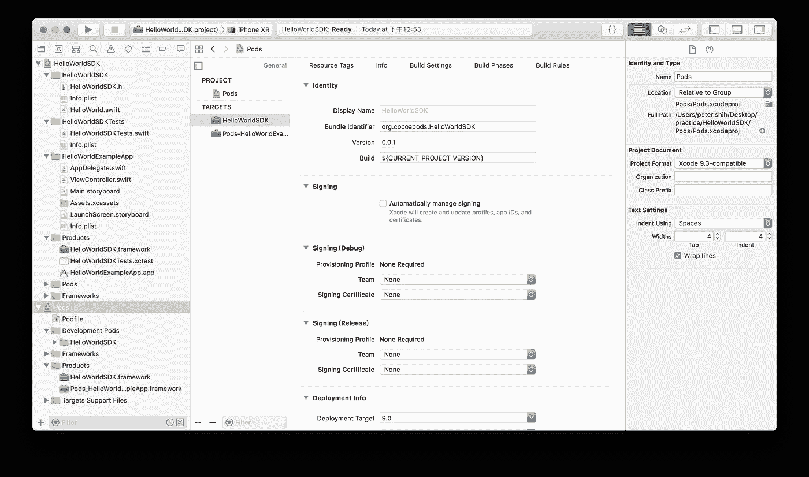****

****包含项目“HelloWorldSDK”和项目“Pods”的工作区****

## ****构建示例应用程序****

****是时候编写我们的示例应用程序了。在 HelloWorldSDK 项目中，编辑 HelloWorldExampleApp 组下的文件“ViewController.swift”。****

********

****选择方案 HelloWorldExampleApp 和动作`Build`。如果一切顺利，您应该看到您的示例应用程序启动，您的框架成功安装。****

****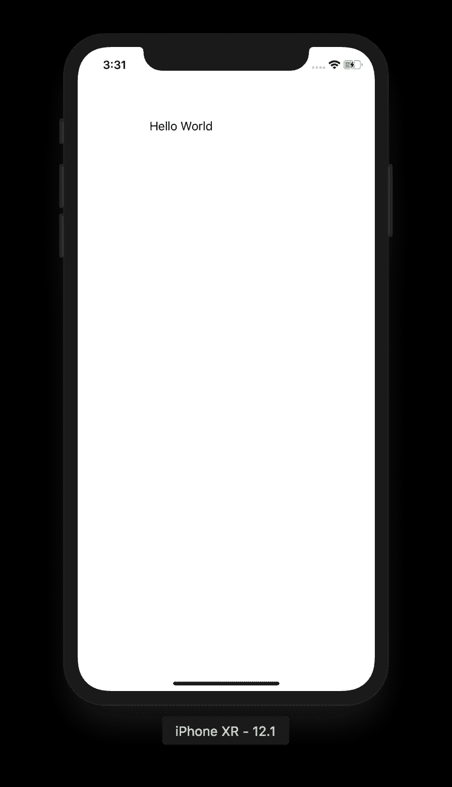****

# ****5.常见问题解答****

## ******为什么我无法在示例应用程序中使用我的框架？******

****如果你开始使用框架制作你的示例应用程序，你可能会发现你不能`import HelloWorldSDK`或者你成功导入但是不能使用你的类或方法。有几种可能的方法可以解决这个问题:****

1.  ******清理构建文件夹。**有时 Xcode 会保存你的框架的旧头的缓存。点击“Product > Clean Build Folder”并重新构建你的框架通常是有用的。****
2.  ******更新后重建框架。**请记住，每次更新框架时，您都需要在启动应用程序之前重新构建它，以查看结果或享受新框架 API 的自动完成功能。为了实现自动化，您可以将`Build Phases`中的`Target Dependencies`设置为应用目标(在目标级别)，或者将您的方案配置为在`Run`上自动构建框架(在方案级别)。****
3.  ******创建或删除文件后，重新安装 pod。**如果文件是在你的框架中创建的或者从你的框架中删除的，这意味着头文件的改变。你应该打开你的终端，再次输入`pod install`来同步头文件到应用程序。否则，您将成功地重新构建框架，但由于过时的头而无法重新构建应用程序。****

## ****我的框架可以依赖于其他框架吗？****

****我建议不要在你的框架中使用其他框架。如果这样做，事情会变得复杂，因为您的框架中没有 Podfile。相反，您必须在 podspec 中编写 *subspec* 。这有点超出了我们的范围。或者，您也可以手动将 lib 二进制文件嵌入到您的框架中，而不使用 subspecs。然而，如果你用最少的功能来使你的框架摆脱对其他框架的依赖，事情是可以避免的。****

## ****我可以在我的框架中包含资产吗？****

****是的，您可以将您的资产放在您的框架中，但是您需要在使用它们时指定捆绑包。捆绑包是资源所在的地方。示例应用程序和框架属于不同的包。要创建我们可以在框架中使用的资产，请单击“文件>新建>文件…”****

****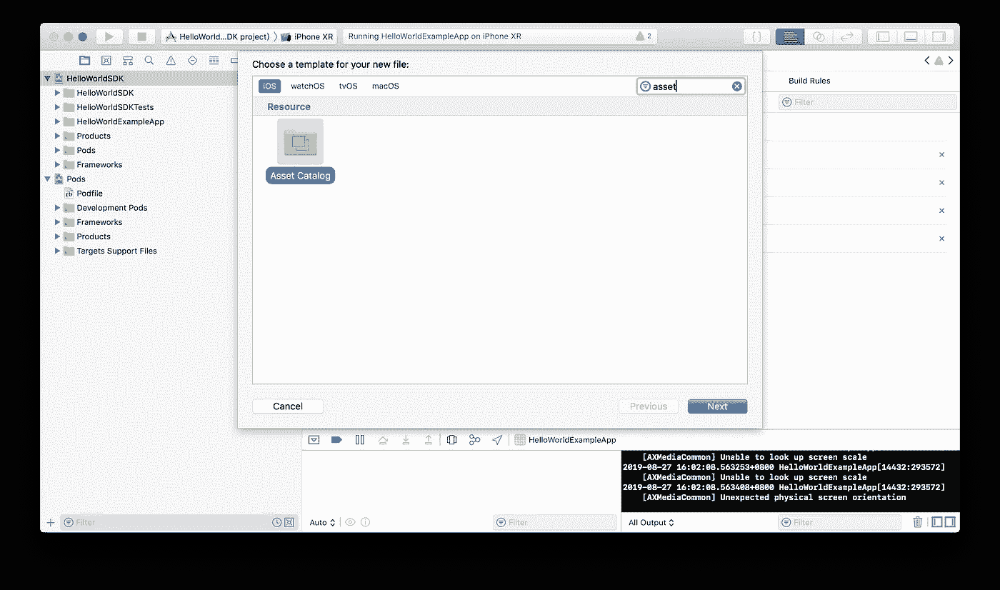****

****创造一个`Asset Catelog`****

********

****在组" *HelloWorldSDK"* 下的目标" *HelloWorldSDK"*****

****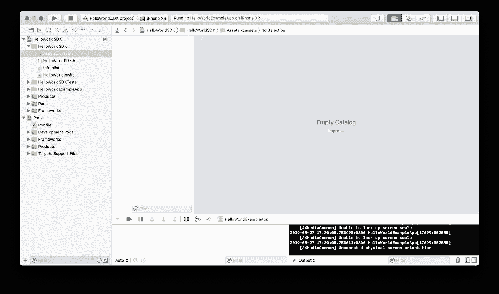********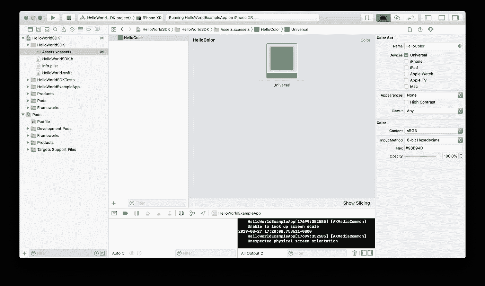****

****添加名为“HelloColor”的颜色****

****向框架中添加一个新的 API 来获取我们的资产。请注意，您必须为框架指定包，否则它将无法找到资产:****

****在你的应用中使用你的 API，享受你的结果。万岁。****

********

## ****我觉得我的计划不太妥当。我能说得简单点吗？****

****目前，我们在 HelloWorldSDK 项目中有三个目标:****

1.  ****目标 HelloWorldSDK****
2.  ****目标 HelloWorldSDKTests****
3.  ****目标 HelloWorldExampleApp****

****然后 Xcode 会为它们自动创建三种方案:****

1.  ****scheme HelloWorldSDK 仅使用`Run`动作构建框架目标(实际上只有`Builds`动作，但不运行任何东西)****
2.  ****模式 HelloWorldSDKTests 仅使用`Test`动作构建并运行测试目标****
3.  ****模式 HelloWorldExampleApp 仅使用`Run`动作构建并运行应用程序目标****

****这些动作看起来相互依赖，没有冲突。还记得在一个方案中怎么会有`Build`、`Run`、`Test`以及其他任何动作吗？如果我们把目前的三个方案结合起来，这样我们就只有一个方案来应对所有这些行动，那会怎么样？****

****还要注意我们的目标之间的依赖性。如果您更新您的框架，您必须在重新构建应用程序目标之前重新构建框架目标，以查看结果。同样，测试目标依赖于框架目标。也就是说，它们都需要重新构建框架。****

****让我们把三个方案简化为一个。我们将从模式 HelloWorldSDKTests 中移除动作`Test`，从模式 HelloWorldExampleApp 中移除动作`Run` ，并将两者都移动到模式 HelloWorldSDK 中。****

****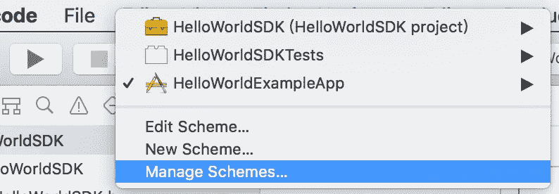****

****点击方案按钮，选择`Manage Schemes..."`****

********

****删除方案" *HelloWorldSDKTests"* 和" *HelloWorldExampleApp "*编辑方案" *HelloWorldSDK"*****

****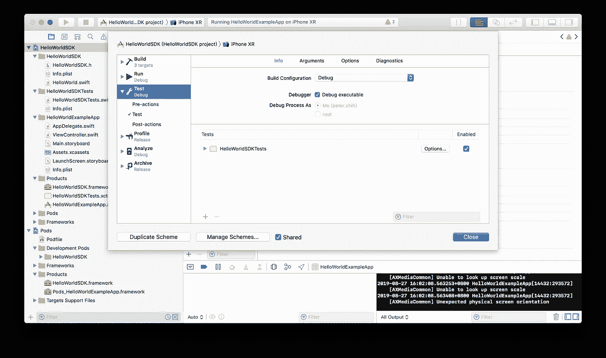****

****点击“测试”，在方案“*HelloWorldSDK”*中添加目标“*HelloWorldSDKTests”*至`Tests`****

****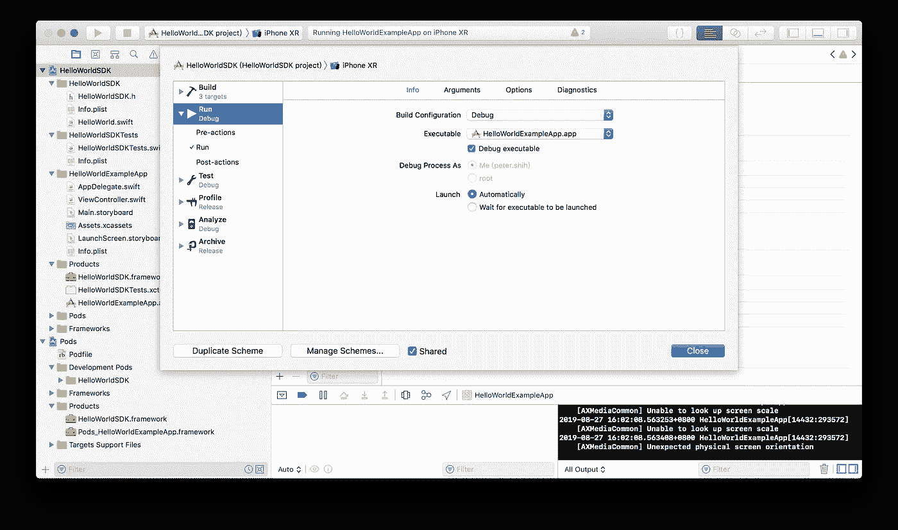****

****点击“运行”，将`Executable`设置为方案" *HelloWorldSDK"* 中的目标"*helloworldexample app "*****

****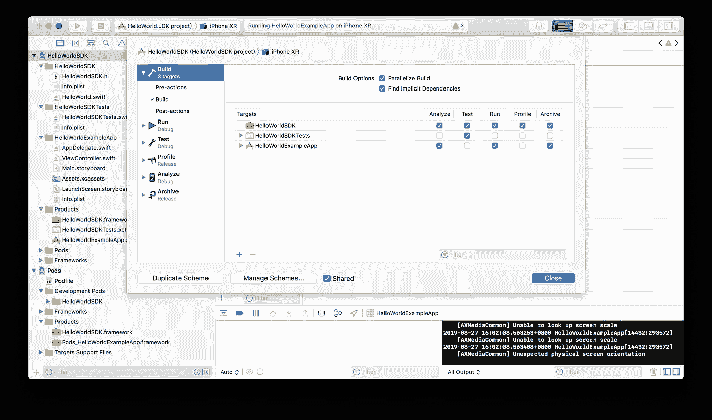****

****点击“构建”确认“*hello world SDK”*将在 `test` ing 和 app 运行的方案“*hello world SDK”*中构建****

****所以我们现在只有一个方案，HelloWorldSDK，to`Run`**app target 和`Test`**with test target，两者都遵循框架`Build`。我们不必再切换方案，只需要选择正确的行动。万岁。********

************

******现在只需要选择动作。不需要选择方案(右边的“HelloWorldSDK”)。******

## ******好的，我知道了。但是我不想从头开始创建文件结构和方案。有捷径吗？******

******是的。下次您想要构建您的框架时，只需使用 CocoaPods 的 lib，通过命令`pod lib create`快速启动。回答这些问题，它将为您创建一个框架、测试和示例应用程序的模板。然而，文件结构可能与我们上面创建的不同，但是现在您应该有能力处理它了。******

## ******我很高兴我完成了我的框架。我如何与他人分享？******

******看看发布你的框架的方式:[https://guides . cocoa pods . org/making/getting-setup-with-trunk . html](https://guides.cocoapods.org/making/getting-setup-with-trunk.html)******

# ******参考******

1.  ******[https://medium . com/无瑕-app-stories/create-your-own-cocoa pods-library-da 589 D5 CD 270](https://medium.com/flawless-app-stories/create-your-own-cocoapods-library-da589d5cd270)******
2.  ******[https://use your loaf . com/blog/loading-resources-from-a-framework/](https://useyourloaf.com/blog/loading-resources-from-a-framework/)******