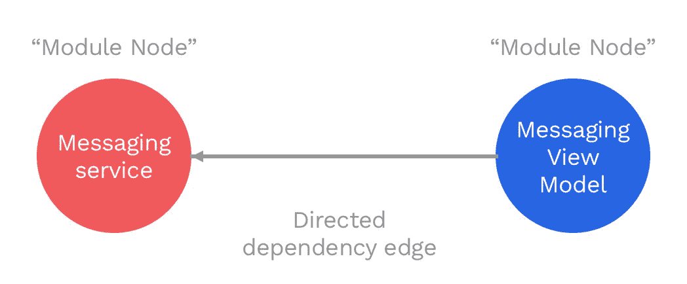
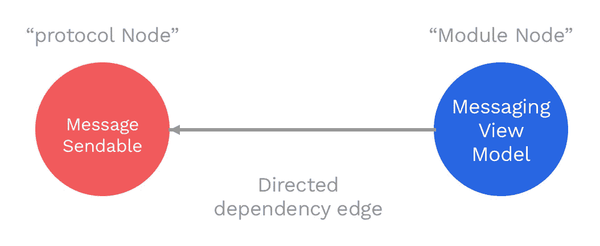

# iOS 测试:用协议模拟服务

> 原文：<https://betterprogramming.pub/ios-testing-mocking-services-with-protocols-1ff93f141e5f>

## 今天就开始为你的 iOS 代码库编写测试吧

[自由股票](https://unsplash.com/@freestocks?utm_source=medium&utm_medium=referral)在 [Unsplash](https://unsplash.com?utm_source=medium&utm_medium=referral) 上的照片。

对于大多数开发人员来说，编写测试是他们生存的祸根。我甚至会承认:我真的不喜欢写测试…一点都不喜欢。但是当我满怀信心地去找我的客户，因为我对每一项功能都进行了单元测试，我知道应用程序会按照我的预期方式运行，那种感觉是无价的。

# 概观

尽管通用单元测试相对简单，但是当你开始将框架和其他服务引入到你的应用程序中时(如果你正在创建一个合理大小的应用程序，你将会这样)，你将需要开始以一种允许通过模仿来容易地测试你的代码的方式来编写你的代码。一旦我们做到了这一点，我们就可以在不实际使用服务的情况下，以模拟服务行为的方式编写测试。因此，我们可以在较小的单元规模上测试我们的应用程序的功能，而不必依赖于我们在运行测试时在生产中使用的服务。

在整篇文章中，我将演示如何编写代码来模拟一个简单的云函数消息服务。在生产中，这将在成功完成消息发送后更新数据库。您将会看到，您不需要知道这个云函数消息服务是如何实现的，并且仍然可以通过模拟我们所依赖的模块的输出来测试单元规模的视图模型。

# 什么是嘲讽？

软件中的嘲讽和现实世界中的嘲讽没有什么不同。当某人/某物在现实世界中被嘲笑时，这个人/物的行为或表现方式正在被模仿。

在软件测试中，当我们模仿一个服务或模块时，我们是在复制一个模块/服务的行为方式，这允许我们在测试过程中模拟一个模块的行为，而不必使用模块本身。因此，我们可以通过模仿正在测试的模块的所有依赖项来断言正在测试的模块。通过这样做，我们将能够查明我们正在测试的模块中的错误，而不用担心来自其他模块的潜在问题。如果不是这样，就很难判断测试失败是由于当前模块的代码还是来自另一个模块的代码！

*“嗯，布雷迪，我们为什么不在测试期间也使用这项服务呢？”*

我们不想在单元测试中使用模块依赖的一些原因包括:

*   不允许我们关注模块中的代码单元，而是允许依赖来自其他模块的代码。
*   潜在地带来网络延迟问题。
*   服务可以创建与数据库的事务，这在时间和金钱上都是昂贵的。
*   很难确定测试失败的原因。
*   可能依赖第三方 API，这可能会导致问题。

# 编写可测试的代码

既然我们理解了为什么在单元测试中模拟服务如此重要，我们需要研究编写软件的最佳实践，这将允许我们轻松地模拟我们的模块(视图模型、网络管理器等)的服务。)取决于。

描述有向依赖关系的图表(作者)

为了做到这一点，我们可以把我们的程序想象成一个模块依赖关系的有向图。每个模块代表图上的一个节点，并且当它依赖于另一个模块时，它具有到另一个模块的边。当我们编写软件时，我们希望能够模拟图边另一边的节点，这样我们调用服务的模块就不能区分真实服务和模拟服务了！

*“太好了！我现在如何在我的代码中做到这一点？”*

# 注入依赖关系

大多数刚起步的软件开发人员不会在他们的代码中使用依赖注入。相反，他们会以调用模块或服务的初始化器的方式编写自己的类或视图模型，而不会显式声明当前模块依赖于其他模块。我们可以在下面的代码中看到一个简单的例子:

编写没有依赖注入的模块。

在上面的代码中，我们不知道是否有边(代表依赖关系)指向基于初始化器的其他模块。我们实际上有一个节点模块，没有已知的输出依赖。我们将很快看到，如果我们以这种方式初始化我们的模块，这将使模仿这些服务几乎不可能。

为了能够编写模拟这些模块的测试，我们需要将这些依赖注入到我们的初始化器中。如果我们不注入依赖关系，我们就不能通过查看一个给定模块的初始化式来理解它的“依赖边缘”,而且我们肯定不能模仿这个模块，因为类/结构在没有外部干扰的情况下控制着模块的创建。

具有依赖注入的模块。

我们应该将依赖关系作为参数传递给`init`方法，而不是自己显式地构造依赖关系。通过这样做，当前模块可以利用它所依赖的模块，而不必显式地声明如何创建它们或者正在构造服务的什么特定实例。

或者，我们现在接受模块的实例，并将其保存为属性，然后在我们自己的模块中使用它，而不用担心在图中创建“依赖节点”。这就是依赖注入这个术语的来源。我们“注入”节点并保存边引用，以便能够调用模块运行所需的方法。

*“好的，听起来不算太糟！但是你不是漏掉了什么吗？”*

# 利用协议

是的，我是。我相信你已经听过无数次了，“你需要创建一个协议。”我要做一百万次。您需要为模块的功能创建一个协议。

现在，模块依赖于协议定义的功能，而不是模块中功能的具体实现。

为了让您能够模拟模块，我们需要利用协议来允许将任何符合协议功能的依赖项注入到我们的模块中。因此，我们可以让模块和模拟模块实现定义我们的模块中所需的服务功能的协议。因为我们做出了利用协议的令人敬畏的决定，这将允许我们在测试期间给我们的模块提供模拟服务，而在我们的产品代码中提供完整的服务！

让我们付诸实践吧！

对于我们正在创建的应用程序，我们需要我们的视图模型能够调用一个服务，该服务将一个文档添加到我们的数据库中，该文档包含来自我们的用户和发送者 ID 的文本消息。由于所需的功能是接收消息和发送者 ID，我们将创建一个名为`MessageSendable` *的协议。* `MessageSendable` 将为一个函数定义原型，该函数接受一条消息、发送者 ID 和一个完成闭包，该闭包接受一个`Result`结构作为参数。然后，我们将让我们的视图模型为符合`MessageSendable` 协议的服务使用依赖注入。

下面，我们可以看到我们的视图模型有一个`init`，它依赖于`MessageSendable`协议中定义的功能。作为这种依赖注入的结果，我们将能够在测试期间模拟功能，这将允许我们专注于测试视图模型，而不是它所调用的服务。我们现在可以自由地通过模仿来抽象服务的功能，这使我们能够测试视图模型如何响应服务的结果，而不是服务本身。

使用协议依赖注入的视图模型。

# 运行您的测试

现在，您可以像编写任何其他模块/视图模型一样编写您的测试，并在测试套件中创建模块实例时简单地注入模拟服务！

要创建消息服务提供的功能的模拟版本，只需创建一个名为`MockedMessagingService` 的结构，并使其符合`MessageSendable`协议(如下所示)。然后，我们可以通过基于输入返回不同的结果来模拟 API 在生产中的实际工作方式。

在下面的例子中，如果消息为空或者用户名为空，我们只返回一个错误。否则，我们返回成功！

上面的代码模拟了视图模型和托管在云中的消息服务之间的网络调用。现在，我们可以将这个服务的模拟版本注入到我们的视图模型中进行测试，而不必担心网络延迟会导致测试变慢以及没有物理数据库事务(因此，您可以节省更多的时间和金钱！).

# 感谢您的阅读！

嘣！您刚刚在测试您的 iOS 代码方面做得更好了！现在出去试着全面测试你的应用程序的功能吧！我知道未来你会感谢你灌输的好习惯。