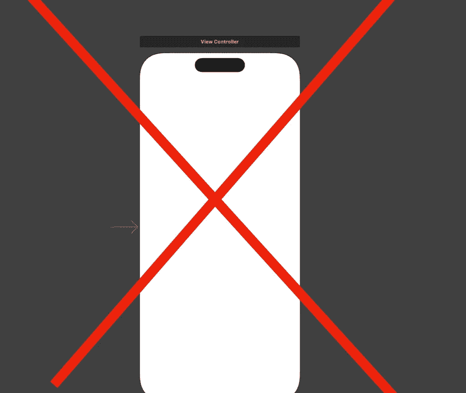
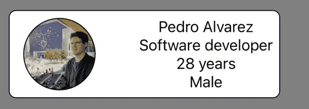
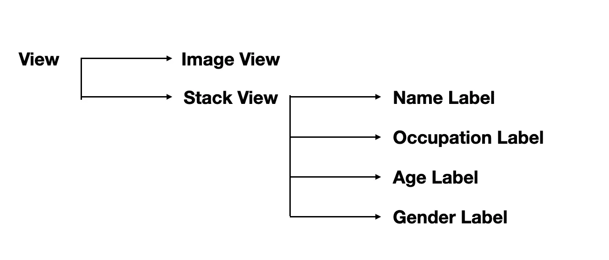
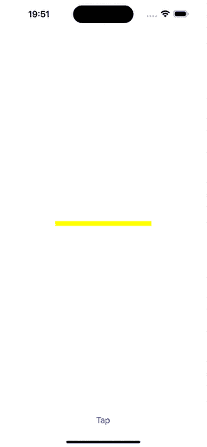
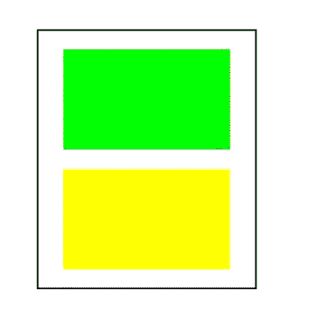
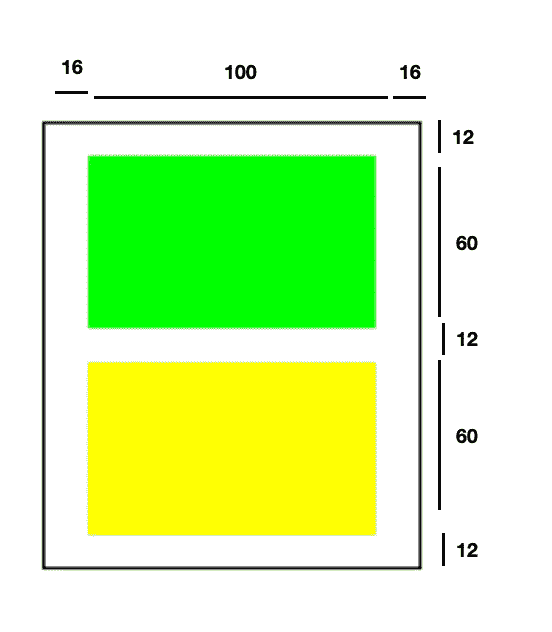

# 查看 iOS 开发者代码手册

> 原文：<https://betterprogramming.pub/ios-view-codes-handbook-1a08e28b0420>

## 针对项目最佳实践的深入指南

图片来自[https://pt . best-wallpaper . net/Nature-landscape-mountains-flowers-rainbow _ wallpapers . html](https://pt.best-wallpaper.net/Nature-landscape-mountains-flowers-rainbow_wallpapers.html)

几乎百分之百的 iOS 开发者，除了那些通过 SwiftUI API 构思的开发者，都开始学习用故事板构建 UI 界面。我仍然记得我在 2017 年经历的所有神奇之处，当时我通过拖动标签、编辑、放置背景颜色和所有事情，创建了一个简单的 Hello World 应用程序和一个故事板，从而上了关于 Swift 的第一课。

我第一次使用视图代码的经历发生在我申请初级职位的时候，当时我想挑战自己，创建一个应用程序，用视图代码来使用漫威 API。问题是我不知道通过代码构建新屏幕的好的风格指南，所以一切都很混乱。幸运的是，在我的职业生涯中，我能够通过学习关于可重用 UI 组件和重要概念(如内在内容大小和约束)的一切来提升我的软件工程技能。

本文为您提供了关于视图代码的主要方面的文档，如何构建可重用和反应式接口，以及我之前提到的所有重要概念。我希望你喜欢它！

# 为什么要查看代码？故事板和 xib 不是一个可靠的解决方案吗？

我将用一个简单明了的否定来开始回答这个问题。接口构建器是一个非常有吸引力的构建接口的框架。然而，它们只是在视觉上简单，直到你解决了你的第一个遗留问题。

在我的职业生涯中，由于视图控制器在不同的流程中循环使用，我真诚地努力寻找接口错误。无法调试哪个约束、栈视图、标签和 IBOutlet 导致了这个问题。您始终需要确保在界面构建器之外引用您的插座，并检查在 XML 或 Swift 文件中设置配置的确切位置(您知道，故事板是描述您的界面的 XML 文件)。

我需要提到的另一件事是关于冲突。每当你与团队中的其他成员发生冲突时。故事板文件，您需要准确地解释解决冲突的影响。

基本上，当你处理视图代码时，一切都变得简单了，你对你的流程有了更多的控制，什么导致了布局的每一个变化，每一个按钮的反应，以及导航。请不要使用`UISegue`进行导航。这是我在任何编程语言中见过的最糟糕的数据传递机制，并且耦合性太强。

既然您已经理解了为什么 View Code 是使用 SwiftUI 构建您的屏幕和组件的最佳途径，我将向您介绍大多数公司在应用时采用的最佳实践。其中一些是非常有名的，少数是我在经历中自己采用的，大多数人可能不知道。如果你想了解更多，请查看这篇文章。既然我已经说了，让我们开始吧:

# 查看代码管道

在屏幕上显示组件之前有三个步骤。您几乎可以按任何顺序定义它们，除非其中两个必须在另一个之前:

## 1.构建层次结构

通过将每个子视图添加到其父视图中，为每个子视图建立层次结构。这是一系列的`addSubview(:)`方法调用，或者如果你正在处理一个`UIStackView`，则是`addArrangedSubview(:)`。

## 2.定义约束

在这里，您应该定义每个视图之间的关系，告诉它哪个是高度和宽度锚点，哪个是公共子视图之间的距离。

## 3.查看配置

这是您应该为视图定义附加配置的步骤。我知道它的大部分可能已经在视图的初始化块中定义了，但是一些数据(可能是一些视图模型内容)需要稍后再填充。我们以后再谈。

关于这一点重要的事情是:总是在定义约束之前应用层次步骤。如果你不这样做，Xcode 将会对一个组件如何放置在另一个组件旁边感到困惑，如果它们甚至没有一个共同的父组件的话。这是有意义的，因为只有当两个元素属于相同的上下文时，您才能比较它们(想象一下在不同屏幕上的组件之间定义约束)。

# 视图代码协议

提供一种自动触发视图代码管道的方法总是一个好的做法，所以在我的所有项目中，我首先定义的事情之一是某个`Common`文件夹中的`ViewCodeProtocol`。该协议包含四种方法，其中三种方法对应于管道的每一步，第四种方法分开实现，以正确的顺序调用这三种方法:

注意，`configureViews`方法是可选的，`applyViewCode`触发整个流水线。当一个新的`UIView`或`UIViewController`子类被实例化时，你唯一需要做的就是在`init`方法中调用`applyViewCode`，UI 就完成了。

您可以在一个超类中定义这个管道，由所有视图继承，并在其中声明一些视图代码方法:

这种方法只有一个缺点:因为协议或超类定义了每个方法，所以这些方法永远不能被声明为`private`。这意味着没有机制可以避免从其他地方调用管道，比如视图模型或超级视图。它可能会损害 UI 封装。尽管保持管道仍然是一个很好的编码实践。

# 声明用户界面属性

我们将要创建一个新的组件，保存在我们的设计系统中，我们将一步一步地从声明它的子视图开始，直到填充内容。我们将要创建的视图是一个`ProfileView`,它应该包含五个提供用户数据的元素:一个图像和四个关于个人信息的标签，分别是姓名、年龄、职业和性别。

我们的组件应该是这样的:

根据我们的设计规范，无论屏幕大小如何，这些都是我们组件的要求:

*   `ProfileView`拥有`98`的身高
*   `imageView`在`ProfileView`垂直居中
*   `imageView`有`80`的高度和宽度。
*   `imageView`与领先的`16`有距离。
*   所有四个标签都与`imageView`相距`48`
*   所有四个标签都是垂直对齐的，并且距离尾部有`16`的距离
*   四个标签与顶部和底部的距离为`8`。

有了所有这些信息，我们确定我们的组件中有六个 UI 元素将成为变量:一个图像视图、四个`UILabels`和一个`UIStackView`来保存所有标签。当处理跨某个轴对齐的多个元素时，强烈建议将它们保存在堆栈视图中，以简化约束并指定单个行为。既然我已经说了，让我们编码:

正如我们所看到的，我们没有创建一些`IBOutlets`，而是从故事板或 xib 中的一些预配置组件中拖拽。我们只是实例化了一些 UI 属性，并将它们声明为`lazy`。它们由创建新视图、配置其属性并返回它的初始化代码块来检索。这样，我们只在需要 UI 元素时才执行这个初始化块。我强烈建议始终将它们声明为`lazy`，以优化我们的记忆。当我们要添加组件时，有些组件可能会在很晚的时候初始化，比如一个错误视图，只有当我们从一个 API 得到一些失败时，我们才需要它。

你可能想知道为什么我们把这个`translatesAutoresizingMaskIntoConstraints`设置为假。这是因为你希望你的界面依靠约束来设置它在超级视图中的位置，而不是它自己的框架布局(如果你用`CGRect`框架创建了对象)。我们稍后将讨论约束。

# 建筑层次结构

现在我们已经在视图中列出了所有的元素，是时候定义它们将遵循的层次结构了。此时，我们应该让我们的`View`类实现`ViewCodeProtocol`并声明我们的管道。

首先，我们需要明确哪个视图应该包含另一个视图，以免我们的层次定义出现错误。如果我们设置了一个错误的层次结构，然后设置了约束，那么解决 bug 将会更加困难。这是我们所拥有的:

现在让我们在代码中反映出来:

为了简化这一步，我们总是可以在一个`UIView`扩展中实现一个方法，该方法接收一组视图并一次添加它们。对于`UIStackView` `addArrangedSubview`功能也应该如此。

# 限制

现在我们将描述层次结构中属于同一父元素的每个元素之间的关系。根据我们的规范，让我们为常量定义一个嵌套的`enum`,其中包含我们将分配给约束的所有常量:

Swift 中的约束包括五个重要元素(还有更多，但我们将在后面的另一篇文章中描述):

1 .关系的第一个元素

2.关系的第二个要素

3.第一元素的锚

4.第二元素的锚

5.常数

锚描述了我们正在谈论的元素的哪个维度:是顶部、底部、前导、尾随、左侧、右侧、高度还是宽度？

基本上，当我们声明一个约束时，我们声明如下:

*第二个元素的【锚点】距离第一个元素的【锚点】为【常数】点。我们也可以将高度和宽度锚点定义为常量。*

还有约束的优先级，以防有其他约束冲突，但这是后面的另一个话题。

这就是活动约束的对象。用 Swift 代码声明约束有几种方法，我将介绍所有这些方法的优缺点:

## NSLayoutConstraint 激活

对我来说，这是最可靠的一个，因为它是原生的，写起来更简单。供您参考，定义约束的 Swift UIKit 类是`NSLayoutConstraint`，它由我们上面描述的所有属性定义。例如，让我们描述一个在两个标签之间建立垂直关系的约束:

`firstLabel.bottomAnchor.constraint(equalTo: secondLabel.topAnchor, constant: 12)`

它说:“第一个标签的底部锚点与第二个标签的顶部锚点相距 12 点。”

一个视图的每个锚点都有一个`constraint`方法，该方法将另一个视图的锚点作为参数和常量。

如果我们只想列出所有这些关系，只需依赖来自`NSLayoutConstraint`的`activate`静态方法:

我们所有的约束都是基于设计规范(Figma、Zeplin 或其他)的度量。这是一次声明所有约束的最佳本机方式。我强烈建议在大多数情况下使用它，除了我们将要检查的那个。

## NSLayoutConstraint 处于活动状态？

想象一下下面的场景:有一个约束，只有在我们的视图的特定状态下遵循一个条件时，这个约束才应该有效。由于声明约束的第一种方式需要一组约束，所以每次添加和删除约束会非常无聊。因此，我们有一个机制来分别定义它是否有效，就好像我们在处理一个动态约束:

## 第三方库:快照工具包

SnapKit 是一个作为 CocoaPod 提供的库，它为我们提供了一种用更少的代码行编写约束的更简单的方法。它的优点是，您可以在一行中合并具有相同常数和相同锚点的视图的两个约束，在一个闭包中对所有视图的约束进行分组，并在不知道父视图是什么的情况下将关系写入父视图。看起来是这样的:

注意，`UIView`的每个后代都有一个`snp`对象，它管理锚点并提供通过闭包编写约束的方法。每个约束，像我们的图像视图中的`height`和`width`，具有相同的常数，可以通过为`make`对象一次设置它们而放在一行中。

此外，不是在我们的约束中写父代，像我们的`imageView`的`leading`，我们说它等于`superview`。我认为这是 SnapKit 最重要的方面，因为父对象的这种抽象允许我们创建许多可重用的代码来约束某些类型的视图。

然而，SnapKit 仍然是一个第三方库，它应该始终与我们的最新代码保持一致，可能会有错误和一些不推荐使用的组件。正因为如此，我建议尽可能使用本地方式。

# 附加配置

既然我们已经用约束定义了层次结构，那么管道中还有第三步:配置 UI 元素。你一定在想:“但是我们不是已经把元素配置在它们自己的初始化块中了吗？为什么我们需要再做一次？”。这是一个很好的问题，但有一个简单的答案:数据是动态的，可能会在生命周期中发生变化。

假设我们的视图通过`init`接收一个视图模型作为输入，我们需要用它的属性填充我们的视图。当我们声明我们的视图时，我们仍然没有任何`viewModel`,因为它只在初始化方法中被注入。

首先，声明一个嵌套视图模型，它应该只填充我们的组件。代码如下:

现在，让我们创建采用视图模型参数并填充元素的方法:

请注意，我们还设置了根视图本身的一些属性，因为我们没有更合适的地方来进行设置。

我们只是忘记了为我们的视图创建一个初始化器，传递视图模型并触发视图代码管道。

现在我们的管道已经完成了，但是只有一件事我们忘了提，那就是让我们的代码按照设计规范的预期工作。

# 布局子视图

正如我们前面讨论的，约束只是我们创建的对象，用来描述我们的组件应该如何行为。但是它们只有在我们的布局被验证后才有效，这发生在创建或一些布局更新之后，或者更好地说，它被应用在`layoutSubviews`方法中。

记住，我们希望我们的图像是圆形的。为此，其拐角半径应为其高度和宽度的一半。但是如果我们在初始化块中声明，当没有约束，没有定义布局的时候，就不行了，因为它的高度和宽度都是`zero`。

实现布局定义后调用的`layoutSubviews`方法，看看它是如何工作的:

现在我们有一个圆形图像:

如果在视图的生命周期中你需要更新布局，你应该通知需要改变布局并调用`setNeedsLayout`函数，但是如果你需要立即改变布局，直接调用`layoutIfNeeded`。这将检查某个约束或尺寸是否改变，然后强制“重画”我们现在要更深入地研究它。

# 动画约束

假设我们有一个视图，点击一个按钮就会更新它的高度。我们为它的约束声明了一个变量，甚至是常量，最初是`10`。我们想让一部动画成长到`100`。为此，您依赖于来自`UIView`的`animate`方法，但是您注意到改变约束的常数不起作用。

这是因为在动画块中更改此参数时，您没有强制更改布局。您可以在动画方法外定义约束更改，然后在动画块内强制布局更改。那就是会改变高度的东西。下面是实现这一点的代码:

# 内在内容大小

当处理视图代码中的约束时，内在内容大小是最重要的方面之一。假设我们有以下视图:

我们所拥有的如下:

请注意，为了按照约束呈现绿色和黄色视图，我们需要 12 + 60 + 12 + 60 + 12 = 156 个点。所以超级视图的大小是由其内部内容定义的，不需要为其高度定义约束。我们不需要宽度约束，因为宽度是内部视图(100)的宽度加上来自边界的空间。这被称为内在内容大小，即适合其内部内容的视图大小。`intrinsicContentSize`是`UIView`的计算属性，根据其子视图和约束计算大小。

如果你有一个已经有一个内在内容大小的视图，并且声明了一个对它的大小的约束，你将面临一个约束之间冲突的警告，因为高度被定义了两次，所以我们有一个歧义。

根据苹果的文档:

> 接收视图的自然大小，仅考虑视图本身的属性

如果您有一个想要定义其内在内容大小而不是大小约束的自定义视图，请填充 free 以覆盖其属性，因为它是`open`。

# 结论

在本文中，我们记录了视图代码是如何工作的，以及创建可重用组件的最佳编码实践是什么。我们还讨论了一些重要的概念，如约束动画和内在内容大小。如果你想了解更多关于构建独立于项目和业务规则的纯可重用 UI 组件，你应该看看我的另一篇关于[设计系统](https://pedroalvarez-29395.medium.com/design-system-how-to-define-a-visual-identity-to-my-app-b8b00dc571e2)的文章。

我希望它回答了你的大部分问题，你喜欢阅读:)。