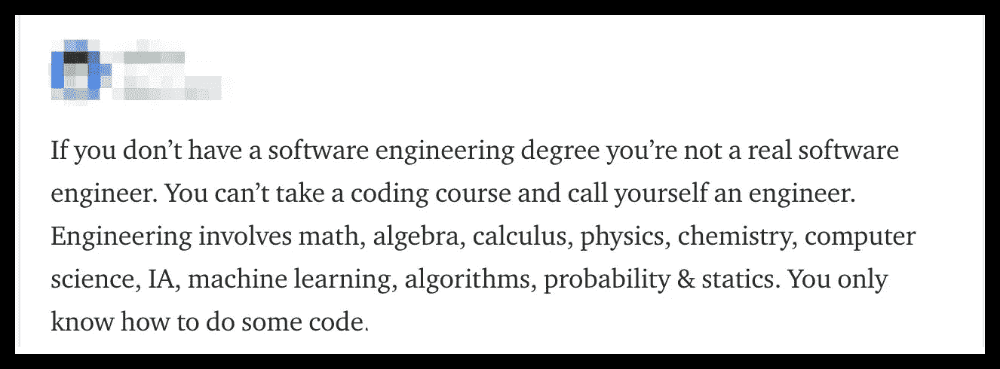
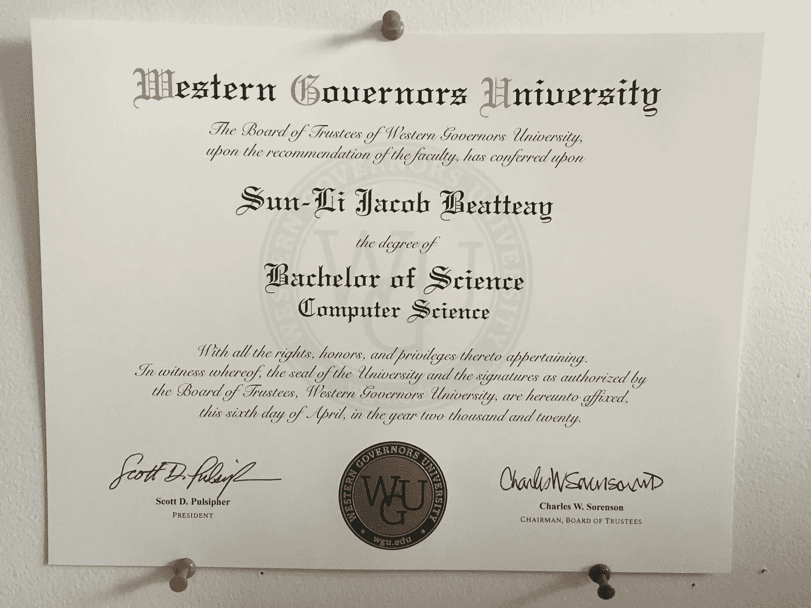

# 一个计算机科学学位值得吗？

> 原文：<https://betterprogramming.pub/is-a-computer-science-degree-worth-it-8afc94524fd8>

## 我回到学校寻找答案

Honey Yanibel Minaya Cruz 在 [Unsplash](https://unsplash.com?utm_source=medium&utm_medium=referral) 上拍摄的照片

*TL；博士:计算机科学学位值得吗？对我来说，部分是。给你的？你告诉我。*

2018 年 8 月，我在大学注册获得了计算机科学学位。然而，我不是典型的计算机系学生。首先，我快 30 岁了，已经有了九年前的大学学位。其次，我已经是一名全职的专业软件开发人员。

我班上的绝大多数其他学生要么想进入技术领域，要么想利用学位找到更好的工作。但我并不想做这两件事。如果我已经是一名软件工程师了，为什么还要回到学校呢？这是我经常听到的问题。理应如此。这似乎是浪费时间和金钱。或者至少对我告诉的人是这样。

我选择获得计算机科学学位有很多原因，比如提高我的计算机科学和算法基础——这些领域不是我的强项。但是有一个主要的原因促使我回到学校:看看所有的宣传是怎么回事。

你看，我写过几次关于我作为一个自学成才的开发人员进入技术领域的旅程。我听人说过，CS 学位是成为真正的软件工程师的唯一途径。虽然这些人是少数，但他们的声音大得足以让我挠头，想知道他们是否知道一些我不知道的事情。

“如果你没有软件工程学位，你就不是一个真正的软件工程师。…您只知道如何编写一些代码。”

尽管免费或廉价的在线资源不断增加，但为一个大学学位付出一大笔钱是否仍然值得？这仍然是成为软件工程师的最佳途径吗？

幸运的是，我能够自己回答这个问题。我有一个为大学课程提供报销的雇主，我找到了一所有在线计算机科学课程的大学，我可以在工作时间之外兼职。所以我决定进行一项实验。我将获得计算机科学学位，并最终亲眼看看这是否真的值得。

但是“值得”是什么意思呢？每个人都有自己的定义。在我的实验中，我认为，如果计算机科学学位能提供更多的就业机会，并且比我的自学路线更好地为我的工作做准备，那么它是值得的。

快进一年半到 2020 年 4 月，我的实验已经结束。我现在是一名计算机科学毕业生，有文凭可以证明这一点。

是的，那是我的学位

至于我实验的结果？这就是本文剩余部分将关注的内容。

顺便说一下:对所有这些都要有所保留。这个实验是为了娱乐，而不是作为同行评议的分析，我的发现只和我自己有关。不过，我希望我的经历能给你一些启发。

# (对一些人来说)学位仍然很重要

Clem Onojeghuo 在 [Unsplash](https://unsplash.com?utm_source=medium&utm_medium=referral) 拍摄的照片

我实验的参数之一是确定拥有学位是否会带来工作机会。没多久就找到了答案。

当我第一次注册 CS 项目时，我做的第一件事就是更新我的网站、简历和 LinkedIn。嘿，我很兴奋，想让每个人都知道这件事。我可以时不时有点虚荣。

在我更新 LinkedIn 的几周内，来自招聘人员的邮件明显增多。不仅如此，他们在邮件中直接提到了我的学位。

我收到一封招聘人员发来的邮件

但这本身并不令人信服。所以为了测试招聘者是否会注意到 CS 学位，我重新上传了我的简历。六个月前，我创建了一个雇佣档案，尽管结果相当令人沮丧。我很好奇这一次我是否会过得更好。

我做到了。差很多。

六个月前，我只找到了几个，所有的都试图通过谈判降低我想要的薪水。有了更新后的简历，我在几天内获得了八次点击，所有人都接受了我建议的薪水(我已经提高了)。

现在，我怀疑我简历上的新部分“计算机科学学位(2020)”是为了感谢所有这些新的兴趣。毕竟，我多了六个月的工作经验。但我确实认为它起到了一些作用，因为现在许多工作列表上都有一行写着“计算机科学学位(或相关经验)”我的学位在复选框里打了个勾。

照片由[格伦·卡斯滕斯-彼得斯](https://unsplash.com/@glenncarstenspeters?utm_source=medium&utm_medium=referral)在 [Unsplash](https://unsplash.com?utm_source=medium&utm_medium=referral) 拍摄

我不能说我对新的关注感到惊讶。CS 学位可以向招聘人员和招聘经理表明，你已经通过了认证机构的审查，并对软件工程有了基本的了解，这是他们对入门级工程师的期望。

另一方面，自学成才的工程师是一个通配符。由于他们没有以前的经验，如果不深入研究他们的投资组合，很难知道他们是否准备好了一份工作。但是大多数招聘人员不知道如何去做，或者没有时间。

值得指出的是，并不是每个招聘人员或招聘经理都会关心计算机科学学位。我在没有学位的情况下找到了一份工作，许多公司都在招聘清单上取消了学位要求。然而，就我所见，拥有一个绝对是你简历的福音，尤其是在你职业生涯的早期。

# 学位不是工作培训

JESHOOTS.COM 在 [Unsplash](https://unsplash.com?utm_source=medium&utm_medium=referral) 上[的照片](https://unsplash.com/@jeshoots?utm_source=medium&utm_medium=referral)

我实验的第二部分是评估计算机科学学位是否会比我的自学更好地为我的工作做准备。我认为这将是一次侥幸脱险。

我在西雅图长大，这里是微软、亚马逊和华盛顿大学最负盛名的计算机科学项目之一的所在地。我认识的每个软件工程师都有 CS 学位，大多数公司不会雇佣没有 CS 学位的人。从小到大，我一直认为计算机科学学位和大学教育是找工作的最佳培训。

然而，现在经历了两次大学生活让我意识到这与事实相去甚远。计算机科学学位不是工作培训。课程很宽，很浅，涵盖了广泛的科目。

凭经验来说，我学习的课程包括微积分、离散数学、操作系统、计算机体系结构、数据结构和算法、网络安全、项目管理、人工智能、机器学习等等。不仅如此，在一年半的时间里，我学会了三种不同的编程语言。

虽然在软件工程师的职业生涯中，学习所有这些主题都很重要，但这是非常超前的。当课程材料每个月左右从一个科目跳到另一个科目时，很难掌握一门特定的技能或语言。

精通很重要，因为雇主需要专业知识。他们想要能够在给定的角色中尽快表现出色并提供价值的人，无论是后端、前端、数据科学等。如果你是一个精通几种不同技能和语言的候选人，你更有可能被一个更擅长的人忽略。

让我说清楚。我不是说大学不好。大学被设计成通向高等教育的大门，并在推动未来的学生进入研究和学术界的职业生涯方面非常出色。

然而，太多人混淆了直接工作培训的学位。对于那些想从事 web 开发工作并且对学习 Linux 如何避免 POSIX 线程死锁不感兴趣的人来说，计算机科学学位不是他们想要的。

过去，一个计算机科学学位足以找到一份工作，但时代在变。就业市场的竞争一年比一年激烈，雇主对初级工程师的标准也越来越高。

就我所见，计算机科学课程本身不足以让学生为就业做好准备。通常，他们不得不通过兼职项目、开源以及实习(如果幸运的话)来补充他们的学习。没有的学生就会落后。

这解释了为什么越来越多的计算机科学学生参加编码训练营，为什么越来越多的新毕业生给我发电子邮件帮助我找工作。

# 这值得吗？

照片由[布伦丹·丘奇](https://unsplash.com/@bdchu614?utm_source=medium&utm_medium=referral)在 [Unsplash](https://unsplash.com?utm_source=medium&utm_medium=referral) 上拍摄

基于我实验的标准，我的计算机学位是否值得的答案是:有点。

我的收件箱里出现了比我拿到闪亮的文凭前更多的招聘人员。然而，关于它是否会比我的自学更好地培训我的工作，答案是响亮的不。

当然有一些课程与我的日常工作相关，但更多的是不相关的。当进入一个新的职业时，无论是你的第一份职业还是第五份职业，任何花费在学习你不会用到的信息上的时间都是机会成本。

然而，这并不是说我的计算机科学学位毫无价值。在我自学背景之上的补充教育方面，它是完美的。它扩展了我在计算机科学领域的知识，巩固了我的基础知识。例如，虽然我在工作中不直接使用 cgroups 和名称空间，但我确实使用 Docker 这样的容器系统。学习操作系统如何使用 cgroups 和名称空间教会了我很多关于容器如何在幕后操作的知识。

尽管所有文章的标题都是“自学与 CS 学位”和“我如何在没有 CS 学位的情况下找到工作”，但并不一定非此即彼。毕竟，[两种方法都有差距](https://triplebyte.com/blog/bootcamps-vs-college)。这都是为了找到平衡。

Christophe Hautier 在 [Unsplash](https://unsplash.com?utm_source=medium&utm_medium=referral) 上拍摄的照片

对于那些正在攻读计算机科学学位的人来说，确保通过兼职项目来磨练自己的编程技能。对于自学成才的开发人员，请花时间学习计算机科学的基础知识。你不需要像我一样获得学位；你可以简单地[自学 CS](https://teachyourselfcs.com/) 。

但是这篇文章并不是提供职业建议。事实上，带着强烈的怀疑态度看待每个人对教育的看法。虽然我有自己的偏好，但这并不意味着它们会为你工作。这都是关于权衡和找到适合你的。

学习的方法没有对错，只有你的方法。

[*订阅我的个人资料*](https://medium.com/subscribe/@SunnyB) *如果你想在我上传新故事时得到通知。*