# 神经网络比 Ash 更擅长探测火箭队吗？如果有，如何实现？

> 原文：<https://betterprogramming.pub/is-a-neural-network-better-than-ash-at-detecting-team-rocket-if-so-how-c00108c64174>

## TensorFlow 中的 CNN 训练、Google Cloud 中的对象检测模型以及 TensorFlow.js 中的激活图可视化


2020 神奇宝贝

我们的整个存在是一个永无止境的谜。宇宙中只有我们吗？人生有什么意义？在识别火箭队方面，神经网络比 Ash 更好吗？前两个问题是让许多科学家和哲学家夜不能寐的重要问题。然而，最后一个让我无法入睡。在这篇文章中，我将尝试回答这个问题。

这些天我花了一些时间看了《口袋妖怪秀》的第一季(反正我也不需要借口)。当我看着 Ash 和他的朋友们开始他们的冒险，捕捉口袋妖怪并成为最棒的(就像从来没有人一样)，我不禁注意到，当他们穿着他们标志性的服装时，他们从来没有认出火箭队。我的意思是，拜托，火箭队总是在那里，在你旅程的每一步，你告诉我你不能注意到他们？太奇怪了。但是当然，没关系；我猜是口袋妖怪世界规则。

但是后来，我想，“嗯，等等，神经网络怎么样？在识别火箭队方面，神经网络会比 Ash 和 crew 更好吗？”嗯，可能吧。但是这几天我没什么事做，所以让我们看看它的实际效果。此外，有时旅程比目的地更好。

在继续之前，对于那些不知道火箭队是谁的人来说，它是一个三人组——由杰西，詹姆斯和喵喵组成——扮演口袋妖怪动画的主要对手。它的主要目标是从亚什那里偷皮卡丘。对于这个项目，我只是考虑杰西和詹姆斯。

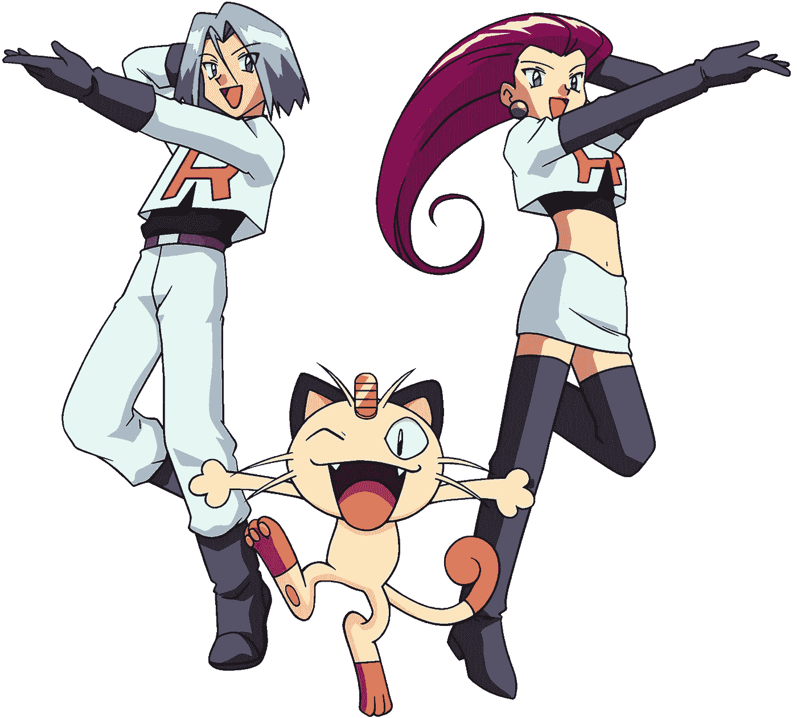

图一。火箭队:詹姆斯、杰西和喵喵 2020 神奇宝贝

在这篇文章中，我讨论了我的实验结果，在这个实验中，我使用了两个模型来区分火箭队。第一个是在 [Google Cloud AutoML](https://cloud.google.com/automl) 中训练的对象检测模型，用于检测图像中的杰西和詹姆斯。为了使用这个模型，我将它部署在一个 [TensorFlow.js](https://www.tensorflow.org/js) 应用程序中。从那里，我们可以探测到复仇女神队。第二个模型是在 TensorFlow 上训练的卷积神经网络(CNN)图像分类器，用于识别 Jessie 或 James。

然而，仅仅预测这些目标就有点无聊了。为了让事情变得更有趣，我还想知道为什么图像分类器会这样预测。换句话说，我感兴趣的是看到网络看到了什么，以及为什么图像分类器将图像分类为杰西或詹姆斯。因此，我扩展了 TensorFlow.js 应用程序，也使用图像分类器在预测时绘制 CNN 层的激活图。这样，我们将能够确定网络用来计算其预测的特征。

在本文中，我将解释训练模型和构建 web 应用程序的所有步骤。我们开始吧。


图二。真正邪恶的 2020 神奇宝贝

# 数据

我用来解决这个问题的数据集非常非常小。它由杰西和詹姆斯的 87 幅和 71 幅图像组成。为了在 Google Cloud AutoML 上训练对象检测模型，Google 建议每个标签至少有 50 张图像，所以我很好。对于图像分类器，我使用 TensorFlow 的 [ImageDataGenerator](https://www.tensorflow.org/api_docs/python/tf/keras/preprocessing/image/ImageDataGenerator) 。该生成器在每个历元对数据集进行变换，并用新变换的数据进行训练。因此，我使用的不仅仅是 158 张图片。

警告:我完全理解 158 张图片对于这样的问题来说是个笑话，模型的表现不会让人印象深刻。然而，请记住这是一个有趣的实验项目，不是我打算在 NeurIPS 或 ICLR 上发表的东西。此外，我不想花几个小时寻找火箭队的图像。

# 问题是

我说过，这里的主要问题是阿什认不出火箭队。想看看证据吗？看看这个:

尽管他们挥舞着大大的“R”旗，Ash 还是完全不知道。哇哦。这个怎么样？

是的，是火箭队。最后，这一个:

所以 Ash 不是唯一有问题的人。

# 对象检测模型

我创建的两个模型中的第一个是使用[谷歌云的 AutoML 视觉物体检测](https://cloud.google.com/vision/automl/object-detection/docs)训练的物体检测器。这项服务允许您轻松地(枯燥地)注释对象检测数据集，并在几次点击中训练一个模型。可以为 TensorFlow.js、TensorFlow Lite 和 TensorFlow 等几个推理引擎导出和优化训练好的模型。

不过，这项服务不是免费的。不过谷歌提供了一次性的信用券，应该够小型号用了。

## 创建和注释数据集

在训练 AutoML 对象检测模型之前，第一步需要上传数据集并对其进行注释。要上传数据，请通过在云控制台搜索栏中搜索“数据集”来访问数据集管理页面。然后，创建一个新的“object detection”类型的数据集(图 3)，并将图像上传到一个 bucket。

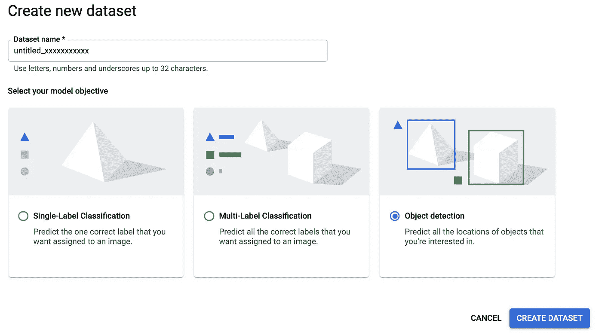

图 3。在 AutoML 中创建新数据集

上传并处理后，转到 IMAGES 选项卡，开始注释数据集的沉闷过程。在这种情况下，注释数据集包括在图像上绘制目标对象的边界框(图 4)——这并不有趣。


图 4。重复这个过程 100 多次

在数据集被标记后，单击“训练”选项卡来训练模型。

## 训练模型

训练模型只需三次点击。从当前屏幕，转到培训选项卡，并点击培训新模型。然后命名模型，选择“edge”(因为我们要下载)，选择优化目标(我用的是精度更高的)和节点小时预算，然后点击开始训练。使用默认的节点小时预算，以及我的数据集的大小，训练花费了大约四个小时。

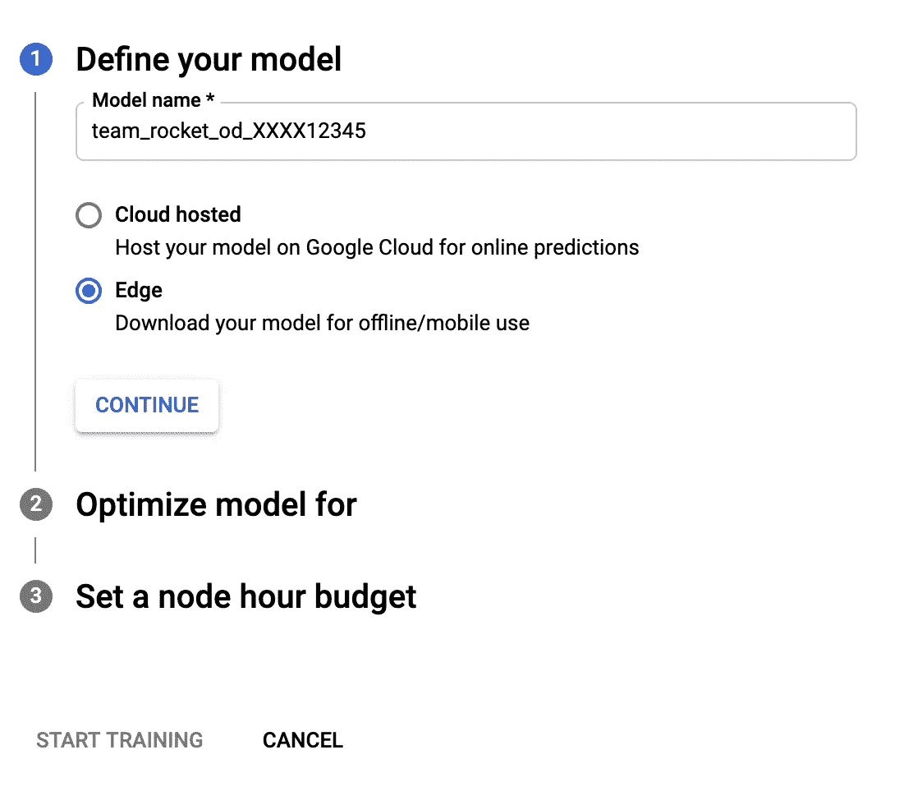

图 5。定义和训练模型

## 评估模型

培训已经结束；欢迎回来。要评估模型的指标，请转到“评估”选项卡。在这里，您可以找到精确度和召回分数，以及在不同阈值水平计算它们的选项。我的模型分别实现了 100%的准确率和 93.75%的召回率(图 6)。然而，在实践中，正如我们将很快看到的，该模型有点糟糕。不过没关系！考虑到训练集的规模，我不会期望模型有那么大。


图 6。模特的分数。

至于最后一步，转到 TEST & USE 选项卡，导出 TensorFlow.js 模型(图 7)。导出的目录应该有一个`model.json`(模型拓扑)和`dict.txt`文件(标签)，以及几个`.bin`文件(权重)。现在，让我们围绕模型构建一个应用程序。

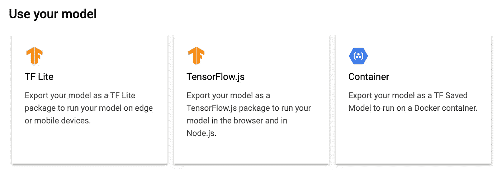

图 7。导出模型

## 在 TensorFlow.js 中部署模型

为了使用对象检测模型检测 Team Rocket 并运行图像分类模型来呈现激活图，我构建了一个 web 应用程序，它使用 TensorFlow.js 来加载模型并使用它们进行预测。在这一部分，我将展示我如何加载对象检测模型，用它进行预测，并绘制边界框。让我们从 HTML 开始:

在 head 标签中，我加载了 TensorFlow.js 和 [AutoML Edge API](https://www.npmjs.com/package/@tensorflow/tfjs-automl) ，这是一个加载和运行用 AutoML Edge 生成的模型的包。在主体中，有一个用户用来上传一个图像和两个图像标签的输入元素。一个显示原始图像，另一个显示带有边界框的图像。然后我们调用 JS 脚本:

在脚本的顶部，我们声明了模型变量及其选项。options 对象指定阈值，[交集超过并集(IoU)](https://en.wikipedia.org/wiki/Jaccard_index) 阈值，以及要返回的对象的最大数量。接下来是画布的上下文，我们将在其中绘制检测、输出图像的大小以及检测覆盖图的颜色。

第一个功能`setupODCanvas()`，设置目标检测画布。第二个，`drawBoundingBoxes()`，负责绘制边界框。然后是`processInput()`，预测的功能。这里我们使用图像输入元素的`onchange`事件来预测用户何时选择图像。一旦被触发，我们得到图像并把它作为`odModel.detect()`的一个参数，这个方法检测物体。检测之后，我们在画布上绘制图像和包围盒。

要运行 web 应用程序，请在项目的根目录下启动一个本地 web 服务器。您可以使用`$ python3 -m http.server`或 [http-server](https://www.npmjs.com/package/http-server) 轻松创建一个，这是一个用于创建 http 服务器的命令行工具。启动服务器后，进入服务器显示的地址，如 [http://127.0.0.1:8080/](http://127.0.0.1:8000/) ，访问 app。注意，在代码中，我使用的是端口 8080。

## 模型有能力探测火箭队吗？

从经验上来说，是的！它探测火箭队的能力比 Ash 强。但是，和 Ash 一样，它也会时不时地失败。让我们看看。下面是从上面呈现的剪辑的场景中的一些检测。

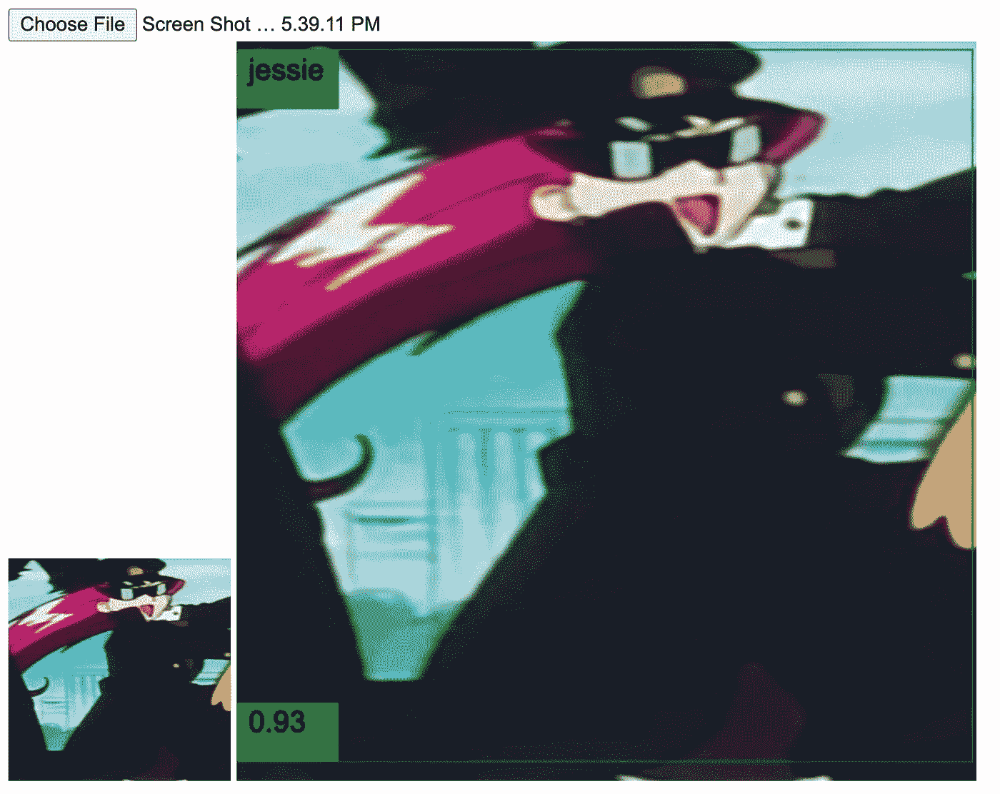

图 8。检测到杰西


图 9。检测到詹姆斯

干得好，神经网络！那的确是杰西和詹姆斯。以下是第二段视频。

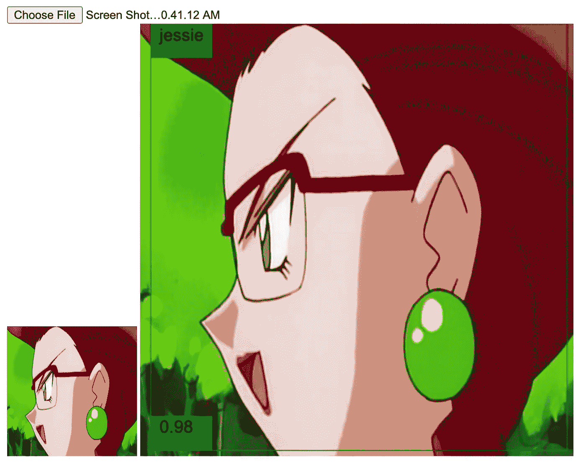

图 10。另一个发现了杰西


图 11。另一个发现了詹姆斯

再次，成功。


图 12。杰西。


图 13。詹姆斯。

这些是模型按计划工作的一些正面案例。但不幸的是，还有其他失败的例子。我注意到，在火箭队看起来太傻、图像缺乏细节以及从远处观看的情况下，该模型表现不佳(至少在其他人使用的相同置信度阈值下)。例如:


图 14。一个未被发现的杰西

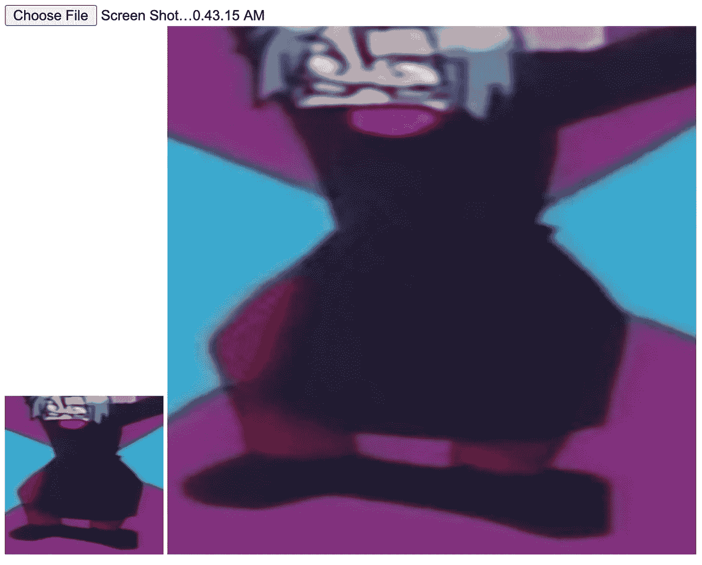

图 15。一个未被发现的詹姆斯

该网络在图像中检测它们时遇到了问题，这些图像没有显示它们最明显的特征:头发的颜色。举个例子，


图 16。那是杰西，不是詹姆斯。

在上图中，你几乎看不到杰西的头发。老实说，如果我不知道上下文，我也不会知道那是她。这与他们染发的情况相似:


图 17。不管怎么说，这并不容易。

我想提到的最后一个问题是，在我的所有测试中，网络都无法在一张照片中检测到两个成员。相反，它会将这两者检测为一个标签。在我看来，这种不便以及假阳性是实验的最大缺陷。希望增加更多训练数据后修复。


图 18。从技术上讲，这是正确的。

所以，总结一下，在探测火箭队方面，神经网络比 Ash 更好吗？我同意。现在又来了一个后续问题。网络是如何识别他们的？在说“是的，这是杰西”之前，它看到了什么？在实验的第二部分，我要解决这个问题。

# 解释激活图

通俗地说，卷积神经网络(CNN)通过查看其最突出的视觉特征来学习辨别类别。例如，美国有线电视新闻网可能知道香蕉是香蕉，因为它的形状像香蕉，颜色是黄色的。在实验的第二部分，我想研究 CNN 从杰西和詹姆斯的图像中提取的视觉特征。换句话说，我有兴趣看到网络的激活图，这是其卷积和最大池层的输出。

为了实现这个目标，我在 TensorFlow 中进行了训练，这是一个 CNN 图像分类器，可以预测图像是杰西还是詹姆斯。这样，我就知道为什么电视台认为这不是杰西就是詹姆斯了。随着网络的训练，我扩展了之前的 TensorFlow.js 应用程序，以加载模型并在屏幕上绘制所有层和每个过滤器的激活图。看起来是这样的:

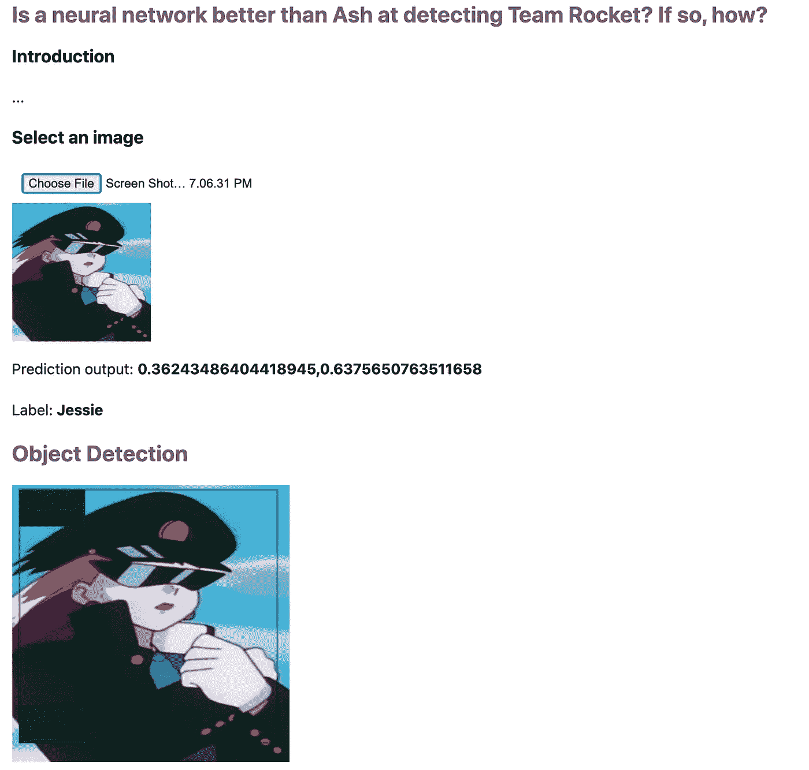

图 19。应用程序的分类输出和对象检测部分

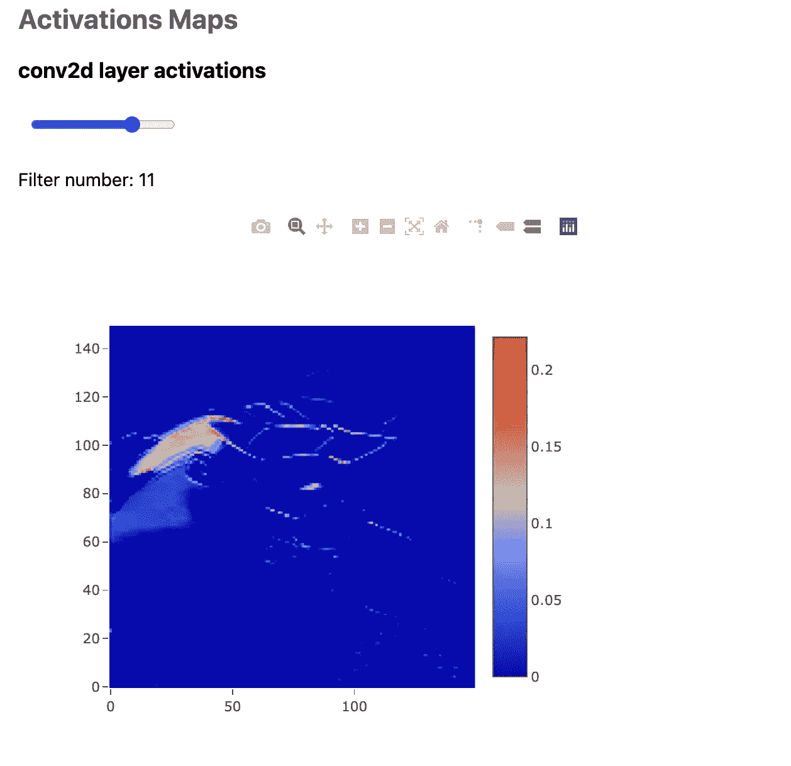

图 20。第一层的过滤器 11 的激活图

## 训练模型

图像分类器模型是一个非常标准的 CNN。它有三个卷积层，三个 max 池层，一个 dropout 层，一个具有 ReLU 激活功能的密集层，至于最后一个，另一个两个单元的密集层和 softmax 激活功能。这最后一位意味着输出是长度为 2 的向量，其中每个值是图像是 James(标签 0)或 Jessie(标签 1)的可能性。下面是模型的图表，后面是它的摘要。

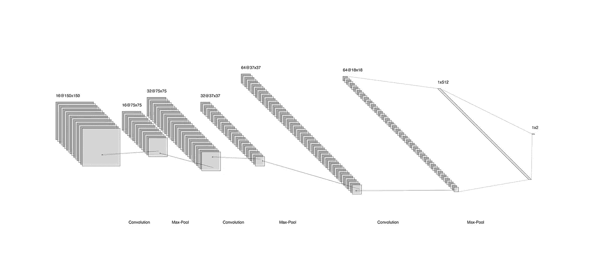

图 21。CNN。用 [NN-SVG](http://alexlenail.me/NN-SVG/index.html) 创建的图表

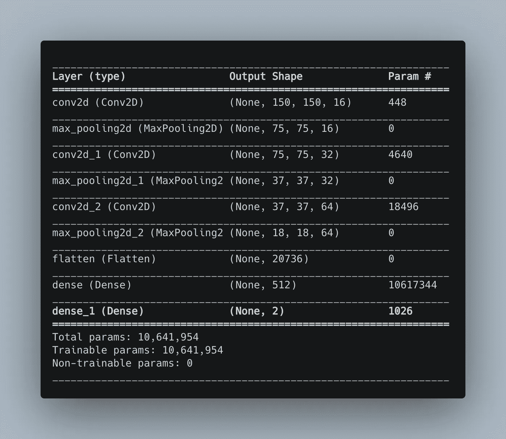

图 22。CNN 摘要

与之前的模型不同，为了训练这个模型，我有一个更丰富的数据集。嗯，有点:我没有使用 158 张图像，而是使用 TensorFlow 的图像生成器，通过转换现有的数据集来增加我的数据集。我应用的变换是将图像在[-45，45]度之间旋转，水平和垂直移动，水平翻转和缩放。此外，20%的生成图像被用作验证集。为了评估模型，我使用 TensorBoard。以下是完整的培训脚本:

第一个函数，`create_data_generators()`，创建生成器(当然它是这么做的，哈哈哈)。`train()`，参数都是发电机，训练模型。请注意，我们正在使用`model.fit()`上的 TensorBoard 回调来记录模型的训练信息。一旦训练结束，我们保存模型。

关于模型的性能，在 25 个时期之后，它分别实现了 0.8594 和 0.3367 的训练精度和损失值，以及 0.8065 和 0.2541 的验证精度和损失值。下面是来自 TensorBoard 的两张截图，展示了精确度和损耗值。

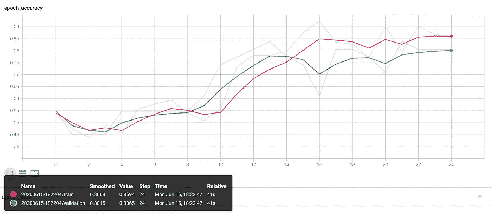

图 23:训练和验证的准确性。

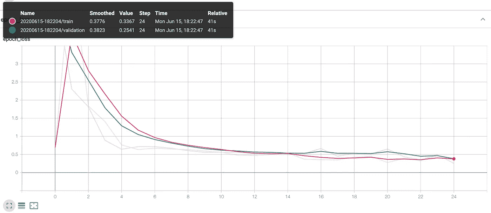

图 24:培训和验证的损失

要启动 TensorBoard，请在终端中执行:

```
$ tensorboard --logdir /tmp/tensorboard
```

确保给定的路径与`model.fit()`中使用的 TensorBoard 回调中使用的路径相同。

## 将模型转换为 TensorFlow.js 模型

在培训结束时，我们将模型保存到磁盘上。但是，这种格式在 TensorFlow.js 中是行不通的，要在我们的 web app 中使用模型，必须先将其转换为 TensorFlow.js 格式；这比听起来容易。要转换它，我们需要 [TensorFlow.js 转换器](https://github.com/tensorflow/tfjs/tree/master/tfjs-converter)工具。安装后，执行以下命令来生成模型的 TensorFlow.js 版本:

```
$ tensorflowjs_converter --input_format=keras_saved_model PATH/TO/TS_MODEL OUTPUT/PATH
```

## TensorFlow.js 激活 web 应用程序

我们将在这里看到的激活地图 web 应用程序是上一个应用程序的扩展。现在，除了检测团队火箭，它将分类图像之间的“杰西”或“詹姆斯”，并提出该层的激活地图。

你可以在[https://juandes . github . io/team-rocket-activations-app/index . html](https://juandes.github.io/team-rocket-activations-app/index.html)找到这个应用。

图 20 是该应用程序的屏幕截图。在这里，您可以看到图像输入控件、对象检测画布、预测结果，以及每层的一个部分，其中用户使用输入滑块来选择想要可视化的过滤器。我是如何构建应用程序的？是时候编写一些代码了，从 HTML 开始:

对于这个版本的应用程序，我使用可视化库 [Plotly](https://plotly.com/) 来可视化激活图。此外，我们有一个 CSS 文件，你可以在回购中找到。在主体中，有两个显示预测标签和输出的`<p>`和六个`<div>`(每层一个)用于选择我们希望绘制的过滤器的输入类型范围——最大值是该层的过滤器数量。这些`<div>`中的每一个都有另一个`<div>`，其中脚本以编程方式添加 Plotly 图。

这就是 HTML。至于 JS 脚本，在进入代码之前，让我快速解释一下它是如何工作的。该脚本使用三个模型:对象检测器、图像分类器和一个新模型。这个新模型输出一个由所有中间激活图组成的张量。我们将通过将其输入显式设置为图像分类器的输入，并将分类器的输出张量列表(卷积层和池层)作为输出来创建该模型。为了触发预测，用户首先要上传一张图片。之后，我们将在应用程序上显示检测到的火箭、分类输出和激活地图。现在，让我们一部分一部分地看代码:

上面我们有模型的变量:图像分类器，我们将用于激活的模型，以及对象检测器。跟在它们后面的是保存我们想要分类的图像的变量、画布上下文和描述一些图层信息的地图列表。

我想介绍的前两个函数是`setupODCanvas()`(之前的)和`initSliders()`，用于初始化滑块的输入。`initSliders()`的第二个参数是用户移动滑块时调用的回调函数:

然后是`drawActivation()`，在 Plotly 情节中绘制激活图的那个。它的参数是所有“预测的”激活、我们想要绘制其过滤器的层的索引、过滤器索引、绘图的 id 和过滤器的大小。在函数内部，我们使用了`tf.tidy(fn)`，一个 TensorFlow.js [函数](https://js.tensorflow.org/api/latest/)，它清理了`fn`分配的所有中间张量。在`tf.tidy()`中，我们得到由`layerIndex`和`filterNumber`表示的激活张量和滤波器。然后，我们将激活图转换为 2D 阵列，并将其绘制为热图:

之后是`setupSliders()`。这个函数迭代`layersInformation`并使用来自`layersInformation`的值调用`initSliders()`。`initSliders()`的第二个参数是当用户使用滑块选择图层的滤镜时触发的回调。在这种情况下，我们将使用`activationModel`生成激活图。预测之后，我们称之为`drawActivation()`:

接下来是`setupModels()`，负责初始化我们正在使用的三个模型。该功能从加载分类器和对象检测模型开始。之后，它遍历 CNN 的前六层(三个卷积和最大池)并将它们的输出添加到一个列表中。然后，我们使用 TensorFlow 的[功能](https://www.tensorflow.org/js/guide/models_and_layers#the_functional_model)方法创建一个新模型，命名为`activationModel`，在该方法中，我们必须指定模型的输入和输出:

以下功能与之前的`drawBoundingBoxes()`相同:

现在出现了第一个预测函数。这个叫做`predictWithObjectDetector()`，使用输入图像检测火箭队，就像我们之前做的一样:

下一个名为`predictWithClassifier()`的函数获取输入图像，将其转换为张量，并预测其标签和激活。预测之后，该函数从每一层绘制第一个过滤器的激活图，并将预测结果添加到 HTML 中。该函数在用户上传图像时运行。与我们对来自`initSliders()`的回调所做的预测不同，在那里绘制了用户选择的过滤器的激活，在这里我们将可视化每个层的第一个过滤器:

然后是将所有东西粘在一起的功能:`processInput()`。这个函数使用几个事件来加载用户选择的图像，在屏幕上绘制图像，并调用前面的预测函数:

最后，有一个 init 函数作为应用程序的起始点。

那是代码。要运行该应用程序，请遵循之前讨论的方法。

# 模型是如何识别火箭队的？

在那堂漂亮的 TensorFlow.js 和 js 课之后，是时候回答我们的第二个问题了:模型是如何识别火箭队的？它在预测时间看到了什么？为了回答这个问题，我将展示几个激活图，从下图开始:

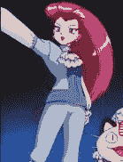

图 25。更多杰西和一点喵喵 2020 神奇宝贝

CNN 说这是杰西——0.99 杰西和 0.01 詹姆斯，根据 softmax 的输出。但为什么是她？好吧，你自己看吧。


图 26。激活图

图 26 显示了来自六层的一些过滤器的激活图。前两个图像来自第一个卷积层和最大池层。接下来的两个来自第二组卷积和最大池，最后两个来自第三组-因为每个连续层都比前一层小，所以图像的分辨率会降低。在这些热图上，颜色的强度代表了 CNN 用来识别物体的区域。这就是为什么杰西的头发，可以说是她最具标志性的特征，如此突出并不奇怪。

然而，这些图像并没有讲述网络的全部故事。它们只是模型中 100 多个过滤器中的一小部分。虽然大多数贴图侧重于头发，但其他贴图会查看其他部分:


图 27。喵喵的确是一个美丽的地方

在下一个例子中，考虑詹姆斯的图像:


图 28。詹姆斯和他令人敬畏的假胡子 2020 神奇宝贝

CNN 正确预测了“詹姆斯”(杰西 0.20，詹姆斯 0.80)。像以前一样，网络也主要关注头发，在某些情况下，关注那雄伟的假胡子。


图 29。詹姆斯的激活地图。

没有什么是完美的，这包括我的网络。在我的测试中，我发现了一些 CNN 预测错误的例子。一个例子是物体探测器无法探测到的杰西的同一张照片——我们可以说这是因为头发几乎不存在。


图 30。又错了

这是激活图。杰西没有可辨认的特征。


图 31。没有找到头发。

就这样，我们结束了实验！要查看更多示例，我将邀请您查看上面展示的交互式演示，或者克隆回购并自己运行它。

# 结论和概述

生活充满了问题。我是谁？是先有鸡还是先有蛋？神经网络比 Ash 更擅长探测火箭队吗？在这个实验中，我试图回答最新的问题。结果令人满意，我愿意用“是”来回答这个问题为了这个项目，我训练了两个网络，一个对象检测器和一个图像分类器来检测图像中的团队火箭，并了解 CNN 认为相关的特征。为了使用这些模型，我们使用 TensorFlow.js 创建了一个 web 应用程序来加载它们，并显示检测到的火箭和激活图。

给我亲爱的朋友小智，这些是我给你的建议。正如我们从对象检测器模型中了解到的，如果你需要知道你面前的团队是否是火箭队，那么试着一次分析每个人；不要把他们看成一个群体。其次，试着和他们更亲近一点——这很有帮助。最后，这不是一个巨大的突破，集中在头发上。如果是鲜红色的长型，很有可能那个人就是杰西。或者，如果矮个子，浅蓝色，很可能是詹姆斯。

对于该项目的未来迭代，我想修正对象检测器，以检测同一帧中的两个恶棍。同样，我想训练一个多标签 CNN，能够在一个图像中同时识别杰西和詹姆斯。

就是这样！你可以在[https://github.com/juandes/team-rocket-activations-app](https://github.com/juandes/team-rocket-activations-app)找到完整的源代码，在[https://juandes . github . io/team-rocket-activations-app/index . html](https://juandes.github.io/team-rocket-activations-app/index.html)找到该应用的运行版本。您可以在 data/test/目录中找到适合测试模型的图片。

感谢阅读。

如果你有任何问题，评论，或存在危机，在这里留下评论。

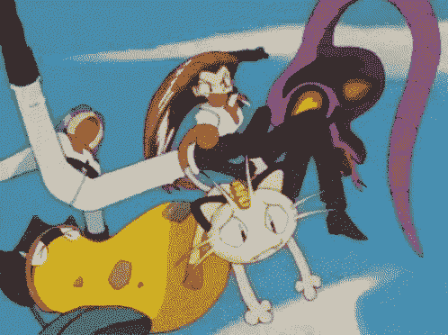

火箭队再次升空了！

*为了谨慎起见:神奇宝贝和所有相关名称都是任天堂 1996-2020 的商标。*