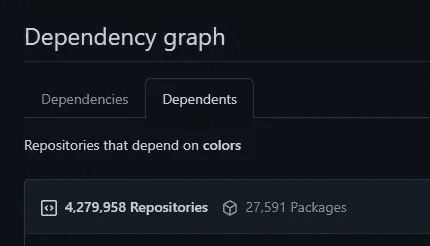

# NPM 激进主义现在是一件事吗？

> 原文：<https://betterprogramming.pub/is-npm-activism-now-a-thing-63b322e8ec62>

## 如果是的话，你如何保护自己


让这成为我们的一个教训

几天前，一个流行的 NPM 软件包 Colors.js 的维护者故意发布了一个更新，导致该软件包停止工作，并破坏了一吨依赖于它的软件包。

考虑到仅仅几周前互联网还在为 Log4J 中的一个*意外*漏洞所困扰，遇到一个由软件包维护者引入的*故意*问题是非常不幸的。

# 这是怎么发生的？

一个新的包被发布到 NPM，这导致了一个无限循环。因此，依赖于`colors.js`的包在试图加载库时会陷入无限循环。

所以，这个问题很大程度上是由有多少包依赖于`colors.js`来定义的，对吗？那么有多少包裹依赖于`colors.js`？


因此，18，961 个包以某种方式依赖于`colors.js`。即便如此，这还不是故事的全部，因为可能有依赖于`colors.js`的包，然后其他包依赖于这些包。诸如此类。

但这并不能说明全部情况。GitHub 告诉我们有多少库依赖于`colors`，并不好。



*超过四百万个存储库。每分钟都在创造更多。这些仓库中的每一个，无论是数百万人在使用还是没有人在使用，都可能受到这一变化的影响。*

# NPM 激进主义的时代已经来临

事实是，在我们生活的世界里，如果人们对某件事有强烈的感觉，他们会使用他们所掌握的工具来表达他们的观点。如果那个人有一个非常受欢迎的 NPM 包，他们会故意打破它，只是为了制造足够大的火来吸引人们对他们事业的注意。

此外，在这个世界上，大多数开发人员在某种程度上依赖开源包。而且，在任何时候，如果一个包的维护者决定这么做，他可以把恶意代码推到他自己的存储库中。没有什么能阻止任何人这样做，除了他们自己的“个人准则”或道德。

即使是一直流行的麻省理工学院许可证也明确保护原始创作者免受任何类型的由他们创作的包引起的行为。如果你想知道的话，这里有一点。

```
THE SOFTWARE IS PROVIDED "AS IS", WITHOUT WARRANTY OF ANY KIND, EXPRESS ORIMPLIED, INCLUDING BUT NOT LIMITED TO THE WARRANTIES OF MERCHANTABILITY,FITNESS FOR A PARTICULAR PURPOSE AND NONINFRINGEMENT. IN NO EVENT SHALL THEAUTHORS OR COPYRIGHT HOLDERS BE LIABLE FOR ANY CLAIM, DAMAGES OR OTHERLIABILITY, WHETHER IN AN ACTION OF CONTRACT, TORT OR OTHERWISE, ARISING FROM,OUT OF OR IN CONNECTION WITH THE SOFTWARE OR THE USE OR OTHER DEALINGS INTHE SOFTWARE.
```

我不是律师，你不应该以任何形式的权威阅读我说的任何话，但我想说的是，这一条款的意图是，如果你制作了一个包并免费发布，NASA 开始使用它，出现了问题，导致火箭偏离轨道并爆炸，你个人对此不负责任。该软件包没有担保，并且“在任何情况下，作者…都不对任何索赔负责”。在我看来，这应该是为了保护那些创建包并可能把事情搞砸的人，而这导致了现实世界的问题。他们尽了最大努力，但还是出了点问题，不过没关系。麻省理工学院的许可证保护他们免受法律报复。

但是，它*也*保护那些明确打算通过他们的行为造成损害的人。记住，“决不”。不可否认，这不是我以前想过的事情，但它看起来很简单。软件包维护者可以做他们想做的任何事情，包括推送恶意代码，只是受限于我们的希望和梦想，他们*不会*这么做。当你仔细想想，这是很弱的。

> 事实是，在我们生活的世界里，如果人们对某件事有强烈的感觉，他们会使用他们所掌握的工具来表达他们的观点。如果那个人有一个非常受欢迎的 NPM 包，他们会故意打破它，只是为了制造足够大的火来吸引人们对他们事业的注意。

# 人们总是会被这个弄得措手不及

如果我创建了一个依赖于受损包的应用程序，并且它在启动时陷入了这个无限循环，我会认为我犯了一个错误。也许我拉错了包裹，或者别的什么。

更糟糕的是，如果我正在做一个我以前做过的项目，它突然停止了工作，我会很快认为是我的环境发生了变化导致了这个问题。

关键是，在我的列表中“也许我所依赖的一个包已经被破坏了”有多远。它在地平线上如此遥远，由于地球的曲率，你甚至看不到它。作为一名开发人员，我觉得如果某件事不成功，总是我的错。那意味着我总能修好它，对吗？对此 GitHub 有很多评论，人们说“我花了 2 天时间在这上面”，因为当一个包突然失控时，每个人都会完全不知所措。

# 如何保护自己

事实是，如果你有一个软件项目，你把依赖关系拉进来，你相信某个你不认识的人的品质和道德，他写的代码你可能永远也不会读。你不断地暴露在这种风险中，这一点永远不会改变。当然，你也总是面临其他风险，比如一架飞机从天上掉下来砸在你的房子上，或者一颗流星撞到你的邻居。幸运的是，这些事情很少发生，一个包维护者故意破坏他的包也很少发生(至少现在是这样)。

如果你真的关心这个，你可以更明确地依赖你的`package.json`中的包。通常，您的依赖关系如下所示:

```
foo: ^1.0.0
```

这个小的`^`意味着你的项目将接受*补丁*版本的增加。所以如果我推`foo 1.0.1`，下次你运行`npm install`，或者有人克隆项目运行`npm install`，他们会得到下一个次要版本。这是[语义版本](https://docs.npmjs.com/about-semantic-versioning\)的一部分，如果只有最后一个数字发生变化，那么它被认为是一个补丁发布，并且是一个不间断的变化。

如果我把它改成:

```
foo: 1.0.0
```

那么 NPM 将永远只能得到软件包的 1.0.0 版本，没有如果、但是或可能。这有一个明显的缺点，那就是永远得不到那个包的任何补丁发布，所以如果在`foo 1.0.0`中发现了一个关键的漏洞，并在`foo 1.0.1`中打了补丁，除非你明确地改变你的版本约束，否则你不会得到那个补丁。

另外，也不能保证您对一个受损的包有一个可传递的依赖关系(也就是说，您不直接依赖这个包，但是您所依赖的包之一有依赖关系)。在这种情况下，您需要原始的包维护者来更改他们的依赖关系，或者您需要自己派生并修补它。

> 你不断地暴露在风险中(软件包变得不可靠)，这一点永远不会改变。当然，你也总是面临其他风险，比如一架飞机从天上掉下来砸在你的房子上，或者一颗流星撞到你的邻居。幸运的是，这些东西相当罕见。

严酷的事实是。我们可能有数以千计的依赖于免费可用的开源项目，这些项目是由志愿者在空闲时间维护的。如果有人决定破坏自己的包来伤害他人，那是在他们作为包维护者的权限范围内。当然，我们希望他们不要这样做，但是如果我们对此有强烈的感觉，我们唯一能保证的方法就是我们自己制作包装。

因此，相反，我们接受这个事实，这实际上是一个东西。开源和 NPM 软件包现在是人们行动主义的一个渠道。至少，现在我们知道这是一种可能性，也许下次我们的项目无法构建时，它会为我们节省一些调试时间。也许我们会想“有人故意破坏这个项目吗？”。