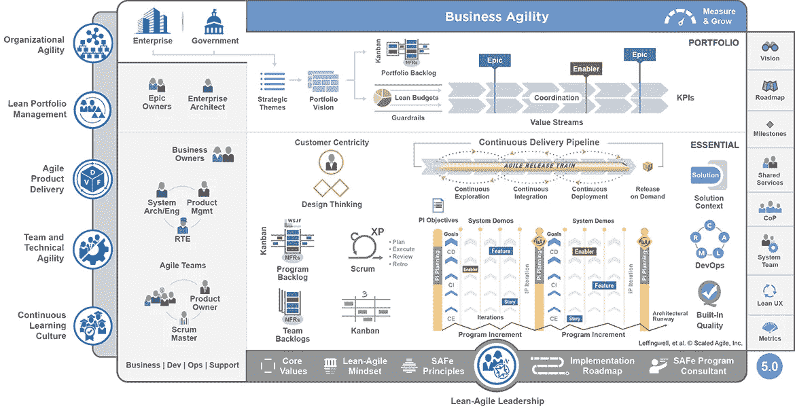

# Scrum 要死了吗？

> 原文：<https://betterprogramming.pub/is-scrum-dying-52c72c1ab347>

## 对大多数公司来说，富有成果价值的乐土似乎遥不可及。难怪他们在寻找替代品

[张家瑜](https://unsplash.com/@danielkcheung?utm_source=medium&utm_medium=referral)在 [Unsplash](https://unsplash.com?utm_source=medium&utm_medium=referral) 上拍照

2010 年，第一份 Scrum 指南发布。在那之后，世界将不再一样。对于大多数数字公司来说，原本被认为是轻量级的框架变成了世界标准的工作流程。市场张开双臂欢迎 Scrum，创造了数以千计的 Scrum 大师和产品负责人职位。Scrum 所说的角色成为了许多人的职业——包括我自己。

世界上许多公司将 Scrum 视为银弹；他们相信 Scrum 会确保成功。然而，只有少数几个公司能够到达富有价值的乐土。这样的公司在他们的业务中表现出色，而那些没有达到目标的公司则彻底毁了 Scrum。

当公司无法用 Scrum 得到他们想要的结果时，他们会寻找替代方案。一个常见的失败发生在扩展时:生产力下降，依赖性增加，团队迷失。高管们不相信 Scrum 能提供他们需要的控制，然后他们渴望更健壮的结构。旧的瀑布思维模式开始出现，然后像可伸缩敏捷框架(SAFe)这样的框架成为答案。公司想要变得敏捷，但是他们不能放弃旧的命令和控制风格。

现在，Scrum 面临着前所未有的阻力。我偶然发现世界各地的公司都鄙视 Scrum，他们想要不同的东西。像下面这样的句子在决策者中很常见:

*   这对我们没用。
*   Scrum 就像政客:他们承诺给你天堂，而你得到的却是地狱。
*   它只对小团队有效。
*   Scrum 用大量的会议淹没了人们。

让我详细解释一下为什么我认为 Scrum 正处于崩溃的边缘。

# Scrum 不是银弹

几十年来，瀑布是公司开发软件的方式。大多数从事 it 工作的人都经历过类似的痛苦:孤立的团队、缺乏协作、客户参与度低等。尽管过程详尽，但结果往往很差——这种解决方案让客户感到惊讶，因为它没有解决他们的问题。公司无法通过传统的瀑布模式取得成功，迫切需要改变。这时 Scrum 进来了。

出了什么问题？过程还是别的？在回答这个问题之前，先考虑一支几十年都没拿过冠军的足球队。然后，一位新教练接手，他们决定实施[全足球](https://en.wikipedia.org/wiki/Total_Football)——这就是荷兰国家队如何在 70 年代震惊世界的。尽管教练很乐观，结果还是和以前一样糟糕。

一支球队只有改变比赛方式才能获胜吗？可能不会，因为除了团队如何比赛，还有更重要的方面，例如，调整心态，管理层的支持，以及拥有合适的球员。

由[米克·豪普特](https://unsplash.com/@rocinante_11?utm_source=medium&utm_medium=referral)在 [Unsplash](https://unsplash.com?utm_source=medium&utm_medium=referral) 上拍摄

许多公司在没有解决功能障碍的情况下用 Scrum 替换了瀑布。第一个巨大的误解是将 Scrum 视为一个过程，而不是一个框架。事实上，Scrum 在设计上是不完整的。没有一家公司能单靠 Scrum 取得成功。例如，产品管理不是 Scrum 的一部分，但是它对于交付成功的产品是至关重要的。

无论公司使用哪种开发流程，在功能障碍得到解决之前，都不会顺利运行。其中一些是:

*   指挥和控制
*   目标不明确
*   基于层级的优先级排序
*   微观管理

对于不解决功能障碍的公司来说，Scrum 的失败是不可避免的。然而，Scrum 会受到指责。

Scrum 不是害怕改变的组织的框架。如果没有敏捷的思维，Scrum 是不可能成功的。这就是为什么更保守的公司在 SAFe 中找到了他们的避风港，SAFe 是一个与 Scrum 无关的高度规定性的框架。

> “话说回来， [SAFe 和 Scrum](https://medium.com/serious-scrum/safes-scrum-vs-scrum-according-to-the-scrum-guide-they-are-not-the-same-bea882add76d) 有着不同的用途。外管局在很大程度上是一个交付框架。Scrum 的存在是为了解决复杂的问题，同时交付尽可能高的价值。这是一个重要的区别。外管局更符合传统的方法和公司结构。这对高层管理人员的威胁较小。但是它也不能带来最好的灵活性。它没有带来最高价值的产品。”
> 
> — [威廉-扬·阿格林](https://medium.com/u/a55fee07a2c4?source=post_page-----52c72c1ab347--------------------------------)， [Scrum 已经撞上了玻璃天花板](https://medium.com/serious-scrum/scrum-has-hit-the-glass-ceiling-3610bb978b1d)

当我看着 SAFe 时，我总是感到害怕，因为这是一个沉重的过程。它让我想起了我的电子电路课；这看起来一点也不像敏捷方法。比如谁负责什么？为了了解客户的动态，我需要一些时间来找到他们。我想知道他们为什么厚颜无耻地称之为敏捷。

[保险箱 5.0](https://www.scaledagileframework.com/)

# 为什么 Scrum 濒临灭绝？

Scrum 是世界上最常用的敏捷框架，但是公司如何实现它却有很大的不同。成功和失败的尝试之间的区别取决于组织愿意改变的程度。当 Scrum 的实现只涉及执行时，结果可能与前面的场景类似。尽管如此，当公司敢于触及其文化时，成功就在路上了。

实现 Scrum 最常见的方式是什么？我猜你知道会发生什么。高层管理人员不愿意改变文化，因为他们不确定这样的重大转变会带来有意义的价值增长。

> “最高管理层认为，拥有真正自我管理的团队风险太大。这就是 Scrum 遭遇玻璃天花板的原因。”
> 
> — [威廉-简·阿格林](https://medium.com/u/a55fee07a2c4?source=post_page-----52c72c1ab347--------------------------------) , [Scrum 已经碰到玻璃天花板](https://medium.com/serious-scrum/scrum-has-hit-the-glass-ceiling-3610bb978b1d)

高层管理没有准备好授权给 Scrum 团队；他们想保持控制。这就是他们走捷径的原因。第一，改变执行力。然后，如果 Scrum 证明了它的价值，改变文化。好吧，这样是不行的，结局是让所有人失望。当 Scrum 只用于执行时，角色会变得有些尴尬。让我分享一些我的观察。

善良好奇的在 [Unsplash](https://unsplash.com?utm_source=medium&utm_medium=referral) 上的照片

## 产品所有者

产品负责人将像服务员一样工作，直到他们对优先级负责。他们接受订单，推荐一道配菜，然后把订单送到厨房。做一名接单员是令人沮丧的；你唯一要做的就是管理涉众的期望，并与开发人员沟通。

产品负责人角色的变化是如此普遍，以至于很多时候我怀疑某人是否是 Scrum 产品负责人。当我回顾我的职业生涯时，我可能接近成为一个，但是从来没有像 Scrum 指南建议的那样被完全授权。我的问题是:Scrum 产品负责人在企业界存在吗？

> “产品负责人这个角色是不是像尼斯湖水怪一样，只存在于我们的想象中？是不是我们只能说、读、幻想，却永远不会在现实世界中见证的东西？”
> 
> — [马腾达尔米恩](https://medium.com/u/b40569a4ce51?source=post_page-----52c72c1ab347--------------------------------)，[请真正的产品负责人站起来好吗？](https://medium.com/serious-scrum/will-the-real-product-owner-please-stand-up-951917cf7b18)

## 开发商

理论上，开发人员是决定如何工作的人。他们完全负责如何实现、使用哪种技术堆栈等等。再说一次，我从没见过。通常会有一个首席技术官(CTO)，一个技术领导，或者其他人，他们不仅发号施令，还对开发人员进行微观管理。

开发人员得到了 Scrum 的自主权，但是他们得到了吗？我觉得不是这样的。不幸的是，大多数开发人员都收到了要实现的清晰的解决方案；开发人员很少被授权在没有确切期限的情况下解决问题。

在幻想世界中，Scrum 开发人员可能会和 Scrum 产品负责人在一起，但在现实中不会。我们很容易发现开发人员被锁定在一个特性工厂中。

## Scrum 大师

Scrum 中最被忽视的角色是 Scrum Master。没有 Scrum 大师的 Scrum 团队很常见，因为公司认为付钱给某人做这项工作是浪费金钱。但是当他们是团队的一部分时，Scrum Masters 通常是无能为力的，因为他们不能促进必要的改变来允许 Scrum 蓬勃发展。

Scrum Master 角色和其他角色没有什么不同。不太可能找到一个完全像 Scrum 指南建议的那样的人。

# Scrum 会幸存吗？

考虑到所有 Scrum 角色的变化，许多高水平的专业人员厌倦了 Scrum；他们对它失去了信心。他们渴望别的东西，这样的专业人士正在寻找机会试验不同的框架。

高层管理人员不愿意改变，导致团队采用淡化的 Scrum 版本，从而导致糟糕的结果。一系列的错误决策和误解可能会导致 Scrum 走向死亡。高层管理正在回归其根本:命令和控制。这就是秘密瀑布代理人 SAFe 可能会受到关注的原因。

# 如何避免 Scrum 的终结

如果公司愿意改变他们的心，而不仅仅是他们的头，他们可以用 Scrum 茁壮成长。Scrum 需要思维模式的改变，不管公司使用哪种敏捷框架，他们都会失败，除非他们改变旧的思维模式。但是还有希望。一些公司愿意改变，他们表现出的一些迹象是:

*   最高管理层了解产品管理的需要，首席产品官成为执行团队的一部分。
*   路线图是基于客观的关键结果规划的，高层管理定义目标，Scrum 团队定义结果。
*   Scrum 团队被授权尝试不同的选择来达到关键的结果。
*   产品发现成立。高管们知道，投入适当的时间来发现值得解决的问题是至关重要的。

这从来都不是关于做得更好的 Scrum。一切都是为了提供更多价值！