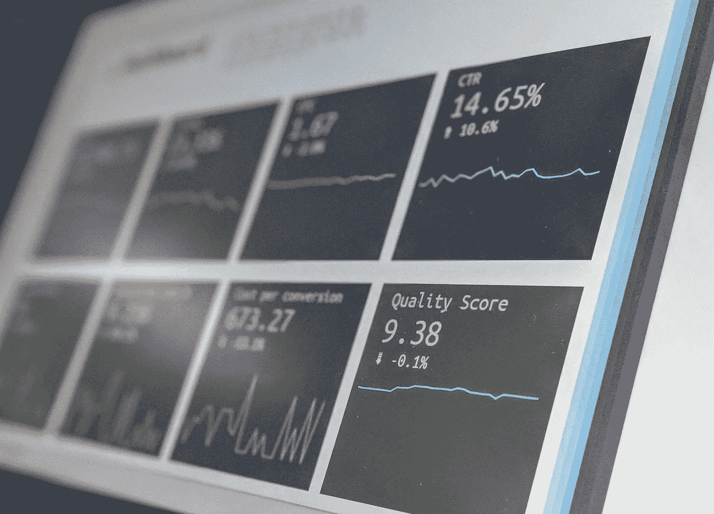

# 你的开发团队懈怠了吗？

> 原文：<https://betterprogramming.pub/is-your-development-team-slacking-f0124d85f962>

## 帮助提高团队绩效的技巧

在 [Unsplash](https://unsplash.com/s/photos/business?utm_source=unsplash&utm_medium=referral&utm_content=creditCopyText) 上由 [Adeolu Eletu](https://unsplash.com/@adeolueletu?utm_source=unsplash&utm_medium=referral&utm_content=creditCopyText) 拍摄的照片

我们大多数人发现自己经常处于这样一种情况:不得不为发布客户请求或规划下一季度的路线图给出时间估计。

除了这些请求，团队内部关于工资、工作量和绩效的讨论都可以通过记录和使用开发人员绩效指标来支持。

# 让您的日常数据为您服务

全球的大多数开发团队都有所有可用的数据来衡量他们的产出——问题是:他们应该这样做吗，如果是，有什么好处？

是的，做吧。简而言之，了解你的团队的能力可以让你们所有人有信心以诚实和开放的方式与客户和其他部门沟通。您还可以加强和指导团队成员取得更多成就，并随着您的项目发展他们的技能。

照片由[艾萨克·史密斯](https://unsplash.com/@isaacmsmith?utm_source=unsplash&utm_medium=referral&utm_content=creditCopyText)在 [Unsplash](https://unsplash.com/s/photos/chart?utm_source=unsplash&utm_medium=referral&utm_content=creditCopyText) 拍摄

在我目前作为开发主管的角色中，我对我的团队和相关的产出负责。在我们公司内部，我们对所有员工使用 SMART 目标。SMART 代表具体的、可衡量的、可实现的、现实的和有时间限制的。

定期检查这些目标(至少每季度一次)。我们的开发绩效指标包括了开发团队的一大部分目标。使用这些目标会有所帮助——不仅在技术方面，而且从人力资源的角度支持你。

# 如何开始

在我们查看单个指标之前，我想指出，当然，记录和使用您的数据有不同的方式。

我在这里描述的是我们处理它的方式，到目前为止效果很好。为了让您更好地理解，在我们开始之前，这里有一点背景:我们已经使用这个模型两年了，我们能够大幅提高我们的整体性能(质量、输出、预测)和效率(花费的时间与输出)。

我们关注三个关键指标，如下所述:

## 测试周期

一个测试周期是一个任务被标记为完成后从 QA 返回给开发人员的次数。要完全理解这个数字，你需要一点背景知识——首先，[done](https://medium.com/@c.muehle18/definition-of-done-cfe6eb0401b8)的定义。

其次，你需要定义什么是可接受的，什么对你的团队和项目来说太高了。计算这个数字需要您知道任务的测试和开发时间，包括开发人员将任务标记为完成的次数。

每个周期都会花费你一些时间，所以减少每个开发人员的平均周期会为其他任务释放一些空间——或者只是让你更放松地工作。

对于整个团队来说，我们能够将这个数字从平均 2.8 降低到大约 1.6，为我们提供大约 40 多个小时/月。请记住，这个指标需要您的开发人员和测试人员的存储时间，以及任务状态变化的历史记录。如果你使用一个票系统，它应该很容易提取——如果没有，这可能是一项艰巨的任务。

## 生产时间

你在真正的工作上花了多少时间？如果你是一名开发人员，开发将是你的核心任务(包括测试、编写文档等)。)，但是你真正花在上面的时间有多少呢？

我们的目标是将总时间的至少 60%用于开发。根据您的角色，这个数字可能会有所不同，但是这个数字应该会告诉您是否有消耗您时间的问题。

请记住，如果有人错过了这个目标，这可能与他的工作没有直接关系。很多因素可能会浪费时间。尽快行动以防止延误或挫折是很重要的。许多开发人员喜欢开发，如果他们不得不在会议或其他任务上花费太多时间，他们可能会感到沮丧。

根据我的经验，我可以告诉你，如果我们的数字下降到 60%的边界，这是一个艰难的月份——团队压力很大，我需要关注可能即将到来的阻碍任务，甚至将一些任务移到下个月。

在 [Unsplash](https://unsplash.com/s/photos/in-time?utm_source=unsplash&utm_medium=referral&utm_content=creditCopyText) 上[智妍公园](https://unsplash.com/@greenpjy123?utm_source=unsplash&utm_medium=referral&utm_content=creditCopyText)的照片

## 准时

对每个开发人员来说，一个非常重要的技能是估计一项任务需要多长时间。不要低估这项技能——如果你需要对任务进行优先排序，以便首先及时完成更重要的事情，它会派上用场。

我只是鼓励你至少让票的主人估计一下时间预算，并对此负责。我们的工作流程是这样的:

*   一项新任务被批准进入路线图。粗略的时间估计已经出来了(由 QA、产品负责人或记者提供)。
*   在一般的基础上审查时间估计—它是否适合任务(包括测试和开发时间)？
*   分配任务。您可能需要根据新的任务所有者来更改时间(根据技能进行调整，也就是个人因素)。
*   允许业主改变估价。如果有偏差，再次讨论以确保下一次评估更加准确。

现在的目标是按时完成分配给你的一定比例的任务。对我们来说，这个目标是 60%。如果这个数字低于这个数字，这是一个很好的指标，表明要么估计错误，要么缺乏技能，要么缺少信息/工具。

当然，这也会受到项目本身的影响。如果基本任务花费的时间比计划的多，这可能是高技术债务的迹象:

 [## 工程中的技术债务和权衡

### 因为不幸的是，我们现在不能免费拥有一切

medium.com](https://medium.com/better-programming/technical-debt-and-tradeoffs-in-engineering-4a8696d8a95e) 

# 支持您的工具

如果你设立了目标或绩效指标，你将需要数据来计算它们。有很多很棒的工具可以处理这个问题，但是你至少需要某种票/错误追踪器来存储你的时间数据。我们正在使用螳螂，并且对此非常满意(易于托管，易于扩展)，但是你可以使用大多数可用的解决方案，比如吉拉。如果你想更深入地了解螳螂和它的公司，[请阅读这个](https://medium.com/@c.muehle18/top-5-development-must-haves-a0f6a87ef581)。

考虑在这些解决方案中促进现有的仪表板。你的团队成员应该很容易得到一个快速的概述。确保数字是透明的。交流它们是如何计算的，并确保每个人都理解为什么使用它们以及它们的含义。

照片由[斯蒂芬·道森](https://unsplash.com/@srd844?utm_source=unsplash&utm_medium=referral&utm_content=creditCopyText)在 [Unsplash](https://unsplash.com/s/photos/dashboard?utm_source=unsplash&utm_medium=referral&utm_content=creditCopyText) 拍摄

# 设定目标，重新审视，调整

请记住:目标应该是可以实现的。项目、团队和目标可能会随着时间的推移而改变，目标也应该调整。定期重温它们，讨论它们是否仍然有用。

根据技能水平，可以调整个人基准。例如:为了更加关注质量，您可以减少测试周期的目标。上面的示例数字基于我们的团队。很有可能，随着时间的推移，你会找到自己的。

# 结论

使用绩效指标来衡量开发团队是比较和提高产出的好方法。你们中的大多数人手头都有介绍它们的所有数据，并有工具支持，这些工具应该是开发团队的日常伴侣。

绩效指标也可以用来向高层管理人员证明工作和商业头脑。如果你手头有你的数字，你可以提供改进的时间预测。会议时间估计将节省成本，并减少超额预订的开发人员或任务之间的空白。