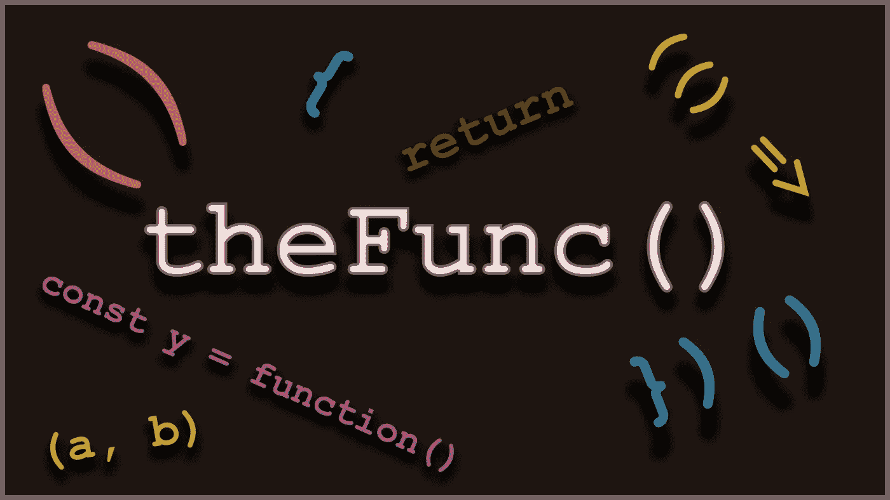

# JavaScript:函数综述

> 原文：<https://betterprogramming.pub/javascript-a-review-of-functions-37ed492eab45>

## 简单明了的 JavaScript 基本函数、函数表达式、匿名函数、函数表达式等指南

在深入研究 JavaScript 函数更微妙的形式时，我发现自己在没有完全理解它们的情况下使用了各种语法结构。例如:

一个匿名的*立即调用的函数表达式*(life)。

当看到上面这段完全有效但有些神秘的代码时，我的主要问题是，“为什么有这么多括号？”在通过实验和研究回答这个问题的过程中，出现了其他更基本的问题，这些问题反过来需要回顾 JavaScript 中函数的一些基本概念。这篇文章描述并探索了:

*   [基本功能](#ac25)
*   [函数表达式](#108d)
*   [匿名函数](#b479)
*   [箭头功能](#38ab)
*   [工厂职能](#0514)
*   [立即调用函数表达式(IIFEs 基础知识](#9bf2)
*   [iife 的品种](#ff0d)
*   野生动物的生活

# **基本功能**

JavaScript 的任何中级用户都熟悉函数的基本结构和用法。例如:

// -> '表示控制台输出

声明了一个名为`add`的函数，它接受参数`x`和`y`的两个值，并返回这两个值的和。然后声明一个名为`mySum`的变量，它的值被设置为调用函数时返回的值，并将整数值`4`和`5`作为参数传递给函数。最后，`mySum`的值输出到控制台:`9`。

这是基本的东西。然而，在这个结构中可以发现一些微妙之处。让我们考虑这个更简单的函数:

因为我们在这个函数中不使用参数，所以使用的空括号`()`是*而不是可选的*(就像在其他一些语言中一样)。

函数本身没有包含`()`将会抛出错误:“语法错误:意外标记{ …”

然而，在函数调用中没有包含`()`将只是无声地失败，或者更准确地说，它看起来什么也不做。这是我们对基本函数声明的隐藏性质的第一个线索。请注意，这种行为与在代码中简单地包含一个未定义的名称形成了鲜明的对比:

我们定义一个函数，命名为`basicFunc`。更准确地说，我们创建了一个名为`basicFunc`的变量*，并将其值设置为我们定义的函数。通过将我们的“函数名”指向一个新值，我们可以看到这种情况:*

将函数重新定义为字符串！

我们设置新值，而不需要用`let`、`var`或`const`声明变量——事实上，这将抛出一个错误，因为当我们定义函数时，这个初始声明已经在“幕后”发生了。在我们将标识符指向一个字符串之后，对函数的调用就会失败，因为名字不再指向一个函数。

# 函数表达式

事实上，我们的基本函数声明和用法相当于:

这里，我们声明了一个名为`funcExp`的变量，并将其值显式设置为一个 ***匿名函数*** 。这是一个 ***函数表达式*** 的形式。它的行为与我们以前的、不太明确的版本完全一样，包括声明变量的值可以被改变的事实。因此，我们的早期版本也是命名一个变量，然后“指向”一个匿名函数(即使它没有被写成这样的表达式)。

当你写你自己的代码时，如果你清楚你所使用的名字，偶然“覆盖”一个函数的可能性看起来可以忽略不计。然而，当合并来自其他来源(库、模块等)的代码时。)或者试图理解或重构他人的工作，这样的问题可能很重要。

幸运的是，我们可以通过用`const` ( *而不是* `let`或`var`)声明函数来防止函数的重定义。例如:

使用“const”函数表达式可以防止重定义。

现在，我们的函数将始终是我们第一次声明它的函数，任何重新定义或修改它的尝试，无论是偶然的还是其他的，都将抛出一个错误。

我原以为这种语法只是一种更老的、但实际上等效的函数声明形式，但这种略显冗长的形式支持更好的控制，并为我们代码的读者提供更多信息。

# 匿名函数

如上所述，函数表达式(见上文)将匿名函数与命名变量相关联。事实上，*除了这里考虑的函数的第一个基本形式之外的所有*形式的函数(见上面的[基本函数](#ac25))，都明确涉及到一个匿名函数形式。

一些评论家会争辩说，匿名函数的这种使用使得跟踪行号和/或函数名的错误变得困难或不可能。这似乎夸大了完全匿名函数的潜在错误报告困难，更重要的是，这种函数的使用与在命名函数(与标识符相关的函数)中使用*形式的*匿名函数混为一谈。为了证明这一点，让我们看看三种不同形式的函数，每一种都包含相同的错误，记录它们的类型，并比较堆栈跟踪(**剧透:**它们是相同的):

以上三种形式的错误的堆栈跟踪实际上是相同的，包括对错误的确切点的引用(包括行号)和对函数“name”的引用。

此外，尽管在第二和第三个例子中使用了匿名函数的*形式*,但在所有情况下结果类型都是一个命名函数。因此，我们看不出解释器追踪错误和命名包含错误的函数的能力有什么不同。

在某些情况下(见下面的“各种类型的函数”),函数表达式从未被赋予标识符(没有任何意义上的命名),因此总体上仍然是一个真正的匿名函数。显然，在这种情况下，我们的堆栈跟踪永远不会引用函数的“名称”，但我仍然不知道在这种构造中跟踪错误有什么困难——如果您知道任何这类问题，请在评论中告诉我。

# 箭头功能

第三种包含错误的函数形式(如上)是一个 ***箭头函数*** 。如果我们将基本函数重新创建为箭头函数，我们会得到:

使用这种结构有两个主要的潜在好处:

**1:较短的语法**

通过省略`function`关键字，我们减少了总的字符数(但可能会在某种程度上降低代码的透明度)。在特殊情况下，我们可以进一步减少字符数，例如，当只使用一个参数时，我们可以完全省略括号:

精明的人会注意到这个例子也省略了花括号。如果函数只包含一个表达式，表示要返回的值(或者只执行一条语句)，花括号也是可选的。

**2:没有绑定“this”关键字**

> 箭头函数从父作用域继承它们的作用域，这被称为“词法作用域”虽然在使用箭头函数时保证了词法作用域(因此关键字`this`的值将总是从定义它的父作用域中导出)，但是其他形式的函数具有依赖于它们的**执行上下文的作用域，**因此它们的值`this`也根据执行上下文而变化。

如果前一段读起来像一个单词沙拉，这可能表明需要更好地理解 JavaScript 中的作用域概念(试试克里斯蒂安·萨尔塞斯库的这篇文章)和/或合理地掌握稍微复杂一些的`this`关键词(我推荐布兰登·莫雷利的这篇文章)。

有时候，代码比散文说得更清楚。以下示例(在浏览器控制台中运行)演示了 arrow 函数的词法范围，而不是其他函数形式的上下文范围:

上面，箭头函数是在全局(窗口)范围内定义的。这个函数的`this`值是`window`,不管它是从全局范围还是从一个对象内部被调用。

相比之下，上面的例子是*不是*一个箭头函数，当从对象内部调用它时`this`的值不再是`window`(因为它是在对象的范围内执行的)。

关于箭头函数的词法作用域的一个实用示例，请参见下一节:“工厂函数”

使用箭头函数有两个主要的潜在缺点:

**1:更不透明的语法:**

就个人而言，我喜欢 arrow 函数更稀疏的语法。一旦学会了，在现实世界的代码库中解析它通常是容易的。然而，`function`关键字的省略不可否认对初学者不太友好。

当然，当与其他稀疏形式结合时(例如，一些立即调用函数表达式的形式，如本文的介绍和下面的[相应章节](#ff0d)中所介绍的)，这种简洁的结构对于外行来说可能会变得晦涩难懂。

**2。词法范围阻止手动绑定范围:**

如上所述，要完全理解作用域、它的绑定以及对关键字`this`的值产生的影响，需要付出一些努力(我仍在努力)。我推荐 Dario Garcia Moya 的这篇文章，它很好地介绍了与箭头函数相关的问题。

基本上，如果你的代码使用了`call`、`apply`或`bind`来指定某个动作的范围，那么避免在代码的上下文中使用箭头函数。如果您没有使用这些方法来绑定特定的作用域(如果您还不明白这是什么意思，您可能就不会这样做)，那么您可以考虑使用箭头函数了——很可能。我仍然模棱两可，因为警告(更多的将在下一节揭示)可能看起来相对微妙。

# 工厂功能:

> “**工厂函数**是任何不是返回(假定是新的)对象的类或构造函数的函数。在 JavaScript 中，任何函数都可以返回一个对象。如果没有`new`关键字，它就是一个工厂函数。”(Eric Elliot，[使用 ES6+](https://medium.com/javascript-scene/javascript-factory-functions-with-es6-4d224591a8b1) 的 JavaScript 工厂功能)

在[前一节](#38ab)中描述的 arrow 函数的词法作用域，使它们在许多情况下非常有用，提供了一种更简单、更简洁的方法来创建对象实例。让我们首先回顾一下用于创建对象实例的*构造器模式*:

请注意这与工厂函数方法的对比:

arrow 函数的词法作用域消除了重复使用`this`关键字的需要，因此大大简化了结构。还要注意，实例化新实例不需要关键字`new`。

尽管在上面两个有限的例子中行为是相同的，但是形式并不是在所有方面都是等价的。一个主要的区别是，工厂函数产生单例对象，而构造函数模式将从对象原型继承(在对象原型中可以定义各种属性和方法)。

选择使用一种模式可能很复杂，并且/或者是基于风格/品味/与总体模式的最佳匹配。有时选择可能很简单；例如，如果由工厂函数产生的(单例)对象实例的数量变得足够大，以至于它将显著影响内存使用，那么构造器模式可以通过将对象实例的一部分功能移动到对象原型来实现内存使用的显著减少。相反，如果对象的功能彼此差异很大，就不可能简单地将这些功能转移到原型中。此外，在有些情况下，使用单例来确保不变性和/或避免实例化多个这样的对象。

我知道这是一个我还没有资格详细阐述的领域，因此，我将建议进一步阅读，既是为了我自己，也是为了你，读者。我们最好从仔细阅读本节开头引用的 Eric Elliot 的文章开始，然后继续阅读 Chris Ferdinandi 的 JavaScript 构造器模式介绍。

# 立即调用的函数表达式:基础

现在让我们来看看在运行时一遇到就执行的函数— ***立即调用的函数表达式*** (IIFEs) —也称为“iffys”。这是一个非常简单的匿名生活的例子:

没有单独的语句来调用该函数，因为 final `()`会这样做。`void`关键字表示后面是一个表达式，而不是一个函数定义。为了同样的效果，我们可以用更神秘的`!`代替`void`:

后一种形式可能被认为更容易混淆不知情的人，因为在 JavaScript(和许多其他语言)中，感叹号`!`，又名“砰”，是逻辑“非”操作符。顺便提一下，它实际上也是这样操作的，并调用函数表达式:

因此，更神秘的`!`可以用来有意地利用它的布尔运算。它还可以用来帮助避免前面连接的模块丢失尾部分号时的错误。最后，它可能比其他形式节省一两个字节的内存。

将函数标记为表达式的第三种方法是将其括在括号中，如下所示:

如果我们使用 arrow 函数结构来删除关键字`function`，我们最终会得到这篇文章介绍中显示的结构，它首先引起了我的兴趣:

现在已经回答了我最初的问题“为什么有这么多括号？”，我们很可能会问一个更重要的问题:“这有什么意义？”由于到目前为止给出的示例只是在每个函数中执行一条语句，因此只执行语句而不将其包装在函数表达式中似乎没有什么区别。

使用 IIFE 的主要原因是函数表达式创建了一个新的作用域上下文或“闭包”(如果你需要回顾作用域的概念，我会再次推荐 Cristian Salcescu 的这篇文章。这可以用一个虚构的例子来说明:

我们能够用相同的标识符`name`声明第二个变量，这在相同的作用域内是非法的，并在各自的作用域内使用每个变量，而不会干扰彼此的值。

当编写包含许多相似但不同的操作的代码时，这会带来直接的好处。例如，在编写计算器应用程序时，我发现自己想在许多地方使用像`result`这样的变量名。通过尝试使用描述性标识符(以提高代码可读性)，我求助于使用诸如`tempResultA`、`tempResultB`等变体。远非理想，但通过明智地使用 IIFEs(或其他作用域解决方案)很容易解决。

> 这种封装避免了“污染”全局(或父)范围。它还有助于保护封装的代码免受更改全局值的意外/无意影响。

# 生活的多样性

让我们更进一步，声明一个变量标识符并指向一个立即调用的函数:

虽然这确实为我们提供了 IIFEs 的所有范围相关的优势，但这个特定的案例并没有增加任何额外的功能。尽管试图给我们的生活分配一个标识符，我们只是简单地分配了一个“未定义”的值，因为函数已经执行了，但是没有一个执行提供了一个值(它只是在控制台记录了一个字符串)。因此，我们在内存中放置了一个标识符，但没有带来任何好处。

然而，如果我们*从函数表达式返回一个值*，而不是简单地执行语句，我们将成功地将变量设置为该值:

注意，当在终端中运行时，这种形式不需要括号来封装函数表达式，但是在没有括号的某些浏览器中会抛出错误。*下面的箭头函数形式*是否在所有情况下都需要这样的封装括号(如果没有括号，将会抛出错误):

> 当设置(或计算)变量值时，这种模式为我们提供了一种获得范围封装好处的简洁方式，以及由此产生的闭包。

这是一个提醒我们自己的好时机，我们也可以将参数传递给 IIFEs 的参数，就像常规函数一样。例如:

如果我们在 return 语句周围加上花括号，就会发生有趣的事情:

这些花括号告诉 JavaScript 返回一个对象文字，这意味着我们可以读取与`ary`键相关的值，在上面的例子中，使用`arrowIIFE.ary`，它表示形式:<life name>。<对象文字键>

我们还可以添加一个函数来改变我们的数组，并将该函数作为一个对象文字返回，这为我们提供了在生命执行后更改我们声明的数组的能力:

> 有了这个模式，我们就有了一个非常真实的例子——模块模式。

这是我在没有完全理解它的情况下，在完成一个旨在创建井字游戏的练习时使用的模式。下面的例子是我的解决方案中的`board`模块:

你大概可以猜到上面的例子用了一个 9 元素的数组来表示井字棋盘。如果你已经阅读了这篇文章，希望你也理解了如何在`board`名称空间中使用`addPiece`和`reset`函数。

到目前为止，我们已经看到了直接运行的函数，以及设置变量值的函数。你可能也想知道，“能不能创造一个命名的生命，在它被立即调用后又被调用？”是的，它可以:

这里，我们看到一个包含命名函数定义*的生命，它返回自身*。因此，它在初始执行*和*时执行命名函数中的代码，随后每次调用 IIFE 时执行。在这个例子中，我们还有一个参数`msg`，它的默认参数包含在 IIFE 中。

# 野外生活

在结束之前，让我们花一点时间了解一下生命是如何以及为什么被真正使用的。

**数据隐私:**

例子来自 Marius Schultz 的[*JavaScript 生命的用例*](https://mariusschulz.com/blog/use-cases-for-javascripts-iifes)；

`count`变量，以及增加变量并在返回的 id 字符串中使用变量的值的函数，都不能从生命的外部访问，因为它创建了一个闭包(局部作用域)。因此，唯一 id 产生的过程被保护免受意外或有意的修改(除非通过直接重写生命)。

**模块模式为 API:**

Addi Osmani 的 [*学习 JavaScript 设计模式*](https://www.oreilly.com/library/view/learning-javascript-design/9781449334840/ch09s02.html) 示例:

这里使用的模块模式不仅在`basketModule`中巧妙地命名了它的方法，还通过公开返回的 API 呈现了许多方法，同时保持了许多方法的私有性。

**更好的定时重复:**

这个例子改编自 Safraz Ahmed 的 [*JavaScript 自调用函数*](https://sarfraznawaz.wordpress.com/2012/01/26/javascript-self-invoking-functions/) 。

假设您希望您的网页每 5 秒重复运行一些代码，可能是为了查询数据库或 API，或者出于其他原因。简单(但不太有效)的方法是使用`setInterval`每 5 秒调用一次函数:

然而，如果`doStuff`中的代码没有在 5 秒内完成，它将被再次调用。不难想象(或体验)这可能不会产生预期的结果，甚至会导致严重的问题。如果我们使用一个在代码执行后经过一段设定时间*后才调用自身的生命，这样的问题就可以避免:*

我只触及了生活中生活中生活的表面，但是希望你现在已经准备好了，当你遇到他们的时候，能够识别和更好地理解他们。

# 结论:

JavaScript 程序员可以使用各种形式的函数，其中许多可以利用底层概念的不同方面，比如闭包、范围、绑定、调用的时间和模式等等。

通过提高对 JavaScript 函数的熟练程度，可以获得更多的控制和效率，避免许多错误，并加深对真实世界代码库的理解。

# 使用的资源:

[*介绍 JavaScript 构造器模式*](https://gomakethings.com/an-introduction-to-the-javascript-constructor-pattern/) ，作者 Chris Ferdinandi

[*介绍 JavaScript*](https://medium.freecodecamp.org/an-introduction-to-scope-in-javascript-cbd957022652) 中的作用域，作者 Cristian Salcescu

[*基本 JavaScript:掌握即时调用函数表达式*](https://medium.com/@vvkchandra/essential-javascript-mastering-immediately-invoked-function-expressions-67791338ddc6) ，作者钱德拉·冈达马拉朱

布兰登·莫雷利 [*JavaScript:初学者的箭头函数*](https://codeburst.io/javascript-arrow-functions-for-beginners-926947fc0cdc)

[*JavaScript 设计模式:单例模式*](https://www.sitepoint.com/javascript-design-patterns-singleton/) ，作者萨米尔·赛义德

[*JavaScript 工厂函数与 ES6+*](https://medium.com/javascript-scene/javascript-factory-functions-with-es6-4d224591a8b1) ，作者 Eric Elliot

[*JavaScript 自我调用函数*](https://sarfraznawaz.wordpress.com/2012/01/26/javascript-self-invoking-functions/) ，作者 Safraz Ahmed

JavaScript:给初学者的关键词“这个”，作者布兰登·莫雷利

[*学习 JavaScript 设计模式*](https://www.oreilly.com/library/view/learning-javascript-design/9781449334840/ch09s02.html) ，作者 Addi Osmani

[*用 JavaScript 理解箭头函数中的“this”*](https://www.codementor.io/dariogarciamoya/understanding-this-in-javascript-with-arrow-functions-gcpjwfyuc)，作者达里奥·加西亚·莫亚

[*JavaScript 的使用案例*](https://mariusschulz.com/blog/use-cases-for-javascripts-iifes) ，作者 Marius Schultz

[*空括号做什么…？*](https://stackoverflow.com/questions/2422026/what-do-empty-parentheses-after-a-function-declaration-do-in-javascript) ，StackOverflow

[*感叹号……表示什么？*](https://stackoverflow.com/questions/3755606/what-does-the-exclamation-mark-do-before-the-function) 、StackOverflow