# K8s:一路香草

> 原文：<https://betterprogramming.pub/k8s-vanilla-all-the-way-9ba8c746e4f0>

## Vanilla Stack 是一个新的基于 Kubernetes 的开源云原生栈


几周前，我偶然发现了 [Vanilla Stack](https://vanillastack.io/) ，这是一个基于 Kubernetes 的技术堆栈，嵌入了许多优秀的开源组件。在这篇文章中，这主要是一个堆栈的介绍，我们将快速浏览安装过程，展示不同的可用选项。

# 香草栈——温和的介绍

[Vanilla Stack](https://vanillastack.io) 可以定义为一个 [Kubernetes](https://kubernetes.io) 集群，附带许多开源组件。

开箱即用的不同解决方案包括:

*   [Rook](https://rook.io) 管理分布式存储(文件系统、数据块、对象)
*   [OpenStack](https://www.openstack.org/) 提供基础设施即服务(IaaS)
*   [Cloud Foundry](https://www.cloudfoundry.org/) 提供平台即服务(PaaS)

以下来自官方文档的模式说明了堆栈的全局架构。

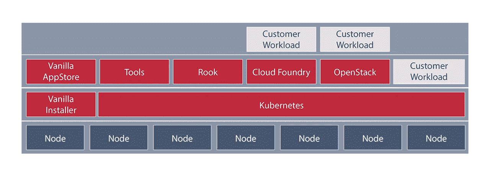

整体架构

**注意:**Vanilla Stack 附带的所有解决方案(Rook、Cloud Foundry、OpenStack 和许多其他工具)都作为 Pods 在底层 Kubernetes 集群中运行。

从上面的模式中我们可以看到，客户端可以:

*   通过创建部署、服务、导航图等，在底层 Kubernetes 集群上运行应用程序。
*   使用 Cloud Foundry 从您的代码中运行应用程序(使用简单的`cf push` *)*
*   使用 OpenStack 创建新的基础架构(虚拟机、软件定义的网络等。)

**注意:**底层机器的硬件要求取决于将安装在堆栈中的组件。

下面的模式更深入一点，提供了所有组件的列表，按类别组织，可以与 Vanilla 堆栈一起提供:


作为 Vanilla 堆栈一部分的开源组件

很漂亮，对吧？有些组件是默认安装的，其他组件可以在安装过程中选择。

在本文中，我们将展示安装过程的主要步骤。为了简单起见，我们将在[数字海洋](https://digitalocean.com)上提供的六个虚拟机上设置 Vanilla 堆栈:三个虚拟机将充当 Kubernetes 主节点，另外三个将充当工作节点。

**注意:**根据我们要安装的组件，可能无法使用所有云提供商，因为有些可能不符合安装要求。例如，要安装 Rook，我们需要一个允许提供块存储的基础设施提供者。

# 运行安装

有两种安装 Vanilla 堆栈的方法，在[下载](https://vanillastack.io/download)部分都有描述。在本文中，我们将使用 Docker 安装，它可以通过以下命令运行:

```
$ docker run \
  --name VanillaStack-installer -d \
  -p 8080:8080 \
  harbor.vanillastack.io/vanillastack/installer:latest
```

端口 8080 上提供了安装程序的 web 界面。它介绍了我们将经历的十几个简单步骤。

# 要求


标准堆栈安装程序的第一步

第一步， **Start** ，定义将要安装堆栈的机器的硬件和软件需求。

出于本文的目的，我们将使用在[数字海洋](https://digitalocean.com)上创建的六个虚拟机。每个虚拟机都运行 Ubuntu 20.04 box，并拥有 4 GB ram / 2 个 CPU。

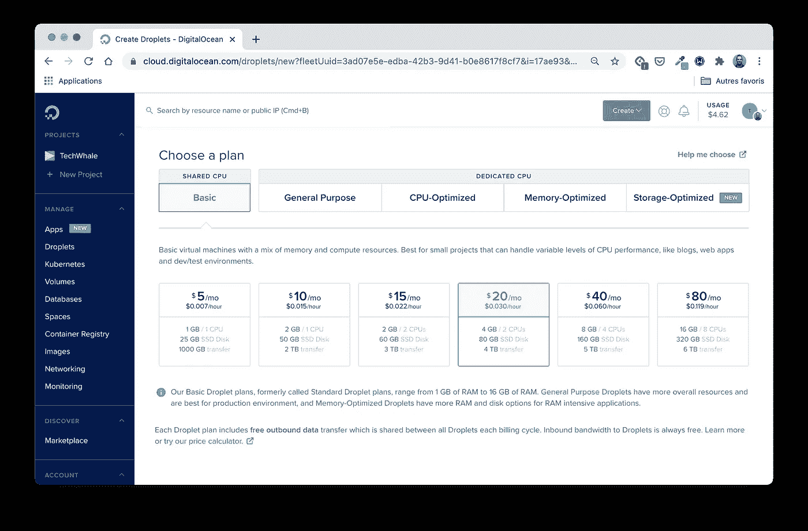

用于设置 Vanilla 堆栈的数字海洋虚拟机的特征

在这些虚拟机中，三个将充当 Kubernetes 主节点，其他的将作为工作节点。

```
# IP addresses of the master nodes
master1 - 159.65.92.123
master2 - 178.62.32.212
master3 - 178.62.40.225 # IP addresses of the worker nodes
worker1 - 178.62.41.87
worker2 - 178.62.27.97
worker3 - 178.62.67.29
```

我们还需要设置域(和几个子域)来访问集群。稍后在配置负载平衡器时，我们将回到这一步。

# 条件

**条款**是第二步。它提供了有关许可证的信息，并要求我们接受条款和条件。

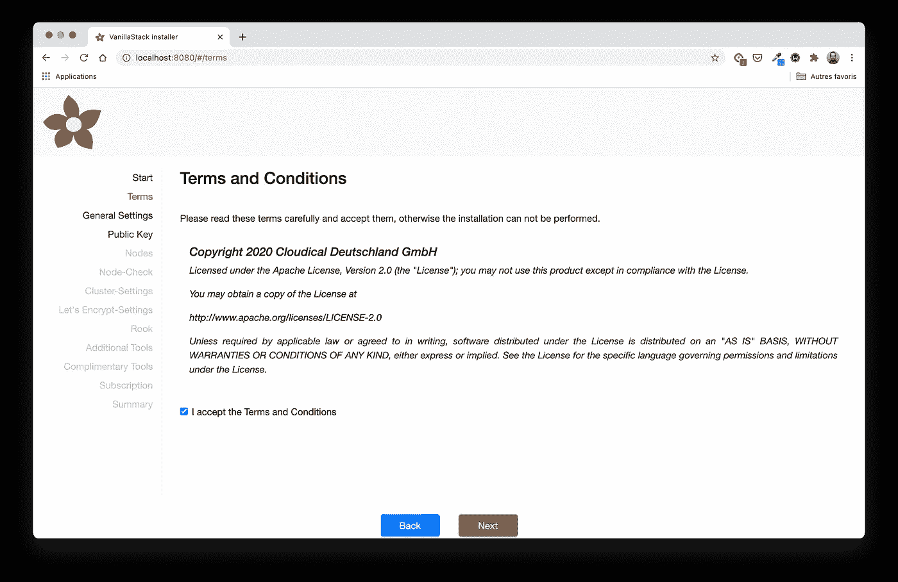

展示使用 Vanilla 堆栈的条款和条件

# 常规设置

接下来，在**通用设置**步骤中，我们需要指定我们想要的安装类型:

*   硕士人数
*   工人人数
*   初始工作量

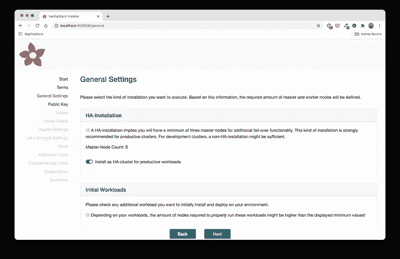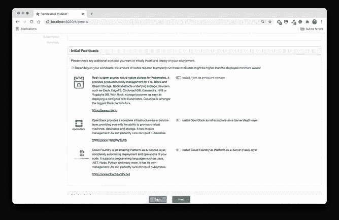

常规设置步骤，定义安装类型

在我们的示例中，我们使用三个主节点进行 HA 安装，其余三个节点充当工作节点。默认情况下，选择 Rook 来安装存储解决方案。这里我们不会用 OpenStack 或者 Cloud Foundry。(这可能是另一篇文章的主题)。

# 通过 SSH 密钥授予对虚拟机的访问权限

**公钥**部分提供 RSA 公钥，并要求在每个虚拟机上复制它。这一步对于允许安装机器(安装程序在其上运行的机器)运行 Ansible 行动手册来配置每个虚拟机是必要的。

**注意:**ansi ble 是一个配置工具。它仅通过 SSH 连接在目标机器上运行命令。它不像其他配置工具如 [Chef](https://www.chef.io/) 和 [Puppet](https://puppet.com) 一样需要任何代理。

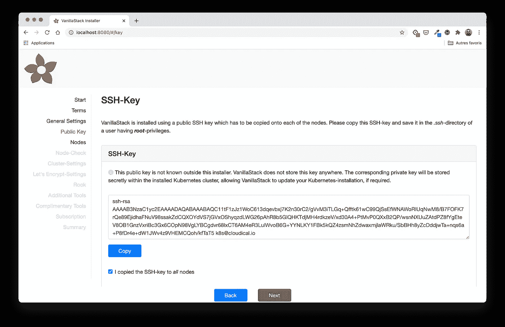

安装程序中指定了复制密钥的说明:

*   将密钥存储在名为`key.pub`的文件中。
*   使用`ssh-copy-id`将密钥复制到目标计算机:

```
ssh-copy-id -f -i key.pub <username>@<ip-address-of-node>
```

*   对所有节点重复此操作。

对于 Windows，请按照这篇博文中的说明:[https://www.chrisjhart.com/Windows-10-ssh-copy-id/](https://www.chrisjhart.com/Windows-10-ssh-copy-id/)，从“将 SSH 密钥复制到远程 Linux 设备”开始

# 定义节点的信息

在**节点**步骤中，我们需要定义每个主节点和工作节点的 IP 地址和用户。

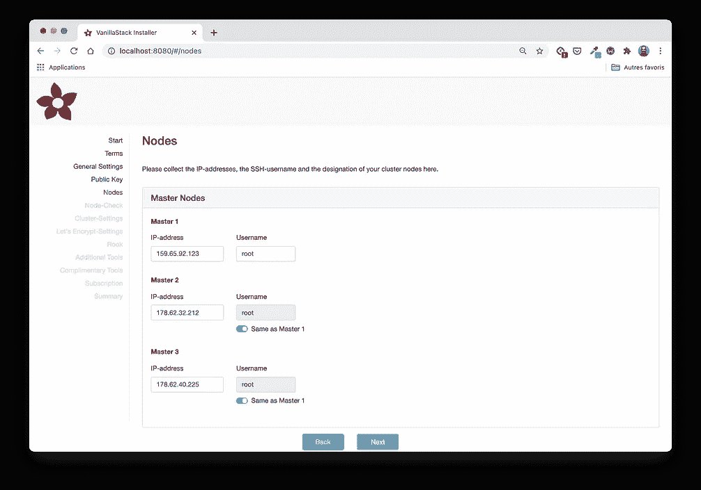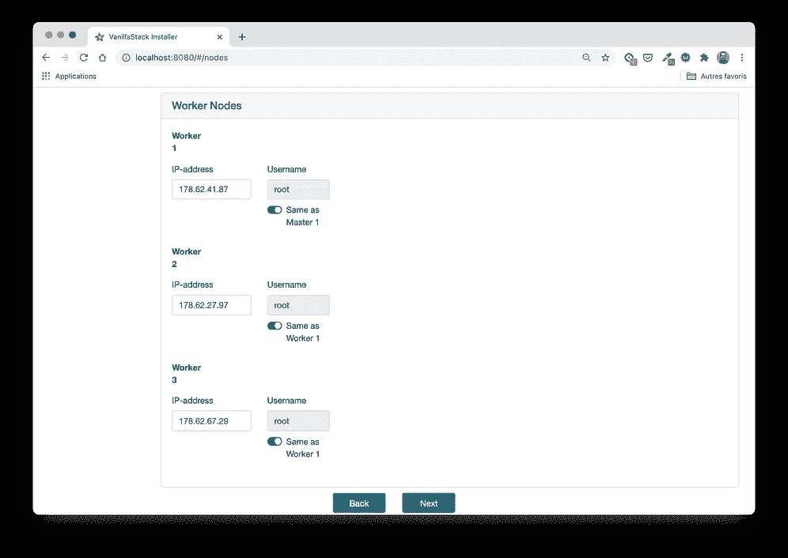

定义节点的 IP 地址

我们还需要定义将用于运行车舱的节点。为了满足需求，我们使用了所有三个工作节点。

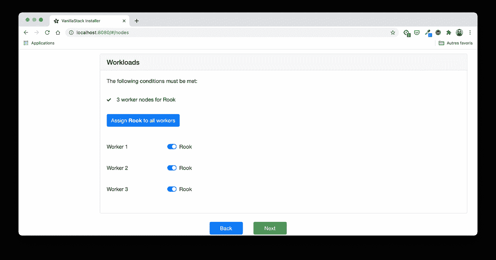

选择运行车舱的节点

# 检查节点配置

**节点检查**步骤用于确保每个节点符合要求。

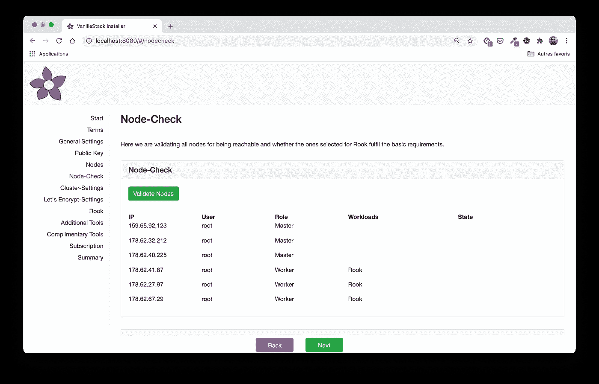

在单击 Validates Nodes 按钮之前，我们需要稍微滚动一下，确保满足 Rook 的要求:每个节点都需要连接一个原始块设备。


块设备需要连接到运行 Rook 的每个节点

在 Digital Ocean 中，我们可以通过创建三个块设备并将每个设备安装在一个工作节点上来轻松完成这一步。


从数字海洋界面创建块设备

为了验证一切正常，我们可以在工人上运行`lsblk -f` 命令:

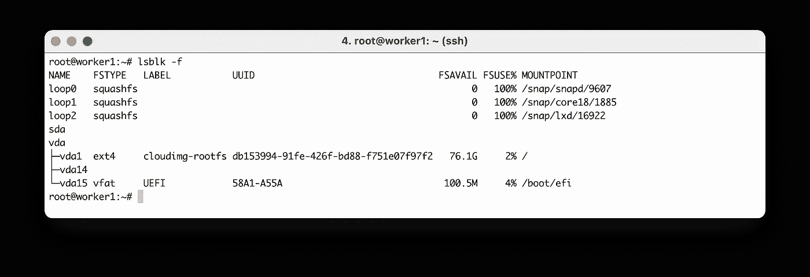

显示附加块设备(sda)的工作节点

在安装程序中，我们可以通过单击 Validate Nodes 按钮来确保所有节点都已正确配置。


# 集群设置

在**集群设置**步骤中首先要设置的是 Pod CIDR 和服务 CIDR(分别是用于提供 Pod 的 IP 地址和服务的虚拟 IP 的 IP 范围)。在这个例子中，我们使用默认的。

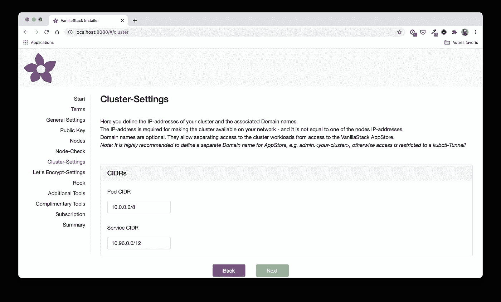

集群的 Pod 和服务 CIDR 的定义

此外，我们需要创建一个负载平衡器，将特定的流量转发到主节点或工作节点。

在数字海洋中，不可能使用同一个负载平衡器将流量重定向到不同的节点集。然后，我们将创建两个负载平衡器:

*   一个在主节点的前面
*   其他的在工人前面

## 主节点前面的负载平衡器

需要第一个负载平衡器来公开集群的 API 服务器。它必须配置为:

*   将端口 6443 上的 TCP 流量重定向到主节点上的同一端口
*   定期检查在端口 6443 上发送 TCP 请求的主节点的健康状况

在本例中，负载平衡器获得了 IP 159.65.211.35。

## 工作节点前面的负载平衡器

需要第二个负载平衡器来公开集群的入口控制器(公开集群中运行的应用程序的组件)。它必须配置为:

*   将 HTTP 流量(端口 80)重定向到工作节点的端口 30080
*   将 HTTPS 流量(端口 443)重定向到工作节点的端口 30443
*   定期检查在端口 30080 上发送 TCP 请求的工作节点的运行状况

在本例中，负载平衡器获得了 IP 46.101.64.165。

## 设置 DNS 条目

负载平衡器的 IP 地址应该与群集域名相关联。在本文中，我们使用`vanilla.techwhale.io`。需要额外的子域，以便可以访问通过入口控制器暴露的 API 服务器和应用程序。


与创建的两个负载平衡器之一的 IP 相关联的域名

在这一步中，我们只能提供单个负载平衡器的 IP 地址，但是在安装程序的下一个版本中将提供更多的灵活性。

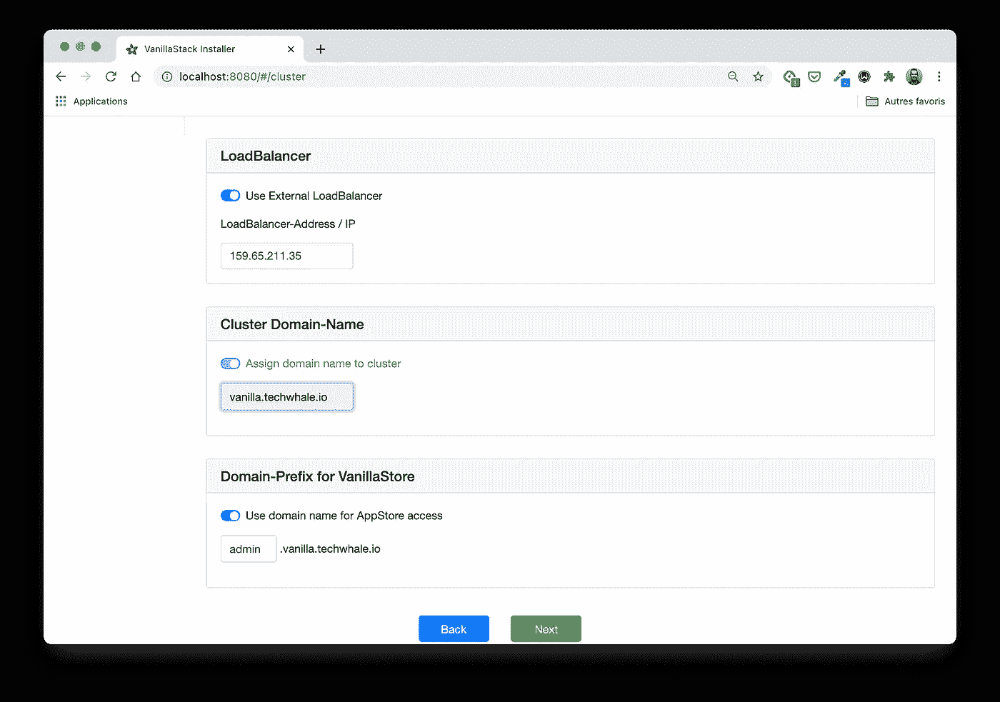

# 配置让我们加密

[让我们加密](https://letsencrypt.org/)是一个广泛使用的免费认证机构。它基本上允许我们获得 HTTPS 证书并自动更新。在 Kubernetes 中，Let's Encrypt 经常通过[证书管理器](https://cert-manager.io/)使用，这是一个默认安装在 Vanilla 堆栈中的组件。Cert Manager 可以从 Let's Encrypt(和其他几个来源)获得一个证书，并通过 Kubernetes Secret 使它对应用程序可用。

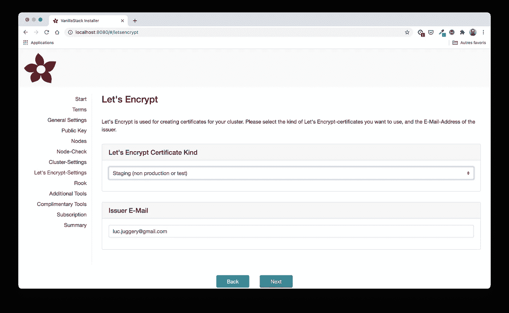

让我们加密配置

# 车配置

**Rook** 步骤允许选择将要安装的 Rook 组件(在这种情况下为 Rook 仪表板和监控)以及单个数据将被复制的次数(副本级别)。


车的基本配置

# 安装附加工具

**附加工具**部分允许指定将在集群中安装哪些组件。

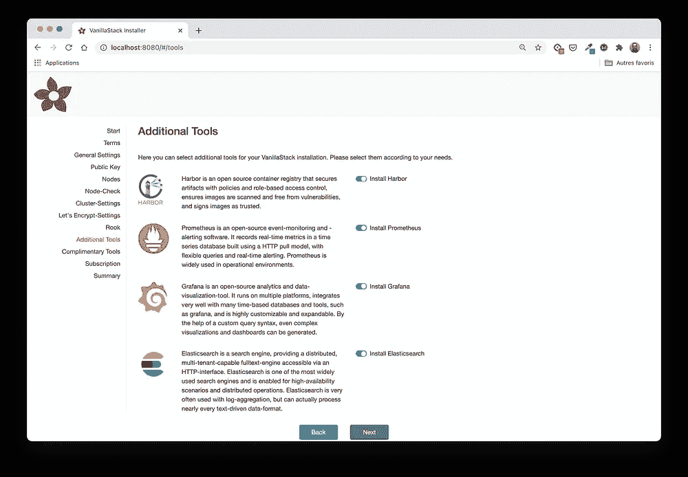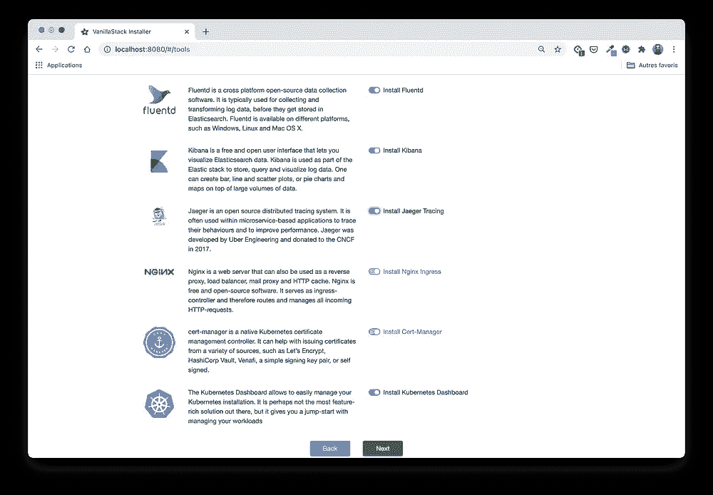

选择将要安装的工具

这里列出的工具非常常见。它们分为不同的类别:

*   监测(普罗米修斯，让格尔)
*   日志记录(fluentd、Elasticsearch、Grafana)
*   集装箱图像登记和舵图储存库(港口)
*   入口控制器(nginx)

这是一种从单一位置安装这些组件的便捷方式。当然，如果在这一步没有选择这些组件，以后仍然可以安装它们。

# 签署

此步骤提供了我们需要的所有信息，以防我们想要订阅商业支持。


支持由[云](https://cloudical.io/)提供。企业维护[香草栈](https://vanillastack.io)并提供[香草云](https://vanillacloud.io/)，这是栈的全新托管风格。

# 查看整个设置

这最后一步允许我们检查和修改(如果需要)我们到目前为止提供的配置选项。

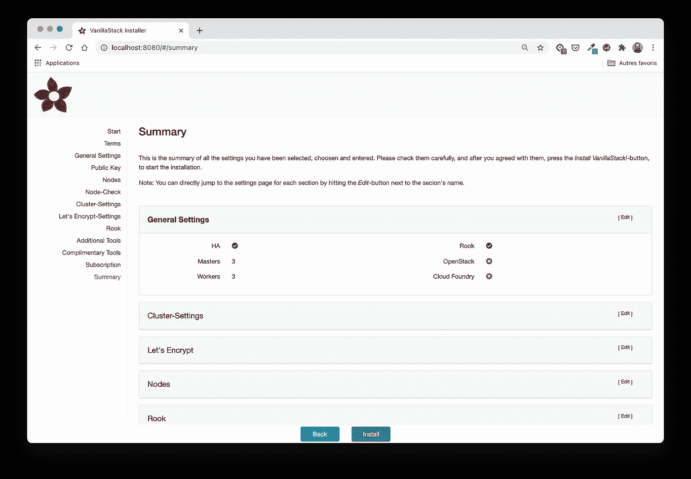

配置选项摘要

在进入下一步并安装整个堆栈之前，我们需要确保在每个节点上正确配置了 `/etc/apt/sources.list` ，以便它引用正式的存储库。

**注意:**如果在 Digital Ocean 上创建虚拟机，例如，默认提供的存储库中没有 Ansible 二进制文件，则需要执行此步骤。

解决这个问题的简单方法是用以下指令替换`/etc/apt/sources.list`的内容:


确保来源是上游来源(例如，在 Digital Ocean flavor 上找不到 Ansible 包)

# 安装所有的东西

一切都准备好了。我们可以运行安装步骤，享受一杯好咖啡。

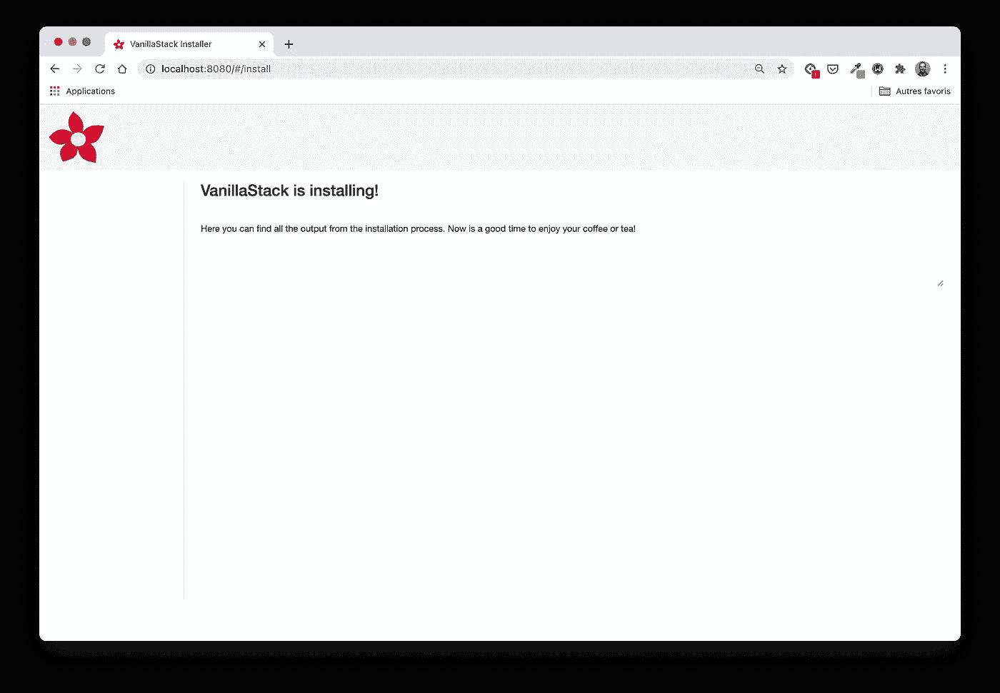

运行安装

在安装日志中，我们将看到应用于每个虚拟机的可行行动手册，以便:

*   安装所有必要的软件包
*   建立一个 Kubernetes 集群(三个主人/三个工人)
*   安装 Rook 和上面选择的所有工具

安装整个堆栈不需要太长时间:)。

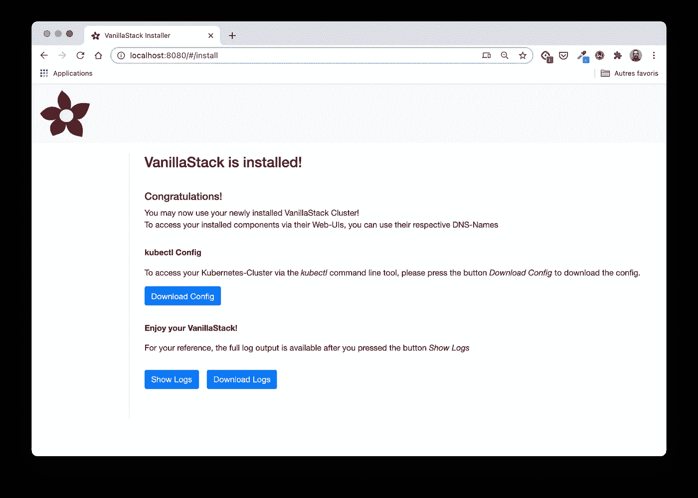

安装完成！

**注意:**我在安装堆栈时遇到了一个小问题，因为数字海洋的负载平衡器将流量转发到节点的内部(私有)IP，而不是公共 IP。入口控制器暴露在节点的外部(公共)IP 上，因此工作节点被标记为不健康，这是不正确的。

# 访问集群

可以像往常一样从`/etc/kubernetes/admin.conf file`中检索到`kubeconfig`文件。

```
# Get kubeconfig file
$ ssh root@master1 cat /etc/kubernetes/admin.conf > vanilla.cfg# Configure local kubectl
$ export KUBECONFIG=$PWD/vanilla.cfg
```

像往常一样，我们首先列出集群的节点:

```
$ kubectl get no
NAME      STATUS   ROLES    AGE   VERSION
master1   Ready    master   38m   v1.19.6
master2   Ready    master   37m   v1.19.6
master3   Ready    master   37m   v1.19.6
worker1   Ready    worker   37m   v1.19.6
worker2   Ready    worker   37m   v1.19.6
worker3   Ready    worker   37m   v1.19.6
```

此外，我们可以检查集群中运行的所有 pod 以及公开它们的服务。

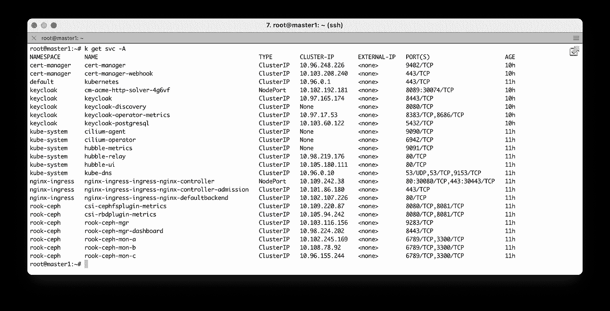

获取群集中正在运行的 pod 和现有服务

一切似乎都很好。下一步可能是运行一个测试应用程序，例如，一个有状态的应用程序，它:

*   使用由 Rook 创建的 Ceph 集群提供的块存储
*   通过 nginx 入口控制器公开
*   使用证书管理器自动创建的 TLS 证书来加密 CA

# 摘要

设置香草栈真的很快。Docker 安装程序简单而干净。应该很快添加额外的选项，以提供更大的灵活性。

如果你不想安装普通堆栈，你可以直接从[普通云](https://vanillacloud.io/)中使用这个堆栈。这种新的云产品于 2020 年 12 月试运行，第一个测试版将于 2021 年 1 月推出。

我强烈推荐仔细看看这个堆栈，因为这也是更熟悉许多广泛使用的开源项目的好方法。