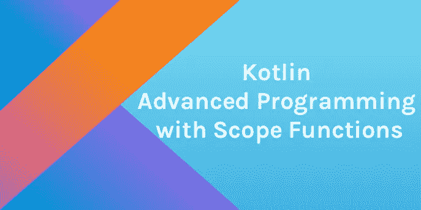

# Kotlin 高级编程(第 3 部分)

> 原文：<https://betterprogramming.pub/kotlin-advanced-programming-part-3-c459a6af435c>

## 了解 Kotlin 范围函数



如果你是科特林的新手，请查看我以前的帖子:

*   [Kotlin 初学者指南](https://medium.com/@pavan.careers5208/kotlin-guide-for-beginners-5ba6018b5368?source=your_stories_page---------------------------) —解释变量声明的基础知识&为什么要学习 Kotlin
*   [Kotlin 高级编程](https://medium.com/@pavan.careers5208/kotlin-advanced-programming-89aef9b2ecb8?source=your_stories_page---------------------------)——这篇文章是关于 Kotlin 中函数&类型的基础知识
*   [Kotlin 高级编程第二部分](https://medium.com/@pavan.careers5208/kotlin-advanced-programming-108d7047691b) —这篇文章是关于 Kotlin 中的函数式编程

在这篇文章中，我们将检查 Kotlin 中的检查范围函数以及如何使用它们。

# 什么是范围函数？

在科特林函数是非常重要的。作用域函数是在对象的上下文中执行代码块的函数。当我们用 lambda 表达式在一个对象上调用这样的函数时，它形成了一个我们可以执行操作的临时范围。在这个作用域中，基于我们使用的作用域函数，对象的上下文通常被称为`it`(或任何自定义名称)或`this`。

让我们举一个运行函数的简单例子:

这里，在`sample(),`内部`a`值被定义为`1`，但是在`run`范围内它被重新定义——修改后的值直到范围结束都有效。范围函数非常有用，我们可以找到许多使用它们的方法。

# 不同的范围功能

Kotlin 中有五种不同的作用域函数。这些是:`let`、`run`、`with`、`apply`和`also`。这五个函数做同样的事情:对一个对象执行一段代码。它们在两个主要方面有所不同:

*   引用上下文对象的方式
*   返回值。

在我们开始之前，让我们先来探索一下上下文对象。我们通常用简称来指代 lambda 表达式中的上下文对象。每个作用域函数使用两种方法中的一种作为 lambda 接收器(`this`)或作为 lambda 参数(`it`)来访问上下文对象。让我们逐一检查一下。

## **这个** —作为接收方

在范围函数`apply`、`run`和`with`中，上下文对象由关键字`this`引用。它们将上下文对象作为 lambda 接收器。在这种情况下，我们可以在访问上下文对象的成员时省略`this`，使代码更短更干净。

如果我们想创建一个`Person`对象，我们这样做:

使用`this`和`apply`范围:

以上所有方法都是一样的——它们用相同的值创建相同的`Person`对象。

> “如果省略`this`，可能很难区分接收器成员和外部对象或功能。因此，**建议**将上下文对象作为接收者(`this`)用于主要操作对象成员的 lambdas:调用其函数或分配属性”
> 
> — [科特林文档](https://kotlinlang.org/docs/reference/scope-functions.html)

## 它——作为论点

在范围函数`let`和`also`中，上下文对象由关键字`it`引用。它们将上下文对象作为 lambda 参数。但是，我们有一个选项可以在这里指定参数名，如果没有指定，对象将被隐式默认名称`it`访问。当我们没有隐式可用的对象时，比如`this`，我们需要在调用对象函数或属性时指定预先附加到它们的`it`。

## 返回值

范围函数的不同之处在于它们返回的结果:

*   `apply`和`also`返回上下文对象。
*   `let`、`run`和`with`返回 lambda 结果。

使用哪个作用域函数可以根据我们在作用域函数旁边做什么来决定。

接下来，让我们看看每个作用域函数

# 让

```
inline fun <T, R> T.let(block: (T) -> R): R
```

开发过程中使用最广泛的作用域函数之一，主要用于空检查。上下文对象可作为参数(`it`)使用。返回值是 lambda 结果。`NullPointerException`在大多数编程语言中都很常见。`let`主要用于执行只有非空值的代码块。要在一个非空对象上执行操作，可以对其使用安全调用操作符`?.`，并使用其 lambda 中的操作调用`let`。

它主要用于以`it` 为参数的空检查，以及接受一种类型的输入并返回另一种类型作为结果的转换。

# 奔跑

```
inline fun <T, R> T.run(block: T.() -> R): R
```

上下文对象可用作接收器(`this`)。返回值是 lambda 结果。`run`基本上可以服务于相同的用例，但是唯一的区别是上下文对象可以作为`this`使用。

当我们的 lambda 包含对象初始化和返回值的计算时，这是很有用的。

# 应用

```
inline fun <T> T.apply(**block**: T.() -> Unit): T
```

上下文对象可用作接收器(`this`)。返回值是对象本身。`apply`不返回值，主要操作 receiver 对象的成员。

这里，`apply`访问`City`名称的属性并覆盖它的值。它类似于`let`——唯一的区别是`apply`不接受返回语句，总是返回它所引用的同一个 receiver 对象。

# 也

```
inline fun  T.also(block: (T) -> Unit): T
```

上下文对象可作为参数使用(`it`)。返回值是对象本身。它与`apply`非常相似——这里唯一的区别是引用上下文对象的方式。在`apply`中，我们可以提供一个自定义名称，以增加在`let`情况下的可读性。

它可以用于对象的初始化，提高代码的可读性。

# 随着

```
inline fun <T, R> with(receiver: T, block: T.() -> R): R
```

上下文对象作为一个参数传递，但是在 lambda 内部，它可以作为一个接收器使用(`this`)。返回值是 lambda 结果。在接收者对象到返回类型的转换方面，它类似于`let`和`run`。

这是为了更好的可读性，建议在不提供 lambda 结果的情况下调用上下文对象上的函数。

# 摘要

到目前为止，您应该对 Kotlin 中作用域函数的用法有了基本的了解。看看我在科特林的帖子

*   [Kotlin 初学者指南](https://medium.com/@pavan.careers5208/kotlin-guide-for-beginners-5ba6018b5368?source=your_stories_page---------------------------) —解释变量声明的基础知识&为什么要学习 Kotlin
*   [科特林高级编程](https://medium.com/@pavan.careers5208/kotlin-advanced-programming-89aef9b2ecb8?source=your_stories_page---------------------------)——这篇文章是关于科特林中函数&类型的基础知识
*   [Kotlin 高级编程第二部分](https://medium.com/@pavan.careers5208/kotlin-advanced-programming-108d7047691b)——这篇文章是关于 Kotlin 中的函数式编程
*   [Kotlin 高级编程第 3 部分](https://medium.com/better-programming/kotlin-advanced-programming-part-3-c459a6af435c) —这篇文章是关于 Kotlin 中的作用域函数
*   [Kotlin 高级编程第 4 部分](https://medium.com/@pavan.careers5208/kotlin-advanced-programming-part-4-4b23a17b23ff) —这篇文章是关于 Kotlin 中的内嵌函数&具体化类型
*   [Kotlin 委托](https://medium.com/@pavan.careers5208/kotlin-delegates-19d0445848eb)——这篇文章解释了 Kotlin 中的内嵌函数&具体化类型
*   [Kotlin 密封类](https://medium.com/@pavan.careers5208/explore-kotlin-sealed-classes-7f54ddb74f28) —这篇文章是关于 enums 扩展的密封类。

# 参考

*   [科特林文件](https://kotlinlang.org/docs/reference/scope-functions.html)

请给我你的建议和意见！

感谢阅读。